<!--
CO_OP_TRANSLATOR_METADATA:
{
  "original_hash": "a22b7dd11cd7690f99f9195877cafdc3",
  "translation_date": "2025-07-14T07:41:04+00:00",
  "source_file": "10-StreamliningAIWorkflowsBuildingAnMCPServerWithAIToolkit/lab2/README.md",
  "language_code": "ar"
}
-->
# 🌐 الوحدة 2: أساسيات MCP مع مجموعة أدوات الذكاء الاصطناعي

[]()
[]()
[]()

## 📋 أهداف التعلم

بنهاية هذه الوحدة، ستكون قادرًا على:
- ✅ فهم بنية بروتوكول سياق النموذج (MCP) وفوائده
- ✅ استكشاف نظام خوادم MCP الخاص بشركة مايكروسوفت
- ✅ دمج خوادم MCP مع منشئ الوكلاء في مجموعة أدوات الذكاء الاصطناعي
- ✅ بناء وكيل أتمتة متصفح وظيفي باستخدام Playwright MCP
- ✅ تكوين واختبار أدوات MCP داخل وكلائك
- ✅ تصدير ونشر وكلاء مدعومين بـ MCP للاستخدام الإنتاجي

## 🎯 البناء على الوحدة 1

في الوحدة 1، أتقنا أساسيات مجموعة أدوات الذكاء الاصطناعي وأنشأنا وكيل Python الأول لدينا. الآن سنقوم بـ **تعزيز** وكلائك من خلال ربطهم بأدوات وخدمات خارجية عبر بروتوكول ثوري يُدعى **بروتوكول سياق النموذج (MCP)**.

فكر في هذا كترقية من آلة حاسبة بسيطة إلى كمبيوتر متكامل - حيث سيكتسب وكلاء الذكاء الاصطناعي لديك القدرة على:
- 🌐 تصفح المواقع والتفاعل معها
- 📁 الوصول إلى الملفات والتعامل معها
- 🔧 التكامل مع أنظمة المؤسسات
- 📊 معالجة البيانات الحية من واجهات برمجة التطبيقات (APIs)

## 🧠 فهم بروتوكول سياق النموذج (MCP)

### 🔍 ما هو MCP؟

بروتوكول سياق النموذج (MCP) هو **"USB-C لتطبيقات الذكاء الاصطناعي"** - معيار مفتوح ثوري يربط نماذج اللغة الكبيرة (LLMs) بالأدوات الخارجية ومصادر البيانات والخدمات. تمامًا كما قضى USB-C على فوضى الكابلات من خلال توفير موصل عالمي واحد، يقضي MCP على تعقيدات دمج الذكاء الاصطناعي عبر بروتوكول موحد واحد.

### 🎯 المشكلة التي يحلها MCP

**قبل MCP:**
- 🔧 تكاملات مخصصة لكل أداة
- 🔄 التقييد بمزودين محددين عبر حلول ملكية  
- 🔒 ثغرات أمنية بسبب الاتصالات العشوائية
- ⏱️ شهور من التطوير لتكاملات بسيطة

**مع MCP:**
- ⚡ تكامل أدوات فوري وسهل
- 🔄 بنية غير مرتبطة بمزود معين
- 🛡️ أفضل ممارسات الأمان مدمجة
- 🚀 دقائق لإضافة قدرات جديدة

### 🏗️ نظرة معمقة على بنية MCP

يتبع MCP بنية **عميل-خادم** تخلق نظامًا بيئيًا آمنًا وقابلًا للتوسع:

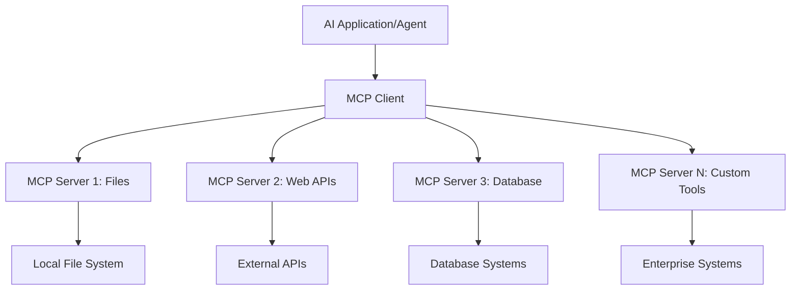

**🔧 المكونات الأساسية:**

| المكون | الدور | أمثلة |
|-----------|------|----------|
| **مضيفو MCP** | التطبيقات التي تستهلك خدمات MCP | Claude Desktop، VS Code، AI Toolkit |
| **عملاء MCP** | معالجات البروتوكول (1:1 مع الخوادم) | مدمجة في تطبيقات المضيف |
| **خوادم MCP** | تعرض القدرات عبر بروتوكول موحد | Playwright، Files، Azure، GitHub |
| **طبقة النقل** | طرق الاتصال | stdio، HTTP، WebSockets |


## 🏢 نظام خوادم MCP الخاص بمايكروسوفت

تقود مايكروسوفت نظام MCP بمجموعة شاملة من الخوادم المؤسسية التي تلبي احتياجات الأعمال الحقيقية.

### 🌟 خوادم MCP المميزة من مايكروسوفت

#### 1. ☁️ خادم Azure MCP
**🔗 المستودع**: [azure/azure-mcp](https://github.com/azure/azure-mcp)
**🎯 الغرض**: إدارة شاملة لموارد Azure مع تكامل الذكاء الاصطناعي

**✨ الميزات الرئيسية:**
- توفير البنية التحتية بشكل إعلاني
- مراقبة الموارد في الوقت الحقيقي
- توصيات لتحسين التكاليف
- التحقق من الامتثال الأمني

**🚀 حالات الاستخدام:**
- البنية التحتية ككود مع مساعدة الذكاء الاصطناعي
- التوسع التلقائي للموارد
- تحسين تكاليف السحابة
- أتمتة سير عمل DevOps

#### 2. 📊 Microsoft Dataverse MCP
**📚 التوثيق**: [Microsoft Dataverse Integration](https://go.microsoft.com/fwlink/?linkid=2320176)
**🎯 الغرض**: واجهة لغة طبيعية لبيانات الأعمال

**✨ الميزات الرئيسية:**
- استعلامات قاعدة بيانات بلغة طبيعية
- فهم سياق الأعمال
- قوالب مطالبات مخصصة
- حوكمة بيانات المؤسسات

**🚀 حالات الاستخدام:**
- تقارير ذكاء الأعمال
- تحليل بيانات العملاء
- رؤى خط المبيعات
- استعلامات بيانات الامتثال

#### 3. 🌐 خادم Playwright MCP
**🔗 المستودع**: [microsoft/playwright-mcp](https://github.com/microsoft/playwright-mcp)
**🎯 الغرض**: أتمتة المتصفح وقدرات التفاعل مع الويب

**✨ الميزات الرئيسية:**
- أتمتة عبر متصفحات متعددة (Chrome، Firefox، Safari)
- اكتشاف ذكي للعناصر
- التقاط لقطات شاشة وتوليد PDF
- مراقبة حركة الشبكة

**🚀 حالات الاستخدام:**
- أتمتة اختبارات العمل
- جمع البيانات من الويب واستخلاصها
- مراقبة واجهة المستخدم وتجربة المستخدم
- أتمتة التحليل التنافسي

#### 4. 📁 خادم Files MCP
**🔗 المستودع**: [microsoft/files-mcp-server](https://github.com/microsoft/files-mcp-server)
**🎯 الغرض**: عمليات نظام الملفات الذكية

**✨ الميزات الرئيسية:**
- إدارة الملفات بشكل إعلاني
- مزامنة المحتوى
- تكامل التحكم في الإصدارات
- استخراج البيانات الوصفية

**🚀 حالات الاستخدام:**
- إدارة الوثائق
- تنظيم مستودعات الكود
- سير عمل نشر المحتوى
- معالجة ملفات خطوط البيانات

#### 5. 📝 خادم MarkItDown MCP
**🔗 المستودع**: [microsoft/markitdown](https://github.com/microsoft/markitdown)
**🎯 الغرض**: معالجة وتعديل متقدم لملفات Markdown

**✨ الميزات الرئيسية:**
- تحليل Markdown غني
- تحويل الصيغ (MD ↔ HTML ↔ PDF)
- تحليل هيكل المحتوى
- معالجة القوالب

**🚀 حالات الاستخدام:**
- سير عمل التوثيق الفني
- أنظمة إدارة المحتوى
- توليد التقارير
- أتمتة قواعد المعرفة

#### 6. 📈 خادم Clarity MCP
**📦 الحزمة**: [@microsoft/clarity-mcp-server](https://www.npmjs.com/package/@microsoft/clarity-mcp-server)
**🎯 الغرض**: تحليلات الويب ورؤى سلوك المستخدم

**✨ الميزات الرئيسية:**
- تحليل بيانات خرائط الحرارة
- تسجيل جلسات المستخدم
- مقاييس الأداء
- تحليل قمع التحويل

**🚀 حالات الاستخدام:**
- تحسين المواقع الإلكترونية
- أبحاث تجربة المستخدم
- تحليل اختبارات A/B
- لوحات معلومات ذكاء الأعمال

### 🌍 نظام المجتمع البيئي

بعيدًا عن خوادم مايكروسوفت، يشمل نظام MCP البيئي:
- **🐙 GitHub MCP**: إدارة المستودعات وتحليل الكود
- **🗄️ قواعد بيانات MCP**: تكاملات PostgreSQL، MySQL، MongoDB
- **☁️ مزودو السحابة MCP**: أدوات AWS، GCP، Digital Ocean
- **📧 MCP الاتصالات**: تكاملات Slack، Teams، البريد الإلكتروني

## 🛠️ المختبر العملي: بناء وكيل أتمتة متصفح

**🎯 هدف المشروع**: إنشاء وكيل أتمتة متصفح ذكي باستخدام خادم Playwright MCP يمكنه تصفح المواقع، استخراج المعلومات، وأداء تفاعلات ويب معقدة.

### 🚀 المرحلة 1: إعداد أساس الوكيل

#### الخطوة 1: تهيئة وكيلك
1. **افتح منشئ وكلاء AI Toolkit**
2. **أنشئ وكيلًا جديدًا** بالتكوين التالي:
   - **الاسم**: `BrowserAgent`
   - **النموذج**: اختر GPT-4o 

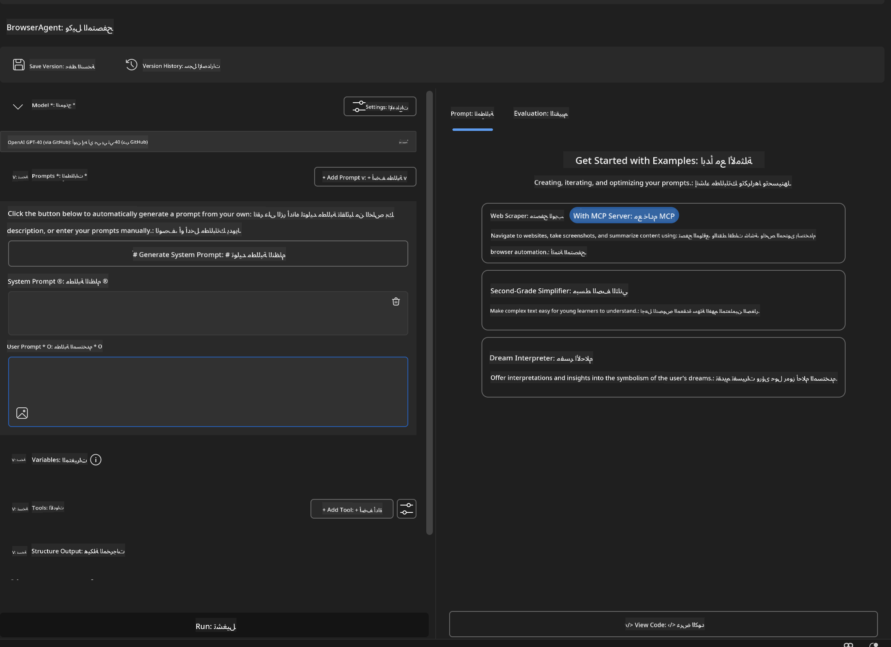


### 🔧 المرحلة 2: سير عمل دمج MCP

#### الخطوة 3: إضافة تكامل خادم MCP
1. **انتقل إلى قسم الأدوات** في منشئ الوكلاء
2. **انقر على "إضافة أداة"** لفتح قائمة التكامل
3. **اختر "خادم MCP"** من الخيارات المتاحة

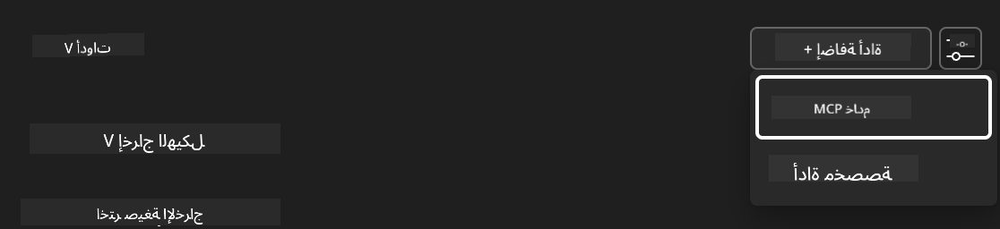

**🔍 فهم أنواع الأدوات:**
- **الأدوات المدمجة**: وظائف AI Toolkit المسبقة التكوين
- **خوادم MCP**: تكاملات الخدمات الخارجية
- **واجهات برمجة التطبيقات المخصصة**: نقاط نهاية خدمتك الخاصة
- **استدعاء الوظائف**: وصول مباشر لوظائف النموذج

#### الخطوة 4: اختيار خادم MCP
1. **اختر خيار "خادم MCP"** للمتابعة
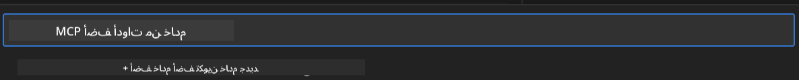

2. **تصفح كتالوج MCP** لاستكشاف التكاملات المتاحة
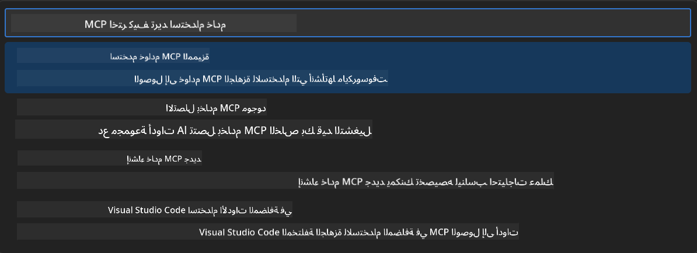


### 🎮 المرحلة 3: تكوين Playwright MCP

#### الخطوة 5: اختيار وتكوين Playwright
1. **انقر على "استخدام خوادم MCP المميزة"** للوصول إلى خوادم مايكروسوفت المعتمدة
2. **اختر "Playwright"** من القائمة المميزة
3. **اقبل معرف MCP الافتراضي** أو قم بتخصيصه لبيئتك

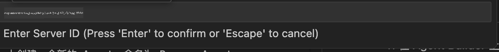

#### الخطوة 6: تفعيل قدرات Playwright
**🔑 خطوة حاسمة**: اختر **جميع** طرق Playwright المتاحة لتحقيق أقصى قدر من الوظائف

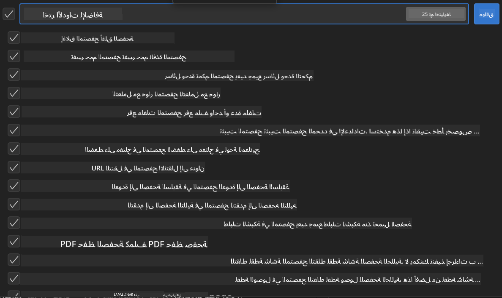

**🛠️ أدوات Playwright الأساسية:**
- **التنقل**: `goto`، `goBack`، `goForward`، `reload`
- **التفاعل**: `click`، `fill`، `press`، `hover`، `drag`
- **الاستخلاص**: `textContent`، `innerHTML`، `getAttribute`
- **التحقق**: `isVisible`، `isEnabled`، `waitForSelector`
- **الالتقاط**: `screenshot`، `pdf`، `video`
- **الشبكة**: `setExtraHTTPHeaders`، `route`، `waitForResponse`

#### الخطوة 7: التحقق من نجاح التكامل
**✅ مؤشرات النجاح:**
- ظهور جميع الأدوات في واجهة منشئ الوكلاء
- عدم وجود رسائل خطأ في لوحة التكامل
- حالة خادم Playwright تظهر "متصل"

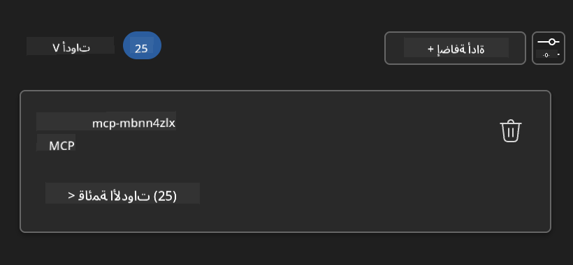

**🔧 استكشاف المشكلات الشائعة:**
- **فشل الاتصال**: تحقق من اتصال الإنترنت وإعدادات الجدار الناري
- **الأدوات المفقودة**: تأكد من اختيار جميع القدرات أثناء الإعداد
- **أخطاء الأذونات**: تحقق من أن VS Code لديه الأذونات اللازمة للنظام

### 🎯 المرحلة 4: هندسة المطالبات المتقدمة

#### الخطوة 8: تصميم مطالبات نظام ذكية
أنشئ مطالبات متطورة تستفيد من كامل قدرات Playwright:

```markdown
# Web Automation Expert System Prompt

## Core Identity
You are an advanced web automation specialist with deep expertise in browser automation, web scraping, and user experience analysis. You have access to Playwright tools for comprehensive browser control.

## Capabilities & Approach
### Navigation Strategy
- Always start with screenshots to understand page layout
- Use semantic selectors (text content, labels) when possible
- Implement wait strategies for dynamic content
- Handle single-page applications (SPAs) effectively

### Error Handling
- Retry failed operations with exponential backoff
- Provide clear error descriptions and solutions
- Suggest alternative approaches when primary methods fail
- Always capture diagnostic screenshots on errors

### Data Extraction
- Extract structured data in JSON format when possible
- Provide confidence scores for extracted information
- Validate data completeness and accuracy
- Handle pagination and infinite scroll scenarios

### Reporting
- Include step-by-step execution logs
- Provide before/after screenshots for verification
- Suggest optimizations and alternative approaches
- Document any limitations or edge cases encountered

## Ethical Guidelines
- Respect robots.txt and rate limiting
- Avoid overloading target servers
- Only extract publicly available information
- Follow website terms of service
```

#### الخطوة 9: إنشاء مطالبات مستخدم ديناميكية
صمم مطالبات تعرض قدرات متنوعة:

**🌐 مثال على تحليل الويب:**
```markdown
Navigate to github.com/kinfey and provide a comprehensive analysis including:
1. Repository structure and organization
2. Recent activity and contribution patterns  
3. Documentation quality assessment
4. Technology stack identification
5. Community engagement metrics
6. Notable projects and their purposes

Include screenshots at key steps and provide actionable insights.
```

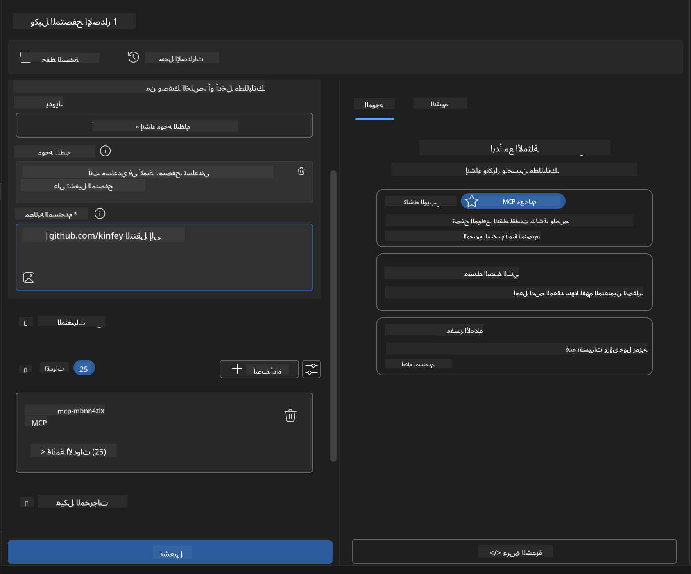

### 🚀 المرحلة 5: التنفيذ والاختبار

#### الخطوة 10: تنفيذ أول أتمتة لك
1. **انقر على "تشغيل"** لبدء تسلسل الأتمتة
2. **راقب التنفيذ في الوقت الحقيقي**:
   - يتم فتح متصفح Chrome تلقائيًا
   - يتنقل الوكيل إلى الموقع المستهدف
   - تُلتقط لقطات شاشة لكل خطوة رئيسية
   - تُعرض نتائج التحليل بشكل مباشر

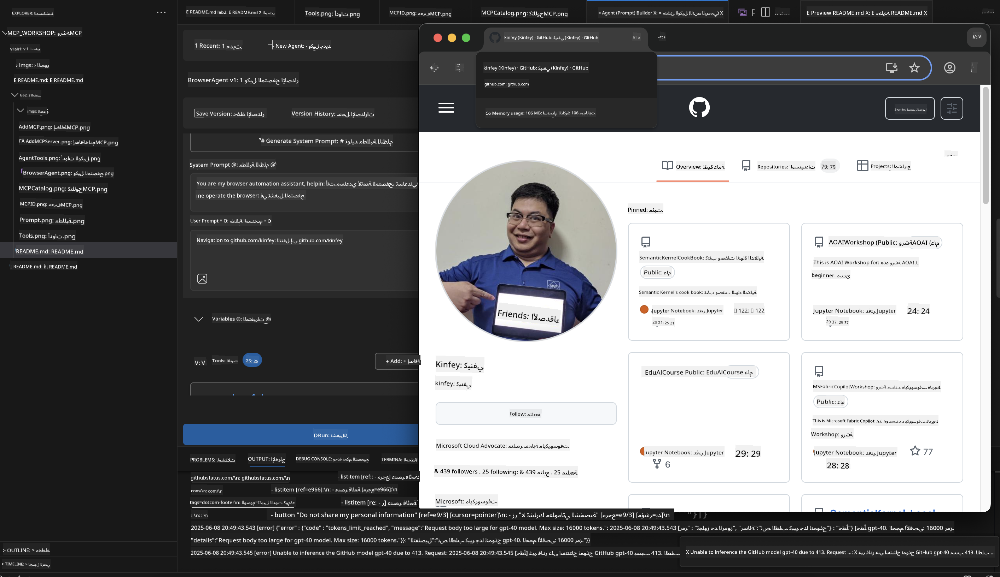

#### الخطوة 11: تحليل النتائج والرؤى
راجع التحليل الشامل في واجهة منشئ الوكلاء:

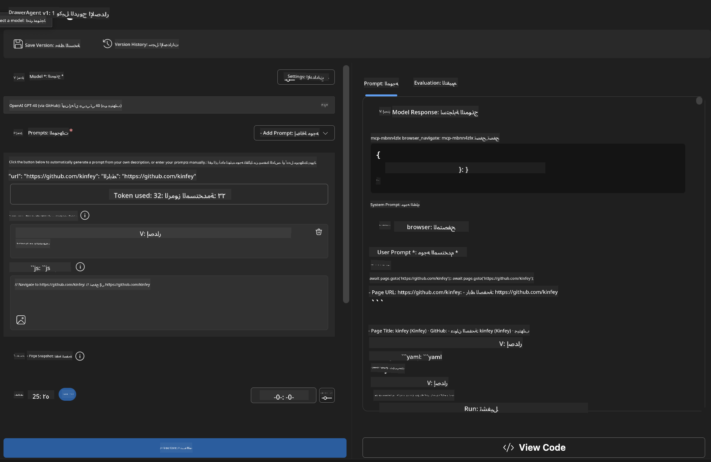

### 🌟 المرحلة 6: القدرات المتقدمة والنشر

#### الخطوة 12: التصدير والنشر الإنتاجي
يدعم منشئ الوكلاء خيارات نشر متعددة:

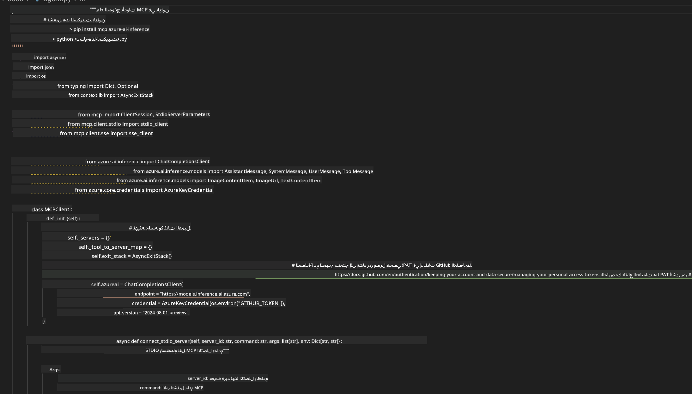

## 🎓 ملخص الوحدة 2 والخطوات التالية

### 🏆 الإنجاز المحقق: إتقان دمج MCP

**✅ المهارات المكتسبة:**
- [ ] فهم بنية MCP وفوائده
- [ ] التنقل في نظام خوادم MCP الخاص بمايكروسوفت
- [ ] دمج Playwright MCP مع AI Toolkit
- [ ] بناء وكلاء أتمتة متصفح متقدمين
- [ ] هندسة مطالبات متقدمة لأتمتة الويب

### 📚 موارد إضافية

- **🔗 مواصفات MCP**: [التوثيق الرسمي للبروتوكول](https://modelcontextprotocol.io/)
- **🛠️ API Playwright**: [مرجع الطرق الكامل](https://playwright.dev/docs/api/class-playwright)
- **🏢 خوادم MCP من مايكروسوفت**: [دليل التكامل المؤسسي](https://github.com/microsoft/mcp-servers)
- **🌍 أمثلة المجتمع**: [معرض خوادم MCP](https://github.com/modelcontextprotocol/servers)

**🎉 تهانينا!** لقد أتقنت دمج MCP ويمكنك الآن بناء وكلاء ذكاء اصطناعي جاهزين للإنتاج مع قدرات أدوات خارجية!


### 🔜 تابع إلى الوحدة التالية

هل أنت مستعد للارتقاء بمهارات MCP الخاصة بك؟ انتقل إلى **[الوحدة 3: تطوير MCP المتقدم مع AI Toolkit](../lab3/README.md)** حيث ستتعلم كيفية:
- إنشاء خوادم MCP مخصصة خاصة بك
- تكوين واستخدام أحدث SDK لـ MCP بلغة Python
- إعداد MCP Inspector لأغراض التصحيح
- إتقان سير عمل تطوير خوادم MCP المتقدم
- بناء خادم Weather MCP من الصفر

**إخلاء المسؤولية**:  
تمت ترجمة هذا المستند باستخدام خدمة الترجمة الآلية [Co-op Translator](https://github.com/Azure/co-op-translator). بينما نسعى لتحقيق الدقة، يرجى العلم أن الترجمات الآلية قد تحتوي على أخطاء أو عدم دقة. يجب اعتبار المستند الأصلي بلغته الأصلية المصدر الموثوق به. للمعلومات الهامة، يُنصح بالاعتماد على الترجمة البشرية المهنية. نحن غير مسؤولين عن أي سوء فهم أو تفسير ناتج عن استخدام هذه الترجمة.