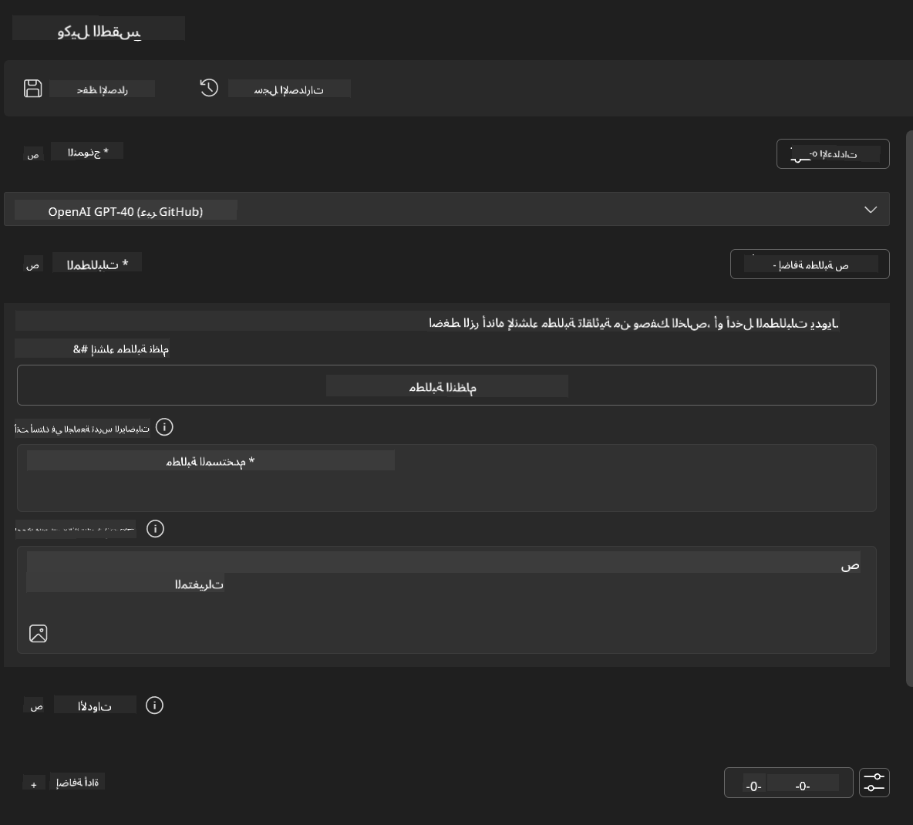
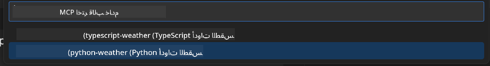
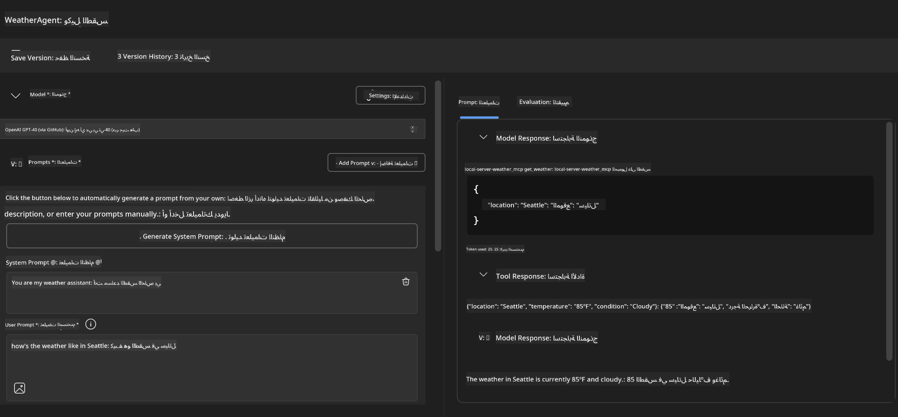
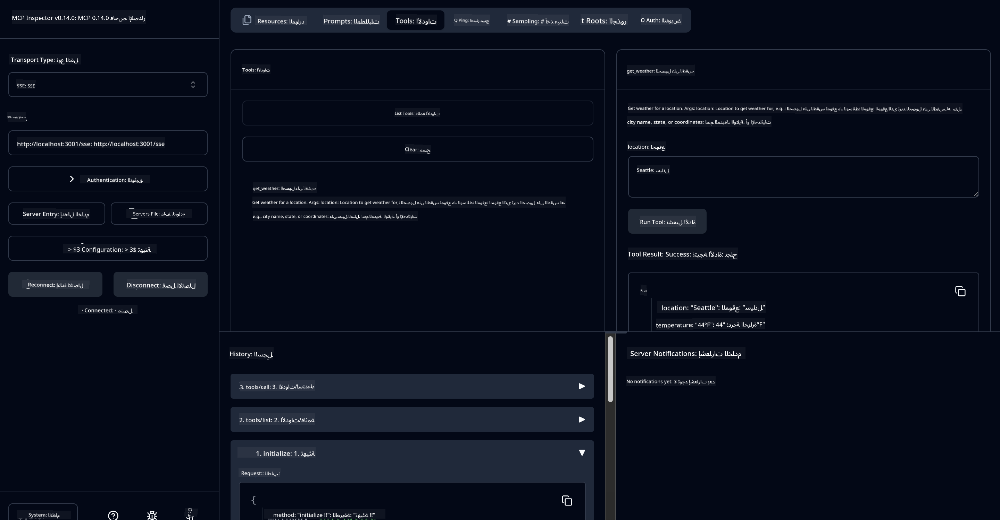

<!--
CO_OP_TRANSLATOR_METADATA:
{
  "original_hash": "dd8da3f75addcef453fe11f02a270217",
  "translation_date": "2025-06-10T06:03:22+00:00",
  "source_file": "10-StreamliningAIWorkflowsBuildingAnMCPServerWithAIToolkit/lab3/README.md",
  "language_code": "ar"
}
-->
# 🔧 الوحدة 3: تطوير MCP متقدم باستخدام AI Toolkit


## 🎯 أهداف التعلم

بحلول نهاية هذا المختبر، ستكون قادرًا على:

- ✅ إنشاء خوادم MCP مخصصة باستخدام AI Toolkit  
- ✅ تهيئة واستخدام أحدث إصدار من MCP Python SDK (v1.9.3)  
- ✅ إعداد واستخدام MCP Inspector لأغراض التصحيح  
- ✅ تصحيح خوادم MCP في بيئتي Agent Builder و Inspector  
- ✅ فهم سير العمل المتقدم لتطوير خوادم MCP  

## 📋 المتطلبات الأساسية

- إكمال المختبر 2 (أساسيات MCP)  
- تثبيت VS Code مع امتداد AI Toolkit  
- بيئة Python 3.10+  
- تثبيت Node.js و npm لإعداد Inspector  

## 🏗️ ما ستبنيه

في هذا المختبر، ستقوم بإنشاء **خادم MCP للطقس** يوضح:  
- تنفيذ خادم MCP مخصص  
- التكامل مع AI Toolkit Agent Builder  
- سير عمل احترافي للتصحيح  
- استخدام أنماط حديثة لـ MCP SDK  

---

## 🔧 نظرة عامة على المكونات الأساسية

### 🐍 MCP Python SDK  
يوفر بروتوكول نموذج السياق Python SDK الأساس لبناء خوادم MCP مخصصة. ستستخدم الإصدار 1.9.3 مع ميزات تصحيح محسنة.

### 🔍 MCP Inspector  
أداة تصحيح قوية توفر:  
- مراقبة الخادم في الوقت الفعلي  
- عرض تنفيذ الأدوات  
- فحص طلبات واستجابات الشبكة  
- بيئة اختبار تفاعلية  

---

## 📖 التنفيذ خطوة بخطوة

### الخطوة 1: إنشاء WeatherAgent في Agent Builder

1. **شغل Agent Builder** في VS Code عبر امتداد AI Toolkit  
2. **أنشئ وكيلًا جديدًا** بالتكوين التالي:  
   - اسم الوكيل: `WeatherAgent`



### الخطوة 2: تهيئة مشروع خادم MCP

1. **اذهب إلى Tools** → **Add Tool** في Agent Builder  
2. **اختر "MCP Server"** من الخيارات المتاحة  
3. **اختر "Create A new MCP Server"**  
4. **اختر القالب `python-weather`**  
5. **سمِّ الخادم الخاص بك:** `weather_mcp`



### الخطوة 3: افتح وراجع المشروع

1. **افتح المشروع المُنشأ** في VS Code  
2. **راجع هيكل المشروع:**  
   ```
   weather_mcp/
   ├── src/
   │   ├── __init__.py
   │   └── server.py
   ├── inspector/
   │   ├── package.json
   │   └── package-lock.json
   ├── .vscode/
   │   ├── launch.json
   │   └── tasks.json
   ├── pyproject.toml
   └── README.md
   ```

### الخطوة 4: الترقية إلى أحدث إصدار من MCP SDK

> **🔍 لماذا الترقية؟** نرغب في استخدام أحدث إصدار من MCP SDK (v1.9.3) وخدمة Inspector (0.14.0) لميزات محسنة وقدرات تصحيح أفضل.

#### 4أ. تحديث تبعيات Python

**حرر `pyproject.toml`:** update [./code/weather_mcp/pyproject.toml](../../../../10-StreamliningAIWorkflowsBuildingAnMCPServerWithAIToolkit/lab3/code/weather_mcp/pyproject.toml)


#### 4b. Update Inspector Configuration

**Edit `inspector/package.json`:** update [./code/weather_mcp/inspector/package.json](../../../../10-StreamliningAIWorkflowsBuildingAnMCPServerWithAIToolkit/lab3/code/weather_mcp/inspector/package.json)

#### 4c. Update Inspector Dependencies

**Edit `inspector/package-lock.json`:** update [./code/weather_mcp/inspector/package-lock.json](../../../../10-StreamliningAIWorkflowsBuildingAnMCPServerWithAIToolkit/lab3/code/weather_mcp/inspector/package-lock.json)

> **📝 Note:** This file contains extensive dependency definitions. Below is the essential structure - the full content ensures proper dependency resolution.


> **⚡ Full Package Lock:** The complete package-lock.json contains ~3000 lines of dependency definitions. The above shows the key structure - use the provided file for complete dependency resolution.

### Step 5: Configure VS Code Debugging

*Note: Please copy the file in the specified path to replace the corresponding local file*

#### 5a. Update Launch Configuration

**Edit `.vscode/launch.json`:**

```json
{
  "version": "0.2.0",
  "configurations": [
    {
      "name": "Attach to Local MCP",
      "type": "debugpy",
      "request": "attach",
      "connect": {
        "host": "localhost",
        "port": 5678
      },
      "presentation": {
        "hidden": true
      },
      "internalConsoleOptions": "neverOpen",
      "postDebugTask": "Terminate All Tasks"
    },
    {
      "name": "Launch Inspector (Edge)",
      "type": "msedge",
      "request": "launch",
      "url": "http://localhost:6274?timeout=60000&serverUrl=http://localhost:3001/sse#tools",
      "cascadeTerminateToConfigurations": [
        "Attach to Local MCP"
      ],
      "presentation": {
        "hidden": true
      },
      "internalConsoleOptions": "neverOpen"
    },
    {
      "name": "Launch Inspector (Chrome)",
      "type": "chrome",
      "request": "launch",
      "url": "http://localhost:6274?timeout=60000&serverUrl=http://localhost:3001/sse#tools",
      "cascadeTerminateToConfigurations": [
        "Attach to Local MCP"
      ],
      "presentation": {
        "hidden": true
      },
      "internalConsoleOptions": "neverOpen"
    }
  ],
  "compounds": [
    {
      "name": "Debug in Agent Builder",
      "configurations": [
        "Attach to Local MCP"
      ],
      "preLaunchTask": "Open Agent Builder",
    },
    {
      "name": "Debug in Inspector (Edge)",
      "configurations": [
        "Launch Inspector (Edge)",
        "Attach to Local MCP"
      ],
      "preLaunchTask": "Start MCP Inspector",
      "stopAll": true
    },
    {
      "name": "Debug in Inspector (Chrome)",
      "configurations": [
        "Launch Inspector (Chrome)",
        "Attach to Local MCP"
      ],
      "preLaunchTask": "Start MCP Inspector",
      "stopAll": true
    }
  ]
}
```

**حرر `.vscode/tasks.json`:**

```
{
  "version": "2.0.0",
  "tasks": [
    {
      "label": "Start MCP Server",
      "type": "shell",
      "command": "python -m debugpy --listen 127.0.0.1:5678 src/__init__.py sse",
      "isBackground": true,
      "options": {
        "cwd": "${workspaceFolder}",
        "env": {
          "PORT": "3001"
        }
      },
      "problemMatcher": {
        "pattern": [
          {
            "regexp": "^.*$",
            "file": 0,
            "location": 1,
            "message": 2
          }
        ],
        "background": {
          "activeOnStart": true,
          "beginsPattern": ".*",
          "endsPattern": "Application startup complete|running"
        }
      }
    },
    {
      "label": "Start MCP Inspector",
      "type": "shell",
      "command": "npm run dev:inspector",
      "isBackground": true,
      "options": {
        "cwd": "${workspaceFolder}/inspector",
        "env": {
          "CLIENT_PORT": "6274",
          "SERVER_PORT": "6277",
        }
      },
      "problemMatcher": {
        "pattern": [
          {
            "regexp": "^.*$",
            "file": 0,
            "location": 1,
            "message": 2
          }
        ],
        "background": {
          "activeOnStart": true,
          "beginsPattern": "Starting MCP inspector",
          "endsPattern": "Proxy server listening on port"
        }
      },
      "dependsOn": [
        "Start MCP Server"
      ]
    },
    {
      "label": "Open Agent Builder",
      "type": "shell",
      "command": "echo ${input:openAgentBuilder}",
      "presentation": {
        "reveal": "never"
      },
      "dependsOn": [
        "Start MCP Server"
      ],
    },
    {
      "label": "Terminate All Tasks",
      "command": "echo ${input:terminate}",
      "type": "shell",
      "problemMatcher": []
    }
  ],
  "inputs": [
    {
      "id": "openAgentBuilder",
      "type": "command",
      "command": "ai-mlstudio.agentBuilder",
      "args": {
        "initialMCPs": [ "local-server-weather_mcp" ],
        "triggeredFrom": "vsc-tasks"
      }
    },
    {
      "id": "terminate",
      "type": "command",
      "command": "workbench.action.tasks.terminate",
      "args": "terminateAll"
    }
  ]
}
```

---

## 🚀 تشغيل واختبار خادم MCP الخاص بك

### الخطوة 6: تثبيت التبعيات

بعد إجراء تغييرات التكوين، نفذ الأوامر التالية:

**تثبيت تبعيات Python:**  
```bash
uv sync
```

**تثبيت تبعيات Inspector:**  
```bash
cd inspector
npm install
```

### الخطوة 7: التصحيح باستخدام Agent Builder

1. **اضغط F5** أو استخدم تكوين **"Debug in Agent Builder"**  
2. **اختر التكوين المركب** من لوحة التصحيح  
3. **انتظر بدء تشغيل الخادم وفتح Agent Builder**  
4. **اختبر خادم MCP للطقس الخاص بك** باستخدام استعلامات اللغة الطبيعية  

أدخل موجهًا مثل هذا

SYSTEM_PROMPT

```
You are my weather assistant
```

USER_PROMPT

```
How's the weather like in Seattle
```



### الخطوة 8: التصحيح باستخدام MCP Inspector

1. **استخدم تكوين "Debug in Inspector"** (في Edge أو Chrome)  
2. **افتح واجهة Inspector** على `http://localhost:6274`  
3. **استكشف بيئة الاختبار التفاعلية:**  
   - عرض الأدوات المتاحة  
   - اختبار تنفيذ الأدوات  
   - مراقبة طلبات الشبكة  
   - تصحيح استجابات الخادم  



---

## 🎯 النتائج الرئيسية للتعلم

بعد إكمال هذا المختبر، تكون قد:

- [x] **أنشأت خادم MCP مخصص** باستخدام قوالب AI Toolkit  
- [x] **قمت بالترقية إلى أحدث إصدار من MCP SDK** (v1.9.3) لوظائف محسنة  
- [x] **هيأت سير عمل تصحيح احترافي** لكل من Agent Builder و Inspector  
- [x] **أعددت MCP Inspector** لاختبار الخادم التفاعلي  
- [x] **أتقنت إعدادات تصحيح VS Code** لتطوير MCP  

## 🔧 الميزات المتقدمة التي تم استكشافها

| الميزة | الوصف | حالة الاستخدام |
|---------|-------------|----------|
| **MCP Python SDK v1.9.3** | أحدث تنفيذ للبروتوكول | تطوير الخوادم الحديثة |
| **MCP Inspector 0.14.0** | أداة تصحيح تفاعلية | اختبار الخادم في الوقت الفعلي |
| **تصحيح VS Code** | بيئة تطوير متكاملة | سير عمل تصحيح احترافي |
| **تكامل Agent Builder** | اتصال مباشر بـ AI Toolkit | اختبار الوكيل من البداية للنهاية |

## 📚 موارد إضافية

- [توثيق MCP Python SDK](https://modelcontextprotocol.io/docs/sdk/python)  
- [دليل امتداد AI Toolkit](https://code.visualstudio.com/docs/ai/ai-toolkit)  
- [توثيق تصحيح VS Code](https://code.visualstudio.com/docs/editor/debugging)  
- [مواصفات بروتوكول نموذج السياق](https://modelcontextprotocol.io/docs/concepts/architecture)  

---

**🎉 تهانينا!** لقد أكملت بنجاح المختبر 3 وأصبحت قادرًا الآن على إنشاء وتصحيح ونشر خوادم MCP مخصصة باستخدام سير عمل تطوير احترافي.

### 🔜 تابع إلى الوحدة التالية

هل أنت مستعد لتطبيق مهارات MCP الخاصة بك في سير عمل تطوير واقعي؟ تابع إلى **[الوحدة 4: تطوير MCP عملي - خادم استنساخ GitHub مخصص](../lab4/README.md)** حيث ستقوم بـ:  
- بناء خادم MCP جاهز للإنتاج لأتمتة عمليات مستودعات GitHub  
- تنفيذ وظيفة استنساخ مستودعات GitHub عبر MCP  
- دمج خوادم MCP المخصصة مع VS Code ووضع GitHub Copilot Agent  
- اختبار ونشر خوادم MCP المخصصة في بيئات الإنتاج  
- تعلم أتمتة سير العمل العملية للمطورين

**تنويه**:  
تمت ترجمة هذا المستند باستخدام خدمة الترجمة الآلية [Co-op Translator](https://github.com/Azure/co-op-translator). بينما نسعى لتحقيق الدقة، يرجى العلم أن الترجمات الآلية قد تحتوي على أخطاء أو عدم دقة. يجب اعتبار المستند الأصلي بلغته الأصلية المصدر الموثوق به. بالنسبة للمعلومات الهامة، يُنصح بالترجمة المهنية البشرية. نحن غير مسؤولين عن أي سوء فهم أو تفسير خاطئ ناتج عن استخدام هذه الترجمة.