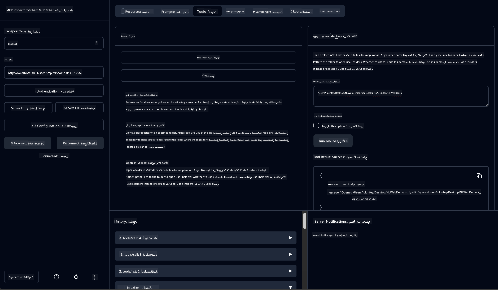

<!--
CO_OP_TRANSLATOR_METADATA:
{
  "original_hash": "f83bc722dc758efffd68667d6a1db470",
  "translation_date": "2025-07-14T08:36:06+00:00",
  "source_file": "10-StreamliningAIWorkflowsBuildingAnMCPServerWithAIToolkit/lab4/README.md",
  "language_code": "ar"
}
-->
# 🐙 الوحدة 4: تطوير MCP عملي - خادم مخصص لاستنساخ مستودعات GitHub


> **⚡ بداية سريعة:** أنشئ خادم MCP جاهز للإنتاج يقوم بأتمتة استنساخ مستودعات GitHub وتكامل VS Code في 30 دقيقة فقط!

## 🎯 أهداف التعلم

بنهاية هذا المختبر، ستكون قادرًا على:

- ✅ إنشاء خادم MCP مخصص لتدفقات العمل التطويرية الحقيقية
- ✅ تنفيذ وظيفة استنساخ مستودعات GitHub عبر MCP
- ✅ دمج خوادم MCP المخصصة مع VS Code وAgent Builder
- ✅ استخدام وضع GitHub Copilot Agent مع أدوات MCP المخصصة
- ✅ اختبار ونشر خوادم MCP المخصصة في بيئات الإنتاج

## 📋 المتطلبات الأساسية

- إكمال المختبرات 1-3 (أساسيات MCP والتطوير المتقدم)
- اشتراك GitHub Copilot ([تسجيل مجاني متاح](https://github.com/github-copilot/signup))
- VS Code مع ملحقات AI Toolkit وGitHub Copilot
- تثبيت وتكوين Git CLI

## 🏗️ نظرة عامة على المشروع

### **تحدي تطوير واقعي**
كمطورين، نستخدم GitHub كثيرًا لاستنساخ المستودعات وفتحها في VS Code أو VS Code Insiders. هذه العملية اليدوية تتضمن:
1. فتح الطرفية/موجه الأوامر
2. الانتقال إلى الدليل المطلوب
3. تنفيذ أمر `git clone`
4. فتح VS Code في الدليل المستنسخ

**حل MCP الخاص بنا يبسط هذا إلى أمر ذكي واحد فقط!**

### **ما ستبنيه**
خادم **GitHub Clone MCP** (`git_mcp_server`) الذي يوفر:

| الميزة | الوصف | الفائدة |
|---------|-------------|---------|
| 🔄 **استنساخ ذكي للمستودعات** | استنساخ مستودعات GitHub مع التحقق | فحص الأخطاء تلقائيًا |
| 📁 **إدارة ذكية للدلائل** | التحقق من وجود الدلائل وإنشاؤها بأمان | يمنع الكتابة فوق الملفات |
| 🚀 **تكامل متعدد المنصات مع VS Code** | فتح المشاريع في VS Code/Insiders | انتقال سلس في سير العمل |
| 🛡️ **معالجة أخطاء قوية** | التعامل مع مشاكل الشبكة، الأذونات، والمسارات | موثوقية جاهزة للإنتاج |

---

## 📖 التنفيذ خطوة بخطوة

### الخطوة 1: إنشاء وكيل GitHub في Agent Builder

1. **افتح Agent Builder** من خلال ملحق AI Toolkit
2. **أنشئ وكيلًا جديدًا** بالتكوين التالي:
   ```
   Agent Name: GitHubAgent
   ```

3. **تهيئة خادم MCP مخصص:**
   - انتقل إلى **الأدوات** → **إضافة أداة** → **خادم MCP**
   - اختر **"إنشاء خادم MCP جديد"**
   - اختر **قالب Python** لأقصى مرونة
   - **اسم الخادم:** `git_mcp_server`

### الخطوة 2: تكوين وضع GitHub Copilot Agent

1. **افتح GitHub Copilot** في VS Code (Ctrl/Cmd + Shift + P → "GitHub Copilot: Open")
2. **اختر نموذج الوكيل** في واجهة Copilot
3. **اختر نموذج Claude 3.7** لتعزيز قدرات الاستدلال
4. **فعّل تكامل MCP** للوصول إلى الأدوات

> **💡 نصيحة احترافية:** يوفر Claude 3.7 فهمًا متقدمًا لتدفقات العمل التطويرية وأنماط معالجة الأخطاء.

### الخطوة 3: تنفيذ الوظائف الأساسية لخادم MCP

**استخدم الموجه التفصيلي التالي مع وضع GitHub Copilot Agent:**

```
Create two MCP tools with the following comprehensive requirements:

🔧 TOOL A: clone_repository
Requirements:
- Clone any GitHub repository to a specified local folder
- Return the absolute path of the successfully cloned project
- Implement comprehensive validation:
  ✓ Check if target directory already exists (return error if exists)
  ✓ Validate GitHub URL format (https://github.com/user/repo)
  ✓ Verify git command availability (prompt installation if missing)
  ✓ Handle network connectivity issues
  ✓ Provide clear error messages for all failure scenarios

🚀 TOOL B: open_in_vscode
Requirements:
- Open specified folder in VS Code or VS Code Insiders
- Cross-platform compatibility (Windows/Linux/macOS)
- Use direct application launch (not terminal commands)
- Auto-detect available VS Code installations
- Handle cases where VS Code is not installed
- Provide user-friendly error messages

Additional Requirements:
- Follow MCP 1.9.3 best practices
- Include proper type hints and documentation
- Implement logging for debugging purposes
- Add input validation for all parameters
- Include comprehensive error handling
```

### الخطوة 4: اختبار خادم MCP الخاص بك

#### 4أ. الاختبار في Agent Builder

1. **شغّل تكوين التصحيح** في Agent Builder
2. **كوّن وكيلك باستخدام موجه النظام هذا:**

```
SYSTEM_PROMPT:
You are my intelligent coding repository assistant. You help developers efficiently clone GitHub repositories and set up their development environment. Always provide clear feedback about operations and handle errors gracefully.
```

3. **اختبر باستخدام سيناريوهات مستخدم واقعية:**

```
USER_PROMPT EXAMPLES:

Scenario : Basic Clone and Open
"Clone {Your GitHub Repo link such as https://github.com/kinfey/GHCAgentWorkshop
 } and save to {The global path you specify}, then open it with VS Code Insiders"
```


**النتائج المتوقعة:**
- ✅ استنساخ ناجح مع تأكيد المسار
- ✅ فتح VS Code تلقائيًا
- ✅ رسائل خطأ واضحة للحالات غير الصالحة
- ✅ معالجة صحيحة للحالات الحدية

#### 4ب. الاختبار في MCP Inspector




---


**🎉 تهانينا!** لقد أنشأت بنجاح خادم MCP عملي وجاهز للإنتاج يحل تحديات سير العمل التطويري الحقيقية. خادم استنساخ GitHub المخصص الخاص بك يبرهن على قوة MCP في أتمتة وتحسين إنتاجية المطورين.

### 🏆 الإنجازات التي حققتها:
- ✅ **مطور MCP** - أنشأت خادم MCP مخصص
- ✅ **مُبسّط سير العمل** - حسّنت عمليات التطوير  
- ✅ **خبير التكامل** - ربطت أدوات تطوير متعددة
- ✅ **جاهز للإنتاج** - بنيت حلولًا قابلة للنشر

---

## 🎓 إتمام الورشة: رحلتك مع بروتوكول سياق النموذج

**عزيزي مشارك الورشة،**

نبارك لك إتمام جميع الوحدات الأربع لورشة عمل Model Context Protocol! لقد قطعت شوطًا طويلًا من فهم أساسيات AI Toolkit إلى بناء خوادم MCP جاهزة للإنتاج تحل تحديات تطوير حقيقية.

### 🚀 ملخص مسار تعلمك:

**[الوحدة 1](../lab1/README.md)**: بدأت باستكشاف أساسيات AI Toolkit، اختبار النماذج، وإنشاء وكيل AI الأول.

**[الوحدة 2](../lab2/README.md)**: تعلمت بنية MCP، دمج Playwright MCP، وبنيت وكيل أتمتة متصفح أول.

**[الوحدة 3](../lab3/README.md)**: تقدمت لتطوير خوادم MCP مخصصة مع خادم الطقس MCP وتعلمت أدوات التصحيح.

**[الوحدة 4](../lab4/README.md)**: طبقت كل شيء لإنشاء أداة أتمتة عملية لسير عمل مستودعات GitHub.

### 🌟 ما أتقنته:

- ✅ **نظام AI Toolkit**: النماذج، الوكلاء، وأنماط التكامل
- ✅ **بنية MCP**: تصميم العميل-الخادم، بروتوكولات النقل، والأمان
- ✅ **أدوات المطور**: من Playground إلى Inspector إلى النشر الإنتاجي
- ✅ **التطوير المخصص**: بناء، اختبار، ونشر خوادم MCP الخاصة بك
- ✅ **التطبيقات العملية**: حل تحديات سير العمل الحقيقية باستخدام الذكاء الاصطناعي

### 🔮 خطواتك القادمة:

1. **ابنِ خادم MCP خاص بك**: طبق هذه المهارات لأتمتة تدفقات عملك الفريدة
2. **انضم إلى مجتمع MCP**: شارك إبداعاتك وتعلم من الآخرين
3. **استكشف التكامل المتقدم**: اربط خوادم MCP بأنظمة المؤسسات
4. **ساهم في المصادر المفتوحة**: ساعد في تحسين أدوات MCP والوثائق

تذكر، هذه الورشة هي البداية فقط. نظام Model Context Protocol يتطور بسرعة، وأنت الآن مجهز لتكون في طليعة أدوات التطوير المدعومة بالذكاء الاصطناعي.

**شكرًا لمشاركتك وتفانيك في التعلم!**

نأمل أن تكون هذه الورشة قد ألهمتك أفكارًا تغير طريقة بناءك وتفاعلك مع أدوات الذكاء الاصطناعي في رحلتك التطويرية.

**برمجة سعيدة!**

---

**إخلاء المسؤولية**:  
تمت ترجمة هذا المستند باستخدام خدمة الترجمة الآلية [Co-op Translator](https://github.com/Azure/co-op-translator). بينما نسعى لتحقيق الدقة، يرجى العلم أن الترجمات الآلية قد تحتوي على أخطاء أو عدم دقة. يجب اعتبار المستند الأصلي بلغته الأصلية المصدر الموثوق به. للمعلومات الهامة، يُنصح بالاعتماد على الترجمة البشرية المهنية. نحن غير مسؤولين عن أي سوء فهم أو تفسير ناتج عن استخدام هذه الترجمة.