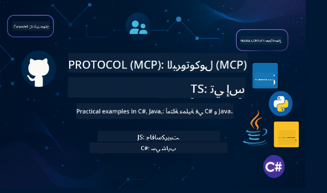

<!--
CO_OP_TRANSLATOR_METADATA:
{
  "original_hash": "866c8877136cb03e1efb9ad633a2f0a6",
  "translation_date": "2025-08-26T17:07:18+00:00",
  "source_file": "README.md",
  "language_code": "ar"
}
-->
 

اتبع الخطوات التالية للبدء باستخدام هذه الموارد:
1. **نسخ المستودع**: اضغط 
2. **استنساخ المستودع**:   `git clone https://github.com/microsoft/mcp-for-beginners.git`
3. [**انضم إلى مجتمع Azure AI Foundry على Discord وتواصل مع الخبراء والمطورين الآخرين**](https://discord.com/invite/ByRwuEEgH4)

### 🌐 دعم متعدد اللغات

#### مدعوم عبر GitHub Action (تلقائي ودائم التحديث)

 [Arabic](./README.md) | [Bengali](../bn/README.md) | [Bulgarian](../bg/README.md) | [Burmese (Myanmar)](../my/README.md) | [Chinese (Simplified)](../zh/README.md) | [Chinese (Traditional, Hong Kong)](../hk/README.md) | [Chinese (Traditional, Macau)](../mo/README.md) | [Chinese (Traditional, Taiwan)](../tw/README.md) | [Croatian](../hr/README.md) | [Czech](../cs/README.md) | [Danish](../da/README.md) | [Dutch](../nl/README.md) | [Finnish](../fi/README.md) | [French](../fr/README.md) | [German](../de/README.md) | [Greek](../el/README.md) | [Hebrew](../he/README.md) | [Hindi](../hi/README.md) | [Hungarian](../hu/README.md) | [Indonesian](../id/README.md) | [Italian](../it/README.md) | [Japanese](../ja/README.md) | [Korean](../ko/README.md) | [Malay](../ms/README.md) | [Marathi](../mr/README.md) | [Nepali](../ne/README.md) | [Norwegian](../no/README.md) | [Persian (Farsi)](../fa/README.md) | [Polish](../pl/README.md) | [Portuguese (Brazil)](../br/README.md) | [Portuguese (Portugal)](../pt/README.md) | [Punjabi (Gurmukhi)](../pa/README.md) | [Romanian](../ro/README.md) | [Russian](../ru/README.md) | [Serbian (Cyrillic)](../sr/README.md) | [Slovak](../sk/README.md) | [Slovenian](../sl/README.md) | [Spanish](../es/README.md) | [Swahili](../sw/README.md) | [Swedish](../sv/README.md) | [Tagalog (Filipino)](../tl/README.md) | [Thai](../th/README.md) | [Turkish](../tr/README.md) | [Ukrainian](../uk/README.md) | [Urdu](../ur/README.md) | [Vietnamese](../vi/README.md)

# 🚀 منهج بروتوكول سياق النموذج (MCP) للمبتدئين

## **تعلم MCP من خلال أمثلة عملية في C#، Java، JavaScript، Rust، Python، وTypeScript**

## 🧠 نظرة عامة على منهج بروتوكول سياق النموذج

**بروتوكول سياق النموذج (MCP)** هو إطار عمل متقدم يهدف إلى توحيد التفاعلات بين نماذج الذكاء الاصطناعي وتطبيقات العملاء. يقدم هذا المنهج المفتوح المصدر مسارًا تعليميًا منظمًا، يتضمن أمثلة عملية في البرمجة وحالات استخدام واقعية، عبر لغات البرمجة الشهيرة مثل C#، Java، JavaScript، TypeScript، وPython.

سواء كنت مطور ذكاء اصطناعي، مهندس أنظمة، أو مهندس برمجيات، فإن هذا الدليل هو مورد شامل لإتقان أساسيات MCP واستراتيجيات التنفيذ.

## 🔗 موارد MCP الرسمية

- 📘 [وثائق MCP](https://modelcontextprotocol.io/) – دروس مفصلة وأدلة المستخدم  
- 📜 [مواصفات MCP](https://modelcontextprotocol.io/docs/) – هيكل البروتوكول والمراجع التقنية  
- 📜 [المواصفات الأصلية لـ MCP](https://spec.modelcontextprotocol.io/) – مراجع تقنية قديمة (قد تحتوي على تفاصيل إضافية)  
- 🧑‍💻 [مستودع MCP على GitHub](https://github.com/modelcontextprotocol) – أدوات مفتوحة المصدر وأمثلة على التعليمات البرمجية
- 🌐 [مجتمع MCP](https://github.com/orgs/modelcontextprotocol/discussions) – انضم إلى المناقشات وساهم في المجتمع

## 🧭 نظرة عامة على منهج MCP

### 📚 هيكل المنهج الكامل

| الوحدة | الموضوع | الوصف | الرابط |
|--------|-------|-------------|------|
| **الوحدات 1-3: الأساسيات** | | | |
| 00 | مقدمة عن MCP | نظرة عامة على بروتوكول سياق النموذج وأهميته في خطوط أنابيب الذكاء الاصطناعي | [اقرأ المزيد](./00-Introduction/README.md) |
| 01 | شرح المفاهيم الأساسية | استكشاف معمق للمفاهيم الأساسية لـ MCP | [اقرأ المزيد](./01-CoreConcepts/README.md) |
| 02 | الأمان في MCP | تهديدات الأمان وأفضل الممارسات | [اقرأ المزيد](./02-Security/README.md) |
| 03 | البدء مع MCP | إعداد البيئة، الخوادم/العملاء الأساسيين، التكامل | [اقرأ المزيد](./03-GettingStarted/README.md) |
| **الوحدة 3: بناء أول خادم وعميل** | | | |
| 3.1 | أول خادم | إنشاء أول خادم MCP | [الدليل](./03-GettingStarted/01-first-server/README.md) |
| 3.2 | أول عميل | تطوير عميل MCP أساسي | [الدليل](./03-GettingStarted/02-client/README.md) |
| 3.3 | عميل مع LLM | دمج نماذج اللغة الكبيرة | [الدليل](./03-GettingStarted/03-llm-client/README.md) |
| 3.4 | تكامل VS Code | استخدام خوادم MCP في VS Code | [الدليل](./03-GettingStarted/04-vscode/README.md) |
| 3.5 | خادم stdio | إنشاء خوادم باستخدام stdio transport | [الدليل](./03-GettingStarted/05-stdio-server/README.md) |
| 3.6 | بث HTTP | تنفيذ بث HTTP في MCP | [الدليل](./03-GettingStarted/06-http-streaming/README.md) |
| 3.7 | أدوات الذكاء الاصطناعي | استخدام أدوات الذكاء الاصطناعي مع MCP | [الدليل](./03-GettingStarted/07-aitk/README.md) |
| 3.8 | الاختبار | اختبار تنفيذ خادم MCP الخاص بك | [الدليل](./03-GettingStarted/08-testing/README.md) |
| 3.9 | النشر | نشر خوادم MCP للإنتاج | [الدليل](./03-GettingStarted/09-deployment/README.md) |
| **الوحدات 4-5: العملية والمتقدمة** | | | |
| 04 | التنفيذ العملي | SDKs، التصحيح، الاختبار، قوالب التعليمات القابلة لإعادة الاستخدام | [اقرأ المزيد](./04-PracticalImplementation/README.md) |
| 05 | مواضيع متقدمة في MCP | الذكاء الاصطناعي متعدد الوسائط، التوسع، الاستخدام المؤسسي | [اقرأ المزيد](./05-AdvancedTopics/README.md) |
| 5.1 | تكامل Azure | تكامل MCP مع Azure | [الدليل](./05-AdvancedTopics/mcp-integration/README.md) |
| 5.2 | تعدد الوسائط | العمل مع وسائط متعددة | [الدليل](./05-AdvancedTopics/mcp-multi-modality/README.md) |
| 5.3 | عرض OAuth2 | تنفيذ مصادقة OAuth2 | [الدليل](./05-AdvancedTopics/mcp-oauth2-demo/README.md) |
| 5.4 | السياقات الجذرية | فهم وتنفيذ السياقات الجذرية | [الدليل](./05-AdvancedTopics/mcp-root-contexts/README.md) |
| 5.5 | التوجيه | استراتيجيات التوجيه في MCP | [الدليل](./05-AdvancedTopics/mcp-routing/README.md) |
| 5.6 | أخذ العينات | تقنيات أخذ العينات في MCP | [الدليل](./05-AdvancedTopics/mcp-sampling/README.md) |
| 5.7 | التوسع | توسيع تنفيذات MCP | [الدليل](./05-AdvancedTopics/mcp-scaling/README.md) |
| 5.8 | الأمان | اعتبارات الأمان المتقدمة | [الدليل](./05-AdvancedTopics/mcp-security/README.md) |
| 5.9 | البحث على الويب | تنفيذ قدرات البحث على الويب | [الدليل](./05-AdvancedTopics/web-search-mcp/README.md) |
| 5.10 | البث في الوقت الحقيقي | بناء وظائف البث في الوقت الحقيقي | [الدليل](./05-AdvancedTopics/mcp-realtimestreaming/README.md) |
| 5.11 | البحث في الوقت الحقيقي | تنفيذ البحث في الوقت الحقيقي | [الدليل](./05-AdvancedTopics/mcp-realtimesearch/README.md) |
| 5.12 | مصادقة Entra ID | المصادقة باستخدام Microsoft Entra ID | [الدليل](./05-AdvancedTopics/mcp-security-entra/README.md) |
| 5.13 | تكامل Foundry | التكامل مع Azure AI Foundry | [الدليل](./05-AdvancedTopics/mcp-foundry-agent-integration/README.md) |
| 5.14 | هندسة السياق | تقنيات هندسة السياق الفعالة | [الدليل](./05-AdvancedTopics/mcp-contextengineering/README.md) |
| **الوحدات 6-10: المجتمع وأفضل الممارسات** | | | |
| 06 | مساهمات المجتمع | كيفية المساهمة في نظام MCP | [الدليل](./06-CommunityContributions/README.md) |
| 07 | رؤى من التبني المبكر | قصص تنفيذ واقعية | [الدليل](./07-LessonsFromEarlyAdoption/README.md) |
| 08 | أفضل الممارسات لـ MCP | الأداء، تحمل الأخطاء، المرونة | [الدليل](./08-BestPractices/README.md) |
| 09 | دراسات حالة MCP | أمثلة تنفيذ عملية | [الدليل](./09-CaseStudy/README.md) |
| 10 | ورشة عمل عملية | بناء خادم MCP باستخدام أدوات الذكاء الاصطناعي | [المختبر](./10-StreamliningAIWorkflowsBuildingAnMCPServerWithAIToolkit/README.md) |

### 💻 مشاريع أمثلة التعليمات البرمجية

#### أمثلة أساسية لحاسبة MCP

| اللغة | الوصف | الرابط |
|----------|-------------|------|
| C# | مثال خادم MCP | [عرض التعليمات البرمجية](./03-GettingStarted/samples/csharp/README.md) |
| Java | حاسبة MCP | [عرض التعليمات البرمجية](./03-GettingStarted/samples/java/calculator/README.md) |
| JavaScript | عرض MCP | [عرض التعليمات البرمجية](./03-GettingStarted/samples/javascript/README.md) |
| Python | خادم MCP | [عرض التعليمات البرمجية](../../03-GettingStarted/samples/python/mcp_calculator_server.py) |
| TypeScript | مثال MCP | [عرض التعليمات البرمجية](./03-GettingStarted/samples/typescript/README.md) |
| Rust | مثال MCP | [عرض التعليمات البرمجية](./03-GettingStarted/samples/rust/README.md) |

#### تنفيذات MCP المتقدمة

| اللغة | الوصف | الرابط |
| C# | نموذج متقدم | [عرض الكود](./04-PracticalImplementation/samples/csharp/README.md) |
| Java مع Spring | مثال لتطبيق الحاوية | [عرض الكود](./04-PracticalImplementation/samples/java/containerapp/README.md) |
| JavaScript | نموذج متقدم | [عرض الكود](./04-PracticalImplementation/samples/javascript/README.md) |
| Python | تنفيذ معقد | [عرض الكود](../../04-PracticalImplementation/samples/python/READMEmd) |
| TypeScript | نموذج الحاوية | [عرض الكود](./04-PracticalImplementation/samples/typescript/README.md) |

## 🎯 المتطلبات الأساسية لتعلم MCP

للاستفادة القصوى من هذا المنهج، يجب أن تكون لديك:

- معرفة أساسية بالبرمجة في واحدة على الأقل من اللغات التالية: C#، Java، JavaScript، Python، أو TypeScript  
- فهم لنموذج العميل-الخادم وواجهات برمجة التطبيقات (APIs)  
- إلمام بمفاهيم REST وHTTP  
- (اختياري) خلفية في مفاهيم الذكاء الاصطناعي/تعلم الآلة  

- الانضمام إلى مناقشات المجتمع للحصول على الدعم  

## 📚 دليل الدراسة والموارد

يتضمن هذا المستودع العديد من الموارد لمساعدتك على التنقل والتعلم بشكل فعال:

### دليل الدراسة

يتوفر [دليل دراسة شامل](./study_guide.md) لمساعدتك على التنقل في هذا المستودع بشكل فعال. يتضمن الدليل:

- خريطة منهجية مرئية تعرض جميع المواضيع المشمولة  
- تقسيم تفصيلي لكل قسم في المستودع  
- إرشادات حول كيفية استخدام المشاريع النموذجية  
- مسارات تعلم موصى بها لمستويات المهارة المختلفة  
- موارد إضافية لتكملة رحلة التعلم الخاصة بك  

### سجل التغييرات

نحافظ على [سجل تغييرات مفصل](./changelog.md) يتتبع جميع التحديثات المهمة لمواد المنهج، بما في ذلك:

- إضافات المحتوى الجديد  
- تغييرات هيكلية  
- تحسينات الميزات  
- تحديثات الوثائق  

## 🛠️ كيفية استخدام هذا المنهج بشكل فعال

كل درس في هذا الدليل يتضمن:

1. شرح واضح لمفاهيم MCP  
2. أمثلة حية للكود بلغات متعددة  
3. تمارين لبناء تطبيقات MCP حقيقية  
4. موارد إضافية للمتعلمين المتقدمين  

## الفعاليات 

### [أيام مطوري MCP يوليو 2025](https://developer.microsoft.com/en-us/reactor/series/S-1563/)
#### [➡️مشاهدة عند الطلب - أيام مطوري MCP](https://developer.microsoft.com/en-us/reactor/series/S-1563/)
استعد ليومين من الرؤى التقنية العميقة، التواصل المجتمعي، والتعلم العملي في أيام مطوري MCP، وهو حدث افتراضي مخصص لبروتوكول سياق النموذج (MCP) — المعيار الناشئ الذي يربط بين نماذج الذكاء الاصطناعي والأدوات التي تعتمد عليها.  
يمكنك مشاهدة أيام مطوري MCP من خلال التسجيل في صفحة الحدث: https://aka.ms/mcpdevdays.  

#### [اليوم الأول: إنتاجية MCP، أدوات التطوير، والمجتمع:](https://developer.microsoft.com/en-us/reactor/series/S-1563/)

يدور حول تمكين المطورين من استخدام MCP في سير عملهم الاحترافي والاحتفال بمجتمع MCP الرائع. سنكون برفقة أعضاء المجتمع وشركاء مثل Arcade، Block، Okta، وNeon لرؤية كيف يتعاونون مع Microsoft لتشكيل نظام MCP مفتوح وقابل للتوسيع.  
عروض حية واقعية عبر VS Code، Visual Studio، GitHub Copilot، وأدوات المجتمع الشهيرة  
تدفقات عمل تطوير عملية وموجهة بالسياق  
جلسات ورؤى بقيادة المجتمع  
سواء كنت تبدأ للتو مع MCP أو تبني بالفعل باستخدامه، فإن اليوم الأول سيضع الأساس للإلهام والنصائح العملية.  

#### [اليوم الثاني: بناء خوادم MCP بثقة](https://developer.microsoft.com/en-us/reactor/series/S-1563/)

مخصص لبناة MCP. سنغوص في استراتيجيات التنفيذ وأفضل الممارسات لإنشاء خوادم MCP ودمج MCP في تدفقات عمل الذكاء الاصطناعي.  

#### المواضيع تشمل:

- بناء خوادم MCP ودمجها في تجارب الوكلاء  
- تطوير موجه بالمطالبات  
- أفضل الممارسات الأمنية  
- استخدام اللبنات الأساسية مثل Functions، ACA، وإدارة واجهات برمجة التطبيقات  
- توافق السجل والأدوات (1P + 3P)  

إذا كنت مطورًا، أو منشئ أدوات، أو استراتيجي منتجات الذكاء الاصطناعي، فإن هذا اليوم مليء بالرؤى التي تحتاجها لبناء حلول MCP قابلة للتوسع، آمنة، وجاهزة للمستقبل.  

### معسكر MCP التدريبي أغسطس 2025
تعلم من خلال جلسات فيديو مكثفة كيفية إنشاء خوادم MCP، التكامل مع VS Code، والنشر بشكل احترافي على Azure بناءً على محتوى منهج MCP للمبتدئين. احصل على مهارات عملية في تقنية تستخدمها بالفعل شركات كبرى.  

#### [➡️مشاهدة عند الطلب معسكر MCP التدريبي | الإنجليزية](https://developer.microsoft.com/en-us/reactor/series/s-1568/)
#### [➡️مشاهدة عند الطلب معسكر MCP التدريبي | البرتغالية](https://developer.microsoft.com/en-us/reactor/series/S-1566/)
#### [➡️مشاهدة عند الطلب معسكر MCP التدريبي | الإسبانية](https://developer.microsoft.com/en-us/reactor/series/S-1567/)

## 🌟 شكرًا للمجتمع

شكرًا للمحترف المقدر من Microsoft [شيفام غويال](https://www.linkedin.com/in/shivam2003/) على مساهمته في نماذج الكود المهمة.  

## 📜 معلومات الترخيص

هذا المحتوى مرخص بموجب **رخصة MIT**. للاطلاع على الشروط والأحكام، راجع [LICENSE](../../LICENSE).  

## 🤝 إرشادات المساهمة

هذا المشروع يرحب بالمساهمات والاقتراحات. معظم المساهمات تتطلب منك الموافقة على  
اتفاقية ترخيص المساهم (CLA) التي تعلن أنك لديك الحق في، وتقوم فعليًا، بمنحنا  
الحقوق لاستخدام مساهمتك. لمزيد من التفاصيل، قم بزيارة  
<https://cla.opensource.microsoft.com>.  

عندما تقدم طلب سحب، سيقوم روبوت CLA تلقائيًا بتحديد ما إذا كنت بحاجة إلى تقديم  
CLA وتزيين الطلب بشكل مناسب (مثل فحص الحالة، التعليق). ببساطة اتبع التعليمات  
المقدمة من الروبوت. ستحتاج إلى القيام بذلك مرة واحدة فقط عبر جميع المستودعات التي تستخدم CLA الخاص بنا.  

هذا المشروع تبنى [مدونة قواعد السلوك مفتوحة المصدر من Microsoft](https://opensource.microsoft.com/codeofconduct/).  
لمزيد من المعلومات، راجع [الأسئلة الشائعة حول مدونة قواعد السلوك](https://opensource.microsoft.com/codeofconduct/faq/) أو  
تواصل مع [opencode@microsoft.com](mailto:opencode@microsoft.com) لأي أسئلة أو تعليقات إضافية.  

## 📂 هيكل المستودع

تم تنظيم المستودع كما يلي:

- **المنهج الأساسي (00-10)**: المحتوى الرئيسي منظم في عشرة وحدات متسلسلة  
- **images/**: الرسوم البيانية والرسوم التوضيحية المستخدمة في جميع أنحاء المنهج  
- **translations/**: دعم متعدد اللغات مع ترجمات آلية  
- **translated_images/**: نسخ محلية من الرسوم البيانية والرسوم التوضيحية  
- **study_guide.md**: دليل شامل للتنقل في المستودع  
- **changelog.md**: سجل لجميع التغييرات المهمة في مواد المنهج  
- **mcp.json**: ملف تكوين لمواصفات MCP  
- **CODE_OF_CONDUCT.md, LICENSE, SECURITY.md, SUPPORT.md**: وثائق حوكمة المشروع  

## 🎒 دورات أخرى
فريقنا ينتج دورات أخرى! تحقق من:

- [وكلاء الذكاء الاصطناعي للمبتدئين](https://github.com/microsoft/ai-agents-for-beginners?WT.mc_id=academic-105485-koreyst)  
- [الذكاء الاصطناعي التوليدي للمبتدئين باستخدام .NET](https://github.com/microsoft/Generative-AI-for-beginners-dotnet?WT.mc_id=academic-105485-koreyst)  
- [الذكاء الاصطناعي التوليدي للمبتدئين باستخدام JavaScript](https://github.com/microsoft/generative-ai-with-javascript?WT.mc_id=academic-105485-koreyst)  
- [الذكاء الاصطناعي التوليدي للمبتدئين](https://github.com/microsoft/generative-ai-for-beginners?WT.mc_id=academic-105485-koreyst)  
- [الذكاء الاصطناعي التوليدي للمبتدئين باستخدام Java](https://github.com/microsoft/generative-ai-for-beginners-java?WT.mc_id=academic-105485-koreyst)  
- [تعلم الآلة للمبتدئين](https://aka.ms/ml-beginners?WT.mc_id=academic-105485-koreyst)  
- [علم البيانات للمبتدئين](https://aka.ms/datascience-beginners?WT.mc_id=academic-105485-koreyst)  
- [الذكاء الاصطناعي للمبتدئين](https://aka.ms/ai-beginners?WT.mc_id=academic-105485-koreyst)  
- [الأمن السيبراني للمبتدئين](https://github.com/microsoft/Security-101?WT.mc_id=academic-96948-sayoung)  
- [تطوير الويب للمبتدئين](https://aka.ms/webdev-beginners?WT.mc_id=academic-105485-koreyst)  
- [إنترنت الأشياء للمبتدئين](https://aka.ms/iot-beginners?WT.mc_id=academic-105485-koreyst)  
- [تطوير الواقع الممتد للمبتدئين](https://github.com/microsoft/xr-development-for-beginners?WT.mc_id=academic-105485-koreyst)  
- [إتقان GitHub Copilot للبرمجة المزدوجة بالذكاء الاصطناعي](https://aka.ms/GitHubCopilotAI?WT.mc_id=academic-105485-koreyst)  
- [إتقان GitHub Copilot لمطوري C#/.NET](https://github.com/microsoft/mastering-github-copilot-for-dotnet-csharp-developers?WT.mc_id=academic-105485-koreyst)  
- [اختر مغامرتك الخاصة مع Copilot](https://github.com/microsoft/CopilotAdventures?WT.mc_id=academic-105485-koreyst)  

## ™️ إشعار العلامات التجارية

قد يحتوي هذا المشروع على علامات تجارية أو شعارات لمشاريع، منتجات، أو خدمات. الاستخدام المصرح به لعلامات Microsoft التجارية أو الشعارات يجب أن يتبع  
[إرشادات العلامات التجارية والعلامات التجارية لـ Microsoft](https://www.microsoft.com/legal/intellectualproperty/trademarks/usage/general).  
استخدام علامات Microsoft التجارية أو الشعارات في نسخ معدلة من هذا المشروع يجب ألا يسبب ارتباكًا أو يوحي برعاية Microsoft.  
أي استخدام لعلامات تجارية أو شعارات تابعة لجهات خارجية يخضع لسياسات تلك الجهات.  

---

**إخلاء المسؤولية**:  
تم ترجمة هذا المستند باستخدام خدمة الترجمة بالذكاء الاصطناعي [Co-op Translator](https://github.com/Azure/co-op-translator). بينما نسعى لتحقيق الدقة، يرجى العلم أن الترجمات الآلية قد تحتوي على أخطاء أو معلومات غير دقيقة. يجب اعتبار المستند الأصلي بلغته الأصلية المصدر الرسمي. للحصول على معلومات حاسمة، يُوصى بالاستعانة بترجمة بشرية احترافية. نحن غير مسؤولين عن أي سوء فهم أو تفسيرات خاطئة تنشأ عن استخدام هذه الترجمة.