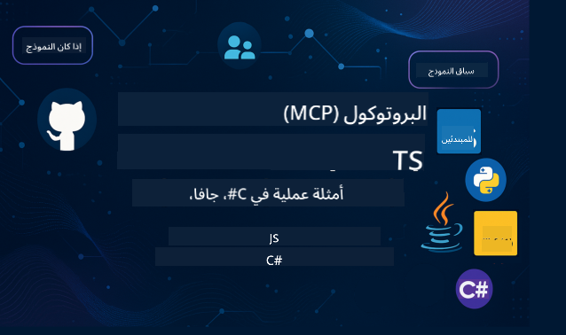

<!--
CO_OP_TRANSLATOR_METADATA:
{
  "original_hash": "2a21391378c12ecfef50f866329dfde0",
  "translation_date": "2025-05-17T05:17:22+00:00",
  "source_file": "README.md",
  "language_code": "ar"
}
-->

اتبع هذه الخطوات للبدء في استخدام هذه الموارد:
1. **قم بعمل فورك للمستودع**: اضغط على 
2. **استنساخ المستودع**: `git clone https://github.com/microsoft/mcp-for-beginners.git`
3. [**انضم إلى Discord Microsoft Azure AI Foundry وقابل الخبراء والمطورين الآخرين**](https://discord.com/invite/ByRwuEEgH4)

### 🌐 دعم متعدد اللغات

#### مدعوم عبر GitHub Action (مؤتمت ودائمًا محدث)
[الفرنسية](../fr/README.md) | [الإسبانية](../es/README.md) | [الألمانية](../de/README.md) | [الروسية](../ru/README.md) | [العربية](./README.md) | [الفارسية](../fa/README.md) | [الأردية](../ur/README.md) | [الصينية (المبسطة)](../zh/README.md) | [الصينية (التقليدية، ماكاو)](../mo/README.md) | [الصينية (التقليدية، هونغ كونغ)](../hk/README.md) | [الصينية (التقليدية، تايوان)](../tw/README.md) | [اليابانية](../ja/README.md) | [الكورية](../ko/README.md) | [الهندية](../hi/README.md) | [البنغالية](../bn/README.md) | [الماراثية](../mr/README.md) | [النيبالية](../ne/README.md) | [البنجابية (غورموكي)](../pa/README.md) | [البرتغالية (البرتغال)](../pt/README.md) | [البرتغالية (البرازيل)](../br/README.md) | [الإيطالية](../it/README.md) | [البولندية](../pl/README.md) | [التركية](../tr/README.md) | [اليونانية](../el/README.md) | [التايلاندية](../th/README.md) | [السويدية](../sv/README.md) | [الدانماركية](../da/README.md) | [النرويجية](../no/README.md) | [الفنلندية](../fi/README.md) | [الهولندية](../nl/README.md) | [العبرية](../he/README.md) | [الفيتنامية](../vi/README.md) | [الإندونيسية](../id/README.md) | [الماليزية](../ms/README.md) | [التاغالوغية (الفلبينية)](../tl/README.md) | [السواحيلية](../sw/README.md) | [الهنغارية](../hu/README.md) | [التشيكية](../cs/README.md) | [السلوفاكية](../sk/README.md) | [الرومانية](../ro/README.md) | [البلغارية](../bg/README.md) | [الصربية (السيريلية)](../sr/README.md) | [الكرواتية](../hr/README.md) | [السلوفينية](../sl/README.md)
# 🚀 الدليل النهائي لمنهج بروتوكول سياق النموذج (MCP) للمبتدئين

## **تعلم MCP من خلال أمثلة عملية باللغات C#، Java، JavaScript، Python، وTypeScript**

## 🧠 نظرة عامة على منهج بروتوكول سياق النموذج

**بروتوكول سياق النموذج (MCP)** هو إطار عمل حديث مصمم لتوحيد التفاعلات بين نماذج الذكاء الاصطناعي وتطبيقات العميل. يوفر هذا المنهج مفتوح المصدر مسارًا تعليميًا منظمًا، مكتملًا بأمثلة عملية للبرمجة وحالات استخدام واقعية، عبر لغات البرمجة الشهيرة بما في ذلك C#، Java، JavaScript، TypeScript، وPython.

سواء كنت مطور ذكاء اصطناعي، مهندس نظم، أو مهندس برمجيات، فإن هذا الدليل هو موردك الشامل لإتقان أساسيات MCP واستراتيجيات التنفيذ.

## 🔗 موارد MCP الرسمية

- 📘 [وثائق MCP](https://modelcontextprotocol.io/) – دروس مفصلة وأدلة المستخدم  
- 📜 [مواصفات MCP](https://spec.modelcontextprotocol.io/) – هيكل البروتوكول والمراجع التقنية  
- 🧑‍💻 [مستودع MCP على GitHub](https://github.com/modelcontextprotocol) – SDKs مفتوحة المصدر، أدوات، وأمثلة للبرمجة  

## 🧭 هيكل المنهج الكامل لـ MCP

### 📌 [مقدمة إلى MCP](./00-Introduction/README.md)

- ما هو بروتوكول سياق النموذج؟
- لماذا تهم التوحيد في مسارات الذكاء الاصطناعي
- حالات استخدام عملية وفوائد MCP

### 🧩 [شرح المفاهيم الأساسية](./01-CoreConcepts/README.md)

- فهم بنية العميل-الخادم في MCP
- مكونات البروتوكول الرئيسية: الطلبات، الردود، والمخططات
- أنماط الرسائل وتبادل البيانات في MCP

### 🔐 [الأمان في MCP](./02-Security/readme.md)

- تحديد التهديدات الأمنية في الأنظمة القائمة على MCP
- تقنيات وممارسات أفضل لتأمين التنفيذ

### 🚀 [البدء مع MCP](./03-GettingStarted/README.md)

- إعداد البيئة والتكوين
- إنشاء خوادم وعملاء MCP الأساسية
- دمج MCP مع التطبيقات الموجودة

#### 🧮 مشاريع عينات MCP الحاسبة:

  
<strong>استكشاف تنفيذات البرمجة حسب اللغة</strong>

  - [مثال خادم MCP في C#](./03-GettingStarted/samples/csharp/README.md)
  - [Java MCP الحاسبة](./03-GettingStarted/samples/java/calculator/README.md)
  - [عرض MCP في JavaScript](./03-GettingStarted/samples/javascript/README.md)
  - [خادم MCP في Python](../../03-GettingStarted/samples/python/mcp_calculator_server.py)
  - [مثال MCP في TypeScript](./03-GettingStarted/samples/typescript/README.md)

### 🛠️ [التنفيذ العملي](./04-PracticalImplementation/README.md)

- استخدام SDKs عبر لغات مختلفة
- تصحيح الأخطاء، الاختبار، والتحقق
- صياغة قوالب ومهام قابلة لإعادة الاستخدام

#### 💡 مشاريع الحاسبة المتقدمة لـ MCP:

  
<strong>استكشاف العينات المتقدمة</strong>

  - [عينة متقدمة في C#](./04-PracticalImplementation/samples/csharp/README.md)
  - [مثال تطبيق الحاوية في Java](./04-PracticalImplementation/samples/java/containerapp/README.md)
  - [عينة متقدمة في JavaScript](./04-PracticalImplementation/samples/javascript/README.md)
  - [تنفيذ معقد في Python](../../04-PracticalImplementation/samples/python/mcp_sample.py)
  - [عينة الحاوية في TypeScript](./04-PracticalImplementation/samples/typescript/README.md)

### 🎓 [مواضيع متقدمة في MCP](./05-AdvancedTopics/README.md)

- مهام الذكاء الاصطناعي متعددة الوسائط وقابلية التوسع
- استراتيجيات التوسع الآمن
- MCP في النظم البيئية للشركات

### 🌍 [مساهمات المجتمع](./06-CommunityContributions/README.md)

- كيفية المساهمة في البرمجة والوثائق
- التعاون عبر GitHub
- تحسينات وملاحظات يقودها المجتمع

### 📈 [رؤى من التبني المبكر](./07-CaseStudies/README.md)

- تنفيذات واقعية وما نجح
- بناء ونشر حلول قائمة على MCP
- الاتجاهات وخريطة الطريق المستقبلية

### 📏 [أفضل الممارسات لـ MCP](./08-BestPractices/README.md)

- ضبط الأداء والتحسين
- تصميم أنظمة MCP مقاومة للأعطال
- استراتيجيات الاختبار والمرونة

### 📊 [دراسات حالة MCP](./09-CaseStudy/Readme.md)

- استكشاف معماريات حلول MCP
- مخططات النشر ونصائح الدمج
- رسوم توضيحية مشروحة وجولات المشاريع

## 🎯 المتطلبات الأساسية لتعلم MCP

لتحقيق أقصى استفادة من هذا المنهج، يجب أن يكون لديك:

- معرفة أساسية بـ C#، Java، أو Python
- فهم نموذج العميل-الخادم وواجهات برمجة التطبيقات
- (اختياري) الإلمام بمفاهيم التعلم الآلي

## 🛠️ كيفية استخدام هذا المنهج بفعالية

كل درس في هذا الدليل يشمل:

1. شروحات واضحة لمفاهيم MCP  
2. أمثلة للبرمجة الحية بلغات متعددة  
3. تمارين لبناء تطبيقات MCP حقيقية  
4. موارد إضافية للمتعلمين المتقدمين  

## 📜 معلومات الترخيص

هذا المحتوى مرخص تحت **ترخيص MIT**. للحصول على الشروط والأحكام، انظر [الترخيص](../../LICENSE).

## 🤝 إرشادات المساهمة

يرحب هذا المشروع بالمساهمات والاقتراحات. تتطلب معظم المساهمات منك الاتفاق على
اتفاقية ترخيص المساهم (CLA) التي تعلن أنك لديك الحق في، وتقوم فعليًا، بمنحنا
الحقوق لاستخدام مساهمتك. لمزيد من التفاصيل، قم بزيارة <https://cla.opensource.microsoft.com>.

عندما تقدم طلب سحب، سيقوم روبوت CLA تلقائيًا بتحديد ما إذا كنت بحاجة إلى تقديم
CLA وتزيين PR بشكل مناسب (مثل، فحص الحالة، التعليق). ببساطة اتبع التعليمات
المقدمة من الروبوت. ستحتاج إلى القيام بذلك مرة واحدة فقط عبر جميع المستودعات التي تستخدم CLA لدينا.

لقد اعتمد هذا المشروع [مدونة قواعد السلوك لمصدر مفتوح من Microsoft](https://opensource.microsoft.com/codeofconduct/).
لمزيد من المعلومات، انظر [الأسئلة الشائعة حول مدونة قواعد السلوك](https://opensource.microsoft.com/codeofconduct/faq/) أو
اتصل بـ [opencode@microsoft.com](mailto:opencode@microsoft.com) مع أي أسئلة أو تعليقات إضافية.

## ™️ إشعار العلامات التجارية

قد يحتوي هذا المشروع على علامات تجارية أو شعارات لمشاريع، منتجات، أو خدمات. الاستخدام المصرح به لعلامات Microsoft
التجارية أو الشعارات يجب أن يتبع [إرشادات العلامات التجارية والعلامات التجارية لـ Microsoft](https://www.microsoft.com/legal/intellectualproperty/trademarks/usage/general).
يجب ألا يسبب استخدام علامات Microsoft التجارية أو الشعارات في الإصدارات المعدلة من هذا المشروع أي لبس أو يشير إلى رعاية Microsoft.
أي استخدام لعلامات تجارية أو شعارات من طرف ثالث يخضع لسياسات الأطراف الثالثة.

**إخلاء المسؤولية**:  
تمت ترجمة هذا المستند باستخدام خدمة الترجمة بالذكاء الاصطناعي [Co-op Translator](https://github.com/Azure/co-op-translator). بينما نسعى جاهدين لتحقيق الدقة، يرجى العلم أن الترجمات الآلية قد تحتوي على أخطاء أو معلومات غير دقيقة. يجب اعتبار المستند الأصلي بلغته الأصلية المصدر الموثوق. للحصول على معلومات حاسمة، يوصى بالترجمة البشرية الاحترافية. نحن غير مسؤولين عن أي سوء فهم أو تفسير خاطئ ينشأ عن استخدام هذه الترجمة.