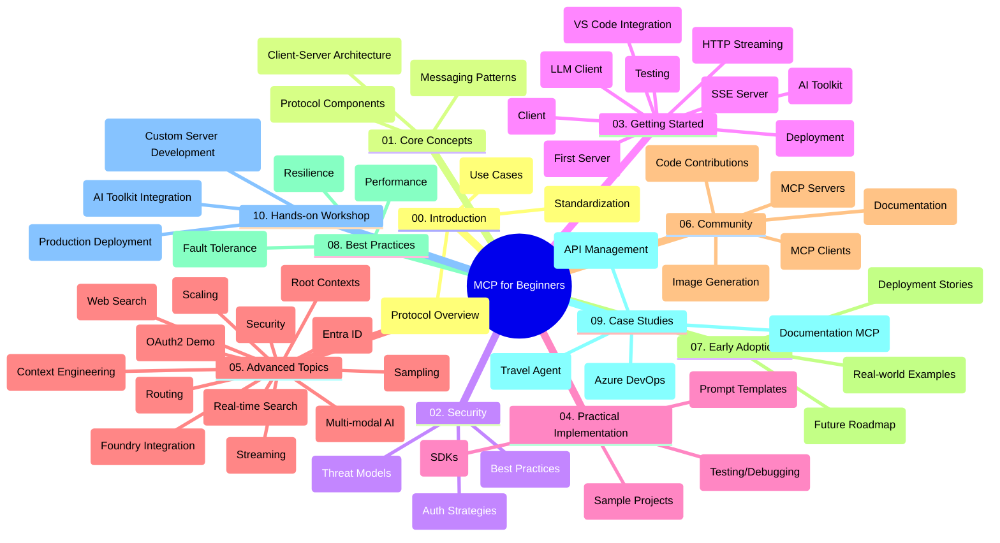

<!--
CO_OP_TRANSLATOR_METADATA:
{
  "original_hash": "77bfab7090f987a5b9fe078f50dbda13",
  "translation_date": "2025-07-16T23:31:17+00:00",
  "source_file": "study_guide.md",
  "language_code": "ar"
}
-->
# بروتوكول سياق النموذج (MCP) للمبتدئين - دليل الدراسة

يوفر هذا الدليل نظرة عامة على هيكل ومستوى المحتوى في مستودع "بروتوكول سياق النموذج (MCP) للمبتدئين". استخدم هذا الدليل للتنقل داخل المستودع بكفاءة والاستفادة القصوى من الموارد المتاحة.

## نظرة عامة على المستودع

بروتوكول سياق النموذج (MCP) هو إطار معياري للتفاعل بين نماذج الذكاء الاصطناعي وتطبيقات العملاء. تم إنشاؤه في البداية بواسطة Anthropic، ويُدار الآن من قبل مجتمع MCP الأوسع عبر المنظمة الرسمية على GitHub. يوفر هذا المستودع منهجًا شاملاً مع أمثلة عملية على الشيفرة بلغات C#، Java، JavaScript، Python، وTypeScript، موجهًا لمطوري الذكاء الاصطناعي، مهندسي الأنظمة، ومهندسي البرمجيات.

## خريطة المنهج البصرية

## هيكل المستودع

ينقسم المستودع إلى عشرة أقسام رئيسية، يركز كل منها على جانب مختلف من MCP:

1. **المقدمة (00-Introduction/)**
   - نظرة عامة على بروتوكول سياق النموذج
   - أهمية التوحيد في خطوط أنابيب الذكاء الاصطناعي
   - حالات استخدام عملية وفوائد

2. **المفاهيم الأساسية (01-CoreConcepts/)**
   - بنية العميل-الخادم
   - المكونات الرئيسية للبروتوكول
   - أنماط الرسائل في MCP

3. **الأمان (02-Security/)**
   - التهديدات الأمنية في أنظمة MCP
   - أفضل الممارسات لتأمين التنفيذات
   - استراتيجيات المصادقة والتفويض

4. **البدء السريع (03-GettingStarted/)**
   - إعداد البيئة والتكوين
   - إنشاء خوادم وعملاء MCP أساسيين
   - التكامل مع التطبيقات القائمة
   - يشمل أقسامًا لـ:
     - تنفيذ أول خادم
     - تطوير العميل
     - دمج عميل LLM
     - التكامل مع VS Code
     - خادم الأحداث المرسلة من الخادم (SSE)
     - البث عبر HTTP
     - دمج مجموعة أدوات الذكاء الاصطناعي
     - استراتيجيات الاختبار
     - إرشادات النشر

5. **التنفيذ العملي (04-PracticalImplementation/)**
   - استخدام SDKs بلغات برمجة مختلفة
   - تقنيات التصحيح، الاختبار، والتحقق
   - تصميم قوالب مطالبات قابلة لإعادة الاستخدام وسير عمل
   - مشاريع نموذجية مع أمثلة تنفيذية

6. **المواضيع المتقدمة (05-AdvancedTopics/)**
   - تقنيات هندسة السياق
   - دمج وكيل Foundry
   - سير عمل الذكاء الاصطناعي متعدد الوسائط
   - عروض توضيحية لمصادقة OAuth2
   - قدرات البحث في الوقت الحقيقي
   - البث في الوقت الحقيقي
   - تنفيذ سياقات الجذر
   - استراتيجيات التوجيه
   - تقنيات العينة
   - أساليب التوسع
   - اعتبارات الأمان
   - دمج أمان Entra ID
   - دمج البحث على الويب

7. **مساهمات المجتمع (06-CommunityContributions/)**
   - كيفية المساهمة بالشيفرة والوثائق
   - التعاون عبر GitHub
   - تحسينات المجتمع وردود الفعل
   - استخدام عملاء MCP المتنوعين (Claude Desktop، Cline، VSCode)
   - العمل مع خوادم MCP الشهيرة بما في ذلك توليد الصور

8. **دروس من التبني المبكر (07-LessonsfromEarlyAdoption/)**
   - تطبيقات واقعية وقصص نجاح
   - بناء ونشر حلول قائمة على MCP
   - الاتجاهات وخارطة الطريق المستقبلية

9. **أفضل الممارسات (08-BestPractices/)**
   - ضبط الأداء والتحسين
   - تصميم أنظمة MCP مقاومة للأخطاء
   - استراتيجيات الاختبار والمرونة

10. **دراسات حالة (09-CaseStudy/)**
    - دراسة حالة: تكامل Azure API Management
    - دراسة حالة: تنفيذ وكيل السفر
    - دراسة حالة: تكامل Azure DevOps مع YouTube
    - أمثلة تنفيذية مع توثيق مفصل

11. **ورشة عمل تطبيقية (10-StreamliningAIWorkflowsBuildingAnMCPServerWithAIToolkit/)**
    - ورشة عمل شاملة تجمع MCP مع مجموعة أدوات الذكاء الاصطناعي
    - بناء تطبيقات ذكية تربط نماذج الذكاء الاصطناعي بالأدوات الواقعية
    - وحدات عملية تغطي الأساسيات، تطوير الخادم المخصص، واستراتيجيات النشر الإنتاجي
    - نهج تعليمي مع مختبرات تعليمية وتعليمات خطوة بخطوة

## موارد إضافية

يحتوي المستودع على موارد داعمة:

- **مجلد الصور**: يحتوي على مخططات ورسوم توضيحية مستخدمة في المنهج
- **الترجمات**: دعم متعدد اللغات مع ترجمات آلية للوثائق
- **الموارد الرسمية لـ MCP**:
  - [MCP Documentation](https://modelcontextprotocol.io/)
  - [MCP Specification](https://spec.modelcontextprotocol.io/)
  - [MCP GitHub Repository](https://github.com/modelcontextprotocol)

## كيفية استخدام هذا المستودع

1. **التعلم المتسلسل**: اتبع الفصول بالترتيب (من 00 إلى 10) لتجربة تعلم منظمة.
2. **التركيز على لغة معينة**: إذا كنت مهتمًا بلغة برمجة محددة، استكشف مجلدات العينات لتنفيذات بلغتك المفضلة.
3. **التنفيذ العملي**: ابدأ بقسم "البدء السريع" لإعداد بيئتك وإنشاء أول خادم وعميل MCP.
4. **الاستكشاف المتقدم**: بعد إتقان الأساسيات، تعمق في المواضيع المتقدمة لتوسيع معرفتك.
5. **المشاركة المجتمعية**: انضم إلى مجتمع MCP عبر مناقشات GitHub وقنوات Discord للتواصل مع الخبراء والمطورين الآخرين.

## عملاء وأدوات MCP

يغطي المنهج عملاء وأدوات MCP المتنوعة:

1. **العملاء الرسميون**:
   - Claude Desktop
   - Claude في VSCode
   - Claude API

2. **عملاء المجتمع**:
   - Cline (مبني على الطرفية)
   - Cursor (محرر الشيفرة)
   - ChatMCP
   - Windsurf

3. **أدوات إدارة MCP**:
   - MCP CLI
   - MCP Manager
   - MCP Linker
   - MCP Router

## خوادم MCP الشهيرة

يقدم المستودع عدة خوادم MCP، منها:

1. **خوادم مرجعية رسمية**:
   - Filesystem
   - Fetch
   - Memory
   - Sequential Thinking

2. **توليد الصور**:
   - Azure OpenAI DALL-E 3
   - Stable Diffusion WebUI
   - Replicate

3. **أدوات التطوير**:
   - Git MCP
   - Terminal Control
   - Code Assistant

4. **خوادم متخصصة**:
   - Salesforce
   - Microsoft Teams
   - Jira & Confluence

## المساهمة

يرحب هذا المستودع بمساهمات المجتمع. راجع قسم مساهمات المجتمع للحصول على إرشادات حول كيفية المساهمة بفعالية في نظام MCP البيئي.

## سجل التغييرات

| التاريخ | التغييرات |
|---------|------------|
| 16 يوليو 2025 | - تحديث هيكل المستودع ليعكس المحتوى الحالي - إضافة قسم عملاء وأدوات MCP - إضافة قسم خوادم MCP الشهيرة - تحديث خريطة المنهج البصرية مع جميع المواضيع الحالية - تعزيز قسم المواضيع المتقدمة بجميع المجالات المتخصصة - تحديث دراسات الحالة لتعكس أمثلة فعلية - توضيح أصل MCP كإنشاء من Anthropic |
| 11 يونيو 2025 | - الإنشاء الأولي لدليل الدراسة - إضافة خريطة المنهج البصرية - تحديد هيكل المستودع - تضمين مشاريع نموذجية وموارد إضافية |

---

*تم تحديث هذا الدليل في 16 يوليو 2025، ويقدم نظرة عامة على المستودع حتى ذلك التاريخ. قد يتم تحديث محتوى المستودع بعد هذا التاريخ.*

**إخلاء المسؤولية**:  
تمت ترجمة هذا المستند باستخدام خدمة الترجمة الآلية [Co-op Translator](https://github.com/Azure/co-op-translator). بينما نسعى لتحقيق الدقة، يرجى العلم أن الترجمات الآلية قد تحتوي على أخطاء أو عدم دقة. يجب اعتبار المستند الأصلي بلغته الأصلية المصدر الموثوق به. للمعلومات الهامة، يُنصح بالترجمة البشرية المهنية. نحن غير مسؤولين عن أي سوء فهم أو تفسير ناتج عن استخدام هذه الترجمة.