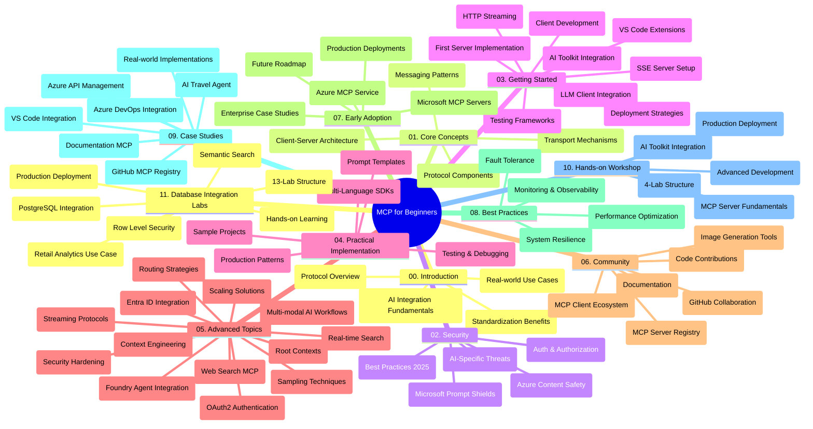

<!--
CO_OP_TRANSLATOR_METADATA:
{
  "original_hash": "aa1ce97bc694b08faf3018bab6d275b9",
  "translation_date": "2025-09-30T14:53:25+00:00",
  "source_file": "study_guide.md",
  "language_code": "ar"
}
-->
# دليل دراسة بروتوكول سياق النموذج (MCP) للمبتدئين

يوفر هذا الدليل نظرة عامة على هيكل المحتوى والمستودع الخاص بمنهج "بروتوكول سياق النموذج (MCP) للمبتدئين". استخدم هذا الدليل للتنقل في المستودع بكفاءة والاستفادة القصوى من الموارد المتاحة.

## نظرة عامة على المستودع

بروتوكول سياق النموذج (MCP) هو إطار عمل معياري للتفاعل بين نماذج الذكاء الاصطناعي وتطبيقات العملاء. تم إنشاؤه في البداية بواسطة Anthropic، ويتم الآن صيانته من قبل مجتمع MCP الأوسع من خلال المنظمة الرسمية على GitHub. يوفر هذا المستودع منهجًا شاملاً مع أمثلة عملية للرمز بلغات C#، Java، JavaScript، Python، وTypeScript، مصممًا لمطوري الذكاء الاصطناعي، مهندسي الأنظمة، ومهندسي البرمجيات.

## خريطة المنهج البصرية

## هيكل المستودع

تم تنظيم المستودع إلى أحد عشر قسمًا رئيسيًا، يركز كل منها على جوانب مختلفة من MCP:

1. **المقدمة (00-Introduction/)**
   - نظرة عامة على بروتوكول سياق النموذج
   - أهمية التوحيد في خطوط أنابيب الذكاء الاصطناعي
   - حالات الاستخدام العملية والفوائد

2. **المفاهيم الأساسية (01-CoreConcepts/)**
   - بنية العميل-الخادم
   - المكونات الرئيسية للبروتوكول
   - أنماط الرسائل في MCP

3. **الأمان (02-Security/)**
   - تهديدات الأمان في الأنظمة القائمة على MCP
   - أفضل الممارسات لتأمين التنفيذ
   - استراتيجيات المصادقة والتفويض
   - **وثائق أمان شاملة**:
     - أفضل ممارسات أمان MCP لعام 2025
     - دليل تنفيذ أمان محتوى Azure
     - ضوابط وتقنيات أمان MCP
     - مرجع سريع لأفضل ممارسات MCP
   - **مواضيع أمان رئيسية**:
     - هجمات حقن التعليمات البرمجية وتسميم الأدوات
     - اختطاف الجلسات ومشاكل الوكيل المرتبك
     - ثغرات تمرير الرموز
     - الأذونات المفرطة والتحكم في الوصول
     - أمان سلسلة التوريد لمكونات الذكاء الاصطناعي
     - تكامل دروع Microsoft Prompt

4. **البدء (03-GettingStarted/)**
   - إعداد البيئة والتكوين
   - إنشاء خوادم وعملاء MCP أساسية
   - التكامل مع التطبيقات الحالية
   - يتضمن أقسامًا لـ:
     - تنفيذ أول خادم
     - تطوير العميل
     - تكامل عميل LLM
     - تكامل VS Code
     - خادم أحداث مرسلة من الخادم (SSE)
     - بث HTTP
     - تكامل أدوات الذكاء الاصطناعي
     - استراتيجيات الاختبار
     - إرشادات النشر

5. **التنفيذ العملي (04-PracticalImplementation/)**
   - استخدام SDKs عبر لغات البرمجة المختلفة
   - تقنيات التصحيح والاختبار والتحقق
   - إنشاء قوالب التعليمات البرمجية القابلة لإعادة الاستخدام
   - مشاريع نموذجية مع أمثلة التنفيذ

6. **المواضيع المتقدمة (05-AdvancedTopics/)**
   - تقنيات هندسة السياق
   - تكامل وكلاء Foundry
   - تدفقات عمل الذكاء الاصطناعي متعددة الوسائط
   - عروض مصادقة OAuth2
   - قدرات البحث في الوقت الفعلي
   - البث في الوقت الفعلي
   - تنفيذ السياقات الجذرية
   - استراتيجيات التوجيه
   - تقنيات أخذ العينات
   - نهج التوسع
   - اعتبارات الأمان
   - تكامل أمان Entra ID
   - تكامل البحث على الويب

7. **مساهمات المجتمع (06-CommunityContributions/)**
   - كيفية المساهمة في الكود والوثائق
   - التعاون عبر GitHub
   - تحسينات وردود فعل يقودها المجتمع
   - استخدام عملاء MCP المختلفين (Claude Desktop، Cline، VSCode)
   - العمل مع خوادم MCP الشهيرة بما في ذلك توليد الصور

8. **دروس من التبني المبكر (07-LessonsfromEarlyAdoption/)**
   - تنفيذات واقعية وقصص نجاح
   - بناء ونشر حلول قائمة على MCP
   - الاتجاهات وخارطة الطريق المستقبلية
   - **دليل خوادم MCP من Microsoft**: دليل شامل لـ 10 خوادم MCP جاهزة للإنتاج من Microsoft بما في ذلك:
     - خادم MCP لوثائق Microsoft Learn
     - خادم MCP لـ Azure (15+ موصلات متخصصة)
     - خادم MCP لـ GitHub
     - خادم MCP لـ Azure DevOps
     - خادم MCP لـ MarkItDown
     - خادم MCP لـ SQL Server
     - خادم MCP لـ Playwright
     - خادم MCP لـ Dev Box
     - خادم MCP لـ Azure AI Foundry
     - خادم MCP لـ Microsoft 365 Agents Toolkit

9. **أفضل الممارسات (08-BestPractices/)**
   - تحسين الأداء وضبطه
   - تصميم أنظمة MCP مقاومة للأعطال
   - استراتيجيات الاختبار والمرونة

10. **دراسات الحالة (09-CaseStudy/)**
    - **سبع دراسات حالة شاملة** توضح تنوع MCP عبر سيناريوهات مختلفة:
    - **وكلاء السفر للذكاء الاصطناعي في Azure**: تنسيق متعدد الوكلاء مع Azure OpenAI والبحث الذكي
    - **تكامل Azure DevOps**: أتمتة عمليات سير العمل مع تحديثات بيانات YouTube
    - **استرجاع الوثائق في الوقت الفعلي**: عميل Python console مع بث HTTP
    - **مولد خطة دراسة تفاعلية**: تطبيق ويب Chainlit مع الذكاء الاصطناعي الحواري
    - **الوثائق داخل المحرر**: تكامل VS Code مع سير عمل GitHub Copilot
    - **إدارة واجهات برمجة التطبيقات في Azure**: تكامل واجهات برمجة التطبيقات المؤسسية مع إنشاء خادم MCP
    - **سجل MCP لـ GitHub**: تطوير النظام البيئي ومنصة التكامل الوكيل
    - أمثلة التنفيذ التي تغطي التكامل المؤسسي، إنتاجية المطورين، وتطوير النظام البيئي

11. **ورشة العمل العملية (10-StreamliningAIWorkflowsBuildingAnMCPServerWithAIToolkit/)**
    - ورشة عمل عملية شاملة تجمع بين MCP وأدوات الذكاء الاصطناعي
    - بناء تطبيقات ذكية تربط نماذج الذكاء الاصطناعي بالأدوات الواقعية
    - وحدات عملية تغطي الأساسيات، تطوير الخادم المخصص، واستراتيجيات النشر في الإنتاج
    - **هيكل المختبر**:
      - المختبر 1: أساسيات خادم MCP
      - المختبر 2: تطوير خادم MCP المتقدم
      - المختبر 3: تكامل أدوات الذكاء الاصطناعي
      - المختبر 4: النشر في الإنتاج والتوسع
    - نهج التعلم القائم على المختبر مع تعليمات خطوة بخطوة

12. **مختبرات تكامل قاعدة بيانات خادم MCP (11-MCPServerHandsOnLabs/)**
    - **مسار تعلم شامل من 13 مختبرًا** لبناء خوادم MCP جاهزة للإنتاج مع تكامل PostgreSQL
    - **تنفيذ تحليلات البيع بالتجزئة الواقعية** باستخدام حالة استخدام Zava Retail
    - **أنماط على مستوى المؤسسات** بما في ذلك أمان مستوى الصف (RLS)، البحث الدلالي، والوصول إلى البيانات متعددة المستأجرين
    - **هيكل المختبر الكامل**:
      - **مختبرات 00-03: الأساسيات** - المقدمة، الهندسة المعمارية، الأمان، إعداد البيئة
      - **مختبرات 04-06: بناء خادم MCP** - تصميم قاعدة البيانات، تنفيذ خادم MCP، تطوير الأدوات
      - **مختبرات 07-09: الميزات المتقدمة** - البحث الدلالي، الاختبار والتصحيح، تكامل VS Code
      - **مختبرات 10-12: الإنتاج وأفضل الممارسات** - النشر، المراقبة، التحسين
    - **التقنيات المغطاة**: إطار عمل FastMCP، PostgreSQL، Azure OpenAI، تطبيقات Azure Container، رؤى التطبيقات
    - **نتائج التعلم**: خوادم MCP جاهزة للإنتاج، أنماط تكامل قاعدة البيانات، تحليلات مدعومة بالذكاء الاصطناعي، أمان المؤسسات

## موارد إضافية

يتضمن المستودع موارد داعمة:

- **مجلد الصور**: يحتوي على الرسوم البيانية والرسوم التوضيحية المستخدمة في المنهج
- **الترجمات**: دعم متعدد اللغات مع ترجمات تلقائية للوثائق
- **موارد MCP الرسمية**:
  - [وثائق MCP](https://modelcontextprotocol.io/)
  - [مواصفات MCP](https://spec.modelcontextprotocol.io/)
  - [مستودع MCP على GitHub](https://github.com/modelcontextprotocol)

## كيفية استخدام هذا المستودع

1. **التعلم المتسلسل**: اتبع الفصول بالترتيب (00 إلى 11) لتجربة تعلم منظمة.
2. **التركيز على لغة معينة**: إذا كنت مهتمًا بلغة برمجة معينة، استكشف أدلة العينات للتنفيذات بلغتك المفضلة.
3. **التنفيذ العملي**: ابدأ بقسم "البدء" لإعداد بيئتك وإنشاء أول خادم وعميل MCP.
4. **الاستكشاف المتقدم**: بمجرد أن تصبح مرتاحًا مع الأساسيات، استكشف المواضيع المتقدمة لتوسيع معرفتك.
5. **التفاعل المجتمعي**: انضم إلى مجتمع MCP من خلال مناقشات GitHub وقنوات Discord للتواصل مع الخبراء والمطورين الآخرين.

## عملاء وأدوات MCP

يغطي المنهج عملاء وأدوات MCP المختلفة:

1. **العملاء الرسميون**:
   - Visual Studio Code
   - MCP في Visual Studio Code
   - Claude Desktop
   - Claude في VSCode
   - Claude API

2. **عملاء المجتمع**:
   - Cline (مبني على الطرفية)
   - Cursor (محرر الكود)
   - ChatMCP
   - Windsurf

3. **أدوات إدارة MCP**:
   - MCP CLI
   - MCP Manager
   - MCP Linker
   - MCP Router

## خوادم MCP الشهيرة

يقدم المستودع خوادم MCP المختلفة، بما في ذلك:

1. **خوادم MCP الرسمية من Microsoft**:
   - خادم MCP لوثائق Microsoft Learn
   - خادم MCP لـ Azure (15+ موصلات متخصصة)
   - خادم MCP لـ GitHub
   - خادم MCP لـ Azure DevOps
   - خادم MCP لـ MarkItDown
   - خادم MCP لـ SQL Server
   - خادم MCP لـ Playwright
   - خادم MCP لـ Dev Box
   - خادم MCP لـ Azure AI Foundry
   - خادم MCP لـ Microsoft 365 Agents Toolkit

2. **الخوادم المرجعية الرسمية**:
   - Filesystem
   - Fetch
   - Memory
   - Sequential Thinking

3. **توليد الصور**:
   - Azure OpenAI DALL-E 3
   - Stable Diffusion WebUI
   - Replicate

4. **أدوات التطوير**:
   - Git MCP
   - التحكم في الطرفية
   - مساعد الكود

5. **الخوادم المتخصصة**:
   - Salesforce
   - Microsoft Teams
   - Jira & Confluence

## المساهمة

يرحب هذا المستودع بمساهمات المجتمع. راجع قسم مساهمات المجتمع للحصول على إرشادات حول كيفية المساهمة بفعالية في نظام MCP البيئي.

## سجل التغييرات

| التاريخ | التغييرات |
|--------|-----------||
| 29 سبتمبر 2025 | - إضافة قسم 11-MCPServerHandsOnLabs مع مسار تعلم شامل من 13 مختبرًا لتكامل قاعدة البيانات - تحديث خريطة المنهج البصرية لتشمل مختبرات تكامل قاعدة البيانات - تحسين هيكل المستودع ليعكس أحد عشر قسمًا رئيسيًا - إضافة وصف مفصل لتكامل PostgreSQL، حالة استخدام تحليلات البيع بالتجزئة، وأنماط المؤسسات - تحديث إرشادات التنقل لتشمل الأقسام 00-11 |
| 26 سبتمبر 2025 | - إضافة دراسة حالة سجل MCP لـ GitHub إلى قسم 09-CaseStudy - تحديث دراسات الحالة لتعكس سبع دراسات حالة شاملة - تحسين أوصاف دراسات الحالة بتفاصيل تنفيذ محددة - تحديث خريطة المنهج البصرية لتشمل سجل MCP لـ GitHub - مراجعة هيكل دليل الدراسة ليعكس التركيز على تطوير النظام البيئي |
| 18 يوليو 2025 | - تحديث هيكل المستودع ليشمل دليل خوادم MCP من Microsoft - إضافة قائمة شاملة لـ 10 خوادم MCP جاهزة للإنتاج من Microsoft - تحسين قسم خوادم MCP الشهيرة مع خوادم MCP الرسمية من Microsoft - تحديث قسم دراسات الحالة بأمثلة ملفات فعلية - إضافة تفاصيل هيكل المختبر لورشة العمل العملية |
| 16 يوليو 2025 | - تحديث هيكل المستودع ليعكس المحتوى الحالي - إضافة قسم عملاء وأدوات MCP - إضافة قسم خوادم MCP الشهيرة - تحديث خريطة المنهج البصرية بجميع المواضيع الحالية - تحسين قسم المواضيع المتقدمة بجميع المجالات المتخصصة - تحديث دراسات الحالة لتعكس أمثلة فعلية - توضيح أصل MCP كإنشاء من Anthropic |
| 11 يونيو 2025 | - إنشاء دليل الدراسة الأولي - إضافة خريطة المنهج البصرية - تحديد هيكل المستودع - تضمين مشاريع نموذجية وموارد إضافية |

---

*تم تحديث هذا الدليل الدراسي في 29 سبتمبر 2025، ويوفر نظرة عامة على المستودع اعتبارًا من ذلك التاريخ. قد يتم تحديث محتوى المستودع بعد هذا التاريخ.*

---

**إخلاء المسؤولية**:  
تم ترجمة هذا المستند باستخدام خدمة الترجمة بالذكاء الاصطناعي [Co-op Translator](https://github.com/Azure/co-op-translator). بينما نسعى لتحقيق الدقة، يرجى العلم أن الترجمات الآلية قد تحتوي على أخطاء أو عدم دقة. يجب اعتبار المستند الأصلي بلغته الأصلية المصدر الرسمي. للحصول على معلومات حاسمة، يُوصى بالترجمة البشرية الاحترافية. نحن غير مسؤولين عن أي سوء فهم أو تفسيرات خاطئة تنشأ عن استخدام هذه الترجمة.