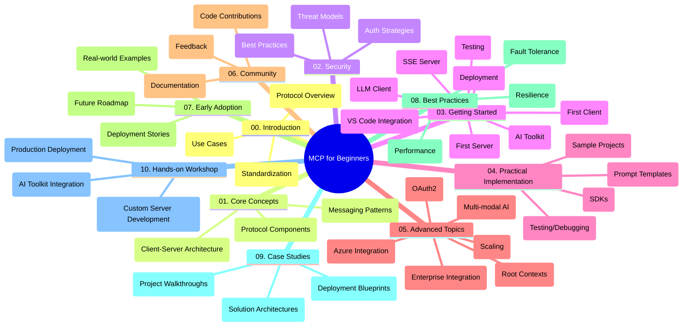

<!--
CO_OP_TRANSLATOR_METADATA:
{
  "original_hash": "a607d4febc94caee9a12b77795f7fc9a",
  "translation_date": "2025-06-11T16:36:25+00:00",
  "source_file": "study_guide.md",
  "language_code": "ar"
}
-->
# بروتوكول سياق النموذج (MCP) للمبتدئين - دليل الدراسة

يقدم هذا الدليل لمحة عامة عن هيكل المحتوى الخاص بالمستودع لمنهج "بروتوكول سياق النموذج (MCP) للمبتدئين". استخدم هذا الدليل للتنقل داخل المستودع بكفاءة والاستفادة القصوى من الموارد المتاحة.

## نظرة عامة على المستودع

بروتوكول سياق النموذج (MCP) هو إطار معياري للتفاعلات بين نماذج الذكاء الاصطناعي وتطبيقات العملاء. يوفر هذا المستودع منهجًا شاملاً مع أمثلة عملية على الشيفرات بلغات C# وJava وJavaScript وPython وTypeScript، موجهًا لمطوري الذكاء الاصطناعي، ومهندسي الأنظمة، ومهندسي البرمجيات.

## خريطة المنهج المرئية

## هيكل المستودع

يتم تنظيم المستودع في عشرة أقسام رئيسية، يركز كل منها على جوانب مختلفة من MCP:

1. **المقدمة (00-Introduction/)**
   - لمحة عامة عن بروتوكول سياق النموذج
   - لماذا تعتبر المعايير مهمة في خطوط أنابيب الذكاء الاصطناعي
   - حالات الاستخدام العملية والفوائد

2. **المفاهيم الأساسية (01-CoreConcepts/)**
   - بنية العميل-الخادم
   - المكونات الرئيسية للبروتوكول
   - أنماط الرسائل في MCP

3. **الأمان (02-Security/)**
   - التهديدات الأمنية في أنظمة MCP
   - أفضل الممارسات لتأمين التنفيذات
   - استراتيجيات المصادقة والتفويض

4. **البدء (03-GettingStarted/)**
   - إعداد البيئة والتكوين
   - إنشاء خوادم وعملاء MCP أساسية
   - التكامل مع التطبيقات القائمة
   - أقسام فرعية للخادم الأول، العميل الأول، عميل LLM، تكامل VS Code، خادم SSE، مجموعة أدوات AI، الاختبار والنشر

5. **التنفيذ العملي (04-PracticalImplementation/)**
   - استخدام SDKs عبر لغات البرمجة المختلفة
   - تقنيات التصحيح والاختبار والتحقق
   - صياغة قوالب طلبات وقوالب عمل قابلة لإعادة الاستخدام
   - مشاريع نموذجية مع أمثلة تنفيذية

6. **المواضيع المتقدمة (05-AdvancedTopics/)**
   - سير عمل AI متعدد الوسائط وقابلية التوسع
   - استراتيجيات التوسع الآمن
   - MCP في أنظمة المؤسسات
   - مواضيع متخصصة تشمل تكامل Azure، تعدد الوسائط، OAuth2، سياقات الجذر، التوجيه، العينة، التوسع، الأمان، تكامل البحث على الويب، والبث المباشر.

7. **مساهمات المجتمع (06-CommunityContributions/)**
   - كيفية المساهمة بالشيفرة والوثائق
   - التعاون عبر GitHub
   - تحسينات يقودها المجتمع وردود الفعل

8. **دروس من التبني المبكر (07-LessonsfromEarlyAdoption/)**
   - تطبيقات حقيقية وقصص نجاح
   - بناء ونشر حلول قائمة على MCP
   - الاتجاهات وخارطة الطريق المستقبلية

9. **أفضل الممارسات (08-BestPractices/)**
   - ضبط الأداء والتحسين
   - تصميم أنظمة MCP مقاومة للأخطاء
   - استراتيجيات الاختبار والمرونة

10. **دراسات حالة (09-CaseStudy/)**
    - تحليلات معمقة لهياكل حلول MCP
    - مخططات النشر ونصائح التكامل
    - مخططات مشروحة وجولات في المشاريع

11. **ورشة عمل عملية (10-StreamliningAIWorkflowsBuildingAnMCPServerWithAIToolkit/)**
    - ورشة عمل شاملة تجمع MCP مع مجموعة أدوات AI من Microsoft لـ VS Code
    - بناء تطبيقات ذكية تربط نماذج الذكاء الاصطناعي بالأدوات الواقعية
    - وحدات عملية تغطي الأساسيات، تطوير الخادم المخصص، واستراتيجيات النشر الإنتاجي

## مشاريع نموذجية

يتضمن المستودع عدة مشاريع نموذجية توضح تنفيذ MCP بلغات برمجة مختلفة:

### عينات حاسبة MCP الأساسية
- مثال خادم MCP بلغة C#
- حاسبة MCP بلغة Java
- عرض MCP بلغة JavaScript
- خادم MCP بلغة Python
- مثال MCP بلغة TypeScript

### مشاريع حاسبة MCP المتقدمة
- عينة متقدمة بلغة C#
- مثال تطبيق حاوية Java
- عينة متقدمة بلغة JavaScript
- تنفيذ معقد بلغة Python
- عينة حاوية بلغة TypeScript

## موارد إضافية

يحتوي المستودع على موارد داعمة:

- **مجلد الصور**: يحتوي على المخططات والرسوم التوضيحية المستخدمة عبر المنهج
- **الترجمات**: دعم متعدد اللغات مع ترجمات آلية للوثائق
- **الموارد الرسمية لـ MCP**:
  - [MCP Documentation](https://modelcontextprotocol.io/)
  - [MCP Specification](https://spec.modelcontextprotocol.io/)
  - [MCP GitHub Repository](https://github.com/modelcontextprotocol)

## كيفية استخدام هذا المستودع

1. **التعلم المتسلسل**: اتبع الفصول بالترتيب (من 00 إلى 10) لتجربة تعلم منظمة.
2. **التركيز على لغة معينة**: إذا كنت مهتمًا بلغة برمجة محددة، استكشف مجلدات العينات لتنفيذات بلغتك المفضلة.
3. **التنفيذ العملي**: ابدأ بقسم "البدء" لإعداد بيئتك وإنشاء أول خادم وعميل MCP.
4. **الاستكشاف المتقدم**: بمجرد أن تتقن الأساسيات، تعمق في المواضيع المتقدمة لتوسيع معرفتك.
5. **المشاركة المجتمعية**: انضم إلى [Azure AI Foundry Discord](https://discord.com/invite/ByRwuEEgH4) للتواصل مع الخبراء والمطورين الآخرين.

## المساهمة

يرحب هذا المستودع بالمساهمات من المجتمع. راجع قسم مساهمات المجتمع للحصول على إرشادات حول كيفية المساهمة.

---

*تم إنشاء هذا الدليل الدراسي في 11 يونيو 2025، ويقدم لمحة عامة عن المستودع حتى ذلك التاريخ. قد يكون محتوى المستودع قد تم تحديثه منذ ذلك الحين.*

**إخلاء المسؤولية**:  
تمت ترجمة هذا المستند باستخدام خدمة الترجمة الآلية [Co-op Translator](https://github.com/Azure/co-op-translator). بينما نسعى لتحقيق الدقة، يرجى العلم أن الترجمات الآلية قد تحتوي على أخطاء أو عدم دقة. يجب اعتبار المستند الأصلي بلغته الأصلية المصدر الرسمي والمعتمد. للمعلومات الحساسة، يُنصح بالترجمة البشرية الاحترافية. نحن غير مسؤولين عن أي سوء فهم أو تفسير خاطئ ناتج عن استخدام هذه الترجمة.