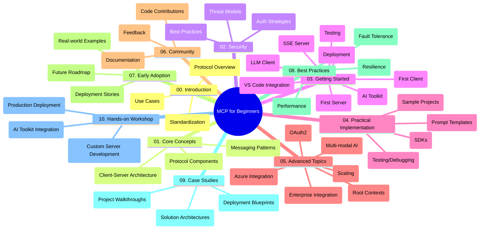

<!--
CO_OP_TRANSLATOR_METADATA:
{
  "original_hash": "a607d4febc94caee9a12b77795f7fc9a",
  "translation_date": "2025-07-13T15:10:04+00:00",
  "source_file": "study_guide.md",
  "language_code": "ar"
}
-->
# بروتوكول سياق النموذج (MCP) للمبتدئين - دليل الدراسة

يوفر هذا الدليل نظرة عامة على هيكل ومستوى المحتوى الخاص بمقرر "بروتوكول سياق النموذج (MCP) للمبتدئين". استخدم هذا الدليل للتنقل داخل المستودع بكفاءة والاستفادة القصوى من الموارد المتاحة.

## نظرة عامة على المستودع

بروتوكول سياق النموذج (MCP) هو إطار معياري للتفاعل بين نماذج الذكاء الاصطناعي وتطبيقات العملاء. يقدم هذا المستودع منهجًا شاملاً مع أمثلة عملية على الشيفرة بلغات C#، Java، JavaScript، Python، وTypeScript، مصممًا لمطوري الذكاء الاصطناعي، مهندسي الأنظمة، ومهندسي البرمجيات.

## خريطة المنهج البصرية

## هيكل المستودع

ينظم المستودع في عشرة أقسام رئيسية، يركز كل منها على جانب مختلف من MCP:

1. **المقدمة (00-Introduction/)**
   - نظرة عامة على بروتوكول سياق النموذج
   - أهمية التوحيد في خطوط أنابيب الذكاء الاصطناعي
   - حالات استخدام عملية وفوائد

2. **المفاهيم الأساسية (01-CoreConcepts/)**
   - بنية العميل-الخادم
   - المكونات الرئيسية للبروتوكول
   - أنماط الرسائل في MCP

3. **الأمان (02-Security/)**
   - التهديدات الأمنية في أنظمة MCP
   - أفضل الممارسات لتأمين التنفيذات
   - استراتيجيات المصادقة والتفويض

4. **البدء (03-GettingStarted/)**
   - إعداد البيئة والتكوين
   - إنشاء خوادم وعملاء MCP أساسيين
   - التكامل مع التطبيقات القائمة
   - أقسام فرعية للخادم الأول، العميل الأول، عميل LLM، تكامل VS Code، خادم SSE، مجموعة أدوات AI، الاختبار، والنشر

5. **التنفيذ العملي (04-PracticalImplementation/)**
   - استخدام SDKs عبر لغات البرمجة المختلفة
   - تقنيات التصحيح، الاختبار، والتحقق
   - تصميم قوالب مطالبات قابلة لإعادة الاستخدام وسير عمل
   - مشاريع نموذجية مع أمثلة تنفيذية

6. **المواضيع المتقدمة (05-AdvancedTopics/)**
   - سير عمل الذكاء الاصطناعي متعدد الوسائط وقابلية التوسع
   - استراتيجيات التوسع الآمن
   - MCP في بيئات المؤسسات
   - مواضيع متخصصة تشمل تكامل Azure، تعدد الوسائط، OAuth2، السياقات الجذرية، التوجيه، العينة، التوسع، الأمان، تكامل البحث على الويب، والبث.

7. **مساهمات المجتمع (06-CommunityContributions/)**
   - كيفية المساهمة بالشيفرة والوثائق
   - التعاون عبر GitHub
   - تحسينات المجتمع وردود الفعل

8. **دروس من التبني المبكر (07-LessonsfromEarlyAdoption/)**
   - تطبيقات واقعية وقصص نجاح
   - بناء ونشر حلول قائمة على MCP
   - الاتجاهات وخارطة الطريق المستقبلية

9. **أفضل الممارسات (08-BestPractices/)**
   - ضبط الأداء والتحسين
   - تصميم أنظمة MCP مقاومة للأخطاء
   - استراتيجيات الاختبار والمرونة

10. **دراسات حالة (09-CaseStudy/)**
    - تحليلات معمقة لهندسة حلول MCP
    - مخططات النشر ونصائح التكامل
    - مخططات مشروحة وجولات تفصيلية في المشاريع

11. **ورشة عمل تطبيقية (10-StreamliningAIWorkflowsBuildingAnMCPServerWithAIToolkit/)**
    - ورشة عمل شاملة تجمع MCP مع مجموعة أدوات AI من مايكروسوفت لـ VS Code
    - بناء تطبيقات ذكية تربط نماذج الذكاء الاصطناعي بالأدوات الواقعية
    - وحدات عملية تغطي الأساسيات، تطوير خادم مخصص، واستراتيجيات النشر الإنتاجي

## مشاريع نموذجية

يحتوي المستودع على عدة مشاريع نموذجية توضح تنفيذ MCP بلغات برمجة مختلفة:

### عينات حاسبة MCP الأساسية
- مثال خادم MCP بلغة C#
- حاسبة MCP بلغة Java
- عرض MCP بلغة JavaScript
- خادم MCP بلغة Python
- مثال MCP بلغة TypeScript

### مشاريع حاسبة MCP المتقدمة
- عينة متقدمة بلغة C#
- مثال تطبيق حاوية Java
- عينة متقدمة بلغة JavaScript
- تنفيذ معقد بلغة Python
- عينة حاوية بلغة TypeScript

## موارد إضافية

يحتوي المستودع على موارد داعمة:

- **مجلد الصور**: يحتوي على مخططات ورسوم توضيحية مستخدمة في المنهج
- **الترجمات**: دعم متعدد اللغات مع ترجمات آلية للوثائق
- **الموارد الرسمية لـ MCP**:
  - [توثيق MCP](https://modelcontextprotocol.io/)
  - [مواصفات MCP](https://spec.modelcontextprotocol.io/)
  - [مستودع MCP على GitHub](https://github.com/modelcontextprotocol)

## كيفية استخدام هذا المستودع

1. **التعلم المتسلسل**: اتبع الفصول بالترتيب (من 00 إلى 10) لتجربة تعلم منظمة.
2. **التركيز على لغة معينة**: إذا كنت مهتمًا بلغة برمجة محددة، استكشف مجلدات العينات لتنفيذات بلغتك المفضلة.
3. **التنفيذ العملي**: ابدأ بقسم "البدء" لإعداد بيئتك وإنشاء أول خادم وعميل MCP.
4. **الاستكشاف المتقدم**: بعد إتقان الأساسيات، تعمق في المواضيع المتقدمة لتوسيع معرفتك.
5. **المشاركة المجتمعية**: انضم إلى [Azure AI Foundry Discord](https://discord.com/invite/ByRwuEEgH4) للتواصل مع الخبراء والمطورين الآخرين.

## المساهمة

يرحب هذا المستودع بمساهمات المجتمع. راجع قسم مساهمات المجتمع للحصول على إرشادات حول كيفية المساهمة.

---

*تم إنشاء هذا الدليل الدراسي في 11 يونيو 2025، ويقدم نظرة عامة على المستودع حتى ذلك التاريخ. قد يكون محتوى المستودع قد تم تحديثه منذ ذلك الحين.*

**إخلاء المسؤولية**:  
تمت ترجمة هذا المستند باستخدام خدمة الترجمة الآلية [Co-op Translator](https://github.com/Azure/co-op-translator). بينما نسعى لتحقيق الدقة، يرجى العلم أن الترجمات الآلية قد تحتوي على أخطاء أو عدم دقة. يجب اعتبار المستند الأصلي بلغته الأصلية المصدر الموثوق به. للمعلومات الهامة، يُنصح بالاعتماد على الترجمة البشرية المهنية. نحن غير مسؤولين عن أي سوء فهم أو تفسير ناتج عن استخدام هذه الترجمة.