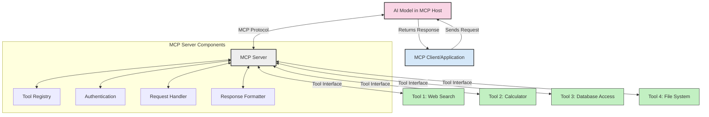
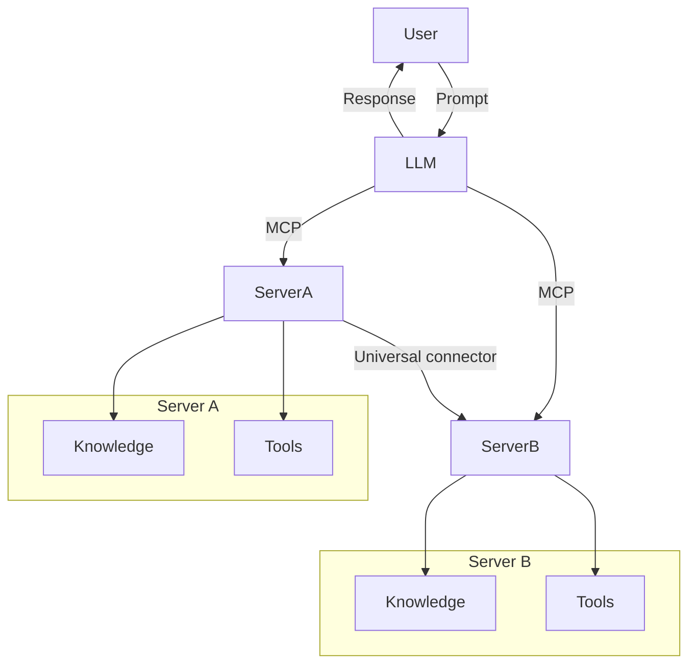

<!--
CO_OP_TRANSLATOR_METADATA:
{
  "original_hash": "1d88dee994dcbb3fa52c271d0c0817b5",
  "translation_date": "2025-05-20T22:32:20+00:00",
  "source_file": "00-Introduction/README.md",
  "language_code": "bg"
}
-->
# Въведение в Model Context Protocol (MCP): Защо е важен за мащабируеми AI приложения

Генеративните AI приложения са голяма крачка напред, тъй като често позволяват на потребителя да взаимодейства с приложението чрез естествени езикови команди. Въпреки това, с увеличаването на времето и ресурсите, инвестирани в такива приложения, искате да сте сигурни, че можете лесно да интегрирате функционалности и ресурси по начин, който е лесно разширяем, че приложението ви може да поддържа повече от един модел и да се справя с различни особености на моделите. С други думи, изграждането на Gen AI приложения е лесно в началото, но с нарастването и усложняването им трябва да започнете да дефинирате архитектура и вероятно ще се нуждаете от стандарт, който да гарантира, че приложенията ви са изградени по последователен начин. Тук влиза MCP, за да организира нещата и да предостави стандарт.

---

## **🔍 Какво е Model Context Protocol (MCP)?**

**Model Context Protocol (MCP)** е **отворен, стандартизиран интерфейс**, който позволява на големите езикови модели (LLMs) да взаимодействат безпроблемно с външни инструменти, API-та и източници на данни. Той осигурява последователна архитектура за разширяване на функционалността на AI моделите отвъд техните тренировъчни данни, което позволява по-интелигентни, мащабируеми и по-отзивчиви AI системи.

---

## **🎯 Защо стандартите в AI са важни**

С нарастването на сложността на генеративните AI приложения е от съществено значение да се възприемат стандарти, които осигуряват **мащабируемост, разширяемост** и **поддръжка**. MCP отговаря на тези нужди чрез:

- Унифициране на интеграциите между модели и инструменти  
- Намаляване на крехки, еднократни персонализирани решения  
- Позволяване на множество модели да съжителстват в една екосистема  

---

## **📚 Учебни цели**

В края на тази статия ще можете да:

- Определите **Model Context Protocol (MCP)** и неговите случаи на употреба  
- Разберете как MCP стандартизира комуникацията между модел и инструмент  
- Идентифицирате основните компоненти на архитектурата на MCP  
- Изследвате реални приложения на MCP в корпоративна и развойна среда  

---

## **💡 Защо Model Context Protocol (MCP) е революционен**

### **🔗 MCP решава фрагментацията в AI взаимодействията**

Преди MCP, интеграцията на модели с инструменти изискваше:

- Персонализиран код за всяка двойка модел-инструмент  
- Нестандартизирани API-та за всеки доставчик  
- Чести прекъсвания заради обновления  
- Лоша мащабируемост при добавяне на повече инструменти  

### **✅ Предимства на стандартизацията чрез MCP**

| **Предимство**            | **Описание**                                                                  |
|--------------------------|-------------------------------------------------------------------------------|
| Интероперативност        | LLMs работят безпроблемно с инструменти от различни доставчици               |
| Последователност         | Еднородно поведение на различни платформи и инструменти                       |
| Преизползваемост         | Инструменти, създадени веднъж, могат да се използват в различни проекти и системи |
| Ускорено разработване    | Намаляване на времето за разработка чрез използване на стандартизирани, plug-and-play интерфейси |

---

## **🧱 Обзор на архитектурата на MCP на високо ниво**

MCP следва **клиент-сървър модел**, при който:

- **MCP Hosts** стартират AI моделите  
- **MCP Clients** инициират заявки  
- **MCP Servers** предоставят контекст, инструменти и възможности  

### **Основни компоненти:**

- **Resources** – Статични или динамични данни за моделите  
- **Prompts** – Предварително дефинирани работни потоци за насочено генериране  
- **Tools** – Изпълними функции като търсене, изчисления  
- **Sampling** – Агентско поведение чрез рекурсивни взаимодействия  

---

## Как работят MCP сървърите

MCP сървърите функционират по следния начин:

- **Поток на заявките**:  
    1. MCP Клиент изпраща заявка към AI Модела, работещ в MCP Host.  
    2. AI Моделът определя кога се нуждае от външни инструменти или данни.  
    3. Моделът комуникира с MCP Сървъра чрез стандартизирания протокол.  

- **Функционалности на MCP Сървъра**:  
    - Регистър на инструментите: Поддържа каталог на наличните инструменти и техните възможности.  
    - Автентикация: Проверява разрешенията за достъп до инструменти.  
    - Обработчик на заявки: Обработва входящите заявки за инструменти от модела.  
    - Форматиране на отговори: Структурира изхода от инструментите във формат, разбираем за модела.  

- **Изпълнение на инструментите**:  
    - Сървърът насочва заявките към съответните външни инструменти  
    - Инструментите изпълняват специализираните си функции (търсене, изчисления, заявки към база данни и др.)  
    - Резултатите се връщат на модела в последователен формат.  

- **Завършване на отговора**:  
    - AI моделът интегрира изхода от инструментите в своя отговор.  
    - Крайният отговор се изпраща обратно към клиентското приложение.  

## 👨‍💻 Как да създадете MCP сървър (с примери)

MCP сървърите ви позволяват да разширите възможностите на LLM, като предоставят данни и функционалности.

Готови ли сте да пробвате? Ето примери за създаване на прост MCP сървър на различни езици:

- **Python пример**: https://github.com/modelcontextprotocol/python-sdk

- **TypeScript пример**: https://github.com/modelcontextprotocol/typescript-sdk

- **Java пример**: https://github.com/modelcontextprotocol/java-sdk

- **C#/.NET пример**: https://github.com/modelcontextprotocol/csharp-sdk

## 🌍 Реални случаи на употреба на MCP

MCP дава възможност за широк спектър от приложения чрез разширяване на AI възможностите:

| **Приложение**             | **Описание**                                                                 |
|----------------------------|-------------------------------------------------------------------------------|
| Интеграция на корпоративни данни | Свързване на LLM с бази данни, CRM системи или вътрешни инструменти          |
| Агентни AI системи         | Позволява автономни агенти с достъп до инструменти и работни потоци за вземане на решения |
| Мултимодални приложения    | Комбиниране на текстови, визуални и аудио инструменти в едно унифицирано AI приложение |
| Интеграция на данни в реално време | Въвеждане на живи данни в AI взаимодействия за по-точни и актуални резултати  |

### 🧠 MCP = Универсален стандарт за AI взаимодействия

Model Context Protocol (MCP) действа като универсален стандарт за AI взаимодействия, подобно на това как USB-C стандартизира физическите връзки за устройства. В света на AI MCP предоставя последователен интерфейс, който позволява на моделите (клиенти) да се интегрират безпроблемно с външни инструменти и доставчици на данни (сървъри). Това премахва необходимостта от разнообразни, персонализирани протоколи за всяко API или източник на данни.

Под MCP, MCP-съвместим инструмент (наричан MCP сървър) следва единен стандарт. Тези сървъри могат да изброяват инструментите или действията, които предлагат, и да изпълняват тези действия при поискване от AI агент. Платформите за AI агенти, които поддържат MCP, могат да откриват наличните инструменти от сървърите и да ги извикват чрез този стандартен протокол.

### 💡 Улеснява достъпа до знания

Освен че предлага инструменти, MCP улеснява и достъпа до знания. Той позволява на приложенията да предоставят контекст на големите езикови модели (LLMs), като ги свързват с различни източници на данни. Например, MCP сървър може да представлява фирмен архив с документи, позволявайки на агентите да извличат релевантна информация при поискване. Друг сървър може да обработва конкретни действия като изпращане на имейли или обновяване на записи. От гледна точка на агента, това са просто инструменти, които може да използва — някои инструменти връщат данни (контекст на знанието), а други изпълняват действия. MCP ефективно управлява и двете.

Агент, който се свързва с MCP сървър, автоматично научава за наличните възможности и достъпните данни чрез стандартен формат. Тази стандартизация позволява динамично наличие на инструменти. Например, добавянето на нов MCP сървър към системата на агента прави неговите функции веднага използваеми, без да е необходима допълнителна персонализация на инструкциите към агента.

Тази опростена интеграция съответства на потока, показан в диаграмата mermaid, където сървърите предоставят както инструменти, така и знания, осигурявайки безпроблемно сътрудничество между системите.

### 👉 Пример: Мащабируемо агентско решение

## 🔐 Практически ползи от MCP

Ето практическите ползи от използването на MCP:

- **Актуалност**: Моделите могат да имат достъп до актуална информация отвъд тренировъчните си данни  
- **Разширение на възможностите**: Моделите могат да използват специализирани инструменти за задачи, за които не са били обучавани  
- **Намаляване на халюцинациите**: Външните източници на данни осигуряват фактологична основа  
- **Поверителност**: Чувствителни данни могат да останат в защитена среда, вместо да се вграждат в подсказките  

## 📌 Основни изводи

Основните изводи при използването на MCP са:

- **MCP** стандартизира начина, по който AI моделите взаимодействат с инструменти и данни  
- Насърчава **разширяемост, последователност и интероперативност**  
- MCP помага да се **намали времето за разработка, да се подобри надеждността и да се разширят възможностите на моделите**  
- Клиент-сървър архитектурата **позволява гъвкави, разширяеми AI приложения**  

## 🧠 Упражнение

Помислете за AI приложение, което бихте искали да създадете.

- Кои **външни инструменти или данни** биха могли да подобрят неговите възможности?  
- Как MCP може да направи интеграцията **по-лесна и по-надеждна?**  

## Допълнителни ресурси

- [MCP GitHub Repository](https://github.com/modelcontextprotocol)

## Какво следва

Следва: [Глава 1: Основни понятия](/01-CoreConcepts/README.md)

**Отказ от отговорност**:  
Този документ е преведен с помощта на AI преводаческа услуга [Co-op Translator](https://github.com/Azure/co-op-translator). Въпреки че се стремим към точност, моля, имайте предвид, че автоматизираните преводи могат да съдържат грешки или неточности. Оригиналният документ на неговия оригинален език трябва да се счита за авторитетен източник. За критична информация се препоръчва професионален човешки превод. Ние не носим отговорност за никакви недоразумения или погрешни тълкувания, произтичащи от използването на този превод.