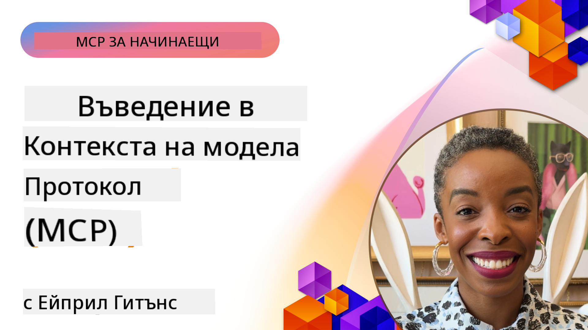
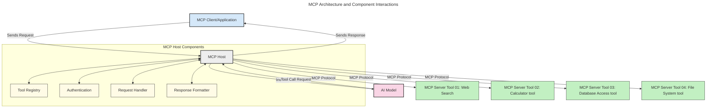
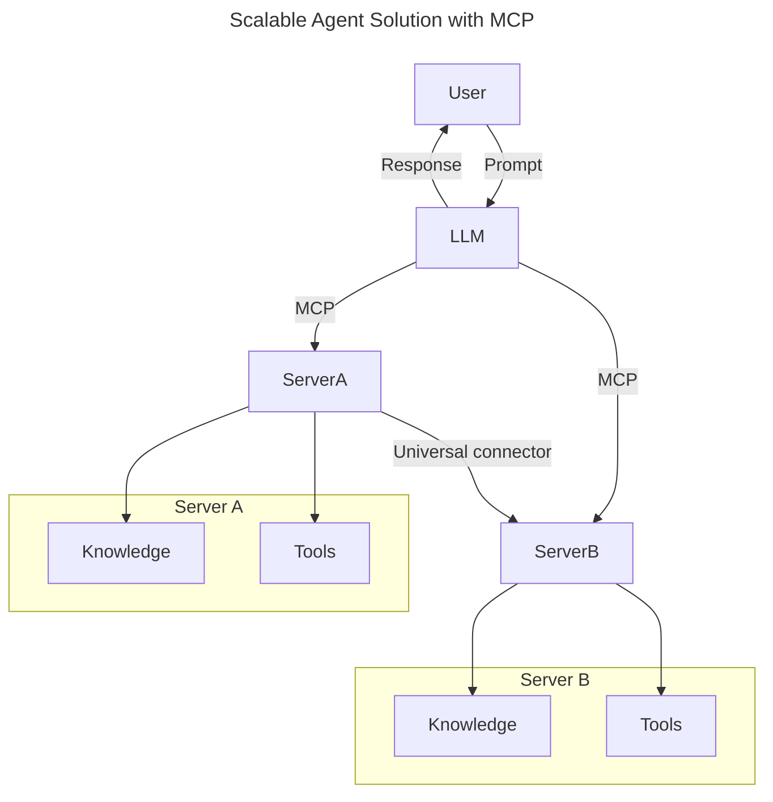
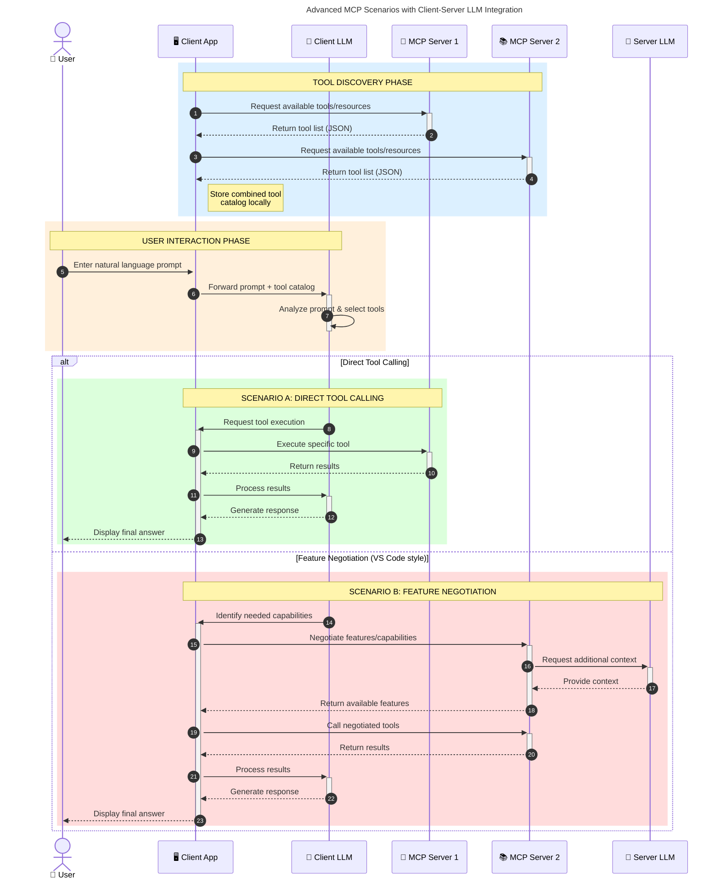

<!--
CO_OP_TRANSLATOR_METADATA:
{
  "original_hash": "0df1ee78a6dd8300f3a040ca5b411c2e",
  "translation_date": "2025-08-19T17:08:44+00:00",
  "source_file": "00-Introduction/README.md",
  "language_code": "bg"
}
-->
# Въведение в Протокола за Контекст на Модела (MCP): Защо е важен за мащабируеми AI приложения

_(Кликнете върху изображението по-горе, за да гледате видеото на този урок)_

Генеративните AI приложения са голяма крачка напред, тъй като често позволяват на потребителя да взаимодейства с приложението чрез естествени езикови команди. Въпреки това, когато се влагат повече време и ресурси в такива приложения, е важно да се уверите, че можете лесно да интегрирате функционалности и ресурси по начин, който позволява лесно разширяване, обслужване на повече от един модел и управление на различни специфики на моделите. Накратко, изграждането на Gen AI приложения е лесно в началото, но с тяхното развитие и усложняване трябва да започнете да дефинирате архитектура и вероятно да разчитате на стандарт, който гарантира, че приложенията ви са изградени по последователен начин. Тук MCP влиза в действие, за да организира нещата и да предостави стандарт.

---

## **🔍 Какво представлява Протоколът за Контекст на Модела (MCP)?**

**Протоколът за Контекст на Модела (MCP)** е **отворен, стандартизиран интерфейс**, който позволява на Големите Езикови Модели (LLMs) да взаимодействат безпроблемно с външни инструменти, API-та и източници на данни. Той предоставя последователна архитектура за разширяване на функционалността на AI моделите отвъд техните обучителни данни, позволявайки създаването на по-умни, мащабируеми и по-отзивчиви AI системи.

---

## **🎯 Защо стандартизацията в AI е важна**

С развитието на генеративните AI приложения е от съществено значение да се приемат стандарти, които гарантират **мащабируемост, разширяемост, поддръжка** и **избягване на зависимост от конкретен доставчик**. MCP отговаря на тези нужди чрез:

- Обединяване на интеграциите между модели и инструменти
- Намаляване на крехките, еднократни персонализирани решения
- Позволяване на множество модели от различни доставчици да съществуват в една екосистема

**Note:** Въпреки че MCP се представя като отворен стандарт, няма планове за стандартизация на MCP чрез съществуващи стандартизационни организации като IEEE, IETF, W3C, ISO или други.

---

## **📚 Цели на обучението**

До края на тази статия ще можете:

- Да дефинирате **Протокол за Контекст на Модела (MCP)** и неговите приложения
- Да разберете как MCP стандартизира комуникацията между модели и инструменти
- Да идентифицирате основните компоненти на архитектурата на MCP
- Да изследвате реални приложения на MCP в корпоративни и развойни контексти

---

## **💡 Защо Протоколът за Контекст на Модела (MCP) е революционен**

### **🔗 MCP решава проблема с фрагментацията в AI взаимодействията**

Преди MCP, интегрирането на модели с инструменти изискваше:

- Персонализиран код за всяка двойка инструмент-модел
- Нестандартизирани API-та за всеки доставчик
- Чести прекъсвания поради актуализации
- Лоша мащабируемост с повече инструменти

### **✅ Ползи от стандартизацията чрез MCP**

| **Полза**                 | **Описание**                                                                   |
|---------------------------|-------------------------------------------------------------------------------|
| Интероперативност         | LLMs работят безпроблемно с инструменти от различни доставчици               |
| Последователност          | Унифицирано поведение между платформи и инструменти                          |
| Повторна употреба         | Инструменти, създадени веднъж, могат да се използват в различни проекти       |
| Ускорено развитие         | Намаляване на времето за разработка чрез стандартизирани интерфейси           |

---

## **🧱 Преглед на архитектурата на MCP**

MCP следва **клиент-сървър модел**, където:

- **MCP Hosts** изпълняват AI моделите
- **MCP Clients** инициират заявки
- **MCP Servers** предоставят контекст, инструменти и възможности

### **Основни компоненти:**

- **Ресурси** – Статични или динамични данни за модели  
- **Команди** – Предварително дефинирани работни потоци за насочено генериране  
- **Инструменти** – Изпълними функции като търсене, изчисления  
- **Избор на проби** – Агентско поведение чрез рекурсивни взаимодействия

---

## Как работят MCP сървърите

MCP сървърите функционират по следния начин:

- **Поток на заявката**:
    1. Заявка се инициира от краен потребител или софтуер, действащ от негово име.
    2. **MCP Client** изпраща заявката към **MCP Host**, който управлява изпълнението на AI модела.
    3. **AI моделът** получава командата на потребителя и може да поиска достъп до външни инструменти или данни чрез една или повече заявки към инструменти.
    4. **MCP Host**, а не моделът директно, комуникира с подходящите **MCP Server(s)**, използвайки стандартизирания протокол.
- **Функционалност на MCP Host**:
    - **Регистър на инструменти**: Поддържа каталог на наличните инструменти и техните възможности.
    - **Автентикация**: Проверява разрешенията за достъп до инструменти.
    - **Обработчик на заявки**: Обработва входящите заявки за инструменти от модела.
    - **Форматиране на отговори**: Структурира изходите от инструменти във формат, който моделът може да разбере.
- **Изпълнение на MCP Server**:
    - **MCP Host** насочва заявките към инструменти към един или повече **MCP Servers**, всеки от които предоставя специализирани функции (например търсене, изчисления, заявки към база данни).
    - **MCP Servers** изпълняват съответните операции и връщат резултати към **MCP Host** в последователен формат.
    - **MCP Host** форматира и предава тези резултати към **AI модела**.
- **Завършване на отговора**:
    - **AI моделът** включва изходите от инструменти в окончателния отговор.
    - **MCP Host** изпраща този отговор обратно към **MCP Client**, който го доставя на крайния потребител или софтуера, който го е поискал.

## 👨‍💻 Как да изградите MCP сървър (с примери)

MCP сървърите ви позволяват да разширите възможностите на LLM чрез предоставяне на данни и функционалности.

Готови ли сте да опитате? Ето SDK-та за различни езици и/или платформи с примери за създаване на прости MCP сървъри:

- **Python SDK**: https://github.com/modelcontextprotocol/python-sdk

- **TypeScript SDK**: https://github.com/modelcontextprotocol/typescript-sdk

- **Java SDK**: https://github.com/modelcontextprotocol/java-sdk

- **C#/.NET SDK**: https://github.com/modelcontextprotocol/csharp-sdk

## 🌍 Реални приложения на MCP

MCP позволява широк спектър от приложения чрез разширяване на AI възможностите:

| **Приложение**             | **Описание**                                                                   |
|----------------------------|-------------------------------------------------------------------------------|
| Интеграция на корпоративни данни | Свързване на LLMs с бази данни, CRM системи или вътрешни инструменти         |
| Агентски AI системи        | Позволяване на автономни агенти с достъп до инструменти и работни потоци за вземане на решения |
| Мултимодални приложения    | Комбиниране на текст, изображения и аудио инструменти в едно унифицирано AI приложение |
| Интеграция на данни в реално време | Включване на актуални данни в AI взаимодействия за по-точни и актуални резултати |

### 🧠 MCP = Универсален стандарт за AI взаимодействия

Протоколът за Контекст на Модела (MCP) действа като универсален стандарт за AI взаимодействия, подобно на начина, по който USB-C стандартизира физическите връзки за устройства. В света на AI, MCP предоставя последователен интерфейс, позволявайки моделите (клиенти) да се интегрират безпроблемно с външни инструменти и доставчици на данни (сървъри). Това елиминира нуждата от разнообразни, персонализирани протоколи за всеки API или източник на данни.

Под MCP, MCP-съвместим инструмент (наричан MCP сървър) следва унифициран стандарт. Тези сървъри могат да изброяват инструментите или действията, които предлагат, и да изпълняват тези действия, когато бъдат поискани от AI агент. Платформи за AI агенти, които поддържат MCP, са способни да откриват наличните инструменти от сървърите и да ги извикват чрез този стандартен протокол.

### 💡 Улеснява достъпа до знания

Освен предоставянето на инструменти, MCP улеснява достъпа до знания. Той позволява приложенията да предоставят контекст на големите езикови модели (LLMs), като ги свързват с различни източници на данни. Например, MCP сървър може да представлява хранилище на документи на компания, позволявайки на агентите да извличат релевантна информация при поискване. Друг сървър може да обработва специфични действия като изпращане на имейли или актуализиране на записи. От гледна точка на агента, това са просто инструменти, които може да използва—някои инструменти връщат данни (контекст на знания), докато други изпълняват действия. MCP ефективно управлява и двете.

Агент, който се свързва с MCP сървър, автоматично научава наличните възможности и достъпните данни на сървъра чрез стандартен формат. Тази стандартизация позволява динамична наличност на инструменти. Например, добавянето на нов MCP сървър към системата на агента прави неговите функции незабавно използваеми, без да е необходима допълнителна персонализация на инструкциите на агента.

Тази опростена интеграция съответства на потока, показан в следната диаграма, където сървърите предоставят както инструменти, така и знания, осигурявайки безпроблемно сътрудничество между системите.

### 👉 Пример: Мащабируемо решение за агенти

### 🔄 Разширени сценарии с MCP и интеграция на LLM от страна на клиента

Освен основната архитектура на MCP, съществуват разширени сценарии, при които както клиентът, така и сървърът съдържат LLMs, позволявайки по-сложни взаимодействия. В следната диаграма **Client App** може да бъде IDE с множество MCP инструменти, достъпни за използване от LLM:

## 🔐 Практически ползи от MCP

Ето практическите ползи от използването на MCP:

- **Актуалност**: Моделите могат да получават актуална информация отвъд обучителните си данни
- **Разширяване на възможностите**: Моделите могат да използват специализирани инструменти за задачи, за които не са обучени
- **Намалени халюцинации**: Външните източници на данни предоставят фактическа основа
- **Поверителност**: Чувствителните данни могат да останат в защитени среди, вместо да бъдат включени в команди

## 📌 Основни изводи

Следните са основни изводи за използването на MCP:

- **MCP** стандартизира начина, по който AI моделите взаимодействат с инструменти и данни
- Насърчава **разширяемост, последователност и интероперативност**
- MCP помага за **намаляване на времето за разработка, подобряване на надеждността и разширяване на възможностите на моделите**
- Клиент-сървър архитектурата **позволява гъвкави, разширяеми AI приложения**

## 🧠 Упражнение

Помислете за AI приложение, което искате да изградите.

- Кои **външни инструменти или данни** биха подобрили неговите възможности?
- Как MCP би направил интеграцията **по-лесна и надеждна?**

## Допълнителни ресурси

- [MCP GitHub Repository](https://github.com/modelcontextprotocol)

## Какво следва

Следва: [Глава 1: Основни концепции](../01-CoreConcepts/README.md)

**Отказ от отговорност**:  
Този документ е преведен с помощта на AI услуга за превод [Co-op Translator](https://github.com/Azure/co-op-translator). Въпреки че се стремим към точност, моля, имайте предвид, че автоматизираните преводи може да съдържат грешки или неточности. Оригиналният документ на неговия роден език трябва да се счита за авторитетен източник. За критична информация се препоръчва професионален човешки превод. Ние не носим отговорност за недоразумения или погрешни интерпретации, произтичащи от използването на този превод.