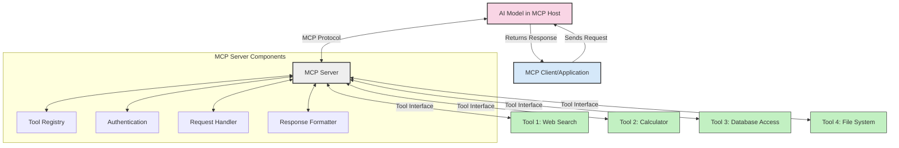
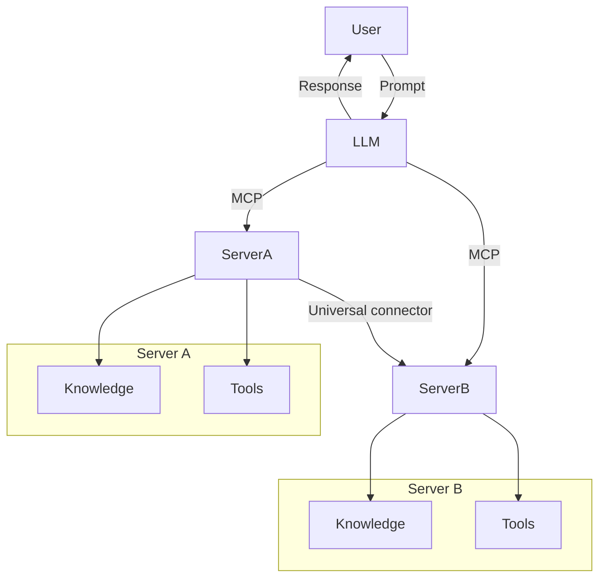

<!--
CO_OP_TRANSLATOR_METADATA:
{
  "original_hash": "02301140adbd807ecf0f17720fa307bc",
  "translation_date": "2025-05-17T06:10:01+00:00",
  "source_file": "00-Introduction/README.md",
  "language_code": "bg"
}
-->
# Въведение в Протокола за Контекст на Модела (MCP): Защо е важен за мащабируеми AI приложения

Генеративните AI приложения са голяма стъпка напред, тъй като често позволяват на потребителя да взаимодейства с приложението чрез команди на естествен език. Въпреки това, с нарастващото инвестиране на време и ресурси в такива приложения, трябва да се уверите, че можете лесно да интегрирате функционалности и ресурси по начин, който е лесен за разширение, че вашето приложение може да обслужва повече от един модел и неговите особености. Накратко, изграждането на Gen AI приложения е лесно в началото, но с нарастването и усложняването му, трябва да започнете да определяте архитектура и най-вероятно ще трябва да се опрете на стандарт, за да сте сигурни, че приложенията ви са изградени по последователен начин. Тук MCP влиза, за да организира нещата и да предостави стандарт.

---

## **🔍 Какво представлява Протоколът за Контекст на Модела (MCP)?**

**Протоколът за Контекст на Модела (MCP)** е **отворен, стандартизиран интерфейс**, който позволява на Големите Езикови Модели (LLMs) да взаимодействат безпроблемно с външни инструменти, API и източници на данни. Той предоставя последователна архитектура за подобряване на функционалността на AI моделите извън техните тренировъчни данни, позволявайки създаването на по-интелигентни, мащабируеми и по-отзивчиви AI системи.

---

## **🎯 Защо стандартите в AI са важни**

С усложняването на генеративните AI приложения, е важно да се приемат стандарти, които осигуряват **мащабируемост, разширяемост** и **поддържане**. MCP отговаря на тези нужди чрез:

- Обединяване на интеграциите между модели и инструменти
- Намаляване на нестабилните, еднократни персонализирани решения
- Позволяване на множество модели да съществуват в една екосистема

---

## **📚 Цели на обучението**

До края на тази статия ще можете:

- Да дефинирате **Протокол за Контекст на Модела (MCP)** и неговите случаи на използване
- Да разберете как MCP стандартизира комуникацията между модели и инструменти
- Да идентифицирате основните компоненти на MCP архитектурата
- Да изследвате реални приложения на MCP в корпоративни и развойни контексти

---

## **💡 Защо Протоколът за Контекст на Модела (MCP) е революционен**

### **🔗 MCP решава фрагментацията в AI взаимодействията**

Преди MCP, интегрирането на модели с инструменти изискваше:

- Персонализиран код за всяка двойка инструмент-модел
- Нестандартизирани API за всеки доставчик
- Чести прекъсвания поради актуализации
- Лоша мащабируемост с повече инструменти

### **✅ Предимства на стандартизацията с MCP**

| **Предимство**             | **Описание**                                                                  |
|----------------------------|------------------------------------------------------------------------------|
| Съвместимост               | LLMs работят безпроблемно с инструменти от различни доставчици               |
| Последователност           | Унифицирано поведение на различни платформи и инструменти                    |
| Повторяемост               | Инструменти, изградени веднъж, могат да се използват в различни проекти и системи |
| Ускорено развитие          | Намаляване на времето за разработка чрез използване на стандартизирани, готови за употреба интерфейси |

---

## **🧱 Преглед на високото ниво на MCP архитектурата**

MCP следва **модела клиент-сървър**, където:

- **MCP Хостове** изпълняват AI моделите
- **MCP Клиенти** инициират заявки
- **MCP Сървъри** предоставят контекст, инструменти и възможности

### **Основни компоненти:**

- **Ресурси** – Статични или динамични данни за модели  
- **Подсказки** – Предварително дефинирани работни процеси за насочено генериране  
- **Инструменти** – Изпълними функции като търсене, изчисления  
- **Избор** – Агентско поведение чрез рекурсивни взаимодействия

---

## Как работят MCP сървърите

MCP сървърите оперират по следния начин:

- **Поток на заявката**: 
    1. MCP Клиентът изпраща заявка към AI модела, работещ в MCP Хост.
    2. AI моделът идентифицира кога му трябват външни инструменти или данни.
    3. Моделът комуникира с MCP сървъра, използвайки стандартизирания протокол.

- **Функционалност на MCP сървъра**:
    - Регистър на инструменти: Поддържа каталог на наличните инструменти и техните възможности.
    - Аутентикация: Проверява разрешенията за достъп до инструменти.
    - Обработчик на заявки: Обработва входящи заявки за инструменти от модела.
    - Форматиране на отговори: Структурира изходите на инструментите в формат, който моделът може да разбере.

- **Изпълнение на инструменти**: 
    - Сървърът насочва заявки към подходящите външни инструменти
    - Инструментите изпълняват своите специализирани функции (търсене, изчисление, заявки към бази данни и т.н.)
    - Резултатите се връщат към модела в последователен формат.

- **Завършване на отговора**: 
    - AI моделът включва изходите на инструментите в своя отговор.
    - Финалният отговор се изпраща обратно към клиентското приложение.

## 👨‍💻 Как да изградите MCP сървър (с примери)

MCP сървърите ви позволяват да разширите възможностите на LLM, като предоставяте данни и функционалности.

Готови ли сте да го пробвате? Ето примери за създаване на прост MCP сървър на различни езици:

- **Python пример**: https://github.com/modelcontextprotocol/python-sdk

- **TypeScript пример**: https://github.com/modelcontextprotocol/typescript-sdk

- **Java пример**: https://github.com/modelcontextprotocol/java-sdk

- **C#/.NET пример**: https://github.com/modelcontextprotocol/csharp-sdk

## 🌍 Реални приложения на MCP

MCP позволява широка гама от приложения, като разширява AI възможностите:

| **Приложение**               | **Описание**                                                                  |
|------------------------------|------------------------------------------------------------------------------|
| Интеграция на корпоративни данни | Свързване на LLMs с бази данни, CRM или вътрешни инструменти                 |
| Агентски AI системи           | Позволяване на автономни агенти с достъп до инструменти и работни процеси за вземане на решения |
| Мултимодални приложения       | Комбиниране на текстови, изображенчески и аудио инструменти в едно унифицирано AI приложение |
| Интеграция на данни в реално време | Внасяне на живи данни в AI взаимодействия за по-точни, актуални резултати   |

### 🧠 MCP = Универсален стандарт за AI взаимодействия

Протоколът за Контекст на Модела (MCP) действа като универсален стандарт за AI взаимодействия, подобно на това как USB-C стандартизира физическите връзки за устройства. В света на AI, MCP предоставя последователен интерфейс, позволявайки на моделите (клиентите) да се интегрират безпроблемно с външни инструменти и доставчици на данни (сървъри). Това елиминира нуждата от разнообразни, персонализирани протоколи за всеки API или източник на данни.

Под MCP, MCP-съвместим инструмент (наричан MCP сървър) следва унифициран стандарт. Тези сървъри могат да изброяват инструментите или действията, които предлагат, и да изпълняват тези действия, когато бъдат поискани от AI агент. Платформите за AI агенти, които поддържат MCP, са способни да откриват наличните инструменти от сървърите и да ги извикват чрез този стандартен протокол.

### 💡 Улеснява достъпа до знания

Освен че предлага инструменти, MCP също така улеснява достъпа до знания. Той позволява на приложенията да предоставят контекст на големите езикови модели (LLMs), като ги свързват с различни източници на данни. Например, MCP сървър може да представлява хранилище на документи на компанията, позволявайки на агентите да извличат съответната информация при поискване. Друг сървър може да се занимава със специфични действия като изпращане на имейли или актуализиране на записи. От гледна точка на агента, това са просто инструменти, които може да използва — някои инструменти връщат данни (контекст на знания), докато други изпълняват действия. MCP ефективно управлява и двете.

Агент, свързващ се с MCP сървър, автоматично научава наличните възможности и достъпни данни на сървъра чрез стандартен формат. Тази стандартизация позволява динамична наличност на инструменти. Например, добавянето на нов MCP сървър към системата на агента прави неговите функции незабавно използваеми, без да се изисква допълнителна персонализация на инструкциите на агента.

Тази оптимизирана интеграция съответства на потока, изобразен в диаграмата на mermaid, където сървърите предоставят както инструменти, така и знания, осигурявайки безпроблемно сътрудничество между системите. 

### 👉 Пример: Мащабируемо решение за агенти

## 🔐 Практически ползи от MCP

Ето някои практически ползи от използването на MCP:

- **Актуалност**: Моделите могат да получават актуална информация извън своите тренировъчни данни
- **Разширение на възможностите**: Моделите могат да използват специализирани инструменти за задачи, за които не са обучени
- **Намалени халюцинации**: Външните източници на данни предоставят фактическа основа
- **Поверителност**: Чувствителните данни могат да останат в сигурни среди, вместо да бъдат вградени в подсказки

## 📌 Основни моменти

Следните са основни моменти за използването на MCP:

- **MCP** стандартизира как AI моделите взаимодействат с инструменти и данни
- Насърчава **разширяемост, последователност и съвместимост**
- MCP помага за **намаляване на времето за разработка, подобряване на надеждността и разширяване на възможностите на модела**
- Архитектурата клиент-сървър **позволява гъвкави, разширяеми AI приложения**

## 🧠 Упражнение

Помислете за AI приложение, което сте заинтересовани да изградите.

- Кои **външни инструменти или данни** биха могли да подобрят неговите възможности?
- Как MCP може да направи интеграцията **по-проста и надеждна?**

## Допълнителни ресурси

- [MCP GitHub Репозитори](https://github.com/modelcontextprotocol)

## Какво следва

Следва: [Глава 1: Основни концепции](/01-CoreConcepts/README.md)

**Отказ от отговорност**:
Този документ е преведен с помощта на AI услуга за превод [Co-op Translator](https://github.com/Azure/co-op-translator). Докато се стремим към точност, моля, имайте предвид, че автоматизираните преводи могат да съдържат грешки или неточности. Оригиналният документ на неговия роден език трябва да се счита за авторитетен източник. За критична информация се препоръчва професионален човешки превод. Не носим отговорност за каквито и да било недоразумения или неправилни интерпретации, произтичащи от използването на този превод.