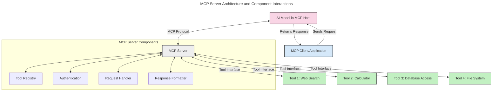
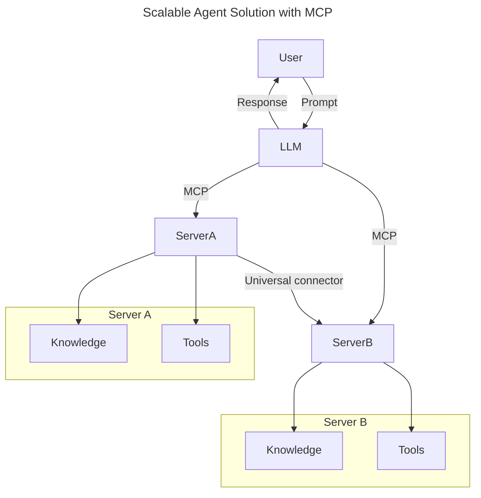
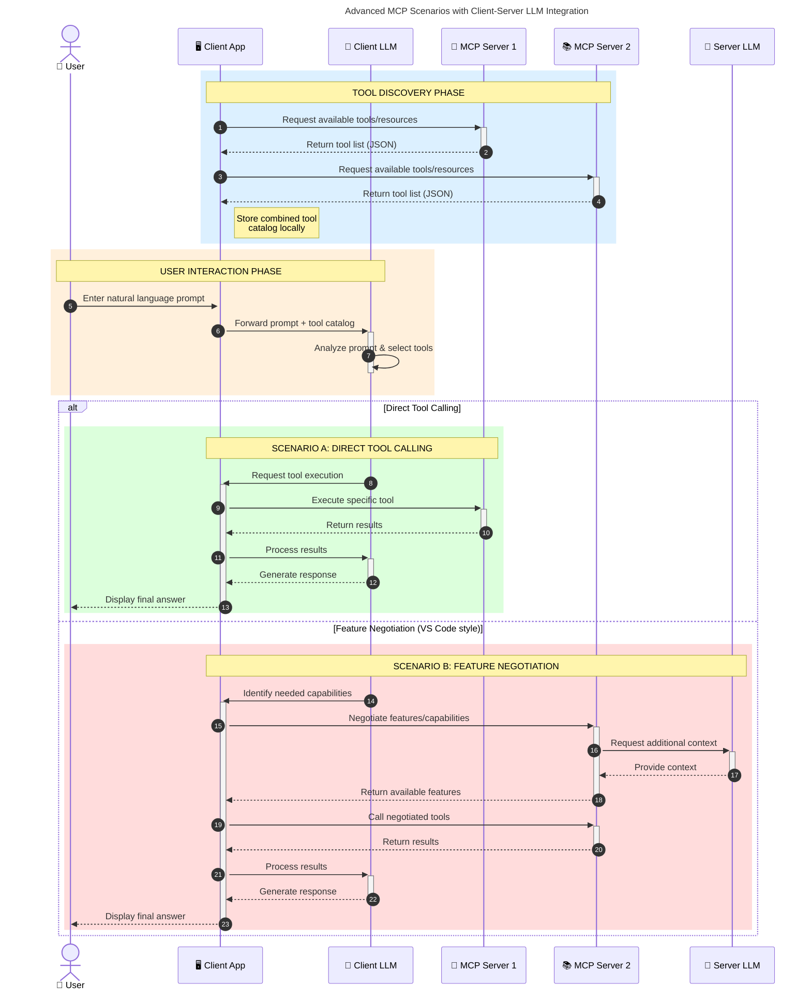

<!--
CO_OP_TRANSLATOR_METADATA:
{
  "original_hash": "105c2ddbb77bc38f7e9df009e1b06e45",
  "translation_date": "2025-07-13T15:39:15+00:00",
  "source_file": "00-Introduction/README.md",
  "language_code": "bg"
}
-->
# Въведение в Model Context Protocol (MCP): Защо е важен за мащабируеми AI приложения

Генеративните AI приложения са голяма крачка напред, тъй като често позволяват на потребителя да взаимодейства с приложението чрез естествени езикови команди. Въпреки това, с увеличаването на времето и ресурсите, вложени в такива приложения, искате да сте сигурни, че можете лесно да интегрирате функционалности и ресурси по начин, който е лесен за разширяване, че приложението ви може да поддържа повече от един модел и да се справя с различни особености на моделите. С други думи, създаването на Gen AI приложения е лесно в началото, но с растежа и усложняването им трябва да започнете да дефинирате архитектура и вероятно ще трябва да разчитате на стандарт, който да гарантира, че приложенията ви са изградени по последователен начин. Тук идва на помощ MCP, който организира нещата и предоставя стандарт.

---

## **🔍 Какво е Model Context Protocol (MCP)?**

**Model Context Protocol (MCP)** е **отворен, стандартизиран интерфейс**, който позволява на големите езикови модели (LLMs) да взаимодействат безпроблемно с външни инструменти, API-та и източници на данни. Той осигурява последователна архитектура за разширяване на функционалността на AI моделите отвъд техните тренировъчни данни, позволявайки по-интелигентни, мащабируеми и по-отзивчиви AI системи.

---

## **🎯 Защо стандартите в AI са важни**

С нарастването на сложността на генеративните AI приложения е от съществено значение да се приемат стандарти, които гарантират **мащабируемост, разширяемост** и **поддръжка**. MCP отговаря на тези нужди чрез:

- Унифициране на интеграциите между модели и инструменти
- Намаляване на крехки, еднократни персонализирани решения
- Позволяване на множество модели да съжителстват в една екосистема

---

## **📚 Учебни цели**

След като прочетете тази статия, ще можете да:

- Определите какво е **Model Context Protocol (MCP)** и неговите приложения
- Разберете как MCP стандартизира комуникацията между модел и инструмент
- Идентифицирате основните компоненти на MCP архитектурата
- Изследвате реални приложения на MCP в корпоративна и развойна среда

---

## **💡 Защо Model Context Protocol (MCP) е революционен**

### **🔗 MCP решава проблема с фрагментацията в AI взаимодействията**

Преди MCP, интеграцията на модели с инструменти изискваше:

- Персонализиран код за всяка двойка инструмент-модел
- Нестандартизирани API-та за всеки доставчик
- Чести прекъсвания при обновления
- Лоша мащабируемост с увеличаване на броя инструменти

### **✅ Предимства на стандартизацията с MCP**

| **Предимство**           | **Описание**                                                                 |
|-------------------------|-------------------------------------------------------------------------------|
| Интероперативност       | LLM работят безпроблемно с инструменти от различни доставчици                |
| Последователност        | Унифицирано поведение на различни платформи и инструменти                    |
| Преизползваемост        | Инструменти, създадени веднъж, могат да се използват в различни проекти и системи |
| Ускорено развитие       | Намаляване на времето за разработка чрез използване на стандартизирани, plug-and-play интерфейси |

---

## **🧱 Обзор на високо ниво на MCP архитектурата**

MCP следва **клиент-сървър модел**, където:

- **MCP Hosts** изпълняват AI моделите
- **MCP Clients** инициират заявки
- **MCP Servers** предоставят контекст, инструменти и възможности

### **Основни компоненти:**

- **Resources** – Статични или динамични данни за моделите  
- **Prompts** – Предварително дефинирани работни потоци за насочено генериране  
- **Tools** – Изпълними функции като търсене, изчисления  
- **Sampling** – Агентско поведение чрез рекурсивни взаимодействия

---

## Как работят MCP сървърите

MCP сървърите функционират по следния начин:

- **Поток на заявките**:  
    1. MCP Клиент изпраща заявка към AI модела, работещ в MCP Host.  
    2. AI моделът разпознава кога се нуждае от външни инструменти или данни.  
    3. Моделът комуникира с MCP Сървъра чрез стандартизирания протокол.

- **Функционалност на MCP Сървъра**:  
    - Регистър на инструменти: Поддържа каталог на наличните инструменти и техните възможности.  
    - Аутентикация: Проверява разрешенията за достъп до инструментите.  
    - Обработчик на заявки: Обработва входящите заявки за инструменти от модела.  
    - Форматиране на отговори: Структурира изхода от инструментите в разбираем за модела формат.

- **Изпълнение на инструменти**:  
    - Сървърът насочва заявките към съответните външни инструменти  
    - Инструментите изпълняват специализираните си функции (търсене, изчисления, заявки към бази данни и др.)  
    - Резултатите се връщат на модела в последователен формат.

- **Завършване на отговора**:  
    - AI моделът включва изхода от инструментите в своя отговор.  
    - Крайният отговор се изпраща обратно към клиентското приложение.

## 👨‍💻 Как да изградим MCP сървър (с примери)

MCP сървърите ви позволяват да разширите възможностите на LLM, като предоставяте данни и функционалности.

Готови ли сте да опитате? Ето примери за създаване на прост MCP сървър на различни езици:

- **Пример на Python**: https://github.com/modelcontextprotocol/python-sdk

- **Пример на TypeScript**: https://github.com/modelcontextprotocol/typescript-sdk

- **Пример на Java**: https://github.com/modelcontextprotocol/java-sdk

- **Пример на C#/.NET**: https://github.com/modelcontextprotocol/csharp-sdk

## 🌍 Реални случаи на използване на MCP

MCP позволява широк спектър от приложения чрез разширяване на AI възможностите:

| **Приложение**             | **Описание**                                                                 |
|----------------------------|-------------------------------------------------------------------------------|
| Интеграция на корпоративни данни | Свързване на LLM с бази данни, CRM системи или вътрешни инструменти          |
| Агентски AI системи        | Позволява автономни агенти с достъп до инструменти и работни потоци за вземане на решения |
| Мултимодални приложения    | Комбиниране на текстови, визуални и аудио инструменти в едно унифицирано AI приложение |
| Интеграция на данни в реално време | Въвеждане на живи данни в AI взаимодействия за по-точни и актуални резултати |

### 🧠 MCP = Универсален стандарт за AI взаимодействия

Model Context Protocol (MCP) действа като универсален стандарт за AI взаимодействия, подобно на това как USB-C стандартизира физическите връзки за устройства. В света на AI, MCP осигурява последователен интерфейс, позволяващ на моделите (клиенти) да се интегрират безпроблемно с външни инструменти и доставчици на данни (сървъри). Това премахва нуждата от разнообразни, персонализирани протоколи за всеки API или източник на данни.

Под MCP, MCP-съвместим инструмент (наричан MCP сървър) следва единен стандарт. Тези сървъри могат да изброяват инструментите или действията, които предлагат, и да изпълняват тези действия при поискване от AI агент. Платформите за AI агенти, които поддържат MCP, могат да откриват наличните инструменти от сървърите и да ги извикват чрез този стандартен протокол.

### 💡 Улеснява достъпа до знания

Освен че предлага инструменти, MCP улеснява и достъпа до знания. Той позволява на приложенията да предоставят контекст на големите езикови модели (LLMs), като ги свързват с различни източници на данни. Например, MCP сървър може да представлява хранилище с документи на компания, позволявайки на агентите да извличат релевантна информация при поискване. Друг сървър може да обработва специфични действия като изпращане на имейли или актуализиране на записи. От гледна точка на агента, това са просто инструменти, които може да използва — някои инструменти връщат данни (контекст на знанието), а други изпълняват действия. MCP ефективно управлява и двете.

Агент, свързан с MCP сървър, автоматично научава наличните възможности и достъпните данни на сървъра чрез стандартен формат. Тази стандартизация позволява динамична наличност на инструменти. Например, добавянето на нов MCP сървър към системата на агента прави функциите му веднага достъпни без необходимост от допълнителна персонализация на инструкциите за агента.

Тази опростена интеграция съответства на потока, показан в диаграмата mermaid, където сървърите предоставят както инструменти, така и знания, осигурявайки безпроблемно сътрудничество между системите.

### 👉 Пример: Мащабируемо агентско решение

### 🔄 Разширени MCP сценарии с интеграция на LLM от страна на клиента

Освен базовата MCP архитектура, има и разширени сценарии, при които както клиентът, така и сървърът съдържат LLM, позволявайки по-сложни взаимодействия:

## 🔐 Практически ползи от MCP

Ето някои от практическите ползи от използването на MCP:

- **Актуалност**: Моделите могат да достъпват актуална информация извън тренировъчните си данни  
- **Разширяване на възможностите**: Моделите могат да използват специализирани инструменти за задачи, за които не са били обучени  
- **Намаляване на халюцинациите**: Външните източници на данни осигуряват фактологична основа  
- **Поверителност**: Чувствителните данни могат да останат в защитена среда, вместо да се вграждат в подсказките

## 📌 Основни изводи

Ето ключовите изводи при използване на MCP:

- **MCP** стандартизира начина, по който AI моделите взаимодействат с инструменти и данни  
- Насърчава **разширяемост, последователност и интероперативност**  
- MCP помага да се **намали времето за разработка, подобри надеждността и разшири възможностите на моделите**  
- Клиент-сървър архитектурата **позволява гъвкави, разширяеми AI приложения**

## 🧠 Упражнение

Помислете за AI приложение, което бихте искали да създадете.

- Кои **външни инструменти или данни** биха могли да подобрят възможностите му?  
- Как MCP може да направи интеграцията **по-проста и по-надеждна?**

## Допълнителни ресурси

- [MCP GitHub Repository](https://github.com/modelcontextprotocol)

## Какво следва

Следва: [Глава 1: Основни концепции](../01-CoreConcepts/README.md)

**Отказ от отговорност**:  
Този документ е преведен с помощта на AI преводаческа услуга [Co-op Translator](https://github.com/Azure/co-op-translator). Въпреки че се стремим към точност, моля, имайте предвид, че автоматизираните преводи могат да съдържат грешки или неточности. Оригиналният документ на неговия роден език трябва да се счита за авторитетен източник. За критична информация се препоръчва професионален човешки превод. Ние не носим отговорност за каквито и да е недоразумения или неправилни тълкувания, произтичащи от използването на този превод.