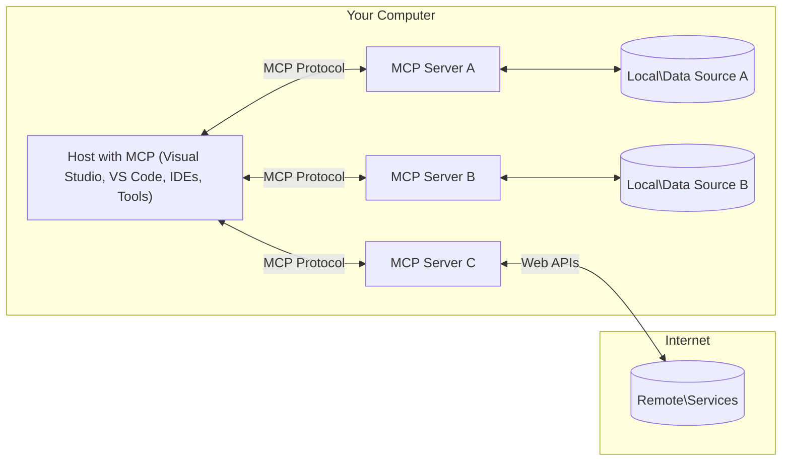

<!--
CO_OP_TRANSLATOR_METADATA:
{
  "original_hash": "904b59de1de9264801242d90a42cdd9d",
  "translation_date": "2025-09-05T11:36:17+00:00",
  "source_file": "01-CoreConcepts/README.md",
  "language_code": "bg"
}
-->
# Основни концепции на MCP: Овладяване на протокола за контекст на модела за интеграция на AI

[](https://youtu.be/earDzWGtE84)

_(Кликнете върху изображението по-горе, за да гледате видеото на този урок)_

[Model Context Protocol (MCP)](https://github.com/modelcontextprotocol) е мощна, стандартизирана рамка, която оптимизира комуникацията между големи езикови модели (LLMs) и външни инструменти, приложения и източници на данни. 
Това ръководство ще ви запознае с основните концепции на MCP. Ще научите за неговата клиент-сървър архитектура, основни компоненти, механика на комуникация и най-добри практики за внедряване.

- **Ясно съгласие от потребителя**: Всички операции и достъп до данни изискват изрично одобрение от потребителя преди изпълнение. Потребителите трябва ясно да разбират какви данни ще бъдат достъпни и какви действия ще бъдат извършени, с детайлен контрол върху разрешенията и авторизациите.

- **Защита на личните данни**: Данните на потребителя се излагат само с изрично съгласие и трябва да бъдат защитени чрез надеждни механизми за контрол на достъпа през целия жизнен цикъл на взаимодействието. Внедренията трябва да предотвратяват неупълномощено предаване на данни и да поддържат строги граници на поверителност.

- **Безопасност при изпълнение на инструменти**: Всяко извикване на инструмент изисква изрично съгласие от потребителя с ясно разбиране за функционалността, параметрите и потенциалното въздействие на инструмента. Надеждни граници за сигурност трябва да предотвратяват нежелано, небезопасно или злонамерено изпълнение на инструменти.

- **Сигурност на транспортния слой**: Всички комуникационни канали трябва да използват подходящи механизми за криптиране и удостоверяване. Отдалечените връзки трябва да внедряват сигурни транспортни протоколи и правилно управление на идентификационните данни.

#### Насоки за внедряване:

- **Управление на разрешенията**: Внедрете системи за детайлен контрол на разрешенията, които позволяват на потребителите да управляват достъпа до сървъри, инструменти и ресурси
- **Удостоверяване и авторизация**: Използвайте сигурни методи за удостоверяване (OAuth, API ключове) с правилно управление на токените и тяхното изтичане  
- **Валидиране на входните данни**: Валидирайте всички параметри и входни данни според дефинирани схеми, за да предотвратите атаки чрез инжектиране
- **Одитни логове**: Поддържайте подробни логове на всички операции за мониторинг на сигурността и съответствие

## Преглед

Този урок разглежда основната архитектура и компонентите, които съставляват екосистемата на Model Context Protocol (MCP). Ще научите за клиент-сървър архитектурата, ключовите компоненти и механизмите за комуникация, които задвижват взаимодействията в MCP.

## Основни цели на обучението

До края на този урок ще можете:

- Да разберете клиент-сървър архитектурата на MCP.
- Да идентифицирате ролите и отговорностите на Hosts, Clients и Servers.
- Да анализирате основните характеристики, които правят MCP гъвкав слой за интеграция.
- Да научите как информацията се движи в екосистемата на MCP.
- Да придобиете практически знания чрез примери с код на .NET, Java, Python и JavaScript.

## Архитектура на MCP: По-задълбочен поглед

Екосистемата на MCP е изградена върху клиент-сървър модел. Тази модулна структура позволява AI приложенията да взаимодействат с инструменти, бази данни, API-та и контекстуални ресурси ефективно. Нека разгледаме тази архитектура и нейните основни компоненти.

В основата си MCP следва клиент-сървър архитектура, при която хост приложението може да се свърже с множество сървъри:



- **MCP Hosts**: Програми като VSCode, Claude Desktop, IDE-та или AI инструменти, които искат да получат достъп до данни чрез MCP
- **MCP Clients**: Протоколни клиенти, които поддържат 1:1 връзки със сървъри
- **MCP Servers**: Леки програми, които предоставят специфични възможности чрез стандартизирания Model Context Protocol
- **Локални източници на данни**: Файлове, бази данни и услуги на вашия компютър, до които MCP сървърите могат да имат сигурен достъп
- **Отдалечени услуги**: Външни системи, достъпни през интернет, към които MCP сървърите могат да се свържат чрез API-та.

Протоколът MCP е развиващ се стандарт, използващ версияция на база дата (формат YYYY-MM-DD). Текущата версия на протокола е **2025-06-18**. Можете да видите последните актуализации на [спецификацията на протокола](https://modelcontextprotocol.io/specification/2025-06-18/)

### 1. Hosts

В Model Context Protocol (MCP) **Hosts** са AI приложения, които служат като основен интерфейс, чрез който потребителите взаимодействат с протокола. Hosts координират и управляват връзките с множество MCP сървъри, като създават специални MCP клиенти за всяка връзка със сървър. Примери за Hosts включват:

- **AI приложения**: Claude Desktop, Visual Studio Code, Claude Code
- **Среда за разработка**: IDE-та и редактори на код с интеграция на MCP  
- **Персонализирани приложения**: Специално създадени AI агенти и инструменти

**Hosts** са приложения, които координират взаимодействията с AI модели. Те:

- **Оркестрират AI модели**: Изпълняват или взаимодействат с LLMs за генериране на отговори и координиране на AI работни потоци
- **Управляват клиентски връзки**: Създават и поддържат един MCP клиент за всяка връзка със сървър
- **Контролират потребителския интерфейс**: Управляват потока на разговорите, взаимодействията с потребителя и представянето на отговорите  
- **Налагат сигурност**: Контролират разрешенията, ограниченията за сигурност и удостоверяването
- **Управляват съгласието на потребителя**: Администрират одобрението на потребителя за споделяне на данни и изпълнение на инструменти

### 2. Clients

**Clients** са основни компоненти, които поддържат специални едно-към-едно връзки между Hosts и MCP сървъри. Всеки MCP клиент се създава от Host, за да се свърже с конкретен MCP сървър, осигурявайки организирани и сигурни комуникационни канали. Множество клиенти позволяват на Hosts да се свързват с множество сървъри едновременно.

**Clients** са свързващи компоненти в хост приложението. Те:

- **Комуникация по протокола**: Изпращат JSON-RPC 2.0 заявки към сървъри с подсказки и инструкции
- **Преговори за възможности**: Преговарят за поддържани функции и версии на протокола със сървъри по време на инициализация
- **Изпълнение на инструменти**: Управляват заявки за изпълнение на инструменти от модели и обработват отговорите
- **Актуализации в реално време**: Обработват известия и актуализации в реално време от сървъри
- **Обработка на отговори**: Обработват и форматират отговорите от сървъри за показване на потребителите

### 3. Servers

**Servers** са програми, които предоставят контекст, инструменти и възможности на MCP клиенти. Те могат да се изпълняват локално (на същата машина като Host) или отдалечено (на външни платформи) и са отговорни за обработката на клиентски заявки и предоставянето на структурирани отговори. Сървърите предоставят специфична функционалност чрез стандартизирания Model Context Protocol.

**Servers** са услуги, които предоставят контекст и възможности. Те:

- **Регистрация на функции**: Регистрират и предоставят налични примитиви (ресурси, подсказки, инструменти) на клиенти
- **Обработка на заявки**: Получават и изпълняват заявки за инструменти, ресурси и подсказки от клиенти
- **Предоставяне на контекст**: Осигуряват контекстуална информация и данни за подобряване на отговорите на модела
- **Управление на състоянието**: Поддържат състояние на сесията и обработват взаимодействия със състояние, когато е необходимо
- **Известия в реално време**: Изпращат известия за промени и актуализации на възможностите към свързани клиенти

Сървърите могат да бъдат разработени от всеки, за да разширят възможностите на модела със специализирана функционалност, и поддържат както локални, така и отдалечени сценарии за внедряване.

### 4. Примитиви на сървъра

Сървърите в Model Context Protocol (MCP) предоставят три основни **примитива**, които определят фундаменталните градивни елементи за богати взаимодействия между клиенти, Hosts и езикови модели. Тези примитиви специфицират типовете контекстуална информация и действия, достъпни чрез протокола.

MCP сървърите могат да предоставят всяка комбинация от следните три основни примитива:

#### Ресурси 

**Ресурси** са източници на данни, които предоставят контекстуална информация на AI приложенията. Те представляват статично или динамично съдържание, което може да подобри разбирането и вземането на решения от модела:

- **Контекстуални данни**: Структурирана информация и контекст за консумация от AI модела
- **Бази знания**: Хранилища на документи, статии, ръководства и научни трудове
- **Локални източници на данни**: Файлове, бази данни и информация от локалната система  
- **Външни данни**: Отговори от API-та, уеб услуги и данни от отдалечени системи
- **Динамично съдържание**: Данни в реално време, които се актуализират според външни условия

Ресурсите се идентифицират чрез URI и поддържат откриване чрез методите `resources/list` и извличане чрез `resources/read`:

```text
file://documents/project-spec.md
database://production/users/schema
api://weather/current
```

#### Подсказки

**Подсказки** са многократно използваеми шаблони, които помагат за структуриране на взаимодействията с езиковите модели. Те предоставят стандартизирани модели на взаимодействие и шаблонни работни потоци:

- **Интеракции на база шаблони**: Предварително структурирани съобщения и начални точки за разговори
- **Шаблони за работни потоци**: Стандартизирани последователности за общи задачи и взаимодействия
- **Примери за few-shot**: Шаблони на база примери за инструкции към модела
- **Системни подсказки**: Основни подсказки, които дефинират поведението и контекста на модела
- **Динамични шаблони**: Шаблони с параметри, които се адаптират към специфични контексти

Подсказките поддържат заместване на променливи и могат да бъдат открити чрез `prompts/list` и извлечени с `prompts/get`:

```markdown
Generate a {{task_type}} for {{product}} targeting {{audience}} with the following requirements: {{requirements}}
```

#### Инструменти

**Инструменти** са изпълними функции, които AI моделите могат да извикват, за да извършват специфични действия. Те представляват "глаголите" на екосистемата MCP, позволявайки на моделите да взаимодействат с външни системи:

- **Изпълними функции**: Отделни операции, които моделите могат да извикват със специфични параметри
- **Интеграция с външни системи**: API повиквания, заявки към бази данни, операции с файлове, изчисления
- **Уникална идентичност**: Всеки инструмент има уникално име, описание и схема на параметрите
- **Структурирано I/O**: Инструментите приемат валидирани параметри и връщат структурирани, типизирани отговори
- **Възможности за действие**: Позволяват на моделите да извършват реални действия и да извличат актуални данни

Инструментите се дефинират с JSON Schema за валидиране на параметрите и се откриват чрез `tools/list`, а се изпълняват чрез `tools/call`:

```typescript
server.tool(
  "search_products", 
  {
    query: z.string().describe("Search query for products"),
    category: z.string().optional().describe("Product category filter"),
    max_results: z.number().default(10).describe("Maximum results to return")
  }, 
  async (params) => {
    // Execute search and return structured results
    return await productService.search(params);
  }
);
```

## Примитиви на клиента

В Model Context Protocol (MCP) **клиентите** могат да предоставят примитиви, които позволяват на сървърите да заявяват допълнителни възможности от хост приложението. Тези примитиви от страна на клиента позволяват по-богати и интерактивни внедрения на сървъри, които могат да получат достъп до възможностите на AI модела и взаимодействията с потребителя.

### Семплиране

**Семплиране** позволява на сървърите да заявяват завършвания от езиковия модел на клиента. Този примитив позволява на сървърите да получат достъп до възможностите на LLM без да внедряват свои собствени зависимости от модела:

- **Достъп, независим от модела**: Сървърите могат да заявяват завършвания без да включват SDK-та за LLM или да управляват достъпа до модела
- **AI, иницииран от сървъра**: Позволява на сървърите автономно да генерират съдържание, използвайки AI модела на клиента
- **Рекурсивни взаимодействия с LLM**: Поддържа сложни сценарии, при които сървърите се нуждаят от AI помощ за обработка
- **Динамично генериране на съдържание**: Позволява на сървърите да създават контекстуални отговори, използвайки модела на хоста

Семплирането се инициира чрез метода `sampling/complete`, при който сървърите изпращат заявки за завършване към клиентите.

### Събиране на информация  

**Събиране на информация** позволява на сървърите да заявяват допълнителна информация или потвърждение от потребителите чрез интерфейса на клиента:

- **Заявки за вход от потребителя**: Сървърите могат да поискат допълнителна информация, когато е необходима за изпълнение на инструменти
- **Диалози за потвърждение**: Заявка за одобрение от потребителя за чувствителни или значими операции
- **Интерактивни работни потоци**: Позволява на сървърите да създават стъпка по стъпка взаимодействия с потребителя
- **Динамично събиране на параметри**: Събиране на липсващи или опционални параметри по време на изпълнение на инструменти

Заявките за събиране на информация се правят чрез метода `elicitation/request`, за да се събере вход от потребителя чрез интерфейса на клиента.

### Логване

**Логване** позволява на сървърите да изпращат структурирани лог съобщения към клиентите за дебъгване, мониторинг и оперативна видимост:

- **Поддръжка за дебъгване**: Позволява на сървърите да предоставят подробни логове за изпълнение за отстраняване на проблеми
- **Оперативен мониторинг**: Изпращане на статус актуализации и метрики за производителност към клиентите
- **
- **JSON-RPC 2.0 Протокол**: Цялата комуникация използва стандартизиран формат за съобщения JSON-RPC 2.0 за извиквания на методи, отговори и известия  
- **Управление на жизнения цикъл**: Обработва инициализацията на връзката, договарянето на възможности и прекратяването на сесията между клиенти и сървъри  
- **Сървърни примитиви**: Позволява на сървърите да предоставят основна функционалност чрез инструменти, ресурси и шаблони  
- **Клиентски примитиви**: Позволява на сървърите да заявяват извадки от LLMs, да извличат потребителски вход и да изпращат лог съобщения  
- **Известия в реално време**: Поддържа асинхронни известия за динамични актуализации без необходимост от периодично запитване  

#### Основни характеристики:

- **Договаряне на версия на протокола**: Използва версия, базирана на дата (YYYY-MM-DD), за да гарантира съвместимост  
- **Откриване на възможности**: Клиенти и сървъри обменят информация за поддържани функции по време на инициализация  
- **Сесии с поддържане на състояние**: Поддържа състоянието на връзката през множество взаимодействия за контекстуална последователност  

### Транспортен слой

**Транспортният слой** управлява комуникационните канали, форматирането на съобщенията и автентикацията между участниците в MCP:

#### Поддържани транспортни механизми:

1. **STDIO Транспорт**:
   - Използва стандартни входно/изходни потоци за директна комуникация между процеси  
   - Оптимален за локални процеси на една и съща машина без мрежови натоварвания  
   - Често използван за локални реализации на MCP сървъри  

2. **Streamable HTTP Транспорт**:
   - Използва HTTP POST за съобщения от клиент към сървър  
   - Опционални Server-Sent Events (SSE) за стрийминг от сървър към клиент  
   - Позволява комуникация с отдалечени сървъри през мрежи  
   - Поддържа стандартна HTTP автентикация (bearer tokens, API ключове, персонализирани заглавия)  
   - MCP препоръчва OAuth за сигурна автентикация, базирана на токени  

#### Абстракция на транспорта:

Транспортният слой абстрахира детайлите на комуникацията от слоя данни, позволявайки използването на един и същ формат за съобщения JSON-RPC 2.0 през всички транспортни механизми. Тази абстракция позволява приложенията да превключват между локални и отдалечени сървъри безпроблемно.

### Съображения за сигурност

Реализациите на MCP трябва да се придържат към няколко критични принципа за сигурност, за да осигурят безопасни, надеждни и сигурни взаимодействия във всички операции на протокола:

- **Съгласие и контрол от потребителя**: Потребителите трябва да предоставят изрично съгласие, преди да бъде достъпен какъвто и да е данни или да бъдат извършени операции. Те трябва да имат ясен контрол върху това какви данни се споделят и кои действия са разрешени, подкрепени от интуитивни потребителски интерфейси за преглед и одобрение на дейности.

- **Поверителност на данните**: Данните на потребителя трябва да бъдат изложени само с изрично съгласие и трябва да бъдат защитени чрез подходящи контроли за достъп. Реализациите на MCP трябва да предотвратяват неоторизирано предаване на данни и да гарантират, че поверителността се поддържа през всички взаимодействия.

- **Безопасност на инструментите**: Преди да бъде извикан какъвто и да е инструмент, се изисква изрично съгласие от потребителя. Потребителите трябва да имат ясно разбиране за функционалността на всеки инструмент, а трябва да бъдат наложени строги граници за сигурност, за да се предотврати нежелано или небезопасно изпълнение на инструменти.

Следвайки тези принципи за сигурност, MCP гарантира, че доверието, поверителността и безопасността на потребителите се поддържат във всички взаимодействия на протокола, като същевременно позволява мощни AI интеграции.

## Примери за код: Основни компоненти

По-долу са представени примери за код на няколко популярни програмни езика, които илюстрират как да се реализират основни MCP сървърни компоненти и инструменти.

### .NET Пример: Създаване на прост MCP сървър с инструменти

Ето практичен пример за .NET, който демонстрира как да се реализира прост MCP сървър с персонализирани инструменти. Този пример показва как да се дефинират и регистрират инструменти, да се обработват заявки и да се свърже сървърът, използвайки Model Context Protocol.

```csharp
using System;
using System.Threading.Tasks;
using ModelContextProtocol.Server;
using ModelContextProtocol.Server.Transport;
using ModelContextProtocol.Server.Tools;

public class WeatherServer
{
    public static async Task Main(string[] args)
    {
        // Create an MCP server
        var server = new McpServer(
            name: "Weather MCP Server",
            version: "1.0.0"
        );
        
        // Register our custom weather tool
        server.AddTool<string, WeatherData>("weatherTool", 
            description: "Gets current weather for a location",
            execute: async (location) => {
                // Call weather API (simplified)
                var weatherData = await GetWeatherDataAsync(location);
                return weatherData;
            });
        
        // Connect the server using stdio transport
        var transport = new StdioServerTransport();
        await server.ConnectAsync(transport);
        
        Console.WriteLine("Weather MCP Server started");
        
        // Keep the server running until process is terminated
        await Task.Delay(-1);
    }
    
    private static async Task<WeatherData> GetWeatherDataAsync(string location)
    {
        // This would normally call a weather API
        // Simplified for demonstration
        await Task.Delay(100); // Simulate API call
        return new WeatherData { 
            Temperature = 72.5,
            Conditions = "Sunny",
            Location = location
        };
    }
}

public class WeatherData
{
    public double Temperature { get; set; }
    public string Conditions { get; set; }
    public string Location { get; set; }
}
```

### Java Пример: Компоненти на MCP сървър

Този пример демонстрира същия MCP сървър и регистрация на инструменти като горния пример за .NET, но реализиран в Java.

```java
import io.modelcontextprotocol.server.McpServer;
import io.modelcontextprotocol.server.McpToolDefinition;
import io.modelcontextprotocol.server.transport.StdioServerTransport;
import io.modelcontextprotocol.server.tool.ToolExecutionContext;
import io.modelcontextprotocol.server.tool.ToolResponse;

public class WeatherMcpServer {
    public static void main(String[] args) throws Exception {
        // Create an MCP server
        McpServer server = McpServer.builder()
            .name("Weather MCP Server")
            .version("1.0.0")
            .build();
            
        // Register a weather tool
        server.registerTool(McpToolDefinition.builder("weatherTool")
            .description("Gets current weather for a location")
            .parameter("location", String.class)
            .execute((ToolExecutionContext ctx) -> {
                String location = ctx.getParameter("location", String.class);
                
                // Get weather data (simplified)
                WeatherData data = getWeatherData(location);
                
                // Return formatted response
                return ToolResponse.content(
                    String.format("Temperature: %.1f°F, Conditions: %s, Location: %s", 
                    data.getTemperature(), 
                    data.getConditions(), 
                    data.getLocation())
                );
            })
            .build());
        
        // Connect the server using stdio transport
        try (StdioServerTransport transport = new StdioServerTransport()) {
            server.connect(transport);
            System.out.println("Weather MCP Server started");
            // Keep server running until process is terminated
            Thread.currentThread().join();
        }
    }
    
    private static WeatherData getWeatherData(String location) {
        // Implementation would call a weather API
        // Simplified for example purposes
        return new WeatherData(72.5, "Sunny", location);
    }
}

class WeatherData {
    private double temperature;
    private String conditions;
    private String location;
    
    public WeatherData(double temperature, String conditions, String location) {
        this.temperature = temperature;
        this.conditions = conditions;
        this.location = location;
    }
    
    public double getTemperature() {
        return temperature;
    }
    
    public String getConditions() {
        return conditions;
    }
    
    public String getLocation() {
        return location;
    }
}
```

### Python Пример: Създаване на MCP сървър

Този пример използва fastmcp, така че се уверете, че сте го инсталирали първо:

```python
pip install fastmcp
```  
Пример за код:

```python
#!/usr/bin/env python3
import asyncio
from fastmcp import FastMCP
from fastmcp.transports.stdio import serve_stdio

# Create a FastMCP server
mcp = FastMCP(
    name="Weather MCP Server",
    version="1.0.0"
)

@mcp.tool()
def get_weather(location: str) -> dict:
    """Gets current weather for a location."""
    return {
        "temperature": 72.5,
        "conditions": "Sunny",
        "location": location
    }

# Alternative approach using a class
class WeatherTools:
    @mcp.tool()
    def forecast(self, location: str, days: int = 1) -> dict:
        """Gets weather forecast for a location for the specified number of days."""
        return {
            "location": location,
            "forecast": [
                {"day": i+1, "temperature": 70 + i, "conditions": "Partly Cloudy"}
                for i in range(days)
            ]
        }

# Register class tools
weather_tools = WeatherTools()

# Start the server
if __name__ == "__main__":
    asyncio.run(serve_stdio(mcp))
```

### JavaScript Пример: Създаване на MCP сървър

Този пример показва създаване на MCP сървър в JavaScript и как да се регистрират два инструмента, свързани с времето.

```javascript
// Using the official Model Context Protocol SDK
import { McpServer } from "@modelcontextprotocol/sdk/server/mcp.js";
import { StdioServerTransport } from "@modelcontextprotocol/sdk/server/stdio.js";
import { z } from "zod"; // For parameter validation

// Create an MCP server
const server = new McpServer({
  name: "Weather MCP Server",
  version: "1.0.0"
});

// Define a weather tool
server.tool(
  "weatherTool",
  {
    location: z.string().describe("The location to get weather for")
  },
  async ({ location }) => {
    // This would normally call a weather API
    // Simplified for demonstration
    const weatherData = await getWeatherData(location);
    
    return {
      content: [
        { 
          type: "text", 
          text: `Temperature: ${weatherData.temperature}°F, Conditions: ${weatherData.conditions}, Location: ${weatherData.location}` 
        }
      ]
    };
  }
);

// Define a forecast tool
server.tool(
  "forecastTool",
  {
    location: z.string(),
    days: z.number().default(3).describe("Number of days for forecast")
  },
  async ({ location, days }) => {
    // This would normally call a weather API
    // Simplified for demonstration
    const forecast = await getForecastData(location, days);
    
    return {
      content: [
        { 
          type: "text", 
          text: `${days}-day forecast for ${location}: ${JSON.stringify(forecast)}` 
        }
      ]
    };
  }
);

// Helper functions
async function getWeatherData(location) {
  // Simulate API call
  return {
    temperature: 72.5,
    conditions: "Sunny",
    location: location
  };
}

async function getForecastData(location, days) {
  // Simulate API call
  return Array.from({ length: days }, (_, i) => ({
    day: i + 1,
    temperature: 70 + Math.floor(Math.random() * 10),
    conditions: i % 2 === 0 ? "Sunny" : "Partly Cloudy"
  }));
}

// Connect the server using stdio transport
const transport = new StdioServerTransport();
server.connect(transport).catch(console.error);

console.log("Weather MCP Server started");
```

Този пример на JavaScript демонстрира как да се създаде MCP клиент, който се свързва със сървър, изпраща шаблон и обработва отговора, включително всякакви извиквания на инструменти, които са направени.

## Сигурност и авторизация

MCP включва няколко вградени концепции и механизми за управление на сигурността и авторизацията през целия протокол:

1. **Контрол на разрешенията за инструменти**:  
   Клиентите могат да посочат кои инструменти моделът има право да използва по време на сесия. Това гарантира, че само изрично разрешените инструменти са достъпни, намалявайки риска от нежелани или небезопасни операции. Разрешенията могат да бъдат конфигурирани динамично въз основа на предпочитанията на потребителя, организационни политики или контекста на взаимодействието.

2. **Автентикация**:  
   Сървърите могат да изискват автентикация, преди да предоставят достъп до инструменти, ресурси или чувствителни операции. Това може да включва API ключове, OAuth токени или други схеми за автентикация. Правилната автентикация гарантира, че само доверени клиенти и потребители могат да извикват сървърни възможности.

3. **Валидация**:  
   Валидацията на параметри се прилага за всички извиквания на инструменти. Всеки инструмент дефинира очакваните типове, формати и ограничения за своите параметри, а сървърът валидира входящите заявки съответно. Това предотвратява неправилно форматиран или злонамерен вход да достигне до реализациите на инструменти и помага за поддържане на целостта на операциите.

4. **Ограничаване на честотата**:  
   За да се предотврати злоупотреба и да се гарантира справедливо използване на сървърните ресурси, MCP сървърите могат да реализират ограничаване на честотата за извиквания на инструменти и достъп до ресурси. Ограниченията на честотата могат да се прилагат на потребител, на сесия или глобално и помагат за защита срещу атаки за отказ на услуга или прекомерно потребление на ресурси.

Чрез комбиниране на тези механизми MCP предоставя сигурна основа за интегриране на езикови модели с външни инструменти и източници на данни, като същевременно дава на потребителите и разработчиците детайлен контрол върху достъпа и използването.

## Съобщения на протокола и поток на комуникация

MCP комуникацията използва структурирани **JSON-RPC 2.0** съобщения за улесняване на ясни и надеждни взаимодействия между хостове, клиенти и сървъри. Протоколът дефинира специфични модели на съобщения за различни типове операции:

### Основни типове съобщения:

#### **Съобщения за инициализация**
- **`initialize` Заявка**: Установява връзка и договаря версия на протокола и възможности  
- **`initialize` Отговор**: Потвърждава поддържаните функции и информация за сървъра  
- **`notifications/initialized`**: Сигнализира, че инициализацията е завършена и сесията е готова  

#### **Съобщения за откриване**
- **`tools/list` Заявка**: Открива наличните инструменти от сървъра  
- **`resources/list` Заявка**: Списък с налични ресурси (източници на данни)  
- **`prompts/list` Заявка**: Извлича налични шаблони  

#### **Съобщения за изпълнение**  
- **`tools/call` Заявка**: Изпълнява конкретен инструмент с предоставени параметри  
- **`resources/read` Заявка**: Извлича съдържание от конкретен ресурс  
- **`prompts/get` Заявка**: Получава шаблон с опционални параметри  

#### **Съобщения от страна на клиента**
- **`sampling/complete` Заявка**: Сървърът заявява завършване от LLM от клиента  
- **`elicitation/request`**: Сървърът заявява потребителски вход чрез интерфейса на клиента  
- **Лог съобщения**: Сървърът изпраща структурирани лог съобщения към клиента  

#### **Съобщения за известия**
- **`notifications/tools/list_changed`**: Сървърът уведомява клиента за промени в инструментите  
- **`notifications/resources/list_changed`**: Сървърът уведомява клиента за промени в ресурсите  
- **`notifications/prompts/list_changed`**: Сървърът уведомява клиента за промени в шаблоните  

### Структура на съобщенията:

Всички MCP съобщения следват формат JSON-RPC 2.0 с:  
- **Заявки**: Включват `id`, `method` и опционални `params`  
- **Отговори**: Включват `id` и или `result`, или `error`  
- **Известия**: Включват `method` и опционални `params` (без `id` или очакван отговор)  

Тази структурирана комуникация гарантира надеждни, проследими и разширяеми взаимодействия, поддържащи напреднали сценарии като актуализации в реално време, свързване на инструменти и надеждно обработване на грешки.

## Основни изводи

- **Архитектура**: MCP използва клиент-сървър архитектура, където хостовете управляват множество клиентски връзки към сървъри  
- **Участници**: Екосистемата включва хостове (AI приложения), клиенти (конектори на протокола) и сървъри (доставчици на възможности)  
- **Транспортни механизми**: Комуникацията поддържа STDIO (локално) и Streamable HTTP с опционални SSE (отдалечено)  
- **Основни примитиви**: Сървърите предоставят инструменти (изпълними функции), ресурси (източници на данни) и шаблони (шаблони)  
- **Клиентски примитиви**: Сървърите могат да заявяват извадки (LLM завършвания), извличане (потребителски вход) и логване от клиенти  
- **Основи на протокола**: Изграден върху JSON-RPC 2.0 с версия, базирана на дата (текуща: 2025-06-18)  
- **Възможности в реално време**: Поддържа известия за динамични актуализации и синхронизация в реално време  
- **Сигурност на първо място**: Изрично съгласие на потребителя, защита на поверителността на данните и сигурен транспорт са основни изисквания  

## Упражнение

Проектирайте прост MCP инструмент, който би бил полезен във вашата област. Определете:  
1. Какво би било името на инструмента  
2. Какви параметри би приемал  
3. Какъв изход би връщал  
4. Как моделът би могъл да използва този инструмент за решаване на проблеми на потребителя  

---

## Какво следва

Следва: [Глава 2: Сигурност](../02-Security/README.md)  

---

**Отказ от отговорност**:  
Този документ е преведен с помощта на AI услуга за превод [Co-op Translator](https://github.com/Azure/co-op-translator). Въпреки че се стремим към точност, моля, имайте предвид, че автоматизираните преводи може да съдържат грешки или неточности. Оригиналният документ на неговия роден език трябва да се счита за авторитетен източник. За критична информация се препоръчва професионален човешки превод. Ние не носим отговорност за недоразумения или погрешни интерпретации, произтичащи от използването на този превод.