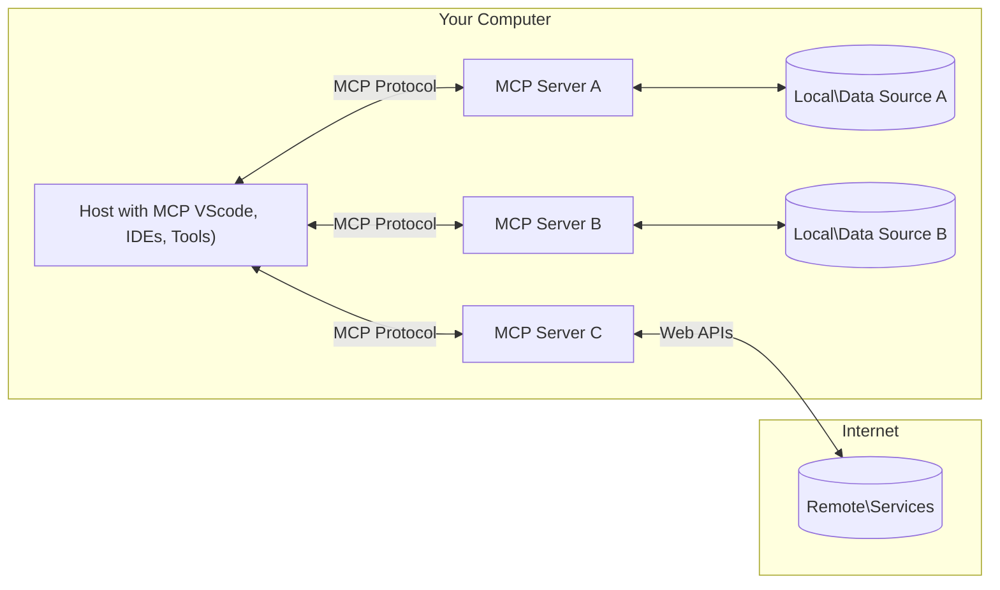

<!--
CO_OP_TRANSLATOR_METADATA:
{
  "original_hash": "355b12a5970c5c9e6db0bee970c751ba",
  "translation_date": "2025-07-04T18:53:31+00:00",
  "source_file": "01-CoreConcepts/README.md",
  "language_code": "bg"
}
-->
# 📖 Основни концепции на MCP: Овладяване на Model Context Protocol за интеграция на AI

[Model Context Protocol (MCP)](https://github.com/modelcontextprotocol) е мощна, стандартизирана рамка, която оптимизира комуникацията между големи езикови модели (LLM) и външни инструменти, приложения и източници на данни. Това SEO-оптимизирано ръководство ще ви преведе през основните концепции на MCP, като ви гарантира разбиране на клиент-сървърната архитектура, ключовите компоненти, механиката на комуникация и най-добрите практики за имплементация.

## Преглед

Този урок разглежда основната архитектура и компоненти, които изграждат екосистемата на Model Context Protocol (MCP). Ще научите за клиент-сървърната архитектура, ключовите компоненти и комуникационните механизми, които задвижват взаимодействията в MCP.

## 👩‍🎓 Основни учебни цели

Към края на този урок ще можете да:

- Разбирате клиент-сървърната архитектура на MCP.
- Идентифицирате ролите и отговорностите на Hosts, Clients и Servers.
- Анализирате основните характеристики, които правят MCP гъвкав слой за интеграция.
- Научите как тече информацията в екосистемата на MCP.
- Придобиете практически знания чрез кодови примери на .NET, Java, Python и JavaScript.

## 🔎 Архитектура на MCP: По-задълбочен поглед

Екосистемата на MCP е изградена върху клиент-сървърен модел. Тази модулна структура позволява на AI приложенията ефективно да взаимодействат с инструменти, бази данни, API-та и контекстуални ресурси. Нека разгледаме тази архитектура по съставните ѝ части.

В основата си MCP следва клиент-сървърна архитектура, при която хост приложение може да се свърже с множество сървъри:



- **MCP Hosts**: Програми като VSCode, Claude Desktop, IDE-та или AI инструменти, които искат да достъпват данни чрез MCP
- **MCP Clients**: Клиенти на протокола, които поддържат 1:1 връзки със сървъри
- **MCP Servers**: Леки програми, които предоставят специфични възможности чрез стандартизирания Model Context Protocol
- **Локални източници на данни**: Файлове, бази данни и услуги на вашия компютър, до които MCP сървърите имат сигурен достъп
- **Отдалечени услуги**: Външни системи, достъпни през интернет, с които MCP сървърите могат да се свързват чрез API-та.

MCP протоколът е развиващ се стандарт – последните актуализации можете да видите в [спецификацията на протокола](https://modelcontextprotocol.io/specification/2025-06-18/)

### 1. Hosts

В Model Context Protocol (MCP) Hosts играят ключова роля като основен интерфейс, чрез който потребителите взаимодействат с протокола. Hosts са приложения или среди, които инициират връзки със MCP сървъри, за да достъпват данни, инструменти и подсказки. Примери за Hosts са интегрирани среди за разработка (IDE) като Visual Studio Code, AI инструменти като Claude Desktop или специално разработени агенти за конкретни задачи.

**Hosts** са LLM приложения, които инициират връзки. Те:

- Изпълняват или взаимодействат с AI модели за генериране на отговори.
- Инициират връзки с MCP сървъри.
- Управляват потока на разговора и потребителския интерфейс.
- Контролират разрешенията и ограниченията за сигурност.
- Обработват съгласието на потребителя за споделяне на данни и изпълнение на инструменти.

### 2. Clients

Clients са съществени компоненти, които улесняват взаимодействието между Hosts и MCP сървъри. Те действат като посредници, позволявайки на Hosts да достъпват и използват функционалностите, предоставяни от MCP сървърите. Clients играят важна роля за осигуряване на гладка комуникация и ефективен обмен на данни в архитектурата на MCP.

**Clients** са конектори в рамките на хост приложението. Те:

- Изпращат заявки към сървърите с подсказки/инструкции.
- Договарят възможностите със сървърите.
- Управляват заявки за изпълнение на инструменти от моделите.
- Обработват и показват отговорите на потребителите.

### 3. Servers

Servers отговарят за обработката на заявки от MCP клиенти и предоставянето на подходящи отговори. Те управляват различни операции като извличане на данни, изпълнение на инструменти и генериране на подсказки. Сървърите гарантират, че комуникацията между клиенти и Hosts е ефективна и надеждна, като поддържат целостта на процеса на взаимодействие.

**Servers** са услуги, които предоставят контекст и възможности. Те:

- Регистрират наличните функции (ресурси, подсказки, инструменти)
- Получават и изпълняват повиквания на инструменти от клиента
- Предоставят контекстуална информация за подобряване на отговорите на модела
- Връщат резултати обратно на клиента
- Поддържат състояние през взаимодействията, когато е необходимо

Сървърите могат да бъдат разработвани от всеки, за да разширят възможностите на модела със специализирана функционалност.

### 4. Функции на сървърите

Сървърите в Model Context Protocol (MCP) предоставят основни градивни елементи, които позволяват богати взаимодействия между клиенти, хостове и езикови модели. Тези функции са проектирани да разширят възможностите на MCP чрез предлагане на структурирани контекст, инструменти и подсказки.

MCP сървърите могат да предлагат някоя от следните функции:

#### 📑 Ресурси

Ресурсите в Model Context Protocol (MCP) обхващат различни видове контекст и данни, които могат да бъдат използвани от потребители или AI модели. Те включват:

- **Контекстуални данни**: Информация и контекст, които потребителите или AI моделите могат да използват за вземане на решения и изпълнение на задачи.
- **Бази знания и хранилища на документи**: Колекции от структурирани и неструктурирани данни, като статии, ръководства и научни трудове, които предоставят ценни прозрения и информация.
- **Локални файлове и бази данни**: Данни, съхранявани локално на устройства или в бази данни, достъпни за обработка и анализ.
- **API-та и уеб услуги**: Външни интерфейси и услуги, които предлагат допълнителни данни и функционалности, позволяващи интеграция с различни онлайн ресурси и инструменти.

Пример за ресурс може да бъде схема на база данни или файл, достъпен по следния начин:

```text
file://log.txt
database://schema
```

### 🤖 Подсказки

Подсказките в Model Context Protocol (MCP) включват различни предварително дефинирани шаблони и модели на взаимодействие, предназначени да улеснят работните процеси на потребителите и да подобрят комуникацията. Те включват:

- **Шаблонирани съобщения и работни потоци**: Предварително структурирани съобщения и процеси, които насочват потребителите през конкретни задачи и взаимодействия.
- **Предварително дефинирани модели на взаимодействие**: Стандартизирани последователности от действия и отговори, които улесняват последователна и ефективна комуникация.
- **Специализирани шаблони за разговори**: Персонализируеми шаблони, пригодени за специфични типове разговори, осигуряващи релевантни и контекстуално подходящи взаимодействия.

Шаблон за подсказка може да изглежда така:

```markdown
Generate a product slogan based on the following {{product}} with the following {{keywords}}
```

#### ⛏️ Инструменти

Инструментите в Model Context Protocol (MCP) са функции, които AI моделът може да изпълнява, за да извършва конкретни задачи. Тези инструменти са създадени да разширят възможностите на AI модела, като предоставят структурирани и надеждни операции. Основни характеристики включват:

- **Функции, които AI моделът може да изпълнява**: Инструментите са изпълними функции, които моделът може да извиква за изпълнение на различни задачи.
- **Уникално име и описание**: Всеки инструмент има уникално име и подробно описание, което обяснява целта и функционалността му.
- **Параметри и изходни данни**: Инструментите приемат конкретни параметри и връщат структурирани резултати, осигурявайки последователни и предвидими резултати.
- **Дискретни функции**: Инструментите изпълняват отделни функции като уеб търсения, изчисления и заявки към бази данни.

Пример за инструмент може да изглежда така:

```typescript
server.tool(
  "GetProducts",
  {
    pageSize: z.string().optional(),
    pageCount: z.string().optional()
  }, () => {
    // return results from API
  }
)
```

## Функции на клиентите

В Model Context Protocol (MCP) клиентите предлагат няколко ключови функции на сървърите, които подобряват цялостната функционалност и взаимодействие в протокола. Една от забележителните функции е Sampling.

### 👉 Sampling

- **Сървърно инициирани агентни поведения**: Клиентите позволяват на сървърите да инициират специфични действия или поведения автономно, подобрявайки динамичните възможности на системата.
- **Рекурсивни взаимодействия с LLM**: Тази функция позволява рекурсивни взаимодействия с големи езикови модели (LLM), което дава възможност за по-сложна и итеративна обработка на задачи.
- **Заявяване на допълнителни завършвания от модела**: Сървърите могат да поискат допълнителни завършвания от модела, за да гарантират, че отговорите са изчерпателни и контекстуално релевантни.

## Поток на информация в MCP

Model Context Protocol (MCP) дефинира структуриран поток на информация между хостове, клиенти, сървъри и модели. Разбирането на този поток помага да се изясни как се обработват потребителските заявки и как външните инструменти и данни се интегрират в отговорите на модела.

- **Хостът инициира връзка**  
  Хост приложението (например IDE или чат интерфейс) установява връзка с MCP сървър, обикновено чрез STDIO, WebSocket или друг поддържан транспорт.

- **Договаряне на възможности**  
  Клиентът (вграден в хоста) и сървърът обменят информация за поддържаните функции, инструменти, ресурси и версии на протокола. Това гарантира, че и двете страни разбират наличните възможности за сесията.

- **Потребителска заявка**  
  Потребителят взаимодейства с хоста (например въвежда подсказка или команда). Хостът събира този вход и го предава на клиента за обработка.

- **Използване на ресурс или инструмент**  
  - Клиентът може да поиска допълнителен контекст или ресурси от сървъра (като файлове, записи в база данни или статии от база знания), за да обогати разбирането на модела.
  - Ако моделът прецени, че е необходим инструмент (например за извличане на данни, извършване на изчисление или повикване на API), клиентът изпраща заявка за извикване на инструмент към сървъра, посочвайки името на инструмента и параметрите.

- **Изпълнение от сървъра**  
  Сървърът получава заявката за ресурс или инструмент, изпълнява необходимите операции (като стартиране на функция, заявка към база данни или извличане на файл) и връща резултатите на клиента в структурирана форма.

- **Генериране на отговор**  
  Клиентът интегрира отговорите на сървъра (данни от ресурси, изходи от инструменти и др.) в текущото взаимодействие с модела. Моделът използва тази информация, за да генерира изчерпателен и контекстуално релевантен отговор.

- **Представяне на резултата**  
  Хостът получава крайния изход от клиента и го представя на потребителя, често включително както генерирания текст от модела, така и резултатите от изпълнението на инструменти или търсения в ресурси.

Този поток позволява на MCP да поддържа напреднали, интерактивни и контекстно осъзнати AI приложения чрез безпроблемно свързване на модели с външни инструменти и източници на данни.

## Детайли за протокола

MCP (Model Context Protocol) е изграден върху [JSON-RPC 2.0](https://www.jsonrpc.org/), предоставяйки стандартизиран, езиконезависим формат за съобщения за комуникация между хостове, клиенти и сървъри. Тази основа осигурява надеждни, структурирани и разширяеми взаимодействия между различни платформи и програмни езици.

### Ключови характеристики на протокола

MCP разширява JSON-RPC 2.0 с допълнителни конвенции за извикване на инструменти, достъп до ресурси и управление на подсказки. Поддържа множество транспортни слоеве (STDIO, WebSocket, SSE) и осигурява сигурна, разширяема и езиконезависима комуникация между компонентите.

#### 🧢 Основен протокол

- **Формат на съобщенията JSON-RPC**: Всички заявки и отговори използват спецификацията JSON-RPC 2.0, осигурявайки последователна структура за методови повиквания, параметри, резултати и обработка на грешки.
- **Състояниеви връзки**: MCP сесиите поддържат състояние през множество заявки, поддържайки продължителни разговори, натрупване на контекст и управление на ресурси.
- **Договаряне на възможности**: По време на установяване на връзка клиентите и сървърите обменят информация за поддържаните функции, версии на протокола, налични инструменти и ресурси. Това гарантира, че и двете страни разбират възможностите на другия и могат да се адаптират.

#### ➕ Допълнителни помощни средства

По-долу са изброени някои допълнителни помощни средства и разширения на протокола, които MCP предоставя за подобряване на разработчиците и поддръжка на напреднали сценарии:

- **Опции за конфигурация**: MCP позволява динамична конфигурация на параметрите на сесията, като разрешения за инструменти, достъп до ресурси и настройки на модела, пригодени за всяко взаимодействие.
- **Проследяване на напредъка**: Дълготрайни операции могат да докладват актуализации за напредъка, осигурявайки отзивчив потребителски интерфейс и по-добро потребителско изживяване при сложни задачи.
- **Отмяна на заявки**: Клиентите могат да отменят текущи заявки, позволявайки на потребителите да прекъснат операции, които вече не са необходими или отнемат твърде много време.
- **Отчитане на грешки**: Стандартизирани съобщения и кодове за грешки помагат за диагностициране на проблеми, обработка на неуспехи и предоставяне на полезна обратна връзка към потребители и разработчици.
- **Логване**: Как клиентите, така и сървърите могат да излъчват структурирани логове за одит, отстраняване на грешки и мониторинг на взаимодействията по протокола.

Чрез използване на тези функции MCP осигурява стабилна, сигурна и гъвкава комуникация между езикови модели и външни инструменти или източници на данни.

### 🔐 Съображения за сигурност

Имплементациите на MCP трябва да спазват няколко ключови принципа за сигурност, за да
MCP включва няколко вградени концепции и механизми за управление на сигурността и авторизацията в целия протокол:

1. **Контрол на разрешенията за инструменти**:  
  Клиентите могат да определят кои инструменти моделът може да използва по време на сесия. Това гарантира, че са достъпни само изрично разрешените инструменти, което намалява риска от нежелани или несигурни операции. Разрешенията могат да се конфигурират динамично според предпочитанията на потребителя, организационните политики или контекста на взаимодействието.

2. **Аутентикация**:  
  Сървърите могат да изискват аутентикация преди да предоставят достъп до инструменти, ресурси или чувствителни операции. Това може да включва API ключове, OAuth токени или други схеми за аутентикация. Правилната аутентикация гарантира, че само доверени клиенти и потребители могат да използват възможностите на сървъра.

3. **Валидация**:  
  Извършва се валидация на параметрите за всички извиквания на инструменти. Всеки инструмент дефинира очакваните типове, формати и ограничения за своите параметри, а сървърът проверява входящите заявки съответно. Това предотвратява подаването на неправилни или злонамерени данни към инструментите и помага за поддържане на целостта на операциите.

4. **Ограничаване на честотата (Rate Limiting)**:  
  За да се предотврати злоупотреба и да се осигури справедливо използване на сървърните ресурси, MCP сървърите могат да прилагат ограничаване на честотата за извиквания на инструменти и достъп до ресурси. Ограниченията могат да се задават на потребител, сесия или глобално ниво и помагат за защита срещу атаки тип отказ на услуга или прекомерна консумация на ресурси.

Чрез комбиниране на тези механизми, MCP осигурява сигурна основа за интегриране на езикови модели с външни инструменти и източници на данни, като същевременно дава на потребителите и разработчиците прецизен контрол върху достъпа и използването.

## Протоколни съобщения

Комуникацията в MCP използва структурирани JSON съобщения, които улесняват ясни и надеждни взаимодействия между клиенти, сървъри и модели. Основните типове съобщения включват:

- **Клиентска заявка**  
  Изпраща се от клиента към сървъра и обикновено съдържа:
  - Подканата или командата на потребителя
  - История на разговора за контекст
  - Конфигурация и разрешения за инструменти
  - Допълнителни метаданни или информация за сесията

- **Отговор на модела**  
  Връща се от модела (чрез клиента) и съдържа:
  - Генериран текст или завършек на базата на подканата и контекста
  - Опционални инструкции за извикване на инструмент, ако моделът прецени, че трябва да се използва такъв
  - Препратки към ресурси или допълнителен контекст при нужда

- **Заявка към инструмент**  
  Изпраща се от клиента към сървъра, когато трябва да се изпълни инструмент. Това съобщение включва:
  - Името на инструмента, който трябва да се извика
  - Параметрите, необходими за инструмента (валидирани спрямо схемата на инструмента)
  - Контекстуална информация или идентификатори за проследяване на заявката

- **Отговор от инструмент**  
  Връща се от сървъра след изпълнение на инструмента. Това съобщение предоставя:
  - Резултатите от изпълнението на инструмента (структурирани данни или съдържание)
  - Всякакви грешки или статусна информация, ако извикването е неуспешно
  - По желание, допълнителни метаданни или логове, свързани с изпълнението

Тези структурирани съобщения гарантират, че всяка стъпка в работния процес на MCP е ясна, проследима и разширяема, поддържайки сложни сценарии като многократни разговори, свързване на инструменти и надеждно обработване на грешки.

## Основни изводи

- MCP използва клиент-сървърна архитектура за свързване на модели с външни възможности
- Екосистемата се състои от клиенти, хостове, сървъри, инструменти и източници на данни
- Комуникацията може да се осъществява чрез STDIO, SSE или WebSockets
- Инструментите са основните функционални единици, достъпни за моделите
- Структурираните комуникационни протоколи осигуряват последователни взаимодействия

## Упражнение

Проектирайте прост MCP инструмент, който би бил полезен във вашата област. Определете:
1. Как ще се казва инструментът
2. Какви параметри ще приема
3. Какъв изход ще връща
4. Как моделът може да използва този инструмент за решаване на потребителски проблеми


---

## Какво следва

Следва: [Глава 2: Сигурност](../02-Security/README.md)

**Отказ от отговорност**:  
Този документ е преведен с помощта на AI преводаческа услуга [Co-op Translator](https://github.com/Azure/co-op-translator). Въпреки че се стремим към точност, моля, имайте предвид, че автоматизираните преводи могат да съдържат грешки или неточности. Оригиналният документ на неговия роден език трябва да се счита за авторитетен източник. За критична информация се препоръчва професионален човешки превод. Ние не носим отговорност за каквито и да е недоразумения или неправилни тълкувания, произтичащи от използването на този превод.