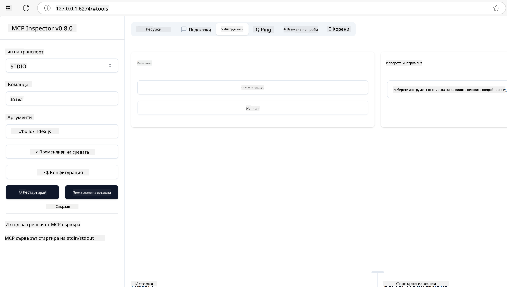
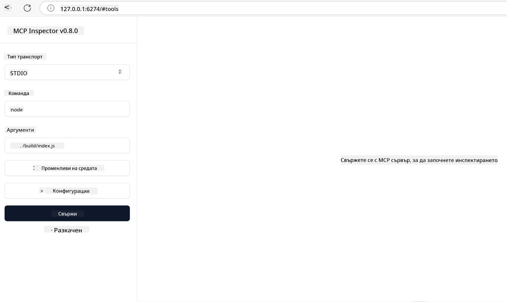
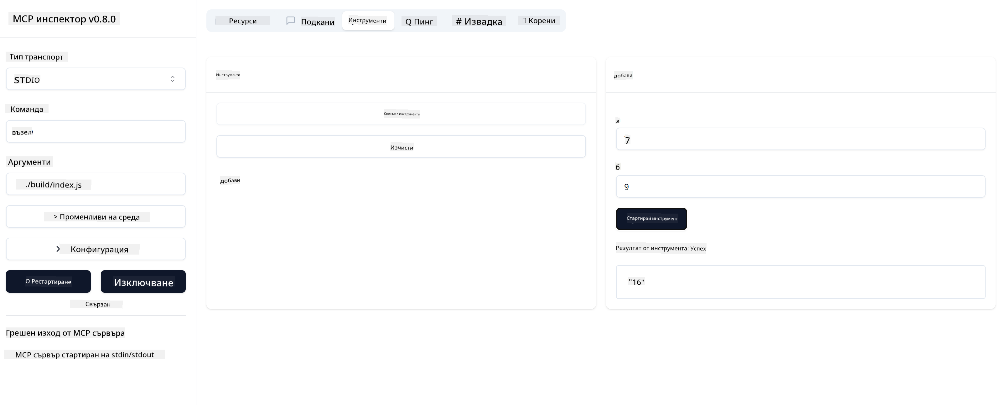

<!--
CO_OP_TRANSLATOR_METADATA:
{
  "original_hash": "5331ffd328a54b90f76706c52b673e27",
  "translation_date": "2025-05-17T08:55:18+00:00",
  "source_file": "03-GettingStarted/01-first-server/README.md",
  "language_code": "bg"
}
-->
# Започване с MCP

Добре дошли в първите ви стъпки с Протокола за Контекст на Моделите (MCP)! Независимо дали сте нови в MCP или искате да задълбочите разбирането си, това ръководство ще ви преведе през основните стъпки за настройка и разработка. Ще откриете как MCP позволява безпроблемна интеграция между AI модели и приложения и ще научите как бързо да подготвите средата си за изграждане и тестване на решения, захранвани от MCP.

> TLDR; Ако изграждате AI приложения, знаете, че можете да добавите инструменти и други ресурси към вашия LLM (голям езиков модел), за да го направите по-знаещ. Въпреки това, ако поставите тези инструменти и ресурси на сървър, приложението и възможностите на сървъра могат да бъдат използвани от всеки клиент със или без LLM.

## Преглед

Този урок предоставя практическо ръководство за настройка на MCP среди и изграждане на вашите първи MCP приложения. Ще научите как да настроите необходимите инструменти и рамки, да изградите основни MCP сървъри, да създадете хост приложения и да тествате вашите реализации.

Протоколът за Контекст на Моделите (MCP) е отворен протокол, който стандартизира как приложенията предоставят контекст на LLMs. Помислете за MCP като за USB-C порт за AI приложения - той предоставя стандартизиран начин за свързване на AI модели към различни източници на данни и инструменти.

## Учебни цели

До края на този урок ще можете да:

- Настроите среди за разработка за MCP в C#, Java, Python, TypeScript и JavaScript
- Изградите и внедрите основни MCP сървъри с персонализирани функции (ресурси, подкани и инструменти)
- Създадете хост приложения, които се свързват с MCP сървъри
- Тествате и дебъгвате MCP реализации

## Настройка на вашата MCP среда

Преди да започнете работа с MCP, е важно да подготвите вашата среда за разработка и да разберете основния работен процес. Тази секция ще ви преведе през първоначалните стъпки за настройка, за да осигурите плавен старт с MCP.

### Предварителни изисквания

Преди да се потопите в разработката на MCP, уверете се, че имате:

- **Среда за разработка**: За избрания от вас език (C#, Java, Python, TypeScript или JavaScript)
- **IDE/Редактор**: Visual Studio, Visual Studio Code, IntelliJ, Eclipse, PyCharm или който и да е модерен редактор на код
- **Мениджъри на пакети**: NuGet, Maven/Gradle, pip или npm/yarn
- **API ключове**: За всякакви AI услуги, които планирате да използвате в хост приложенията си

## Основна структура на MCP сървър

Един MCP сървър обикновено включва:

- **Конфигурация на сървъра**: Настройка на порт, автентикация и други настройки
- **Ресурси**: Данни и контекст, достъпни за LLMs
- **Инструменти**: Функционалност, която моделите могат да извикват
- **Подкани**: Шаблони за генериране или структуриране на текст

Ето един опростен пример на TypeScript:

```typescript
import { Server, Tool, Resource } from "@modelcontextprotocol/typescript-server-sdk";

// Create a new MCP server
const server = new Server({
  port: 3000,
  name: "Example MCP Server",
  version: "1.0.0"
});

// Register a tool
server.registerTool({
  name: "calculator",
  description: "Performs basic calculations",
  parameters: {
    expression: {
      type: "string",
      description: "The math expression to evaluate"
    }
  },
  handler: async (params) => {
    const result = eval(params.expression);
    return { result };
  }
});

// Start the server
server.start();
```

В предходния код ние:

- Импортираме необходимите класове от MCP TypeScript SDK.
- Създаваме и конфигурираме нова инстанция на MCP сървър.
- Регистрираме персонализиран инструмент (`calculator`) с функция за обработка.
- Стартираме сървъра, за да слуша за входящи MCP заявки.

## Тестване и дебъгване

Преди да започнете тестване на вашия MCP сървър, е важно да разберете наличните инструменти и най-добрите практики за дебъгване. Ефективното тестване гарантира, че сървърът ви се държи както се очаква и ви помага бързо да идентифицирате и разрешите проблеми. Следващата секция очертава препоръчани подходи за валидиране на вашата MCP реализация.

MCP предоставя инструменти, които да ви помогнат да тествате и дебъгвате вашите сървъри:

- **Инспектор инструмент**, този графичен интерфейс ви позволява да се свържете с вашия сървър и да тествате вашите инструменти, подкани и ресурси.
- **curl**, можете също да се свържете с вашия сървър, използвайки команден инструмент като curl или други клиенти, които могат да създават и изпълняват HTTP команди.

### Използване на MCP Inspector

[MCP Inspector](https://github.com/modelcontextprotocol/inspector) е визуален инструмент за тестване, който ви помага:

1. **Откриване на възможностите на сървъра**: Автоматично откриване на наличните ресурси, инструменти и подкани
2. **Тестване на изпълнението на инструмента**: Опитайте различни параметри и вижте отговорите в реално време
3. **Преглед на метаданни на сървъра**: Преглед на информация за сървъра, схеми и конфигурации

```bash
# ex TypeScript, installing and running MCP Inspector
npx @modelcontextprotocol/inspector node build/index.js
```

Когато изпълните горните команди, MCP Inspector ще стартира локален уеб интерфейс във вашия браузър. Можете да очаквате да видите табло, показващо вашите регистрирани MCP сървъри, наличните им инструменти, ресурси и подкани. Интерфейсът ви позволява интерактивно да тествате изпълнението на инструменти, да инспектирате метаданните на сървъра и да виждате отговори в реално време, което улеснява валидирането и дебъгването на вашите MCP сървърни реализации.

Ето как може да изглежда:



## Чести проблеми при настройка и решения

| Проблем | Възможно решение |
|---------|------------------|
| Отказ на връзката | Проверете дали сървърът работи и портът е правилен |
| Грешки при изпълнение на инструмента | Прегледайте валидирането на параметрите и обработката на грешки |
| Провали на автентикацията | Проверете API ключовете и разрешенията |
| Грешки при валидиране на схемата | Уверете се, че параметрите съответстват на дефинираната схема |
| Сървърът не стартира | Проверете за конфликти на портове или липсващи зависимости |
| CORS грешки | Конфигурирайте правилни CORS заглавия за заявки от различни източници |
| Проблеми с автентикацията | Проверете валидността на токените и разрешенията |

## Локална разработка

За локална разработка и тестване можете да стартирате MCP сървъри директно на вашата машина:

1. **Стартирайте сървърния процес**: Стартирайте вашето MCP сървърно приложение
2. **Конфигурирайте мрежата**: Уверете се, че сървърът е достъпен на очаквания порт
3. **Свържете клиенти**: Използвайте локални URL адреси за връзка като `http://localhost:3000`

```bash
# Example: Running a TypeScript MCP server locally
npm run start
# Server running at http://localhost:3000
```

## Изграждане на вашия първи MCP сървър

Разгледахме [Основни концепции](/01-CoreConcepts/README.md) в предишен урок, сега е време да приложим тези знания на практика.

### Какво може да прави един сървър

Преди да започнем да пишем код, нека си припомним какво може да прави един сървър:

Един MCP сървър може например:

- Да достъпва локални файлове и бази данни
- Да се свързва с отдалечени API-та
- Да извършва изчисления
- Да се интегрира с други инструменти и услуги
- Да предоставя потребителски интерфейс за взаимодействие

Чудесно, сега когато знаем какво можем да направим, нека започнем да кодираме.

## Упражнение: Създаване на сървър

За да създадете сървър, трябва да следвате тези стъпки:

- Инсталирайте MCP SDK.
- Създайте проект и настройте структурата на проекта.
- Напишете сървърния код.
- Тествайте сървъра.

### -1- Инсталирайте SDK

Това се различава малко в зависимост от избраното от вас изпълнение, така че изберете едно от следните изпълнения:

Генеративният AI може да генерира текст, изображения и дори код.
Вие сте обучени на данни до октомври 2023 г.

### -2- Създайте проект

Сега, когато сте инсталирали вашия SDK, нека създадем проект:

### -3- Създайте файлове на проекта

### -4- Създайте сървърен код

### -5- Добавяне на инструмент и ресурс

Добавете инструмент и ресурс, като добавите следния код:

### -6 Финален код

Нека добавим последния код, от който се нуждаем, за да може сървърът да стартира:

### -7- Тествайте сървъра

Стартирайте сървъра със следната команда:

### -8- Стартирайте, използвайки инспектора

Инспекторът е чудесен инструмент, който може да стартира вашия сървър и ви позволява да взаимодействате с него, за да тествате дали работи. Нека го стартираме:

> [!NOTE]
> може да изглежда различно в полето "command", тъй като съдържа командата за стартиране на сървър с вашето специфично изпълнение/ 

Трябва да видите следния потребителски интерфейс:



1. Свържете се със сървъра, като изберете бутона Connect. След като се свържете със сървъра, трябва да видите следното:

  

1. Изберете "Tools" и "listTools", трябва да видите "Add", изберете "Add" и попълнете стойностите на параметрите.

  Трябва да видите следния отговор, т.е. резултат от инструмента "add":

  

Поздравления, успяхте да създадете и стартирате първия си сървър!

### Официални SDKs

MCP предоставя официални SDKs за множество езици:
- [C# SDK](https://github.com/modelcontextprotocol/csharp-sdk) - Поддържан в сътрудничество с Microsoft
- [Java SDK](https://github.com/modelcontextprotocol/java-sdk) - Поддържан в сътрудничество със Spring AI
- [TypeScript SDK](https://github.com/modelcontextprotocol/typescript-sdk) - Официалната TypeScript реализация
- [Python SDK](https://github.com/modelcontextprotocol/python-sdk) - Официалната Python реализация
- [Kotlin SDK](https://github.com/modelcontextprotocol/kotlin-sdk) - Официалната Kotlin реализация
- [Swift SDK](https://github.com/modelcontextprotocol/swift-sdk) - Поддържан в сътрудничество с Loopwork AI
- [Rust SDK](https://github.com/modelcontextprotocol/rust-sdk) - Официалната Rust реализация

## Основни изводи

- Настройката на MCP среда за разработка е лесна с езиково-специфични SDKs
- Изграждането на MCP сървъри включва създаване и регистриране на инструменти с ясни схеми
- Тестването и дебъгването са от съществено значение за надеждни MCP реализации

## Примери

- [Java Калкулатор](../samples/java/calculator/README.md)
- [.Net Калкулатор](../../../../03-GettingStarted/samples/csharp)
- [JavaScript Калкулатор](../samples/javascript/README.md)
- [TypeScript Калкулатор](../samples/typescript/README.md)
- [Python Калкулатор](../../../../03-GettingStarted/samples/python)

## Задание

Създайте прост MCP сървър с инструмент по ваш избор:
1. Реализирайте инструмента на предпочитания от вас език (.NET, Java, Python или JavaScript).
2. Дефинирайте входни параметри и стойности на връщане.
3. Стартирайте инструмента инспектор, за да се уверите, че сървърът работи както трябва.
4. Тествайте реализацията с различни входове.

## Решение

[Решение](./solution/README.md)

## Допълнителни ресурси

- [MCP GitHub Repository](https://github.com/microsoft/mcp-for-beginners)

## Какво следва

Следва: [Започване с MCP клиенти](/03-GettingStarted/02-client/README.md)

**Отказ от отговорност**: 
Този документ е преведен с помощта на AI услуга за превод [Co-op Translator](https://github.com/Azure/co-op-translator). Докато се стремим към точност, моля, имайте предвид, че автоматизираните преводи могат да съдържат грешки или неточности. Оригиналният документ на неговия роден език трябва да се счита за авторитетен източник. За критична информация се препоръчва професионален човешки превод. Не носим отговорност за каквито и да е недоразумения или погрешни интерпретации, произтичащи от използването на този превод.