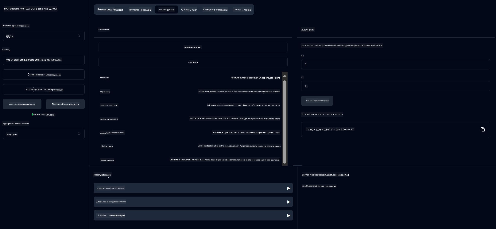
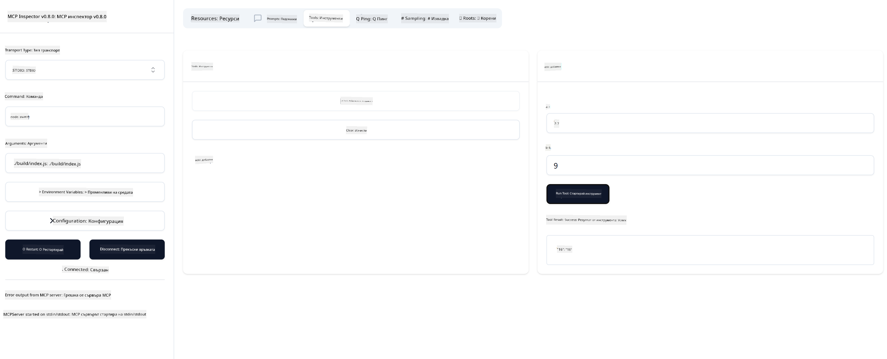

<!--
CO_OP_TRANSLATOR_METADATA:
{
  "original_hash": "ec11ee93f31fdadd94facd3e3d22f9e6",
  "translation_date": "2025-09-09T22:15:00+00:00",
  "source_file": "03-GettingStarted/01-first-server/README.md",
  "language_code": "bg"
}
-->
# Започване с MCP

Добре дошли в първите стъпки с Model Context Protocol (MCP)! Независимо дали сте нови в MCP или искате да задълбочите знанията си, този наръчник ще ви преведе през основните стъпки за настройка и разработка. Ще откриете как MCP позволява безпроблемна интеграция между AI модели и приложения, и ще научите как бързо да подготвите средата си за изграждане и тестване на решения, базирани на MCP.

> TLDR; Ако създавате AI приложения, знаете, че можете да добавите инструменти и други ресурси към вашия LLM (голям езиков модел), за да го направите по-знаещ. Но ако поставите тези инструменти и ресурси на сървър, приложението и възможностите на сървъра могат да бъдат използвани от всеки клиент със/без LLM.

## Общ преглед

Този урок предоставя практическо ръководство за настройка на MCP среди и изграждане на първите ви MCP приложения. Ще научите как да настроите необходимите инструменти и рамки, да изградите основни MCP сървъри, да създадете хост приложения и да тествате вашите реализации.

Model Context Protocol (MCP) е отворен протокол, който стандартизира начина, по който приложенията предоставят контекст на LLMs. Мислете за MCP като за USB-C порт за AI приложения - той предоставя стандартизиран начин за свързване на AI модели с различни източници на данни и инструменти.

## Цели на обучението

До края на този урок ще можете:

- Да настроите среди за разработка за MCP в C#, Java, Python, TypeScript и Rust
- Да изградите и внедрите основни MCP сървъри с персонализирани функции (ресурси, подсказки и инструменти)
- Да създадете хост приложения, които се свързват с MCP сървъри
- Да тествате и отстранявате проблеми в MCP реализации

## Настройка на MCP среда

Преди да започнете работа с MCP, важно е да подготвите средата си за разработка и да разберете основния работен процес. Този раздел ще ви преведе през началните стъпки за настройка, за да осигурите плавен старт с MCP.

### Предварителни изисквания

Преди да се потопите в разработката с MCP, уверете се, че разполагате с:

- **Среда за разработка**: За избрания от вас език (C#, Java, Python, TypeScript или Rust)
- **IDE/Редактор**: Visual Studio, Visual Studio Code, IntelliJ, Eclipse, PyCharm или друг модерен редактор на код
- **Мениджъри на пакети**: NuGet, Maven/Gradle, pip, npm/yarn или Cargo
- **API ключове**: За всякакви AI услуги, които планирате да използвате в хост приложенията си

## Основна структура на MCP сървър

Типичният MCP сървър включва:

- **Конфигурация на сървъра**: Настройка на порт, автентикация и други параметри
- **Ресурси**: Данни и контекст, предоставени на LLMs
- **Инструменти**: Функционалности, които моделите могат да извикват
- **Подсказки**: Шаблони за генериране или структуриране на текст

Ето опростен пример в TypeScript:

```typescript
import { McpServer, ResourceTemplate } from "@modelcontextprotocol/sdk/server/mcp.js";
import { StdioServerTransport } from "@modelcontextprotocol/sdk/server/stdio.js";
import { z } from "zod";

// Create an MCP server
const server = new McpServer({
  name: "Demo",
  version: "1.0.0"
});

// Add an addition tool
server.tool("add",
  { a: z.number(), b: z.number() },
  async ({ a, b }) => ({
    content: [{ type: "text", text: String(a + b) }]
  })
);

// Add a dynamic greeting resource
server.resource(
  "file",
  // The 'list' parameter controls how the resource lists available files. Setting it to undefined disables listing for this resource.
  new ResourceTemplate("file://{path}", { list: undefined }),
  async (uri, { path }) => ({
    contents: [{
      uri: uri.href,
      text: `File, ${path}!`
    }]
  })
);

// Add a file resource that reads the file contents
server.resource(
  "file",
  new ResourceTemplate("file://{path}", { list: undefined }),
  async (uri, { path }) => {
    let text;
    try {
      text = await fs.readFile(path, "utf8");
    } catch (err) {
      text = `Error reading file: ${err.message}`;
    }
    return {
      contents: [{
        uri: uri.href,
        text
      }]
    };
  }
);

server.prompt(
  "review-code",
  { code: z.string() },
  ({ code }) => ({
    messages: [{
      role: "user",
      content: {
        type: "text",
        text: `Please review this code:\n\n${code}`
      }
    }]
  })
);

// Start receiving messages on stdin and sending messages on stdout
const transport = new StdioServerTransport();
await server.connect(transport);
```

В горния код:

- Импортираме необходимите класове от MCP TypeScript SDK.
- Създаваме и конфигурираме нова инстанция на MCP сървър.
- Регистрираме персонализиран инструмент (`calculator`) с функция за обработка.
- Стартираме сървъра, за да слуша входящи MCP заявки.

## Тестване и отстраняване на проблеми

Преди да започнете тестване на вашия MCP сървър, важно е да разберете наличните инструменти и най-добрите практики за отстраняване на проблеми. Ефективното тестване гарантира, че сървърът ви се държи според очакванията и ви помага бързо да идентифицирате и решавате проблеми. Следващият раздел очертава препоръчани подходи за валидиране на вашата MCP реализация.

MCP предоставя инструменти за тестване и отстраняване на проблеми със сървърите:

- **Инструмент за инспекция**: Този графичен интерфейс ви позволява да се свържете със сървъра и да тествате вашите инструменти, подсказки и ресурси.
- **curl**: Можете също да се свържете със сървъра, използвайки команден инструмент като curl или други клиенти, които могат да създават и изпълняват HTTP команди.

### Използване на MCP Inspector

[MCP Inspector](https://github.com/modelcontextprotocol/inspector) е визуален инструмент за тестване, който ви помага:

1. **Откриване на възможностите на сървъра**: Автоматично откриване на налични ресурси, инструменти и подсказки
2. **Тестване на изпълнението на инструменти**: Изпробване на различни параметри и наблюдение на отговорите в реално време
3. **Преглед на метаданни на сървъра**: Изследване на информация за сървъра, схеми и конфигурации

```bash
# ex TypeScript, installing and running MCP Inspector
npx @modelcontextprotocol/inspector node build/index.js
```

Когато изпълните горните команди, MCP Inspector ще стартира локален уеб интерфейс във вашия браузър. Очаквайте да видите табло, показващо регистрираните MCP сървъри, техните налични инструменти, ресурси и подсказки. Интерфейсът ви позволява интерактивно да тествате изпълнението на инструменти, да инспектирате метаданни на сървъра и да наблюдавате отговори в реално време, което улеснява валидирането и отстраняването на проблеми във вашите MCP реализации.

Ето как може да изглежда:


## Често срещани проблеми при настройка и решения

| Проблем | Възможно решение |
|---------|------------------|
| Отказ на връзката | Проверете дали сървърът работи и портът е правилен |
| Грешки при изпълнение на инструменти | Прегледайте валидирането на параметрите и обработката на грешки |
| Неуспешна автентикация | Проверете API ключовете и разрешенията |
| Грешки при валидиране на схема | Уверете се, че параметрите съответстват на дефинираната схема |
| Сървърът не стартира | Проверете за конфликти на портове или липсващи зависимости |
| CORS грешки | Конфигурирайте правилни CORS заглавия за заявки от различни източници |
| Проблеми с автентикация | Проверете валидността на токена и разрешенията |

## Локална разработка

За локална разработка и тестване можете да стартирате MCP сървъри директно на вашата машина:

1. **Стартирайте процеса на сървъра**: Стартирайте вашето MCP сървър приложение
2. **Конфигурирайте мрежата**: Уверете се, че сървърът е достъпен на очаквания порт
3. **Свържете клиенти**: Използвайте локални URL адреси за връзка като `http://localhost:3000`

```bash
# Example: Running a TypeScript MCP server locally
npm run start
# Server running at http://localhost:3000
```

## Изграждане на първия ви MCP сървър

Разгледахме [Основни концепции](/01-CoreConcepts/README.md) в предишен урок, сега е време да приложим тези знания на практика.

### Какво може да прави сървърът

Преди да започнем да пишем код, нека си припомним какво може да прави сървърът:

MCP сървър може например:

- Да достъпва локални файлове и бази данни
- Да се свързва с отдалечени API
- Да извършва изчисления
- Да се интегрира с други инструменти и услуги
- Да предоставя потребителски интерфейс за взаимодействие

Чудесно, сега, когато знаем какво можем да направим, нека започнем с кодирането.

## Упражнение: Създаване на сървър

За да създадете сървър, трябва да следвате тези стъпки:

- Инсталирайте MCP SDK.
- Създайте проект и настройте структурата на проекта.
- Напишете кода на сървъра.
- Тествайте сървъра.

### -1- Създаване на проект

#### TypeScript

```sh
# Create project directory and initialize npm project
mkdir calculator-server
cd calculator-server
npm init -y
```

#### Python

```sh
# Create project dir
mkdir calculator-server
cd calculator-server
# Open the folder in Visual Studio Code - Skip this if you are using a different IDE
code .
```

#### .NET

```sh
dotnet new console -n McpCalculatorServer
cd McpCalculatorServer
```

#### Java

За Java създайте проект Spring Boot:

```bash
curl https://start.spring.io/starter.zip \
  -d dependencies=web \
  -d javaVersion=21 \
  -d type=maven-project \
  -d groupId=com.example \
  -d artifactId=calculator-server \
  -d name=McpServer \
  -d packageName=com.microsoft.mcp.sample.server \
  -o calculator-server.zip
```

Извлечете zip файла:

```bash
unzip calculator-server.zip -d calculator-server
cd calculator-server
# optional remove the unused test
rm -rf src/test/java
```

Добавете следната пълна конфигурация към вашия *pom.xml* файл:

```xml
<?xml version="1.0" encoding="UTF-8"?>
<project xmlns="http://maven.apache.org/POM/4.0.0"
    xmlns:xsi="http://www.w3.org/2001/XMLSchema-instance"
    xsi:schemaLocation="http://maven.apache.org/POM/4.0.0 http://maven.apache.org/xsd/maven-4.0.0.xsd">
    <modelVersion>4.0.0</modelVersion>
    
    <!-- Spring Boot parent for dependency management -->
    <parent>
        <groupId>org.springframework.boot</groupId>
        <artifactId>spring-boot-starter-parent</artifactId>
        <version>3.5.0</version>
        <relativePath />
    </parent>

    <!-- Project coordinates -->
    <groupId>com.example</groupId>
    <artifactId>calculator-server</artifactId>
    <version>0.0.1-SNAPSHOT</version>
    <name>Calculator Server</name>
    <description>Basic calculator MCP service for beginners</description>

    <!-- Properties -->
    <properties>
        <java.version>21</java.version>
        <maven.compiler.source>21</maven.compiler.source>
        <maven.compiler.target>21</maven.compiler.target>
    </properties>

    <!-- Spring AI BOM for version management -->
    <dependencyManagement>
        <dependencies>
            <dependency>
                <groupId>org.springframework.ai</groupId>
                <artifactId>spring-ai-bom</artifactId>
                <version>1.0.0-SNAPSHOT</version>
                <type>pom</type>
                <scope>import</scope>
            </dependency>
        </dependencies>
    </dependencyManagement>

    <!-- Dependencies -->
    <dependencies>
        <dependency>
            <groupId>org.springframework.ai</groupId>
            <artifactId>spring-ai-starter-mcp-server-webflux</artifactId>
        </dependency>
        <dependency>
            <groupId>org.springframework.boot</groupId>
            <artifactId>spring-boot-starter-actuator</artifactId>
        </dependency>
        <dependency>
         <groupId>org.springframework.boot</groupId>
         <artifactId>spring-boot-starter-test</artifactId>
         <scope>test</scope>
      </dependency>
    </dependencies>

    <!-- Build configuration -->
    <build>
        <plugins>
            <plugin>
                <groupId>org.springframework.boot</groupId>
                <artifactId>spring-boot-maven-plugin</artifactId>
            </plugin>
            <plugin>
                <groupId>org.apache.maven.plugins</groupId>
                <artifactId>maven-compiler-plugin</artifactId>
                <configuration>
                    <release>21</release>
                </configuration>
            </plugin>
        </plugins>
    </build>

    <!-- Repositories for Spring AI snapshots -->
    <repositories>
        <repository>
            <id>spring-milestones</id>
            <name>Spring Milestones</name>
            <url>https://repo.spring.io/milestone</url>
            <snapshots>
                <enabled>false</enabled>
            </snapshots>
        </repository>
        <repository>
            <id>spring-snapshots</id>
            <name>Spring Snapshots</name>
            <url>https://repo.spring.io/snapshot</url>
            <releases>
                <enabled>false</enabled>
            </releases>
        </repository>
    </repositories>
</project>
```

#### Rust

```sh
mkdir calculator-server
cd calculator-server
cargo init
```

### -2- Добавяне на зависимости

Сега, когато сте създали проекта си, нека добавим зависимости:

#### TypeScript

```sh
# If not already installed, install TypeScript globally
npm install typescript -g

# Install the MCP SDK and Zod for schema validation
npm install @modelcontextprotocol/sdk zod
npm install -D @types/node typescript
```

#### Python

```sh
# Create a virtual env and install dependencies
python -m venv venv
venv\Scripts\activate
pip install "mcp[cli]"
```

#### Java

```bash
cd calculator-server
./mvnw clean install -DskipTests
```

#### Rust

```sh
cargo add rmcp --features server,transport-io
cargo add serde
cargo add tokio --features rt-multi-thread
```

### -3- Създаване на файлове на проекта

#### TypeScript

Отворете файла *package.json* и заменете съдържанието със следното, за да гарантирате, че можете да изградите и стартирате сървъра:

```json
{
  "name": "calculator-server",
  "version": "1.0.0",
  "main": "index.js",
  "type": "module",
  "scripts": {
    "start": "tsc && node ./build/index.js",
    "build": "tsc && node ./build/index.js"
  },
  "keywords": [],
  "author": "",
  "license": "ISC",
  "description": "A simple calculator server using Model Context Protocol",
  "dependencies": {
    "@modelcontextprotocol/sdk": "^1.16.0",
    "zod": "^3.25.76"
  },
  "devDependencies": {
    "@types/node": "^24.0.14",
    "typescript": "^5.8.3"
  }
}
```

Създайте *tsconfig.json* със следното съдържание:

```json
{
  "compilerOptions": {
    "target": "ES2022",
    "module": "Node16",
    "moduleResolution": "Node16",
    "outDir": "./build",
    "rootDir": "./src",
    "strict": true,
    "esModuleInterop": true,
    "skipLibCheck": true,
    "forceConsistentCasingInFileNames": true
  },
  "include": ["src/**/*"],
  "exclude": ["node_modules"]
}
```

Създайте директория за вашия изходен код:

```sh
mkdir src
touch src/index.ts
```

#### Python

Създайте файл *server.py*

```sh
touch server.py
```

#### .NET

Инсталирайте необходимите NuGet пакети:

```sh
dotnet add package ModelContextProtocol --prerelease
dotnet add package Microsoft.Extensions.Hosting
```

#### Java

За Java Spring Boot проекти структурата на проекта се създава автоматично.

#### Rust

За Rust файлът *src/main.rs* се създава по подразбиране, когато изпълните `cargo init`. Отворете файла и изтрийте стандартния код.

### -4- Създаване на код на сървъра

#### TypeScript

Създайте файл *index.ts* и добавете следния код:

```typescript
import { McpServer, ResourceTemplate } from "@modelcontextprotocol/sdk/server/mcp.js";
import { StdioServerTransport } from "@modelcontextprotocol/sdk/server/stdio.js";
import { z } from "zod";
 
// Create an MCP server
const server = new McpServer({
  name: "Calculator MCP Server",
  version: "1.0.0"
});
```

Сега имате сървър, но той не прави много, нека поправим това.

#### Python

```python
# server.py
from mcp.server.fastmcp import FastMCP

# Create an MCP server
mcp = FastMCP("Demo")
```

#### .NET

```csharp
using Microsoft.Extensions.DependencyInjection;
using Microsoft.Extensions.Hosting;
using Microsoft.Extensions.Logging;
using ModelContextProtocol.Server;
using System.ComponentModel;

var builder = Host.CreateApplicationBuilder(args);
builder.Logging.AddConsole(consoleLogOptions =>
{
    // Configure all logs to go to stderr
    consoleLogOptions.LogToStandardErrorThreshold = LogLevel.Trace;
});

builder.Services
    .AddMcpServer()
    .WithStdioServerTransport()
    .WithToolsFromAssembly();
await builder.Build().RunAsync();

// add features
```

#### Java

За Java създайте основните компоненти на сървъра. Първо, модифицирайте основния клас на приложението:

*src/main/java/com/microsoft/mcp/sample/server/McpServerApplication.java*:

```java
package com.microsoft.mcp.sample.server;

import org.springframework.ai.tool.ToolCallbackProvider;
import org.springframework.ai.tool.method.MethodToolCallbackProvider;
import org.springframework.boot.SpringApplication;
import org.springframework.boot.autoconfigure.SpringBootApplication;
import org.springframework.context.annotation.Bean;
import com.microsoft.mcp.sample.server.service.CalculatorService;

@SpringBootApplication
public class McpServerApplication {

    public static void main(String[] args) {
        SpringApplication.run(McpServerApplication.class, args);
    }
    
    @Bean
    public ToolCallbackProvider calculatorTools(CalculatorService calculator) {
        return MethodToolCallbackProvider.builder().toolObjects(calculator).build();
    }
}
```

Създайте услуга за калкулатор *src/main/java/com/microsoft/mcp/sample/server/service/CalculatorService.java*:

```java
package com.microsoft.mcp.sample.server.service;

import org.springframework.ai.tool.annotation.Tool;
import org.springframework.stereotype.Service;

/**
 * Service for basic calculator operations.
 * This service provides simple calculator functionality through MCP.
 */
@Service
public class CalculatorService {

    /**
     * Add two numbers
     * @param a The first number
     * @param b The second number
     * @return The sum of the two numbers
     */
    @Tool(description = "Add two numbers together")
    public String add(double a, double b) {
        double result = a + b;
        return formatResult(a, "+", b, result);
    }

    /**
     * Subtract one number from another
     * @param a The number to subtract from
     * @param b The number to subtract
     * @return The result of the subtraction
     */
    @Tool(description = "Subtract the second number from the first number")
    public String subtract(double a, double b) {
        double result = a - b;
        return formatResult(a, "-", b, result);
    }

    /**
     * Multiply two numbers
     * @param a The first number
     * @param b The second number
     * @return The product of the two numbers
     */
    @Tool(description = "Multiply two numbers together")
    public String multiply(double a, double b) {
        double result = a * b;
        return formatResult(a, "*", b, result);
    }

    /**
     * Divide one number by another
     * @param a The numerator
     * @param b The denominator
     * @return The result of the division
     */
    @Tool(description = "Divide the first number by the second number")
    public String divide(double a, double b) {
        if (b == 0) {
            return "Error: Cannot divide by zero";
        }
        double result = a / b;
        return formatResult(a, "/", b, result);
    }

    /**
     * Calculate the power of a number
     * @param base The base number
     * @param exponent The exponent
     * @return The result of raising the base to the exponent
     */
    @Tool(description = "Calculate the power of a number (base raised to an exponent)")
    public String power(double base, double exponent) {
        double result = Math.pow(base, exponent);
        return formatResult(base, "^", exponent, result);
    }

    /**
     * Calculate the square root of a number
     * @param number The number to find the square root of
     * @return The square root of the number
     */
    @Tool(description = "Calculate the square root of a number")
    public String squareRoot(double number) {
        if (number < 0) {
            return "Error: Cannot calculate square root of a negative number";
        }
        double result = Math.sqrt(number);
        return String.format("√%.2f = %.2f", number, result);
    }

    /**
     * Calculate the modulus (remainder) of division
     * @param a The dividend
     * @param b The divisor
     * @return The remainder of the division
     */
    @Tool(description = "Calculate the remainder when one number is divided by another")
    public String modulus(double a, double b) {
        if (b == 0) {
            return "Error: Cannot divide by zero";
        }
        double result = a % b;
        return formatResult(a, "%", b, result);
    }

    /**
     * Calculate the absolute value of a number
     * @param number The number to find the absolute value of
     * @return The absolute value of the number
     */
    @Tool(description = "Calculate the absolute value of a number")
    public String absolute(double number) {
        double result = Math.abs(number);
        return String.format("|%.2f| = %.2f", number, result);
    }

    /**
     * Get help about available calculator operations
     * @return Information about available operations
     */
    @Tool(description = "Get help about available calculator operations")
    public String help() {
        return "Basic Calculator MCP Service\n\n" +
               "Available operations:\n" +
               "1. add(a, b) - Adds two numbers\n" +
               "2. subtract(a, b) - Subtracts the second number from the first\n" +
               "3. multiply(a, b) - Multiplies two numbers\n" +
               "4. divide(a, b) - Divides the first number by the second\n" +
               "5. power(base, exponent) - Raises a number to a power\n" +
               "6. squareRoot(number) - Calculates the square root\n" + 
               "7. modulus(a, b) - Calculates the remainder of division\n" +
               "8. absolute(number) - Calculates the absolute value\n\n" +
               "Example usage: add(5, 3) will return 5 + 3 = 8";
    }

    /**
     * Format the result of a calculation
     */
    private String formatResult(double a, String operator, double b, double result) {
        return String.format("%.2f %s %.2f = %.2f", a, operator, b, result);
    }
}
```

**Опционални компоненти за готова за производство услуга:**

Създайте конфигурация за стартиране *src/main/java/com/microsoft/mcp/sample/server/config/StartupConfig.java*:

```java
package com.microsoft.mcp.sample.server.config;

import org.springframework.boot.CommandLineRunner;
import org.springframework.context.annotation.Bean;
import org.springframework.context.annotation.Configuration;

@Configuration
public class StartupConfig {
    
    @Bean
    public CommandLineRunner startupInfo() {
        return args -> {
            System.out.println("\n" + "=".repeat(60));
            System.out.println("Calculator MCP Server is starting...");
            System.out.println("SSE endpoint: http://localhost:8080/sse");
            System.out.println("Health check: http://localhost:8080/actuator/health");
            System.out.println("=".repeat(60) + "\n");
        };
    }
}
```

Създайте контролер за здраве *src/main/java/com/microsoft/mcp/sample/server/controller/HealthController.java*:

```java
package com.microsoft.mcp.sample.server.controller;

import org.springframework.http.ResponseEntity;
import org.springframework.web.bind.annotation.GetMapping;
import org.springframework.web.bind.annotation.RestController;
import java.time.LocalDateTime;
import java.util.HashMap;
import java.util.Map;

@RestController
public class HealthController {
    
    @GetMapping("/health")
    public ResponseEntity<Map<String, Object>> healthCheck() {
        Map<String, Object> response = new HashMap<>();
        response.put("status", "UP");
        response.put("timestamp", LocalDateTime.now().toString());
        response.put("service", "Calculator MCP Server");
        return ResponseEntity.ok(response);
    }
}
```

Създайте обработчик на изключения *src/main/java/com/microsoft/mcp/sample/server/exception/GlobalExceptionHandler.java*:

```java
package com.microsoft.mcp.sample.server.exception;

import org.springframework.http.HttpStatus;
import org.springframework.http.ResponseEntity;
import org.springframework.web.bind.annotation.ExceptionHandler;
import org.springframework.web.bind.annotation.RestControllerAdvice;

@RestControllerAdvice
public class GlobalExceptionHandler {

    @ExceptionHandler(IllegalArgumentException.class)
    public ResponseEntity<ErrorResponse> handleIllegalArgumentException(IllegalArgumentException ex) {
        ErrorResponse error = new ErrorResponse(
            "Invalid_Input", 
            "Invalid input parameter: " + ex.getMessage());
        return new ResponseEntity<>(error, HttpStatus.BAD_REQUEST);
    }

    public static class ErrorResponse {
        private String code;
        private String message;

        public ErrorResponse(String code, String message) {
            this.code = code;
            this.message = message;
        }

        // Getters
        public String getCode() { return code; }
        public String getMessage() { return message; }
    }
}
```

Създайте персонализиран банер *src/main/resources/banner.txt*:

```text
_____      _            _       _             
 / ____|    | |          | |     | |            
| |     __ _| | ___ _   _| | __ _| |_ ___  _ __ 
| |    / _` | |/ __| | | | |/ _` | __/ _ \| '__|
| |___| (_| | | (__| |_| | | (_| | || (_) | |   
 \_____\__,_|_|\___|\__,_|_|\__,_|\__\___/|_|   
                                                
Calculator MCP Server v1.0
Spring Boot MCP Application
```

#### Rust

Добавете следния код в началото на файла *src/main.rs*. Това импортира необходимите библиотеки и модули за вашия MCP сървър.

```rust
use rmcp::{
    handler::server::{router::tool::ToolRouter, tool::Parameters},
    model::{ServerCapabilities, ServerInfo},
    schemars, tool, tool_handler, tool_router,
    transport::stdio,
    ServerHandler, ServiceExt,
};
use std::error::Error;
```

Сървърът за калкулатор ще бъде прост и ще може да събира две числа. Нека създадем структура за представяне на заявката за калкулатор.

```rust
#[derive(Debug, serde::Deserialize, schemars::JsonSchema)]
pub struct CalculatorRequest {
    pub a: f64,
    pub b: f64,
}
```

След това създайте структура за представяне на сървъра за калкулатор. Тази структура ще съдържа маршрутизатора на инструменти, който се използва за регистриране на инструменти.

```rust
#[derive(Debug, Clone)]
pub struct Calculator {
    tool_router: ToolRouter<Self>,
}
```

Сега можем да имплементираме структурата `Calculator`, за да създадем нова инстанция на сървъра и да имплементираме обработчика на сървъра, за да предоставим информация за сървъра.

```rust
#[tool_router]
impl Calculator {
    pub fn new() -> Self {
        Self {
            tool_router: Self::tool_router(),
        }
    }
}

#[tool_handler]
impl ServerHandler for Calculator {
    fn get_info(&self) -> ServerInfo {
        ServerInfo {
            instructions: Some("A simple calculator tool".into()),
            capabilities: ServerCapabilities::builder().enable_tools().build(),
            ..Default::default()
        }
    }
}
```

Накрая трябва да имплементираме основната функция, за да стартираме сървъра. Тази функция ще създаде инстанция на структурата `Calculator` и ще я обслужва през стандартния вход/изход.

```rust
#[tokio::main]
async fn main() -> Result<(), Box<dyn Error>> {
    let service = Calculator::new().serve(stdio()).await?;
    service.waiting().await?;
    Ok(())
}
```

Сървърът вече е настроен да предоставя основна информация за себе си. Следва да добавим инструмент за извършване на събиране.

### -5- Добавяне на инструмент и ресурс

Добавете инструмент и ресурс, като добавите следния код:

#### TypeScript

```typescript
server.tool(
  "add",
  { a: z.number(), b: z.number() },
  async ({ a, b }) => ({
    content: [{ type: "text", text: String(a + b) }]
  })
);

server.resource(
  "greeting",
  new ResourceTemplate("greeting://{name}", { list: undefined }),
  async (uri, { name }) => ({
    contents: [{
      uri: uri.href,
      text: `Hello, ${name}!`
    }]
  })
);
```

Вашият инструмент приема параметри `a` и `b` и изпълнява функция, която генерира отговор във формата:

```typescript
{
  contents: [{
    type: "text", content: "some content"
  }]
}
```

Вашият ресурс се достъпва чрез низ "greeting" и приема параметър `name`, като генерира подобен отговор на инструмента:

```typescript
{
  uri: "<href>",
  text: "a text"
}
```

#### Python

```python
# Add an addition tool
@mcp.tool()
def add(a: int, b: int) -> int:
    """Add two numbers"""
    return a + b


# Add a dynamic greeting resource
@mcp.resource("greeting://{name}")
def get_greeting(name: str) -> str:
    """Get a personalized greeting"""
    return f"Hello, {name}!"
```

В горния код сме:

- Дефинирали инструмент `add`, който приема параметри `a` и `p`, и двата цели числа.
- Създали ресурс, наречен `greeting`, който приема параметър `name`.

#### .NET

Добавете това към вашия файл Program.cs:

```csharp
[McpServerToolType]
public static class CalculatorTool
{
    [McpServerTool, Description("Adds two numbers")]
    public static string Add(int a, int b) => $"Sum {a + b}";
}
```

#### Java

Инструментите вече са създадени в предишната стъпка.

#### Rust

Добавете нов инструмент вътре в блока `impl Calculator`:

```rust
#[tool(description = "Adds a and b")]
async fn add(
    &self,
    Parameters(CalculatorRequest { a, b }): Parameters<CalculatorRequest>,
) -> String {
    (a + b).to_string()
}
```

### -6- Финален код

Нека добавим последния код, който ни е необходим, за да стартира сървърът:

#### TypeScript

```typescript
// Start receiving messages on stdin and sending messages on stdout
const transport = new StdioServerTransport();
await server.connect(transport);
```

Ето пълния код:

```typescript
// index.ts
import { McpServer, ResourceTemplate } from "@modelcontextprotocol/sdk/server/mcp.js";
import { StdioServerTransport } from "@modelcontextprotocol/sdk/server/stdio.js";
import { z } from "zod";

// Create an MCP server
const server = new McpServer({
  name: "Calculator MCP Server",
  version: "1.0.0"
});

// Add an addition tool
server.tool(
  "add",
  { a: z.number(), b: z.number() },
  async ({ a, b }) => ({
    content: [{ type: "text", text: String(a + b) }]
  })
);

// Add a dynamic greeting resource
server.resource(
  "greeting",
  new ResourceTemplate("greeting://{name}", { list: undefined }),
  async (uri, { name }) => ({
    contents: [{
      uri: uri.href,
      text: `Hello, ${name}!`
    }]
  })
);

// Start receiving messages on stdin and sending messages on stdout
const transport = new StdioServerTransport();
server.connect(transport);
```

#### Python

```python
# server.py
from mcp.server.fastmcp import FastMCP

# Create an MCP server
mcp = FastMCP("Demo")


# Add an addition tool
@mcp.tool()
def add(a: int, b: int) -> int:
    """Add two numbers"""
    return a + b


# Add a dynamic greeting resource
@mcp.resource("greeting://{name}")
def get_greeting(name: str) -> str:
    """Get a personalized greeting"""
    return f"Hello, {name}!"

# Main execution block - this is required to run the server
if __name__ == "__main__":
    mcp.run()
```

#### .NET

Създайте файл Program.cs със следното съдържание:

```csharp
using Microsoft.Extensions.DependencyInjection;
using Microsoft.Extensions.Hosting;
using Microsoft.Extensions.Logging;
using ModelContextProtocol.Server;
using System.ComponentModel;

var builder = Host.CreateApplicationBuilder(args);
builder.Logging.AddConsole(consoleLogOptions =>
{
    // Configure all logs to go to stderr
    consoleLogOptions.LogToStandardErrorThreshold = LogLevel.Trace;
});

builder.Services
    .AddMcpServer()
    .WithStdioServerTransport()
    .WithToolsFromAssembly();
await builder.Build().RunAsync();

[McpServerToolType]
public static class CalculatorTool
{
    [McpServerTool, Description("Adds two numbers")]
    public static string Add(int a, int b) => $"Sum {a + b}";
}
```

#### Java

Вашият завършен основен клас на приложението трябва да изглежда така:

```java
// McpServerApplication.java
package com.microsoft.mcp.sample.server;

import org.springframework.ai.tool.ToolCallbackProvider;
import org.springframework.ai.tool.method.MethodToolCallbackProvider;
import org.springframework.boot.SpringApplication;
import org.springframework.boot.autoconfigure.SpringBootApplication;
import org.springframework.context.annotation.Bean;
import com.microsoft.mcp.sample.server.service.CalculatorService;

@SpringBootApplication
public class McpServerApplication {

    public static void main(String[] args) {
        SpringApplication.run(McpServerApplication.class, args);
    }
    
    @Bean
    public ToolCallbackProvider calculatorTools(CalculatorService calculator) {
        return MethodToolCallbackProvider.builder().toolObjects(calculator).build();
    }
}
```

#### Rust

Финалният код за Rust сървъра трябва да изглежда така:

```rust
use rmcp::{
    ServerHandler, ServiceExt,
    handler::server::{router::tool::ToolRouter, tool::Parameters},
    model::{ServerCapabilities, ServerInfo},
    schemars, tool, tool_handler, tool_router,
    transport::stdio,
};
use std::error::Error;

#[derive(Debug, serde::Deserialize, schemars::JsonSchema)]
pub struct CalculatorRequest {
    pub a: f64,
    pub b: f64,
}

#[derive(Debug, Clone)]
pub struct Calculator {
    tool_router: ToolRouter<Self>,
}

#[tool_router]
impl Calculator {
    pub fn new() -> Self {
        Self {
            tool_router: Self::tool_router(),
        }
    }
    
    #[tool(description = "Adds a and b")]
    async fn add(
        &self,
        Parameters(CalculatorRequest { a, b }): Parameters<CalculatorRequest>,
    ) -> String {
        (a + b).to_string()
    }
}

#[tool_handler]
impl ServerHandler for Calculator {
    fn get_info(&self) -> ServerInfo {
        ServerInfo {
            instructions: Some("A simple calculator tool".into()),
            capabilities: ServerCapabilities::builder().enable_tools().build(),
            ..Default::default()
        }
    }
}

#[tokio::main]
async fn main() -> Result<(), Box<dyn Error>> {
    let service = Calculator::new().serve(stdio()).await?;
    service.waiting().await?;
    Ok(())
}
```

### -7- Тестване на сървъра

Стартирайте сървъра със следната команда:

#### TypeScript

```sh
npm run build
```

#### Python

```sh
mcp run server.py
```

> За да използвате MCP Inspector, използвайте `mcp dev server.py`, което автоматично стартира Inspector и предоставя необходимия токен за прокси сесия. Ако използвате `mcp run server.py`, ще трябва ръчно да стартирате Inspector и да конфигурирате връзката.

#### .NET

Уверете се, че сте в директорията на проекта си:

```sh
cd McpCalculatorServer
dotnet run
```

#### Java

```bash
./mvnw clean install -DskipTests
java -jar target/calculator-server-0.0.1-SNAPSHOT.jar
```

#### Rust

Изпълнете следните команди, за да форматирате и стартирате сървъра:

```sh
cargo fmt
cargo run
```

### -8- Стартиране с инспектора

Инспекторът е страхотен инструмент, който може да стартира вашия сървър и ви позволява да взаимодействате с него, за да тествате дали работи. Нека го стартираме:

> [!NOTE]
> Може да изглежда различно в полето "command", тъй като съдържа командата за стартиране на сървър с вашата специфична среда за изпълнение.

#### TypeScript

```sh
npx @modelcontextprotocol/inspector node build/index.js
```

или добавете го към вашия *package.json* като: `"inspector": "npx @modelcontextprotocol/inspector node build/index.js"` и след това изпълнете `npm run inspector`

Python обвива инструмент Node.js, наречен инспектор. Възможно е да се извика този инструмент така:

```sh
mcp dev server.py
```

Въпреки това, той не имплементира всички методи, налични в инструмента, така че се препоръчва да изпълните инструмента Node.js директно, както е показано по-долу:

```sh
npx @modelcontextprotocol/inspector mcp run server.py
```

Ако използвате инструмент или IDE, който ви позволява да конфигурирате команди и аргументи за изпълнение на скриптове, 
уверете се, че сте задали `python` в полето `Command` и `server.py` като


**Вече сте свързани със сървъра**  
**Секцията за тестване на Java сървъра е завършена**

Следващата секция е за взаимодействие със сървъра.

Трябва да видите следния потребителски интерфейс:


1. Свържете се със сървъра, като изберете бутона Connect.  
   След като се свържете със сървъра, трябва да видите следното:

   

2. Изберете "Tools" и "listTools". Трябва да видите "Add", изберете "Add" и попълнете стойностите на параметрите.

   Трябва да видите следния отговор, т.е. резултат от инструмента "add":

   

Поздравления, успяхте да създадете и изпълните първия си сървър!

#### Rust

За да стартирате Rust сървъра с MCP Inspector CLI, използвайте следната команда:

```sh
npx @modelcontextprotocol/inspector cargo run --cli --method tools/call --tool-name add --tool-arg a=1 b=2
```

### Официални SDKs

MCP предоставя официални SDKs за множество езици:

- [C# SDK](https://github.com/modelcontextprotocol/csharp-sdk) - Поддържан в сътрудничество с Microsoft
- [Java SDK](https://github.com/modelcontextprotocol/java-sdk) - Поддържан в сътрудничество със Spring AI
- [TypeScript SDK](https://github.com/modelcontextprotocol/typescript-sdk) - Официалната TypeScript имплементация
- [Python SDK](https://github.com/modelcontextprotocol/python-sdk) - Официалната Python имплементация
- [Kotlin SDK](https://github.com/modelcontextprotocol/kotlin-sdk) - Официалната Kotlin имплементация
- [Swift SDK](https://github.com/modelcontextprotocol/swift-sdk) - Поддържан в сътрудничество с Loopwork AI
- [Rust SDK](https://github.com/modelcontextprotocol/rust-sdk) - Официалната Rust имплементация

## Основни моменти

- Настройването на MCP среда за разработка е лесно с езиково-специфични SDKs.
- Създаването на MCP сървъри включва създаване и регистриране на инструменти с ясни схеми.
- Тестването и дебъгването са от съществено значение за надеждни MCP имплементации.

## Примери

- [Java Калкулатор](../samples/java/calculator/README.md)
- [.Net Калкулатор](../../../../03-GettingStarted/samples/csharp)
- [JavaScript Калкулатор](../samples/javascript/README.md)
- [TypeScript Калкулатор](../samples/typescript/README.md)
- [Python Калкулатор](../../../../03-GettingStarted/samples/python)
- [Rust Калкулатор](../../../../03-GettingStarted/samples/rust)

## Задача

Създайте прост MCP сървър с инструмент по ваш избор:

1. Имплементирайте инструмента на предпочитания от вас език (.NET, Java, Python, TypeScript или Rust).
2. Дефинирайте входните параметри и стойностите за връщане.
3. Стартирайте инструмента за инспекция, за да се уверите, че сървърът работи правилно.
4. Тествайте имплементацията с различни входни данни.

## Решение

[Решение](./solution/README.md)

## Допълнителни ресурси

- [Създаване на агенти с Model Context Protocol на Azure](https://learn.microsoft.com/azure/developer/ai/intro-agents-mcp)
- [Дистанционен MCP с Azure Container Apps (Node.js/TypeScript/JavaScript)](https://learn.microsoft.com/samples/azure-samples/mcp-container-ts/mcp-container-ts/)
- [.NET OpenAI MCP Agent](https://learn.microsoft.com/samples/azure-samples/openai-mcp-agent-dotnet/openai-mcp-agent-dotnet/)

## Какво следва

Следва: [Започване с MCP клиенти](../02-client/README.md)

---

**Отказ от отговорност**:  
Този документ е преведен с помощта на AI услуга за превод [Co-op Translator](https://github.com/Azure/co-op-translator). Въпреки че се стремим към точност, моля, имайте предвид, че автоматизираните преводи може да съдържат грешки или неточности. Оригиналният документ на неговия роден език трябва да се счита за авторитетен източник. За критична информация се препоръчва професионален човешки превод. Ние не носим отговорност за недоразумения или погрешни интерпретации, произтичащи от използването на този превод.