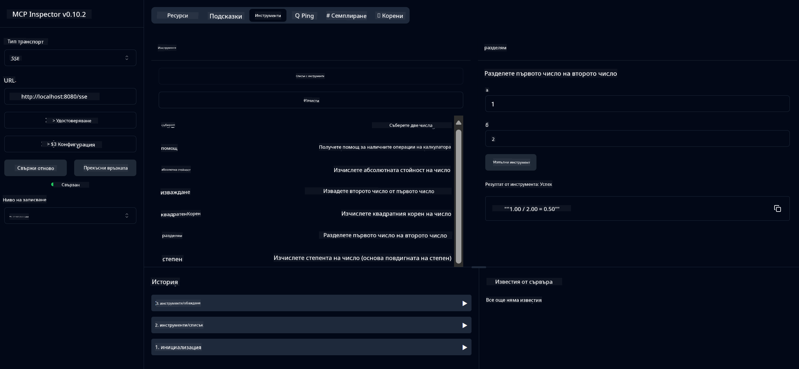

<!--
CO_OP_TRANSLATOR_METADATA:
{
  "original_hash": "ed9cab32cc67c12d8969b407aa47100a",
  "translation_date": "2025-07-13T17:56:40+00:00",
  "source_file": "03-GettingStarted/01-first-server/solution/java/README.md",
  "language_code": "bg"
}
-->
# Основна услуга за калкулатор MCP

Тази услуга предоставя основни калкулаторни операции чрез Model Context Protocol (MCP) с използване на Spring Boot и WebFlux транспорт. Тя е създадена като прост пример за начинаещи, които се запознават с имплементациите на MCP.

За повече информация вижте справочната документация за [MCP Server Boot Starter](https://docs.spring.io/spring-ai/reference/api/mcp/mcp-server-boot-starter-docs.html).


## Използване на услугата

Услугата предоставя следните API крайни точки чрез MCP протокола:

- `add(a, b)`: Събира две числа
- `subtract(a, b)`: Изважда второто число от първото
- `multiply(a, b)`: Умножава две числа
- `divide(a, b)`: Деление на първото число на второто (с проверка за нула)
- `power(base, exponent)`: Изчислява степен на число
- `squareRoot(number)`: Изчислява квадратен корен (с проверка за отрицателно число)
- `modulus(a, b)`: Изчислява остатъка при деление
- `absolute(number)`: Изчислява абсолютната стойност

## Зависимости

Проектът изисква следните основни зависимости:

```xml
<dependency>
    <groupId>org.springframework.ai</groupId>
    <artifactId>spring-ai-starter-mcp-server-webflux</artifactId>
</dependency>
```

## Компилиране на проекта

Компилирайте проекта с Maven:
```bash
./mvnw clean install -DskipTests
```

## Стартиране на сървъра

### Използване на Java

```bash
java -jar target/calculator-server-0.0.1-SNAPSHOT.jar
```

### Използване на MCP Inspector

MCP Inspector е полезен инструмент за взаимодействие с MCP услуги. За да го използвате с тази калкулаторна услуга:

1. **Инсталирайте и стартирайте MCP Inspector** в нов терминален прозорец:
   ```bash
   npx @modelcontextprotocol/inspector
   ```

2. **Достъп до уеб интерфейса** като кликнете на URL адреса, показан от приложението (обикновено http://localhost:6274)

3. **Конфигурирайте връзката**:
   - Задайте типа транспорт на "SSE"
   - Задайте URL адреса към SSE крайна точка на работещия сървър: `http://localhost:8080/sse`
   - Натиснете "Connect"

4. **Използвайте инструментите**:
   - Кликнете "List Tools", за да видите наличните калкулаторни операции
   - Изберете инструмент и натиснете "Run Tool", за да изпълните операция



**Отказ от отговорност**:  
Този документ е преведен с помощта на AI преводаческа услуга [Co-op Translator](https://github.com/Azure/co-op-translator). Въпреки че се стремим към точност, моля, имайте предвид, че автоматизираните преводи могат да съдържат грешки или неточности. Оригиналният документ на неговия роден език трябва да се счита за авторитетен източник. За критична информация се препоръчва професионален човешки превод. Ние не носим отговорност за каквито и да е недоразумения или неправилни тълкувания, произтичащи от използването на този превод.