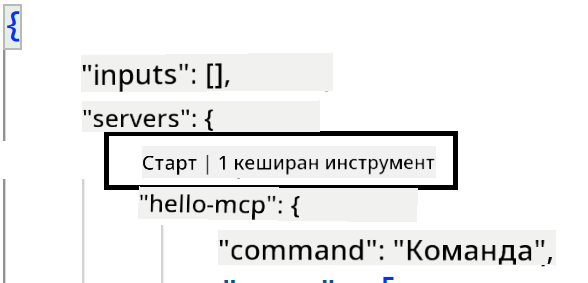
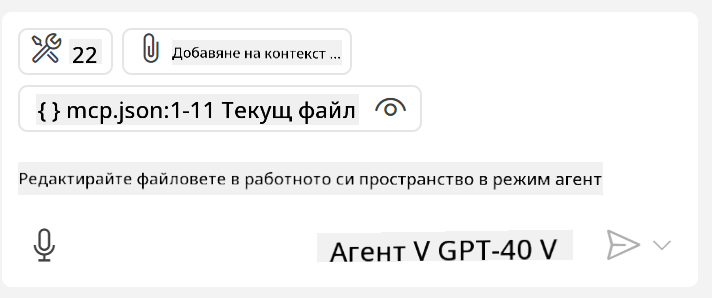

<!--
CO_OP_TRANSLATOR_METADATA:
{
  "original_hash": "c37fabfbc0dcbc9a4afb6d17e7d3be9f",
  "translation_date": "2025-05-17T11:16:15+00:00",
  "source_file": "03-GettingStarted/04-vscode/README.md",
  "language_code": "bg"
}
-->
Нека поговорим повече за това как използваме визуалния интерфейс в следващите секции.

## Подход

Ето как трябва да подходите на високо ниво:

- Конфигурирайте файл, за да намерите вашия MCP сървър.
- Стартирайте/Свържете се със сървъра, за да получите списък с неговите възможности.
- Използвайте тези възможности чрез интерфейса за чат на GitHub Copilot.

Чудесно, сега когато разбираме потока, нека се опитаме да използваме MCP сървър чрез Visual Studio Code чрез упражнение.

## Упражнение: Консумиране на сървър

В това упражнение ще конфигурираме Visual Studio Code, за да намерим вашия MCP сървър, така че да може да бъде използван от интерфейса за чат на GitHub Copilot.

### -0- Предварителна стъпка, активирайте откриването на MCP сървъри

Може да се наложи да активирате откриването на MCP сървъри.

1. Отидете на `File -> Preferences -> Settings` in Visual Studio Code.

1. Search for "MCP" and enable `chat.mcp.discovery.enabled` в файла settings.json.

### -1- Създайте конфигурационен файл

Започнете със създаването на конфигурационен файл в корена на вашия проект, ще ви трябва файл, наречен MCP.json и да го поставите в папка, наречена .vscode. Трябва да изглежда така:

```text
.vscode
|-- mcp.json
```

След това, нека видим как можем да добавим запис на сървър.

### -2- Конфигурирайте сървър

Добавете следното съдържание към *mcp.json*:

```json
{
    "inputs": [],
    "servers": {
       "hello-mcp": {
           "command": "cmd",
           "args": [
               "/c", "node", "<absolute path>\\build\\index.js"
           ]
       }
    }
}
```

Ето прост пример по-горе как да стартирате сървър, написан на Node.js, за други среди посочете правилната команда за стартиране на сървъра, използвайки `command` and `args`.

### -3- Стартирайте сървъра

Сега, когато сте добавили запис, нека стартираме сървъра:

1. Намерете вашия запис в *mcp.json* и се уверете, че намирате иконата "play":

    

1. Кликнете върху иконата "play", трябва да видите как иконата на инструментите в чата на GitHub Copilot увеличава броя на наличните инструменти. Ако кликнете върху тази икона на инструментите, ще видите списък с регистрирани инструменти. Можете да проверите/размаркирате всеки инструмент в зависимост от това дали искате GitHub Copilot да ги използва като контекст: 

  

1. За да стартирате инструмент, въведете подсказка, която знаете, че ще съвпадне с описанието на един от вашите инструменти, например подсказка като "add 22 to 1":

  

  Трябва да видите отговор, който казва 23.

## Задание

Опитайте да добавите запис на сървър към вашия файл *mcp.json* и се уверете, че можете да стартирате/спирате сървъра. Уверете се също, че можете да комуникирате с инструментите на вашия сървър чрез интерфейса за чат на GitHub Copilot.

## Решение

[Решение](./solution/README.md)

## Основни изводи

Изводите от тази глава са следните:

- Visual Studio Code е чудесен клиент, който ви позволява да консумирате няколко MCP сървъра и техните инструменти.
- Интерфейсът за чат на GitHub Copilot е начинът, по който взаимодействате със сървърите.
- Можете да подканите потребителя за входни данни като API ключове, които могат да бъдат предадени на MCP сървъра при конфигуриране на записа на сървъра в *mcp.json* файл.

## Примери

- [Java Калкулатор](../samples/java/calculator/README.md)
- [.Net Калкулатор](../../../../03-GettingStarted/samples/csharp)
- [JavaScript Калкулатор](../samples/javascript/README.md)
- [TypeScript Калкулатор](../samples/typescript/README.md)
- [Python Калкулатор](../../../../03-GettingStarted/samples/python)

## Допълнителни ресурси

- [Документация на Visual Studio](https://code.visualstudio.com/docs/copilot/chat/mcp-servers)

## Какво следва

- Следва: [Създаване на SSE сървър](/03-GettingStarted/05-sse-server/README.md)

**Отказ от отговорност**:  
Този документ е преведен с помощта на AI услуга за превод [Co-op Translator](https://github.com/Azure/co-op-translator). Докато се стремим към точност, моля, имайте предвид, че автоматизираните преводи може да съдържат грешки или неточности. Оригиналният документ на родния му език трябва да се счита за авторитетен източник. За критична информация се препоръчва професионален човешки превод. Не носим отговорност за недоразумения или погрешни интерпретации, възникнали от използването на този превод.