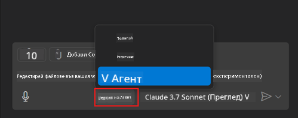
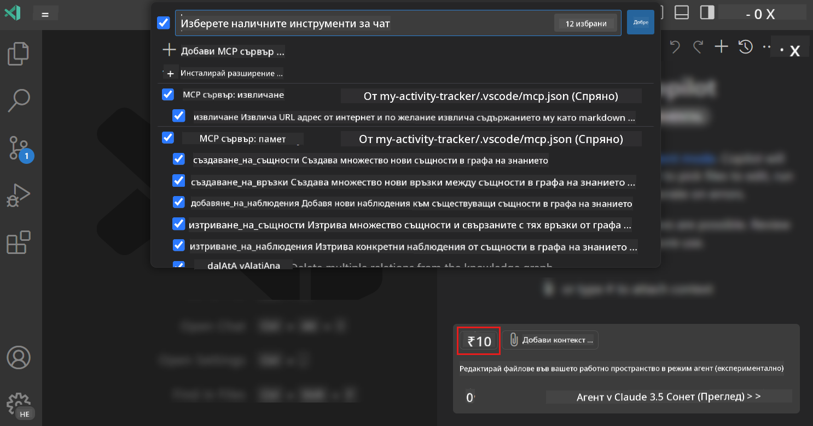
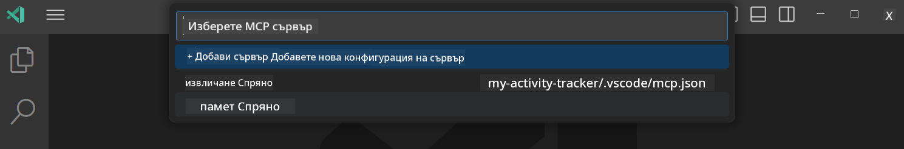
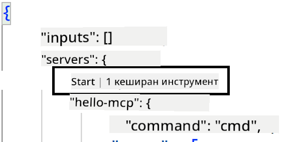
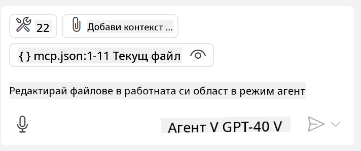
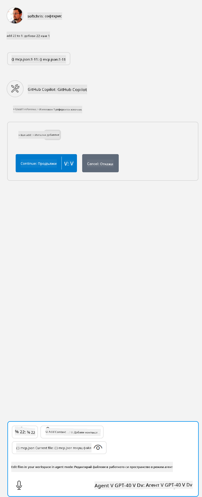

<!--
CO_OP_TRANSLATOR_METADATA:
{
  "original_hash": "8ea28e5e566edd5969337fd0b191ba3f",
  "translation_date": "2025-07-17T11:35:55+00:00",
  "source_file": "03-GettingStarted/04-vscode/README.md",
  "language_code": "bg"
}
-->
# Консумиране на сървър от режим GitHub Copilot Agent

Visual Studio Code и GitHub Copilot могат да действат като клиент и да консумират MCP сървър. Може би се питате защо бихме искали това? Е, това означава, че всички функции, които MCP сървърът предлага, вече могат да се използват директно във вашето IDE. Представете си, че добавяте например MCP сървъра на GitHub – това би позволило да управлявате GitHub чрез подсказки, вместо да въвеждате конкретни команди в терминала. Или пък нещо друго, което да подобри вашето разработваческо преживяване, управлявано изцяло с естествен език. Вече виждате предимствата, нали?

## Преглед

Този урок обяснява как да използвате Visual Studio Code и режима Agent на GitHub Copilot като клиент за вашия MCP сървър.

## Учебни цели

След края на този урок ще можете да:

- Консумирате MCP сървър чрез Visual Studio Code.
- Изпълнявате възможности като инструменти чрез GitHub Copilot.
- Конфигурирате Visual Studio Code да открива и управлява вашия MCP сървър.

## Използване

Можете да управлявате вашия MCP сървър по два начина:

- Чрез потребителския интерфейс, как се прави това ще видите по-нататък в тази глава.
- Чрез терминала, възможно е да управлявате нещата от терминала с изпълнимия файл `code`:

  За да добавите MCP сървър към вашия потребителски профил, използвайте опцията --add-mcp в командния ред и предоставете JSON конфигурацията на сървъра във вида {\"name\":\"server-name\",\"command\":...}.

  ```
  code --add-mcp "{\"name\":\"my-server\",\"command\": \"uvx\",\"args\": [\"mcp-server-fetch\"]}"
  ```

### Скриншотове





Нека поговорим повече за използването на визуалния интерфейс в следващите секции.

## Подход

Ето как трябва да подходим на високо ниво:

- Конфигуриране на файл за откриване на нашия MCP сървър.
- Стартиране/Свързване със сървъра, за да се изброят неговите възможности.
- Използване на тези възможности чрез интерфейса на GitHub Copilot Chat.

Страхотно, сега когато разбираме процеса, нека опитаме да използваме MCP сървър чрез Visual Studio Code с едно упражнение.

## Упражнение: Консумиране на сървър

В това упражнение ще конфигурираме Visual Studio Code да открива вашия MCP сървър, така че да може да се използва чрез интерфейса на GitHub Copilot Chat.

### -0- Предварителна стъпка, активиране на откриването на MCP сървъри

Може да се наложи да активирате откриването на MCP сървъри.

1. Отидете на `File -> Preferences -> Settings` във Visual Studio Code.

1. Потърсете "MCP" и активирайте `chat.mcp.discovery.enabled` в settings.json файла.

### -1- Създаване на конфигурационен файл

Започнете със създаване на конфигурационен файл в корена на проекта, ще ви трябва файл на име MCP.json, който да поставите в папка .vscode. Той трябва да изглежда така:

```text
.vscode
|-- mcp.json
```

След това нека видим как да добавим запис за сървър.

### -2- Конфигуриране на сървър

Добавете следното съдържание в *mcp.json*:

```json
{
    "inputs": [],
    "servers": {
       "hello-mcp": {
           "command": "node",
           "args": [
               "build/index.js"
           ]
       }
    }
}
```

Горният пример показва как да стартирате сървър, написан на Node.js, за други среди посочете правилната команда за стартиране на сървъра чрез `command` и `args`.

### -3- Стартиране на сървъра

След като добавите запис, нека стартираме сървъра:

1. Намерете вашия запис в *mcp.json* и се уверете, че виждате иконата "play":

    

1. Кликнете върху иконата "play", трябва да видите как иконата за инструменти в GitHub Copilot Chat увеличава броя на наличните инструменти. Ако кликнете върху тази икона, ще видите списък с регистрирани инструменти. Можете да маркирате или махнете отметката на всеки инструмент, в зависимост дали искате GitHub Copilot да ги използва като контекст:

  

1. За да използвате инструмент, напишете подсказка, която знаете, че съответства на описанието на някой от вашите инструменти, например подсказка като "add 22 to 1":

  

  Трябва да видите отговор с резултат 23.

## Задача

Опитайте да добавите запис за сървър във вашия *mcp.json* файл и се уверете, че можете да стартирате и спирате сървъра. Също така проверете дали можете да комуникирате с инструментите на сървъра чрез интерфейса на GitHub Copilot Chat.

## Решение

[Solution](./solution/README.md)

## Основни изводи

Основните изводи от тази глава са:

- Visual Studio Code е отличен клиент, който ви позволява да консумирате няколко MCP сървъра и техните инструменти.
- Интерфейсът на GitHub Copilot Chat е начинът, по който взаимодействате със сървърите.
- Можете да искате от потребителя да въведе данни като API ключове, които да се предадат на MCP сървъра при конфигуриране на записа в *mcp.json* файла.

## Примери

- [Java Calculator](../samples/java/calculator/README.md)
- [.Net Calculator](../../../../03-GettingStarted/samples/csharp)
- [JavaScript Calculator](../samples/javascript/README.md)
- [TypeScript Calculator](../samples/typescript/README.md)
- [Python Calculator](../../../../03-GettingStarted/samples/python)

## Допълнителни ресурси

- [Visual Studio docs](https://code.visualstudio.com/docs/copilot/chat/mcp-servers)

## Какво следва

- Следва: [Създаване на SSE сървър](../05-sse-server/README.md)

**Отказ от отговорност**:  
Този документ е преведен с помощта на AI преводаческа услуга [Co-op Translator](https://github.com/Azure/co-op-translator). Въпреки че се стремим към точност, моля, имайте предвид, че автоматизираните преводи могат да съдържат грешки или неточности. Оригиналният документ на неговия роден език трябва да се счита за авторитетен източник. За критична информация се препоръчва професионален човешки превод. Ние не носим отговорност за каквито и да е недоразумения или неправилни тълкувания, произтичащи от използването на този превод.