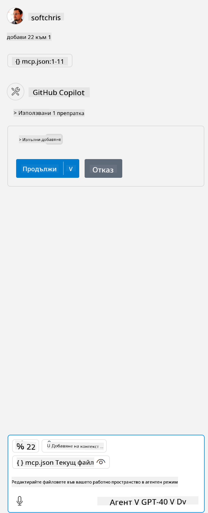

<!--
CO_OP_TRANSLATOR_METADATA:
{
  "original_hash": "96e08a8c1049dab757deb64cce4ea1e8",
  "translation_date": "2025-05-17T11:24:12+00:00",
  "source_file": "03-GettingStarted/04-vscode/solution/README.md",
  "language_code": "bg"
}
-->
# Изпълнение на примера

Тук приемаме, че вече имате работещ код на сървър. Моля, намерете сървър от някой от предишните глави.

## Настройте mcp.json

Ето файл, който използвате за справка, [mcp.json](../../../../../03-GettingStarted/04-vscode/solution/mcp.json).

Променете записа на сървъра според нуждите, за да посочите абсолютния път до вашия сървър, включително необходимата пълна команда за изпълнение.

В примерния файл, посочен по-горе, записът на сървъра изглежда така:

```json
"hello-mcp": {
    "command": "cmd",
    "args": [
        "/c", "node", "<absolute path>\\build\\index.js"
    ]
}
```

Това съответства на изпълнение на команда като тази: `cmd /c node <absolute path>\\build\index.js`. 

- Change this server entry to fit where your server file is located or to what's needed to startup your server depending on your chosen runtime and server location.

## Consume the features in the server

- Click the `play` icon, once you've added *mcp.json* to *./vscode* folder, 

    Observe the tooling icon change to increase the number of available tools. Tooling icon is located right above the chat field in GitHub Copilot.

## Run a tool

- Type a prompt in your chat window that matches the description of your tool. For example to trigger the tool `add` напишете нещо като "добави 3 към 20".

    Трябва да видите инструмент, който се показва над текстовото поле за чат, което ви указва да изберете да стартирате инструмента, както е показано на този визуален елемент:

    

    Изборът на инструмента трябва да произведе числов резултат, казвайки "23", ако вашият подсказка беше както споменахме по-рано.

**Опровержение**:  
Този документ е преведен с помощта на AI услуга за превод [Co-op Translator](https://github.com/Azure/co-op-translator). Въпреки че се стремим към точност, моля, имайте предвид, че автоматизираните преводи може да съдържат грешки или неточности. Оригиналният документ на неговия роден език трябва да се счита за авторитетния източник. За критична информация се препоръчва професионален човешки превод. Не носим отговорност за никакви недоразумения или неправилни тълкувания, произтичащи от използването на този превод.