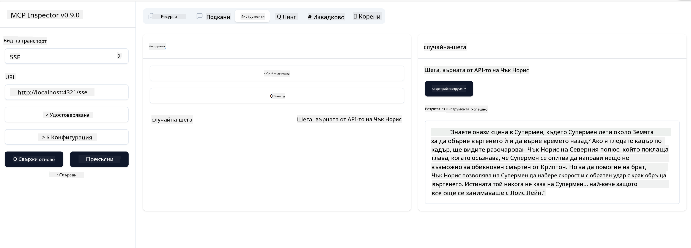

<!--
CO_OP_TRANSLATOR_METADATA:
{
  "original_hash": "0a8086dc4bf89448f83e7936db972c42",
  "translation_date": "2025-05-17T11:43:57+00:00",
  "source_file": "03-GettingStarted/05-sse-server/README.md",
  "language_code": "bg"
}
-->
Сега, когато знаем малко повече за SSE, нека изградим SSE сървър.

## Упражнение: Създаване на SSE сървър

За да създадем нашия сървър, трябва да имаме предвид две неща:

- Трябва да използваме уеб сървър, за да изложим крайни точки за връзка и съобщения.
- Изградете сървъра си както обикновено с инструменти, ресурси и подсказки, когато използвахме stdio.

### -1- Създаване на сървърна инстанция

За да създадем нашия сървър, използваме същите типове както при stdio. Въпреки това, за транспорта трябва да изберем SSE.

Нека добавим необходимите маршрути.

### -2- Добавяне на маршрути

Нека добавим маршрути, които обработват връзката и входящите съобщения:

Нека добавим възможности към сървъра.

### -3- Добавяне на сървърни възможности

Сега, когато сме дефинирали всичко специфично за SSE, нека добавим сървърни възможности като инструменти, подсказки и ресурси.

Вашият пълен код трябва да изглежда така:

Чудесно, имаме сървър, използващ SSE, нека го изпробваме.

## Упражнение: Дебъгване на SSE сървър с Inspector

Inspector е страхотен инструмент, който видяхме в предишен урок [Създаване на първия ви сървър](/03-GettingStarted/01-first-server/README.md). Нека видим дали можем да използваме Inspector и тук:

### -1- Стартиране на Inspector

За да стартирате Inspector, първо трябва да имате работещ SSE сървър, така че нека направим това:

1. Стартирайте сървъра

1. Стартирайте Inspector

    > ![NOTE]
    > Стартирайте това в отделен прозорец на терминала, отколкото сървърът работи. Също така обърнете внимание, че трябва да коригирате долната команда, за да съответства на URL адреса, където работи вашият сървър.

    ```sh
    npx @modelcontextprotocol/inspector --cli http://localhost:8000/sse --method tools/list
    ```

    Стартирането на Inspector изглежда същото във всички среди. Обърнете внимание как вместо да подаваме път към нашия сървър и команда за стартиране на сървъра, вместо това подаваме URL адреса, където сървърът работи и също така уточняваме маршрута `/sse`.

### -2- Изпробване на инструмента

Свържете сървъра, като изберете SSE в падащия списък и попълнете полето за URL адрес, където вашият сървър работи, например http:localhost:4321/sse. Сега кликнете върху бутона "Connect". Както преди, изберете да изброите инструменти, изберете инструмент и предоставете входни стойности. Трябва да видите резултат като по-долу:



Чудесно, можете да работите с Inspector, нека видим как можем да работим с Visual Studio Code.

## Задача

Опитайте да изградите сървъра си с повече възможности. Вижте [тази страница](https://api.chucknorris.io/), за да добавите инструмент, който извиква API, вие решавате как да изглежда сървърът. Забавлявайте се :)

## Решение

[Решение](./solution/README.md) Ето възможно решение с работещ код.

## Основни изводи

Изводите от тази глава са следните:

- SSE е вторият поддържан транспорт след stdio.
- За да поддържате SSE, трябва да управлявате входящи връзки и съобщения с помощта на уеб рамка.
- Можете да използвате както Inspector, така и Visual Studio Code, за да консумирате SSE сървър, точно като stdio сървъри. Обърнете внимание как се различава малко между stdio и SSE. За SSE трябва да стартирате сървъра отделно и след това да стартирате вашия инструмент за инспекция. За инструмента за инспекция има и някои различия в това, че трябва да уточните URL адреса.

## Примери

- [Java Calculator](../samples/java/calculator/README.md)
- [.Net Calculator](../../../../03-GettingStarted/samples/csharp)
- [JavaScript Calculator](../samples/javascript/README.md)
- [TypeScript Calculator](../samples/typescript/README.md)
- [Python Calculator](../../../../03-GettingStarted/samples/python)

## Допълнителни ресурси

- [SSE](https://developer.mozilla.org/en-US/docs/Web/API/Server-sent_events)

## Какво следва

- Следващо: [Започване с AI Toolkit за VSCode](/03-GettingStarted/06-aitk/README.md)

**Отказ от отговорност**:  
Този документ е преведен с помощта на AI услуга за превод [Co-op Translator](https://github.com/Azure/co-op-translator). Въпреки че се стремим към точност, моля, имайте предвид, че автоматичните преводи могат да съдържат грешки или неточности. Оригиналният документ на неговия роден език трябва да се счита за авторитетен източник. За критична информация се препоръчва професионален човешки превод. Ние не носим отговорност за каквито и да било недоразумения или погрешни тълкувания, произтичащи от използването на този превод.