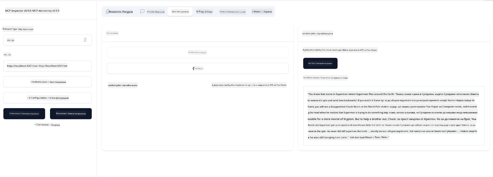

<!--
CO_OP_TRANSLATOR_METADATA:
{
  "original_hash": "3dd2f1e39277c31b0e57e29d165354d6",
  "translation_date": "2025-06-13T01:10:47+00:00",
  "source_file": "03-GettingStarted/05-sse-server/README.md",
  "language_code": "bg"
}
-->
Сега, когато знаем малко повече за SSE, нека след това създадем SSE сървър.

## Упражнение: Създаване на SSE сървър

За да създадем сървъра, трябва да имаме предвид две неща:

- Трябва да използваме уеб сървър, който да предоставя крайни точки за връзка и съобщения.
- Да изградим сървъра си както обикновено с инструменти, ресурси и подсказки, както правехме с stdio.

### -1- Създаване на инстанция на сървър

За да създадем сървъра, използваме същите типове като при stdio. Въпреки това, за транспорта трябва да изберем SSE.

---

Нека добавим необходимите маршрути.

### -2- Добавяне на маршрути

Нека добавим маршрути, които обработват връзката и входящите съобщения:

---

Сега нека добавим възможности на сървъра.

### -3- Добавяне на възможности на сървъра

След като сме дефинирали всичко специфично за SSE, нека добавим възможности като инструменти, подсказки и ресурси.

---

Целият ви код трябва да изглежда така:

---

Страхотно, имаме сървър, използващ SSE, нека го изпробваме сега.

## Упражнение: Отстраняване на грешки на SSE сървър с Inspector

Inspector е страхотен инструмент, който видяхме в предишен урок [Създаване на първия ви сървър](/03-GettingStarted/01-first-server/README.md). Нека видим дали можем да използваме Inspector и тук:

### -1- Стартиране на Inspector

За да стартирате Inspector, първо трябва да имате работещ SSE сървър, така че нека направим това:

1. Стартирайте сървъра

---

1. Стартирайте Inspector

    > ![NOTE]
    > Стартирайте това в отделен терминален прозорец от този, в който работи сървърът. Също така имайте предвид, че трябва да коригирате командата по-долу, за да съответства на URL адреса, на който работи вашият сървър.

    ```sh
    npx @modelcontextprotocol/inspector --cli http://localhost:8000/sse --method tools/list
    ```

    Стартирането на Inspector изглежда еднакво във всички среди за изпълнение. Забележете, че вместо да подаваме път към нашия сървър и команда за стартирането му, подаваме URL адреса, на който сървърът работи, и посочваме маршрута `/sse`.

### -2- Изпробване на инструмента

Свържете се със сървъра, като изберете SSE от падащото меню и попълните полето за URL адрес, където работи вашият сървър, например http://localhost:4321/sse. След това натиснете бутона "Connect". Както преди, изберете да изброите инструментите, изберете инструмент и въведете стойности за вход. Трябва да видите резултат като този по-долу:



Страхотно, успяхте да работите с Inspector, нека видим как можем да работим с Visual Studio Code след това.

## Задача

Опитайте да разширите сървъра си с повече възможности. Вижте [тази страница](https://api.chucknorris.io/) за пример, за да добавите инструмент, който извиква API – вие решавате как да изглежда сървърът. Забавлявайте се :)

## Решение

[Решение](./solution/README.md) Ето едно възможно решение с работещ код.

## Основни изводи

Основните изводи от тази глава са следните:

- SSE е вторият поддържан транспорт след stdio.
- За да поддържате SSE, трябва да управлявате входящите връзки и съобщения чрез уеб фреймуърк.
- Можете да използвате както Inspector, така и Visual Studio Code за консумиране на SSE сървър, както при stdio сървърите. Забележете, че има малки разлики между stdio и SSE. При SSE трябва да стартирате сървъра отделно и след това да стартирате Inspector инструмента. При Inspector има и разлики в това, че трябва да посочите URL адреса.

## Примери

- [Java Calculator](../samples/java/calculator/README.md)
- [.Net Calculator](../../../../03-GettingStarted/samples/csharp)
- [JavaScript Calculator](../samples/javascript/README.md)
- [TypeScript Calculator](../samples/typescript/README.md)
- [Python Calculator](../../../../03-GettingStarted/samples/python)

## Допълнителни ресурси

- [SSE](https://developer.mozilla.org/en-US/docs/Web/API/Server-sent_events)

## Какво следва

- Следва: [HTTP стрийминг с MCP (Streamable HTTP)](/03-GettingStarted/06-http-streaming/README.md)

**Отказ от отговорност**:  
Този документ е преведен с помощта на AI преводаческа услуга [Co-op Translator](https://github.com/Azure/co-op-translator). Въпреки че се стремим към точност, моля, имайте предвид, че автоматизираните преводи могат да съдържат грешки или неточности. Оригиналният документ на неговия роден език трябва да се счита за авторитетен източник. За критична информация се препоръчва професионален човешки превод. Ние не носим отговорност за никакви недоразумения или неправилни тълкувания, възникнали от използването на този превод.