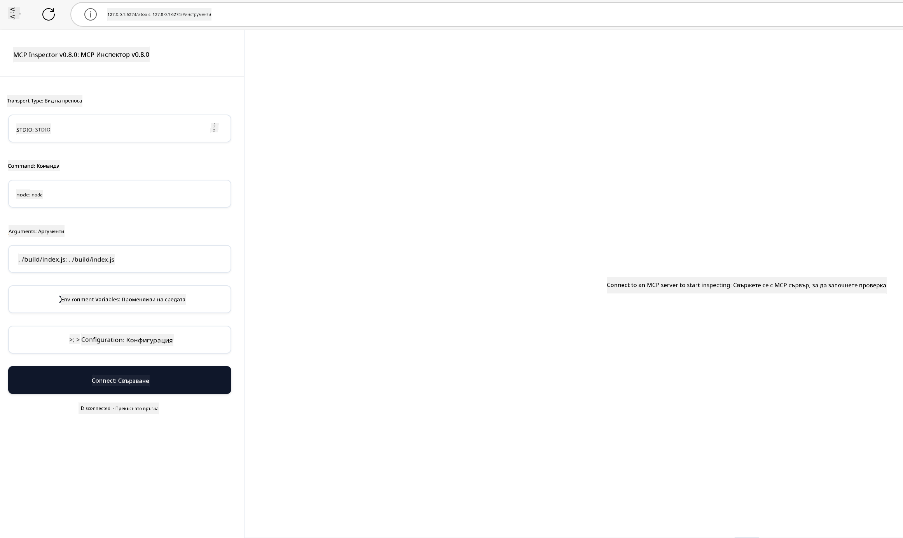

<!--
CO_OP_TRANSLATOR_METADATA:
{
  "original_hash": "4e34e34e84f013e73c7eaa6d09884756",
  "translation_date": "2025-07-13T22:03:58+00:00",
  "source_file": "03-GettingStarted/08-testing/README.md",
  "language_code": "bg"
}
-->
## Тестване и Отстраняване на Грешки

Преди да започнете да тествате вашия MCP сървър, е важно да разберете наличните инструменти и добрите практики за отстраняване на грешки. Ефективното тестване гарантира, че сървърът ви работи както се очаква и ви помага бързо да идентифицирате и разрешите проблеми. Следващият раздел описва препоръчителни подходи за валидиране на вашата MCP имплементация.

## Преглед

Този урок обхваща как да изберете правилния подход за тестване и най-ефективния инструмент за тестване.

## Учебни Цели

Към края на този урок ще можете да:

- Описвате различни подходи за тестване.
- Използвате различни инструменти за ефективно тестване на вашия код.

## Тестване на MCP Сървъри

MCP предоставя инструменти, които да ви помогнат да тествате и отстранявате грешки в сървърите си:

- **MCP Inspector**: Инструмент за команден ред, който може да се използва както като CLI инструмент, така и като визуален инструмент.
- **Ръчно тестване**: Можете да използвате инструмент като curl за изпълнение на уеб заявки, но всеки инструмент, който поддържа HTTP, ще свърши работа.
- **Unit testing**: Възможно е да използвате предпочитаната от вас тестова рамка, за да тествате функциите както на сървъра, така и на клиента.

### Използване на MCP Inspector

В предишни уроци описахме използването на този инструмент, но нека го разгледаме накратко. Това е инструмент, изграден на Node.js, който можете да използвате чрез извикване на изпълнимия файл `npx`. Той ще изтегли и инсталира инструмента временно и ще го почисти след като приключи с изпълнението на вашата заявка.

[MCP Inspector](https://github.com/modelcontextprotocol/inspector) ви помага да:

- **Откривате възможностите на сървъра**: Автоматично разпознава наличните ресурси, инструменти и подсказки
- **Тествате изпълнението на инструменти**: Пробвайте различни параметри и вижте отговорите в реално време
- **Преглеждате метаданни на сървъра**: Изследвайте информация за сървъра, схеми и конфигурации

Типичното стартиране на инструмента изглежда така:

```bash
npx @modelcontextprotocol/inspector node build/index.js
```

Горната команда стартира MCP и неговия визуален интерфейс и отваря локален уеб интерфейс в браузъра ви. Можете да очаквате табло, показващо регистрираните MCP сървъри, наличните им инструменти, ресурси и подсказки. Интерфейсът ви позволява интерактивно да тествате изпълнението на инструменти, да инспектирате метаданните на сървъра и да виждате отговорите в реално време, което улеснява валидирането и отстраняването на грешки в имплементациите на MCP сървъра.

Ето как може да изглежда: 

Можете също да стартирате този инструмент в CLI режим, като добавите атрибута `--cli`. Ето пример за стартиране на инструмента в "CLI" режим, който изброява всички инструменти на сървъра:

```sh
npx @modelcontextprotocol/inspector --cli node build/index.js --method tools/list
```

### Ръчно Тестване

Освен използването на инструмента inspector за тестване на възможностите на сървъра, друг подобен подход е да използвате клиент, който поддържа HTTP, например curl.

С curl можете директно да тествате MCP сървъри чрез HTTP заявки:

```bash
# Example: Test server metadata
curl http://localhost:3000/v1/metadata

# Example: Execute a tool
curl -X POST http://localhost:3000/v1/tools/execute \
  -H "Content-Type: application/json" \
  -d '{"name": "calculator", "parameters": {"expression": "2+2"}}'
```

Както виждате от горния пример с curl, използвате POST заявка, за да извикате инструмент, като изпращате полезен товар, съдържащ името на инструмента и неговите параметри. Изберете подхода, който ви е най-удобен. CLI инструментите обикновено са по-бързи за използване и могат лесно да се скриптират, което е полезно в CI/CD среди.

### Unit Testing

Създайте unit тестове за вашите инструменти и ресурси, за да сте сигурни, че работят както се очаква. Ето примерен тестов код.

```python
import pytest

from mcp.server.fastmcp import FastMCP
from mcp.shared.memory import (
    create_connected_server_and_client_session as create_session,
)

# Mark the whole module for async tests
pytestmark = pytest.mark.anyio


async def test_list_tools_cursor_parameter():
    """Test that the cursor parameter is accepted for list_tools.

    Note: FastMCP doesn't currently implement pagination, so this test
    only verifies that the cursor parameter is accepted by the client.
    """

 server = FastMCP("test")

    # Create a couple of test tools
    @server.tool(name="test_tool_1")
    async def test_tool_1() -> str:
        """First test tool"""
        return "Result 1"

    @server.tool(name="test_tool_2")
    async def test_tool_2() -> str:
        """Second test tool"""
        return "Result 2"

    async with create_session(server._mcp_server) as client_session:
        # Test without cursor parameter (omitted)
        result1 = await client_session.list_tools()
        assert len(result1.tools) == 2

        # Test with cursor=None
        result2 = await client_session.list_tools(cursor=None)
        assert len(result2.tools) == 2

        # Test with cursor as string
        result3 = await client_session.list_tools(cursor="some_cursor_value")
        assert len(result3.tools) == 2

        # Test with empty string cursor
        result4 = await client_session.list_tools(cursor="")
        assert len(result4.tools) == 2
    
```

Горният код прави следното:

- Използва pytest рамка, която ви позволява да създавате тестове като функции и да използвате assert изрази.
- Създава MCP сървър с два различни инструмента.
- Използва `assert` израз, за да провери дали определени условия са изпълнени.

Вижте [пълния файл тук](https://github.com/modelcontextprotocol/python-sdk/blob/main/tests/client/test_list_methods_cursor.py)

С помощта на този файл можете да тествате собствения си сървър, за да се уверите, че възможностите са създадени както трябва.

Всички основни SDK-та имат подобни секции за тестване, така че можете да ги адаптирате към избраната от вас среда за изпълнение.

## Примери

- [Java Calculator](../samples/java/calculator/README.md)
- [.Net Calculator](../../../../03-GettingStarted/samples/csharp)
- [JavaScript Calculator](../samples/javascript/README.md)
- [TypeScript Calculator](../samples/typescript/README.md)
- [Python Calculator](../../../../03-GettingStarted/samples/python)

## Допълнителни Ресурси

- [Python SDK](https://github.com/modelcontextprotocol/python-sdk)

## Какво Следва

- Следва: [Deployment](../09-deployment/README.md)

**Отказ от отговорност**:  
Този документ е преведен с помощта на AI преводаческа услуга [Co-op Translator](https://github.com/Azure/co-op-translator). Въпреки че се стремим към точност, моля, имайте предвид, че автоматизираните преводи могат да съдържат грешки или неточности. Оригиналният документ на неговия роден език трябва да се счита за авторитетен източник. За критична информация се препоръчва професионален човешки превод. Ние не носим отговорност за каквито и да е недоразумения или неправилни тълкувания, произтичащи от използването на този превод.