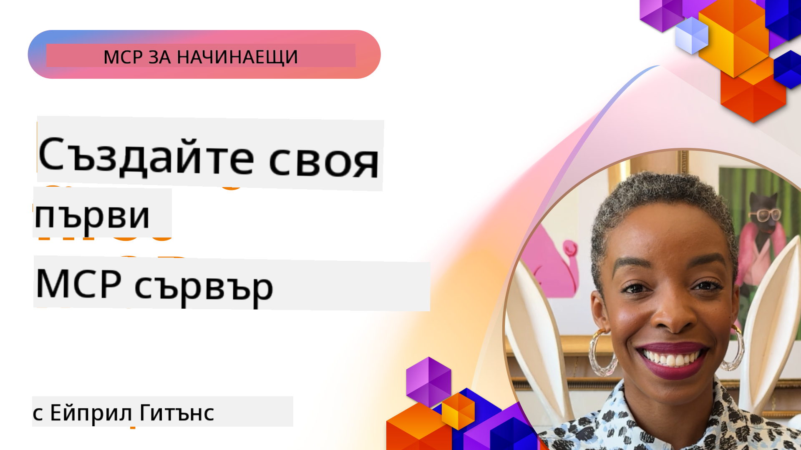

<!--
CO_OP_TRANSLATOR_METADATA:
{
  "original_hash": "1197b6dbde36773e04a5ae826557fdb9",
  "translation_date": "2025-08-26T18:19:34+00:00",
  "source_file": "03-GettingStarted/README.md",
  "language_code": "bg"
}
-->
## Първи стъпки  

_(Кликнете върху изображението по-горе, за да гледате видеото на този урок)_

Тази секция се състои от няколко урока:

- **1 Вашият първи сървър**. В този първи урок ще научите как да създадете първия си сървър и да го инспектирате с инструмента за инспекция – ценен начин за тестване и дебъгване на вашия сървър, [към урока](01-first-server/README.md)

- **2 Клиент**. В този урок ще научите как да напишете клиент, който може да се свърже с вашия сървър, [към урока](02-client/README.md)

- **3 Клиент с LLM**. Още по-добър начин за писане на клиент е като добавите LLM, който може да "преговаря" с вашия сървър какво да прави, [към урока](03-llm-client/README.md)

- **4 Консумиране на сървър в режим GitHub Copilot Agent в Visual Studio Code**. Тук разглеждаме как да стартираме нашия MCP сървър директно от Visual Studio Code, [към урока](04-vscode/README.md)

- **5 stdio Transport Server**. stdio транспортът е препоръчаният стандарт за комуникация между MCP сървър и клиент според текущата спецификация, осигуряващ сигурна комуникация на базата на подпроцеси, [към урока](05-stdio-server/README.md)

- **6 HTTP стрийминг с MCP (Streamable HTTP)**. Научете за модерния HTTP стрийминг, известия за прогрес и как да имплементирате мащабируеми, реалновремеви MCP сървъри и клиенти, използвайки Streamable HTTP, [към урока](06-http-streaming/README.md)

- **7 Използване на AI Toolkit за VSCode** за консумиране и тестване на вашите MCP клиенти и сървъри, [към урока](07-aitk/README.md)

- **8 Тестване**. Тук ще се фокусираме върху различни начини за тестване на вашия сървър и клиент, [към урока](08-testing/README.md)

- **9 Деплоймънт**. Тази глава ще разгледа различни начини за деплойване на вашите MCP решения, [към урока](09-deployment/README.md)

Model Context Protocol (MCP) е отворен протокол, който стандартизира начина, по който приложенията предоставят контекст на LLMs. Мислете за MCP като за USB-C порт за AI приложения – той предоставя стандартизиран начин за свързване на AI модели с различни източници на данни и инструменти.

## Цели на обучението

До края на този урок ще можете:

- Да настроите среди за разработка за MCP на C#, Java, Python, TypeScript и JavaScript
- Да изградите и деплойнете базови MCP сървъри с персонализирани функции (ресурси, подсказки и инструменти)
- Да създадете хост приложения, които се свързват с MCP сървъри
- Да тествате и дебъгвате MCP имплементации
- Да разберете често срещани предизвикателства при настройка и техните решения
- Да свържете вашите MCP имплементации с популярни LLM услуги

## Настройка на вашата MCP среда

Преди да започнете работа с MCP, е важно да подготвите вашата среда за разработка и да разберете основния работен процес. Тази секция ще ви насочи през началните стъпки за настройка, за да осигурите плавен старт с MCP.

### Предварителни изисквания

Преди да се потопите в разработката с MCP, уверете се, че разполагате с:

- **Среда за разработка**: За избрания от вас език (C#, Java, Python, TypeScript или JavaScript)
- **IDE/Редактор**: Visual Studio, Visual Studio Code, IntelliJ, Eclipse, PyCharm или друг модерен редактор на код
- **Мениджъри на пакети**: NuGet, Maven/Gradle, pip или npm/yarn
- **API ключове**: За всякакви AI услуги, които планирате да използвате във вашите хост приложения

### Официални SDKs

В следващите глави ще видите решения, изградени с Python, TypeScript, Java и .NET. Ето всички официално поддържани SDKs.

MCP предоставя официални SDKs за множество езици:
- [C# SDK](https://github.com/modelcontextprotocol/csharp-sdk) - Поддържан в сътрудничество с Microsoft
- [Java SDK](https://github.com/modelcontextprotocol/java-sdk) - Поддържан в сътрудничество със Spring AI
- [TypeScript SDK](https://github.com/modelcontextprotocol/typescript-sdk) - Официалната имплементация за TypeScript
- [Python SDK](https://github.com/modelcontextprotocol/python-sdk) - Официалната имплементация за Python
- [Kotlin SDK](https://github.com/modelcontextprotocol/kotlin-sdk) - Официалната имплементация за Kotlin
- [Swift SDK](https://github.com/modelcontextprotocol/swift-sdk) - Поддържан в сътрудничество с Loopwork AI
- [Rust SDK](https://github.com/modelcontextprotocol/rust-sdk) - Официалната имплементация за Rust

## Основни изводи

- Настройката на MCP среда за разработка е лесна с езиково-специфични SDKs
- Изграждането на MCP сървъри включва създаване и регистриране на инструменти с ясни схеми
- MCP клиентите се свързват със сървъри и модели, за да използват разширени възможности
- Тестването и дебъгването са от съществено значение за надеждни MCP имплементации
- Опциите за деплоймънт варират от локална разработка до облачни решения

## Практика

Разполагаме с набор от примери, които допълват упражненията, които ще видите във всички глави на тази секция. Освен това всяка глава има свои собствени упражнения и задачи.

- [Java Калкулатор](./samples/java/calculator/README.md)
- [.Net Калкулатор](../../../03-GettingStarted/samples/csharp)
- [JavaScript Калкулатор](./samples/javascript/README.md)
- [TypeScript Калкулатор](./samples/typescript/README.md)
- [Python Калкулатор](../../../03-GettingStarted/samples/python)

## Допълнителни ресурси

- [Създаване на агенти с Model Context Protocol на Azure](https://learn.microsoft.com/azure/developer/ai/intro-agents-mcp)
- [Дистанционен MCP с Azure Container Apps (Node.js/TypeScript/JavaScript)](https://learn.microsoft.com/samples/azure-samples/mcp-container-ts/mcp-container-ts/)
- [.NET OpenAI MCP Agent](https://learn.microsoft.com/samples/azure-samples/openai-mcp-agent-dotnet/openai-mcp-agent-dotnet/)

## Какво следва

Следва: [Създаване на вашия първи MCP сървър](01-first-server/README.md)

---

**Отказ от отговорност**:  
Този документ е преведен с помощта на AI услуга за превод [Co-op Translator](https://github.com/Azure/co-op-translator). Въпреки че се стремим към точност, моля, имайте предвид, че автоматизираните преводи може да съдържат грешки или неточности. Оригиналният документ на неговия роден език трябва да се счита за авторитетен източник. За критична информация се препоръчва професионален човешки превод. Ние не носим отговорност за недоразумения или погрешни интерпретации, произтичащи от използването на този превод.