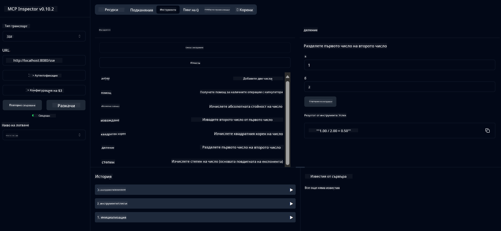

<!--
CO_OP_TRANSLATOR_METADATA:
{
  "original_hash": "13231e9951b68efd9df8c56bd5cdb27e",
  "translation_date": "2025-05-17T13:18:12+00:00",
  "source_file": "03-GettingStarted/samples/java/calculator/README.md",
  "language_code": "bg"
}
-->
# Основна услуга за калкулатор MCP

Тази услуга предоставя основни операции на калкулатор чрез Model Context Protocol (MCP), използвайки Spring Boot с WebFlux транспорт. Тя е проектирана като прост пример за начинаещи, които учат за MCP имплементации.

За повече информация вижте референтната документация на [MCP Server Boot Starter](https://docs.spring.io/spring-ai/reference/api/mcp/mcp-server-boot-starter-docs.html).

## Преглед

Услугата демонстрира:
- Поддръжка за SSE (Server-Sent Events)
- Автоматична регистрация на инструменти чрез `@Tool` анотацията на Spring AI
- Основни функции на калкулатора:
  - Събиране, изваждане, умножение, деление
  - Изчисляване на степен и квадратен корен
  - Модул (остатък) и абсолютна стойност
  - Функция за помощ за описания на операции

## Характеристики

Тази услуга за калкулатор предлага следните възможности:

1. **Основни аритметични операции**:
   - Събиране на две числа
   - Изваждане на едно число от друго
   - Умножение на две числа
   - Деление на едно число с друго (с проверка за деление на нула)

2. **Разширени операции**:
   - Изчисляване на степен (повдигане на база до степен)
   - Изчисляване на квадратен корен (с проверка за отрицателно число)
   - Изчисляване на модул (остатък)
   - Изчисляване на абсолютна стойност

3. **Система за помощ**:
   - Вградена функция за помощ, обясняваща всички налични операции

## Използване на услугата

Услугата предоставя следните API крайни точки чрез MCP протокола:

- `add(a, b)`: Събиране на две числа
- `subtract(a, b)`: Изваждане на второто число от първото
- `multiply(a, b)`: Умножение на две числа
- `divide(a, b)`: Деление на първото число с второто (с проверка за нула)
- `power(base, exponent)`: Изчисляване на степен на число
- `squareRoot(number)`: Изчисляване на квадратен корен (с проверка за отрицателно число)
- `modulus(a, b)`: Изчисляване на остатък при деление
- `absolute(number)`: Изчисляване на абсолютна стойност
- `help()`: Получаване на информация за наличните операции

## Тестов клиент

Включен е прост тестов клиент в `com.microsoft.mcp.sample.client` пакет. `SampleCalculatorClient` класът демонстрира наличните операции на услугата за калкулатор.

## Използване на LangChain4j клиент

Проектът включва примерен клиент LangChain4j в `com.microsoft.mcp.sample.client.LangChain4jClient`, който демонстрира как да интегрирате услугата за калкулатор с LangChain4j и GitHub модели:

### Предпоставки

1. **Настройка на GitHub токен**:
   
   За да използвате AI моделите на GitHub (като phi-4), ви е необходим GitHub персонален достъп токен:

   a. Отидете на настройките на вашия GitHub акаунт: https://github.com/settings/tokens
   
   b. Кликнете "Generate new token" → "Generate new token (classic)"
   
   c. Дайте на вашия токен описателно име
   
   d. Изберете следните обхвати:
      - `repo` (Пълен контрол на частни хранилища)
      - `read:org` (Четене на членство в организации и екипи, четене на проекти на организации)
      - `gist` (Създаване на гистове)
      - `user:email` (Достъп до имейл адреси на потребители (само за четене))
   
   e. Кликнете "Generate token" и копирайте вашия нов токен
   
   f. Настройте го като променлива на околната среда:
      
      На Windows:
      ```
      set GITHUB_TOKEN=your-github-token
      ```
      
      На macOS/Linux:
      ```bash
      export GITHUB_TOKEN=your-github-token
      ```

   g. За постоянна настройка, добавете го към променливите на околната среда чрез системните настройки

2. Добавете зависимостта LangChain4j GitHub към вашия проект (вече включена в pom.xml):
   ```xml
   <dependency>
       <groupId>dev.langchain4j</groupId>
       <artifactId>langchain4j-github</artifactId>
       <version>${langchain4j.version}</version>
   </dependency>
   ```

3. Уверете се, че сървърът на калкулатора работи на `localhost:8080`

### Стартиране на LangChain4j клиент

Този пример демонстрира:
- Свързване към сървъра на калкулатора MCP чрез SSE транспорт
- Използване на LangChain4j за създаване на чат бот, който използва операциите на калкулатора
- Интеграция с AI модели на GitHub (сега използващ phi-4 модел)

Клиентът изпраща следните примерни запитвания за демонстрация на функционалността:
1. Изчисляване на сумата на две числа
2. Намиране на квадратния корен на число
3. Получаване на информация за наличните операции на калкулатора

Стартирайте примера и проверете конзолния изход, за да видите как AI моделът използва инструментите на калкулатора за отговор на запитвания.

### Конфигурация на GitHub модел

LangChain4j клиентът е конфигуриран да използва GitHub phi-4 модел със следните настройки:

```java
ChatLanguageModel model = GitHubChatModel.builder()
    .apiKey(System.getenv("GITHUB_TOKEN"))
    .timeout(Duration.ofSeconds(60))
    .modelName("phi-4")
    .logRequests(true)
    .logResponses(true)
    .build();
```

За да използвате различни GitHub модели, просто променете параметъра `modelName` на друг поддържан модел (например "claude-3-haiku-20240307", "llama-3-70b-8192" и т.н.).

## Зависимости

Проектът изисква следните ключови зависимости:

```xml
<!-- For MCP Server -->
<dependency>
    <groupId>org.springframework.ai</groupId>
    <artifactId>spring-ai-starter-mcp-server-webflux</artifactId>
</dependency>

<!-- For LangChain4j integration -->
<dependency>
    <groupId>dev.langchain4j</groupId>
    <artifactId>langchain4j-mcp</artifactId>
    <version>${langchain4j.version}</version>
</dependency>

<!-- For GitHub models support -->
<dependency>
    <groupId>dev.langchain4j</groupId>
    <artifactId>langchain4j-github</artifactId>
    <version>${langchain4j.version}</version>
</dependency>
```

## Създаване на проекта

Създайте проекта, използвайки Maven:
```bash
./mvnw clean install -DskipTests
```

## Стартиране на сървъра

### Използване на Java

```bash
java -jar target/calculator-server-0.0.1-SNAPSHOT.jar
```

### Използване на MCP Inspector

MCP Inspector е полезен инструмент за взаимодействие с MCP услуги. За да го използвате с тази услуга за калкулатор:

1. **Инсталирайте и стартирайте MCP Inspector** в нов прозорец на терминала:
   ```bash
   npx @modelcontextprotocol/inspector
   ```

2. **Достъп до уеб интерфейса** чрез кликване на URL, показан от приложението (обикновено http://localhost:6274)

3. **Конфигурирайте връзката**:
   - Задайте типа транспорт на "SSE"
   - Задайте URL на работещия сървър SSE крайна точка: `http://localhost:8080/sse`
   - Кликнете "Connect"

4. **Използвайте инструментите**:
   - Кликнете "List Tools", за да видите наличните операции на калкулатора
   - Изберете инструмент и кликнете "Run Tool", за да изпълните операция



### Използване на Docker

Проектът включва Dockerfile за контейнеризирано разгръщане:

1. **Създайте Docker изображение**:
   ```bash
   docker build -t calculator-mcp-service .
   ```

2. **Стартирайте Docker контейнер**:
   ```bash
   docker run -p 8080:8080 calculator-mcp-service
   ```

Това ще:
- Създаде многослойно Docker изображение с Maven 3.9.9 и Eclipse Temurin 24 JDK
- Създаде оптимизирано контейнерно изображение
- Отвори услугата на порт 8080
- Стартира MCP услугата за калкулатор вътре в контейнера

Можете да достъпите услугата на `http://localhost:8080`, след като контейнерът е стартиран.

## Отстраняване на проблеми

### Чести проблеми с GitHub токен

1. **Проблеми с разрешенията на токена**: Ако получите грешка 403 Forbidden, проверете дали вашият токен има правилните разрешения, както е описано в предпоставките.

2. **Токенът не е намерен**: Ако получите грешка "No API key found", уверете се, че променливата на околната среда GITHUB_TOKEN е правилно зададена.

3. **Ограничения на скоростта**: GitHub API има ограничения на скоростта. Ако срещнете грешка за ограничение на скоростта (код на статус 429), изчакайте няколко минути преди да опитате отново.

4. **Изтичане на токена**: GitHub токените могат да изтекат. Ако получите грешки при удостоверяване след известно време, генерирайте нов токен и актуализирайте вашата променлива на околната среда.

Ако имате нужда от допълнителна помощ, проверете [LangChain4j документацията](https://github.com/langchain4j/langchain4j) или [GitHub API документацията](https://docs.github.com/en/rest).

**Отказ от отговорност**:  
Този документ е преведен с помощта на AI услуга за превод [Co-op Translator](https://github.com/Azure/co-op-translator). Докато се стремим към точност, моля, имайте предвид, че автоматичните преводи може да съдържат грешки или неточности. Оригиналният документ на неговия роден език трябва да се счита за авторитетен източник. За критична информация се препоръчва професионален човешки превод. Не носим отговорност за каквито и да е недоразумения или погрешни интерпретации, произтичащи от използването на този превод.