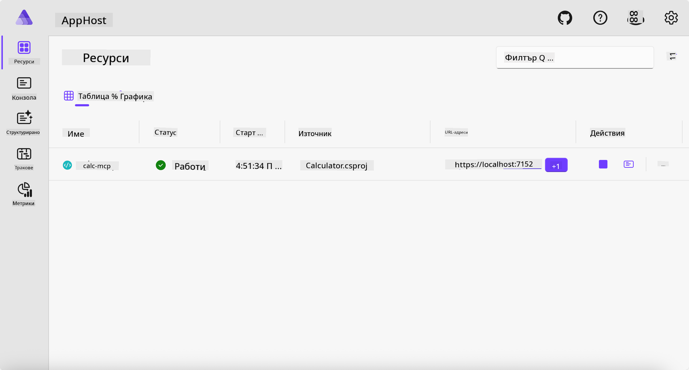
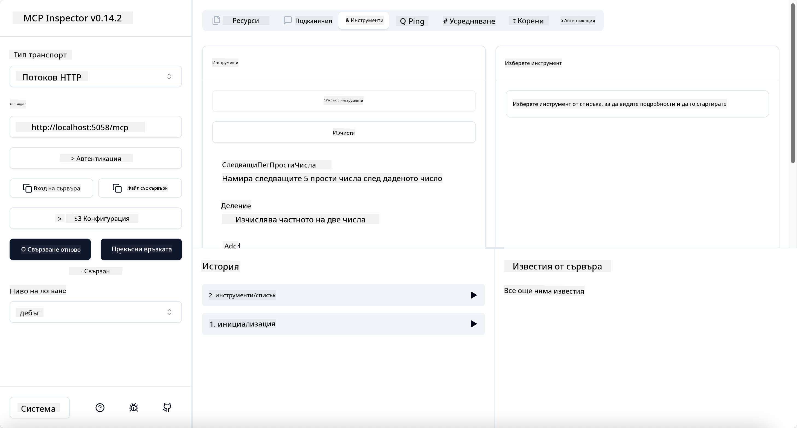

<!--
CO_OP_TRANSLATOR_METADATA:
{
  "original_hash": "0bc7bd48f55f1565f1d95ccb2c16f728",
  "translation_date": "2025-07-13T23:09:55+00:00",
  "source_file": "04-PracticalImplementation/samples/csharp/README.md",
  "language_code": "bg"
}
-->
# Пример

Предишният пример показва как да използвате локален .NET проект с тип `stdio`. И как да стартирате сървъра локално в контейнер. Това е добро решение в много ситуации. Въпреки това, може да е полезно сървърът да работи отдалечено, например в облачна среда. Тук идва типът `http`.

Ако разгледате решението в папката `04-PracticalImplementation`, то може да изглежда много по-сложно от предишното. Но всъщност не е така. Ако погледнете внимателно проекта `src/Calculator`, ще видите, че кодът е почти същият като в предишния пример. Единствената разлика е, че използваме различна библиотека `ModelContextProtocol.AspNetCore` за обработка на HTTP заявките. И променяме метода `IsPrime`, за да го направим private, просто за да покажем, че можете да имате private методи в кода си. Останалата част от кода е същата като преди.

Останалите проекти са от [.NET Aspire](https://learn.microsoft.com/dotnet/aspire/get-started/aspire-overview). Включването на .NET Aspire в решението подобрява опита на разработчика по време на разработка и тестване и помага с наблюдаемостта. Не е задължително за стартиране на сървъра, но е добра практика да го имате в решението си.

## Стартиране на сървъра локално

1. От VS Code (с разширението C# DevKit), навигирайте до директорията `04-PracticalImplementation/samples/csharp`.
1. Изпълнете следната команда, за да стартирате сървъра:

   ```bash
    dotnet watch run --project ./src/AppHost
   ```

1. Когато уеб браузър отвори таблото на .NET Aspire, обърнете внимание на `http` URL адреса. Той трябва да е нещо като `http://localhost:5058/`.

   

## Тествайте Streamable HTTP с MCP Inspector

Ако имате Node.js версия 22.7.5 или по-нова, можете да използвате MCP Inspector за тестване на сървъра.

Стартирайте сървъра и изпълнете следната команда в терминал:

```bash
npx @modelcontextprotocol/inspector http://localhost:5058
```



- Изберете `Streamable HTTP` като тип транспорт.
- В полето Url въведете URL адреса на сървъра, който отбелязахте по-рано, и добавете `/mcp`. Трябва да е `http` (не `https`), нещо като `http://localhost:5058/mcp`.
- Натиснете бутона Connect.

Хубавото на Inspector е, че предоставя добра видимост какво се случва.

- Опитайте да изброите наличните инструменти
- Изпробвайте някои от тях, трябва да работят както преди.

## Тествайте MCP Server с GitHub Copilot Chat в VS Code

За да използвате Streamable HTTP транспорта с GitHub Copilot Chat, променете конфигурацията на сървъра `calc-mcp`, създаден по-рано, така че да изглежда по следния начин:

```jsonc
// .vscode/mcp.json
{
  "servers": {
    "calc-mcp": {
      "type": "http",
      "url": "http://localhost:5058/mcp"
    }
  }
}
```

Направете няколко теста:

- Попитайте за "3 прости числа след 6780". Обърнете внимание как Copilot ще използва новите инструменти `NextFivePrimeNumbers` и ще върне само първите 3 прости числа.
- Попитайте за "7 прости числа след 111", за да видите какво ще се случи.
- Попитайте "Джон има 24 близалки и иска да ги разпредели на 3-те си деца. Колко близалки ще получи всяко дете?", за да видите какво ще се случи.

## Деплойване на сървъра в Azure

Нека деплойнем сървъра в Azure, за да могат повече хора да го използват.

От терминал навигирайте до папката `04-PracticalImplementation/samples/csharp` и изпълнете следната команда:

```bash
azd up
```

След като деплойването приключи, трябва да видите съобщение като това:


Вземете URL адреса и го използвайте в MCP Inspector и в GitHub Copilot Chat.

```jsonc
// .vscode/mcp.json
{
  "servers": {
    "calc-mcp": {
      "type": "http",
      "url": "https://calc-mcp.gentleriver-3977fbcf.australiaeast.azurecontainerapps.io/mcp"
    }
  }
}
```

## Какво следва?

Опитахме различни типове транспорт и инструменти за тестване. Също така деплойнахме MCP сървъра в Azure. Но какво ако сървърът ни трябва да има достъп до частни ресурси? Например база данни или частен API? В следващата глава ще видим как можем да подобрим сигурността на нашия сървър.

**Отказ от отговорност**:  
Този документ е преведен с помощта на AI преводаческа услуга [Co-op Translator](https://github.com/Azure/co-op-translator). Въпреки че се стремим към точност, моля, имайте предвид, че автоматизираните преводи могат да съдържат грешки или неточности. Оригиналният документ на неговия роден език трябва да се счита за авторитетен източник. За критична информация се препоръчва професионален човешки превод. Ние не носим отговорност за каквито и да е недоразумения или неправилни тълкувания, произтичащи от използването на този превод.