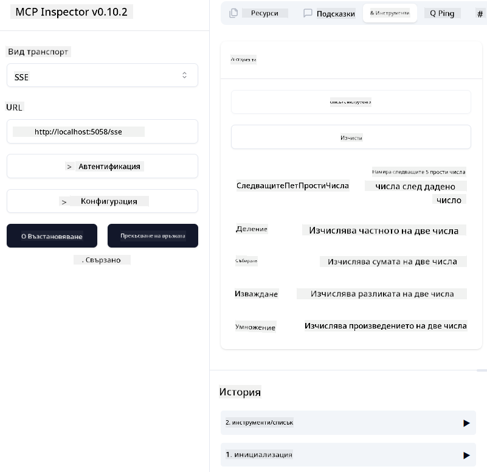

<!--
CO_OP_TRANSLATOR_METADATA:
{
  "original_hash": "5020a3e1a1c7f30c00f9e37f1fa208e3",
  "translation_date": "2025-05-17T14:12:34+00:00",
  "source_file": "04-PracticalImplementation/samples/csharp/README.md",
  "language_code": "bg"
}
-->
# Пример

Предишният пример показва как да използвате локален .NET проект с типа `sdio`. И как да стартирате сървъра локално в контейнер. Това е добро решение в много ситуации. Въпреки това, може да бъде полезно сървърът да работи отдалечено, като в облачна среда. Тук идва типът `http`.

Като разгледате решението в папката `04-PracticalImplementation`, може да изглежда много по-сложно от предишното. Но всъщност не е така. Ако погледнете внимателно проекта `src/mcpserver/mcpserver.csproj`, ще видите, че той е предимно същият код като предишния пример. Единствената разлика е, че използваме различна библиотека `ModelContextProtocol.AspNetCore`, за да обработваме HTTP заявките. И променяме метода `IsPrime`, за да го направим частен, само за да покажем, че можете да имате частни методи в кода си. Останалата част от кода е същата като преди.

Другите проекти са от [.NET Aspire](https://learn.microsoft.com/dotnet/aspire/get-started/aspire-overview). Присъствието на .NET Aspire в решението ще подобри опита на разработчика по време на разработката и тестването и ще помогне с наблюдаемостта. Не е необходимо за стартиране на сървъра, но е добра практика да го имате в решението си.

## Стартиране на сървъра локално

1. От VS Code (с разширението C# DevKit), отворете решението `04-PracticalImplementation\samples\csharp\src\Calculator-chap4.sln`.
2. Натиснете `F5`, за да стартирате сървъра. Трябва да се отвори уеб браузър с таблото за управление на .NET Aspire.

или

1. От терминал, навигирайте до папката `04-PracticalImplementation\samples\csharp\src`
2. Изпълнете следната команда, за да стартирате сървъра:
   ```bash
    dotnet run --project .\AppHost
   ```

3. От таблото за управление, отбележете URL адреса `http`. Трябва да бъде нещо като `http://localhost:5058/`.

## Test `SSE` с ModelContext Protocol Inspector

Ако имате Node.js 22.7.5 или по-нова версия, можете да използвате ModelContext Protocol Inspector, за да тествате сървъра си.

Стартирайте сървъра и изпълнете следната команда в терминал:

```bash
npx @modelcontextprotocol/inspector@latest
```



- Изберете `SSE` as the Transport type. SSE stand for Server-Sent Events. 
- In the Url field, enter the URL of the server noted earlier,and append `/sse`. Трябва да бъде `http` (не `https`) something like `http://localhost:5058/sse`.
- select the Connect button.

A nice thing about the Inspector is that it provide a nice visibility on what is happening.

- Try listing the availables tools
- Try some of them, it should works just like before.


## Test `SSE` with Github Copilot Chat in VS Code

To use the `SSE` transport with Github Copilot Chat, change the configuration of the `mcp-calc` сървър, създаден преди това, за да изглежда така:

```json
"mcp-calc": {
    "type": "sse",
    "url": "http://localhost:5058/sse"
}
```

Направете някои тестове:
- Попитайте за 3-те прости числа след 6780. Забележете как Copilot ще използва новите инструменти `NextFivePrimeNumbers` и ще върне само първите 3 прости числа.
- Попитайте за 7-те прости числа след 111, за да видите какво ще се случи.

# Деплой на сървъра в Azure

Нека деплойнем сървъра в Azure, за да може повече хора да го използват.

От терминал, навигирайте до папката `04-PracticalImplementation\samples\csharp\src` и изпълнете следната команда:

```bash
azd init
```

Това ще създаде няколко файла локално, за да се запази конфигурацията на ресурсите на Azure и вашата инфраструктура като код (IaC).

След това изпълнете следната команда, за да деплойнете сървъра в Azure:

```bash
azd up
```

След като деплойментът приключи, трябва да видите съобщение като това:


Навигирайте до таблото за управление на Aspire и отбележете `HTTP` URL адреса, за да го използвате в MCP Inspector и в Github Copilot Chat.

## Какво следва?

Опитахме различни видове транспорт и инструменти за тестване и също така деплойнахме нашия MCP сървър в Azure. Но какво ако нашият сървър трябва да има достъп до частни ресурси? Например, база данни или частен API? В следващата глава ще видим как можем да подобрим сигурността на нашия сървър.

**Отказ от отговорност**:
Този документ е преведен с помощта на AI услуга за превод [Co-op Translator](https://github.com/Azure/co-op-translator). Въпреки че се стремим към точност, моля, имайте предвид, че автоматизираните преводи може да съдържат грешки или неточности. Оригиналният документ на неговия роден език трябва да се счита за авторитетен източник. За критична информация се препоръчва професионален човешки превод. Не носим отговорност за каквито и да е недоразумения или погрешни интерпретации, произтичащи от използването на този превод.