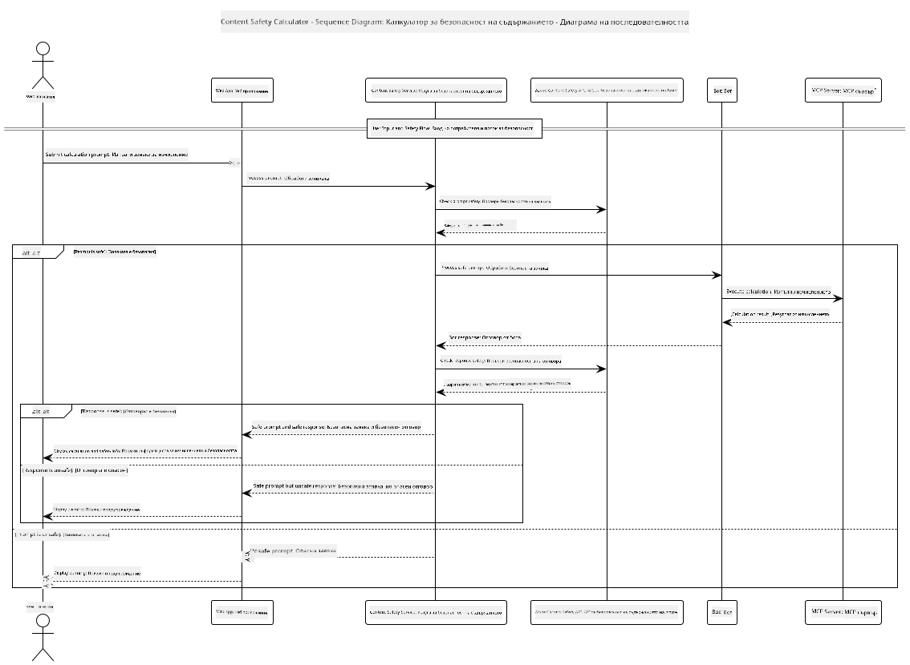

<!--
CO_OP_TRANSLATOR_METADATA:
{
  "original_hash": "e5ea5e7582f70008ea9bec3b3820f20a",
  "translation_date": "2025-07-13T23:20:17+00:00",
  "source_file": "04-PracticalImplementation/samples/java/containerapp/README.md",
  "language_code": "bg"
}
-->
## Системна архитектура

Този проект демонстрира уеб приложение, което използва проверка на безопасността на съдържанието преди да предаде потребителските заявки към калкулаторна услуга чрез Model Context Protocol (MCP).



### Как работи

1. **Потребителски вход**: Потребителят въвежда заявка за изчисление в уеб интерфейса  
2. **Проверка на безопасността на съдържанието (вход)**: Заявката се анализира от Azure Content Safety API  
3. **Решение за безопасност (вход)**:  
   - Ако съдържанието е безопасно (тежест < 2 във всички категории), заявката се изпраща към калкулатора  
   - Ако съдържанието е маркирано като потенциално вредно, процесът спира и се връща предупреждение  
4. **Интеграция с калкулатора**: Безопасното съдържание се обработва от LangChain4j, който комуникира със сървъра на калкулатора чрез MCP  
5. **Проверка на безопасността на съдържанието (изход)**: Отговорът на бота се анализира от Azure Content Safety API  
6. **Решение за безопасност (изход)**:  
   - Ако отговорът на бота е безопасен, той се показва на потребителя  
   - Ако отговорът е маркиран като потенциално вреден, се заменя с предупреждение  
7. **Отговор**: Резултатите (ако са безопасни) се показват на потребителя заедно с двата анализа за безопасност

## Използване на Model Context Protocol (MCP) с калкулаторни услуги

Този проект показва как да се използва Model Context Protocol (MCP) за извикване на калкулаторни MCP услуги от LangChain4j. Имплементацията използва локален MCP сървър, работещ на порт 8080, за предоставяне на калкулаторни операции.

### Настройка на Azure Content Safety Service

Преди да използвате функциите за безопасност на съдържанието, трябва да създадете ресурс за Azure Content Safety:

1. Влезте в [Azure Portal](https://portal.azure.com)  
2. Кликнете на "Create a resource" и потърсете "Content Safety"  
3. Изберете "Content Safety" и кликнете "Create"  
4. Въведете уникално име за вашия ресурс  
5. Изберете вашия абонамент и група ресурси (или създайте нова)  
6. Изберете поддържан регион (проверете [Region availability](https://azure.microsoft.com/en-us/global-infrastructure/services/?products=cognitive-services) за подробности)  
7. Изберете подходящ ценови план  
8. Кликнете "Create", за да разположите ресурса  
9. След като разполагането приключи, кликнете "Go to resource"  
10. В лявото меню, под "Resource Management", изберете "Keys and Endpoint"  
11. Копирайте някой от ключовете и URL адреса на крайна точка за използване в следващата стъпка

### Конфигуриране на променливи на средата

Задайте променливата на средата `GITHUB_TOKEN` за удостоверяване на GitHub моделите:  
```sh
export GITHUB_TOKEN=<your_github_token>
```

За функциите за безопасност на съдържанието задайте:  
```sh
export CONTENT_SAFETY_ENDPOINT=<your_content_safety_endpoint>
export CONTENT_SAFETY_KEY=<your_content_safety_key>
```

Тези променливи на средата се използват от приложението за удостоверяване към Azure Content Safety услугата. Ако тези променливи не са зададени, приложението ще използва заместители за демонстрационни цели, но функциите за безопасност няма да работят правилно.

### Стартиране на MCP сървъра за калкулатора

Преди да стартирате клиента, трябва да стартирате MCP сървъра за калкулатора в SSE режим на localhost:8080.

## Описание на проекта

Този проект демонстрира интеграцията на Model Context Protocol (MCP) с LangChain4j за извикване на калкулаторни услуги. Основните характеристики включват:

- Използване на MCP за свързване с калкулаторна услуга за основни математически операции  
- Двойна проверка на безопасността на съдържанието както на потребителските заявки, така и на отговорите на бота  
- Интеграция с GitHub модела gpt-4.1-nano чрез LangChain4j  
- Използване на Server-Sent Events (SSE) за MCP транспорта

## Интеграция на безопасността на съдържанието

Проектът включва изчерпателни функции за безопасност на съдържанието, за да гарантира, че както потребителските входове, така и системните отговори са без вредно съдържание:

1. **Проверка на входа**: Всички потребителски заявки се анализират за вредни категории като реч на омразата, насилие, самонараняване и сексуално съдържание преди обработка.  

2. **Проверка на изхода**: Дори при използване на потенциално нецензурирани модели, системата проверява всички генерирани отговори чрез същите филтри за безопасност преди да ги покаже на потребителя.

Този двуслоен подход гарантира, че системата остава безопасна независимо кой AI модел се използва, като защитава потребителите както от вредни входове, така и от потенциално проблемни AI-генерирани изходи.

## Уеб клиент

Приложението включва удобен уеб интерфейс, който позволява на потребителите да взаимодействат със системата Content Safety Calculator:

### Характеристики на уеб интерфейса

- Прост и интуитивен формуляр за въвеждане на заявки за изчисления  
- Двойна проверка на безопасността на съдържанието (вход и изход)  
- Обратна връзка в реално време за безопасността на заявката и отговора  
- Цветово кодирани индикатори за безопасност за лесно разбиране  
- Чист и адаптивен дизайн, който работи на различни устройства  
- Примери за безопасни заявки, които да насочват потребителите

### Използване на уеб клиента

1. Стартирайте приложението:  
   ```sh
   mvn spring-boot:run
   ```

2. Отворете браузъра и отидете на `http://localhost:8087`

3. Въведете заявка за изчисление в предоставеното текстово поле (например "Calculate the sum of 24.5 and 17.3")

4. Натиснете "Submit", за да обработите заявката

5. Вижте резултатите, които ще включват:  
   - Анализ на безопасността на вашата заявка  
   - Изчисления резултат (ако заявката е била безопасна)  
   - Анализ на безопасността на отговора на бота  
   - Всякакви предупреждения за безопасност, ако входът или изходът са били маркирани

Уеб клиентът автоматично обработва и двата процеса за проверка на безопасността на съдържанието, като гарантира, че всички взаимодействия са безопасни и подходящи, независимо кой AI модел се използва.

**Отказ от отговорност**:  
Този документ е преведен с помощта на AI преводаческа услуга [Co-op Translator](https://github.com/Azure/co-op-translator). Въпреки че се стремим към точност, моля, имайте предвид, че автоматизираните преводи могат да съдържат грешки или неточности. Оригиналният документ на неговия роден език трябва да се счита за авторитетен източник. За критична информация се препоръчва професионален човешки превод. Ние не носим отговорност за каквито и да е недоразумения или неправилни тълкувания, произтичащи от използването на този превод.