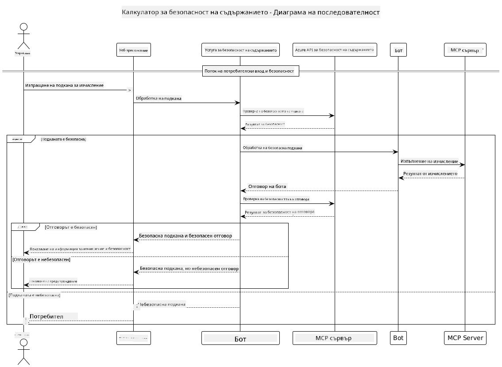

<!--
CO_OP_TRANSLATOR_METADATA:
{
  "original_hash": "e5ea5e7582f70008ea9bec3b3820f20a",
  "translation_date": "2025-05-17T14:32:04+00:00",
  "source_file": "04-PracticalImplementation/samples/java/containerapp/README.md",
  "language_code": "bg"
}
-->
## Системна архитектура

Този проект демонстрира уеб приложение, което използва проверка за безопасност на съдържанието преди да предаде потребителски заявки към калкулаторна услуга чрез Model Context Protocol (MCP).



### Как работи

1. **Потребителски вход**: Потребителят въвежда заявка за изчисление в уеб интерфейса.
2. **Проверка за безопасност на съдържанието (вход)**: Заявката се анализира от Azure Content Safety API.
3. **Решение за безопасност (вход)**:
   - Ако съдържанието е безопасно (тежест < 2 във всички категории), то продължава към калкулатора.
   - Ако съдържанието е отбелязано като потенциално вредно, процесът спира и се връща предупреждение.
4. **Интеграция с калкулатор**: Безопасното съдържание се обработва от LangChain4j, който комуникира с MCP сървъра на калкулатора.
5. **Проверка за безопасност на съдържанието (изход)**: Отговорът на бота се анализира от Azure Content Safety API.
6. **Решение за безопасност (изход)**:
   - Ако отговорът на бота е безопасен, той се показва на потребителя.
   - Ако отговорът на бота е отбелязан като потенциално вреден, той се заменя с предупреждение.
7. **Отговор**: Резултатите (ако са безопасни) се показват на потребителя заедно с двата анализа за безопасност.

## Използване на Model Context Protocol (MCP) с калкулаторни услуги

Този проект демонстрира как да се използва Model Context Protocol (MCP) за извикване на калкулаторни MCP услуги от LangChain4j. Имплементацията използва локален MCP сървър, работещ на порт 8080, за предоставяне на калкулаторни операции.

### Настройка на Azure Content Safety Service

Преди да използвате функциите за безопасност на съдържанието, трябва да създадете ресурс за Azure Content Safety:

1. Влезте в [Azure Portal](https://portal.azure.com)
2. Кликнете "Create a resource" и потърсете "Content Safety"
3. Изберете "Content Safety" и кликнете "Create"
4. Въведете уникално име за вашия ресурс
5. Изберете вашия абонамент и група ресурси (или създайте нова)
6. Изберете поддържан регион (проверете [Наличност на региони](https://azure.microsoft.com/en-us/global-infrastructure/services/?products=cognitive-services) за детайли)
7. Изберете подходяща ценова категория
8. Кликнете "Create" за да разположите ресурса
9. След като разполагането е завършено, кликнете "Go to resource"
10. В лявото меню, под "Resource Management", изберете "Keys and Endpoint"
11. Копирайте някой от ключовете и URL на крайна точка за използване в следващата стъпка

### Конфигуриране на променливи на средата

Задайте променливата на средата `GITHUB_TOKEN` за удостоверяване на моделите в GitHub:
```sh
export GITHUB_TOKEN=<your_github_token>
```

За функциите за безопасност на съдържанието, задайте:
```sh
export CONTENT_SAFETY_ENDPOINT=<your_content_safety_endpoint>
export CONTENT_SAFETY_KEY=<your_content_safety_key>
```

Тези променливи на средата се използват от приложението за удостоверяване с Azure Content Safety услугата. Ако тези променливи не са зададени, приложението ще използва стойности на заместители за демонстрационни цели, но функциите за безопасност на съдържанието няма да работят правилно.

### Стартиране на MCP сървъра на калкулатора

Преди да стартирате клиента, трябва да стартирате MCP сървъра на калкулатора в SSE режим на localhost:8080.

## Описание на проекта

Този проект демонстрира интеграцията на Model Context Protocol (MCP) с LangChain4j за извикване на калкулаторни услуги. Основните функции включват:

- Използване на MCP за свързване с калкулаторна услуга за основни математически операции
- Двуслойна проверка за безопасност на съдържанието както на потребителските заявки, така и на отговорите на бота
- Интеграция с модела gpt-4.1-nano на GitHub чрез LangChain4j
- Използване на Server-Sent Events (SSE) за MCP транспорт

## Интеграция на безопасността на съдържанието

Проектът включва изчерпателни функции за безопасност на съдържанието, за да гарантира, че както потребителските входове, така и отговорите на системата са свободни от вредно съдържание:

1. **Проверка на входа**: Всички потребителски заявки се анализират за категории вредно съдържание като реч на омразата, насилие, самонараняване и сексуално съдържание преди обработка.

2. **Проверка на изхода**: Дори при използване на потенциално нецензурирани модели, системата проверява всички генерирани отговори чрез същите филтри за безопасност на съдържанието преди да ги покаже на потребителя.

Този двуслоен подход гарантира, че системата остава безопасна независимо кой AI модел се използва, защитавайки потребителите както от вредни входове, така и от потенциално проблемни AI-генерирани изходи.

## Уеб клиент

Приложението включва удобен за потребителя уеб интерфейс, който позволява на потребителите да взаимодействат със системата за безопасност на съдържанието на калкулатора:

### Функции на уеб интерфейса

- Прост, интуитивен формуляр за въвеждане на заявки за изчисление
- Двуслойна валидация на безопасността на съдържанието (вход и изход)
- Обратна връзка в реално време за безопасността на заявките и отговорите
- Цветово кодирани индикатори за безопасност за лесно тълкуване
- Чист, отзивчив дизайн, който работи на различни устройства
- Примери за безопасни заявки, които да насочват потребителите

### Използване на уеб клиента

1. Стартирайте приложението:
   ```sh
   mvn spring-boot:run
   ```

2. Отворете браузъра си и отидете на `http://localhost:8087`

3. Въведете заявка за изчисление в предоставената текстова област (напр. "Изчисли сумата на 24.5 и 17.3")

4. Кликнете "Submit", за да обработите заявката си

5. Вижте резултатите, които ще включват:
   - Анализ на безопасността на съдържанието на вашата заявка
   - Изчисленият резултат (ако заявката беше безопасна)
   - Анализ на безопасността на съдържанието на отговора на бота
   - Всички предупреждения за безопасност, ако входът или изходът са били отбелязани

Уеб клиентът автоматично обработва и двата процеса за проверка на безопасността на съдържанието, гарантирайки, че всички взаимодействия са безопасни и подходящи, независимо кой AI модел се използва.

**Отказ от отговорност**:
Този документ е преведен с помощта на AI услуга за превод [Co-op Translator](https://github.com/Azure/co-op-translator). Въпреки че се стремим към точност, моля, имайте предвид, че автоматичните преводи може да съдържат грешки или неточности. Оригиналният документ на неговия роден език трябва да се счита за авторитетен източник. За критична информация се препоръчва професионален човешки превод. Не носим отговорност за каквито и да било недоразумения или погрешни тълкувания, произтичащи от използването на този превод.