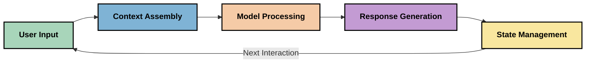
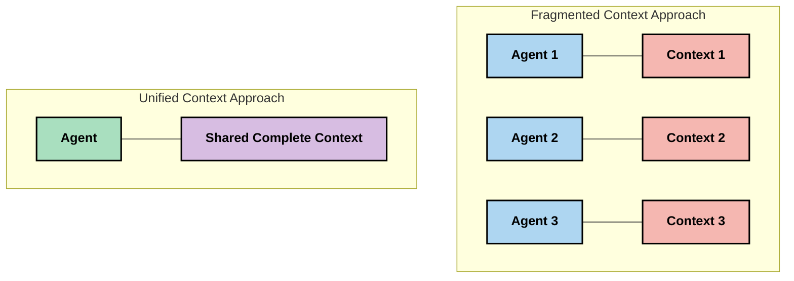

<!--
CO_OP_TRANSLATOR_METADATA:
{
  "original_hash": "fd169ca3071b81b5ee282e194bc823df",
  "translation_date": "2025-09-15T21:09:21+00:00",
  "source_file": "05-AdvancedTopics/mcp-contextengineering/README.md",
  "language_code": "bg"
}
-->
# Контекстно инженерство: възникваща концепция в екосистемата на MCP

## Преглед

Контекстното инженерство е възникваща концепция в областта на изкуствения интелект, която изследва как информацията се структурира, предоставя и поддържа по време на взаимодействията между клиенти и AI услуги. С развитието на екосистемата на Model Context Protocol (MCP), разбирането на ефективното управление на контекста става все по-важно. Този модул представя концепцията за контекстно инженерство и разглежда потенциалните му приложения в имплементациите на MCP.

## Цели на обучението

До края на този модул ще можете:

- Да разберете възникващата концепция за контекстно инженерство и потенциалната му роля в приложенията на MCP
- Да идентифицирате ключовите предизвикателства в управлението на контекста, които дизайнът на MCP протокола адресира
- Да изследвате техники за подобряване на производителността на моделите чрез по-добро управление на контекста
- Да разгледате подходи за измерване и оценка на ефективността на контекста
- Да приложите тези възникващи концепции за подобряване на AI преживяванията чрез MCP рамката

## Въведение в контекстното инженерство

Контекстното инженерство е възникваща концепция, фокусирана върху умишления дизайн и управление на потока от информация между потребители, приложения и AI модели. За разлика от утвърдени области като prompt engineering, контекстното инженерство все още се дефинира от практикуващите, докато те работят за решаване на уникалните предизвикателства при предоставянето на AI модели с правилната информация в правилния момент.

С развитието на големите езикови модели (LLMs), значението на контекста става все по-очевидно. Качеството, релевантността и структурата на предоставения контекст директно влияят върху изходните резултати на модела. Контекстното инженерство изследва тази връзка и се стреми да разработи принципи за ефективно управление на контекста.

> "През 2025 г. моделите са изключително интелигентни. Но дори най-умният човек няма да може да върши работата си ефективно без контекста на това, което му се иска да направи... 'Контекстното инженерство' е следващото ниво на prompt engineering. То е за автоматичното изпълнение на това в динамична система." — Уолдън Ян, Cognition AI

Контекстното инженерство може да включва:

1. **Избор на контекст**: Определяне на коя информация е релевантна за дадена задача
2. **Структуриране на контекста**: Организиране на информацията за максимално разбиране от модела
3. **Предоставяне на контекста**: Оптимизиране на начина и времето за изпращане на информация към моделите
4. **Поддържане на контекста**: Управление на състоянието и еволюцията на контекста във времето
5. **Оценка на контекста**: Измерване и подобряване на ефективността на контекста

Тези области на фокус са особено релевантни за екосистемата на MCP, която предоставя стандартизиран начин за приложенията да предоставят контекст на LLMs.

## Перспективата на пътуването на контекста

Един от начините за визуализиране на контекстното инженерство е да се проследи пътят, който информацията изминава през MCP системата:

### Ключови етапи в пътуването на контекста:

1. **Потребителски вход**: Сурова информация от потребителя (текст, изображения, документи)
2. **Сглобяване на контекста**: Комбиниране на потребителския вход със системния контекст, историята на разговора и друга извлечена информация
3. **Обработка от модела**: AI моделът обработва сглобения контекст
4. **Генериране на отговор**: Моделът произвежда изходи въз основа на предоставения контекст
5. **Управление на състоянието**: Системата актуализира вътрешното си състояние въз основа на взаимодействието

Тази перспектива подчертава динамичния характер на контекста в AI системите и поставя важни въпроси за това как най-добре да се управлява информацията на всеки етап.

## Възникващи принципи в контекстното инженерство

С развитието на областта на контекстното инженерство, някои ранни принципи започват да се появяват от практикуващите. Тези принципи могат да помогнат за информиране на изборите при имплементацията на MCP:

### Принцип 1: Споделяйте контекста напълно

Контекстът трябва да се споделя напълно между всички компоненти на системата, а не да се фрагментира между множество агенти или процеси. Когато контекстът е разпределен, решенията, взети в една част от системата, могат да противоречат на тези, взети другаде.

В приложенията на MCP това предполага проектиране на системи, в които контекстът протича безпроблемно през целия процес, вместо да бъде разделен.

### Принцип 2: Признайте, че действията носят имплицитни решения

Всяко действие, което моделът предприема, въплъщава имплицитни решения за това как да интерпретира контекста. Когато множество компоненти действат върху различни контексти, тези имплицитни решения могат да се конфликтират, водейки до несъответстващи резултати.

Този принцип има важни последици за приложенията на MCP:
- Предпочитайте линейна обработка на сложни задачи пред паралелно изпълнение с фрагментиран контекст
- Уверете се, че всички точки на вземане на решения имат достъп до една и съща контекстна информация
- Проектирайте системи, в които по-късните стъпки могат да видят пълния контекст на по-ранните решения

### Принцип 3: Балансирайте дълбочината на контекста с ограниченията на прозореца

С нарастването на разговорите и процесите, контекстните прозорци в крайна сметка се препълват. Ефективното контекстно инженерство изследва подходи за управление на това напрежение между изчерпателния контекст и техническите ограничения.

Потенциални подходи, които се изследват, включват:
- Компресиране на контекста, което запазва съществената информация, като същевременно намалява използването на токени
- Прогресивно зареждане на контекста въз основа на релевантността към текущите нужди
- Резюмиране на предишни взаимодействия, като се запазват ключовите решения и факти

## Предизвикателства на контекста и дизайн на MCP протокола

Model Context Protocol (MCP) е проектиран с осъзнаване на уникалните предизвикателства на управлението на контекста. Разбирането на тези предизвикателства помага да се обяснят ключовите аспекти на дизайна на MCP протокола:

### Предизвикателство 1: Ограничения на контекстния прозорец
Повечето AI модели имат фиксирани размери на контекстния прозорец, което ограничава колко информация могат да обработват наведнъж.

**Отговор на MCP дизайна:** 
- Протоколът поддържа структуриран, ресурсно-базиран контекст, който може да се реферира ефективно
- Ресурсите могат да се страницират и зареждат прогресивно

### Предизвикателство 2: Определяне на релевантност
Определянето на коя информация е най-релевантна за включване в контекста е трудно.

**Отговор на MCP дизайна:**
- Гъвкави инструменти позволяват динамично извличане на информация въз основа на нуждите
- Структурирани подсказки позволяват последователна организация на контекста

### Предизвикателство 3: Устойчивост на контекста
Управлението на състоянието през взаимодействията изисква внимателно проследяване на контекста.

**Отговор на MCP дизайна:**
- Стандартизирано управление на сесии
- Ясно дефинирани модели на взаимодействие за еволюция на контекста

### Предизвикателство 4: Мултимодален контекст
Различните типове данни (текст, изображения, структурирани данни) изискват различно обработване.

**Отговор на MCP дизайна:**
- Дизайнът на протокола позволява различни типове съдържание
- Стандартизирано представяне на мултимодална информация

### Предизвикателство 5: Сигурност и поверителност
Контекстът често съдържа чувствителна информация, която трябва да бъде защитена.

**Отговор на MCP дизайна:**
- Ясни граници между отговорностите на клиента и сървъра
- Опции за локална обработка за минимизиране на излагането на данни

Разбирането на тези предизвикателства и как MCP ги адресира предоставя основа за изследване на по-напреднали техники за контекстно инженерство.
- [Model Context Protocol Website](https://modelcontextprotocol.io/)
- [Model Context Protocol Specification](https://github.com/modelcontextprotocol/modelcontextprotocol)
- [MCP Documentation](https://modelcontextprotocol.io/docs)
- [MCP C# SDK](https://github.com/modelcontextprotocol/csharp-sdk)
- [MCP Python SDK](https://github.com/modelcontextprotocol/python-sdk)
- [MCP TypeScript SDK](https://github.com/modelcontextprotocol/typescript-sdk)
- [MCP Inspector](https://github.com/modelcontextprotocol/inspector) - Инструмент за визуално тестване на MCP сървъри

### Статии за инженерство на контекста
- [Не създавайте мулти-агенти: Принципи на инженерството на контекста](https://cognition.ai/blog/dont-build-multi-agents) - Възгледи на Уолдън Ян относно принципите на инженерството на контекста
- [Практическо ръководство за създаване на агенти](https://cdn.openai.com/business-guides-and-resources/a-practical-guide-to-building-agents.pdf) - Ръководство на OpenAI за ефективен дизайн на агенти
- [Създаване на ефективни агенти](https://www.anthropic.com/engineering/building-effective-agents) - Подходът на Anthropic към разработката на агенти

### Свързани изследвания
- [Динамично допълване на извличането за големи езикови модели](https://arxiv.org/abs/2310.01487) - Изследване на подходи за динамично извличане
- [Изгубени в средата: Как езиковите модели използват дълги контексти](https://arxiv.org/abs/2307.03172) - Важно изследване за модели на обработка на контекста
- [Йерархично генериране на изображения, обусловено от текст, с CLIP латенти](https://arxiv.org/abs/2204.06125) - Статия за DALL-E 2 с прозрения за структуриране на контекста
- [Изследване на ролята на контекста в архитектурите на големи езикови модели](https://aclanthology.org/2023.findings-emnlp.124/) - Последни изследвания за обработка на контекста
- [Сътрудничество между мулти-агенти: Преглед](https://arxiv.org/abs/2304.03442) - Изследване на системи с мулти-агенти и техните предизвикателства

### Допълнителни ресурси
- [Техники за оптимизация на контекстния прозорец](https://learn.microsoft.com/en-us/azure/ai-services/openai/concepts/context-window)
- [Разширени техники за RAG](https://www.microsoft.com/en-us/research/blog/retrieval-augmented-generation-rag-and-frontier-models/)
- [Документация за Semantic Kernel](https://github.com/microsoft/semantic-kernel)
- [AI Toolkit за управление на контекста](https://github.com/microsoft/aitoolkit)

## Какво следва

- [5.15 MCP Custom Transport](../mcp-transport/README.md)

---

**Отказ от отговорност**:  
Този документ е преведен с помощта на AI услуга за превод [Co-op Translator](https://github.com/Azure/co-op-translator). Въпреки че се стремим към точност, моля, имайте предвид, че автоматизираните преводи може да съдържат грешки или неточности. Оригиналният документ на неговия роден език трябва да се счита за авторитетен източник. За критична информация се препоръчва професионален човешки превод. Ние не носим отговорност за недоразумения или погрешни интерпретации, произтичащи от използването на този превод.