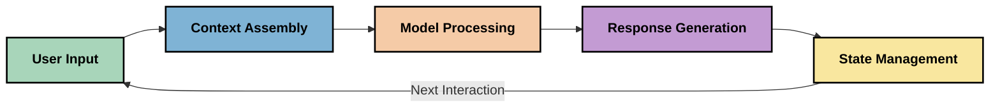
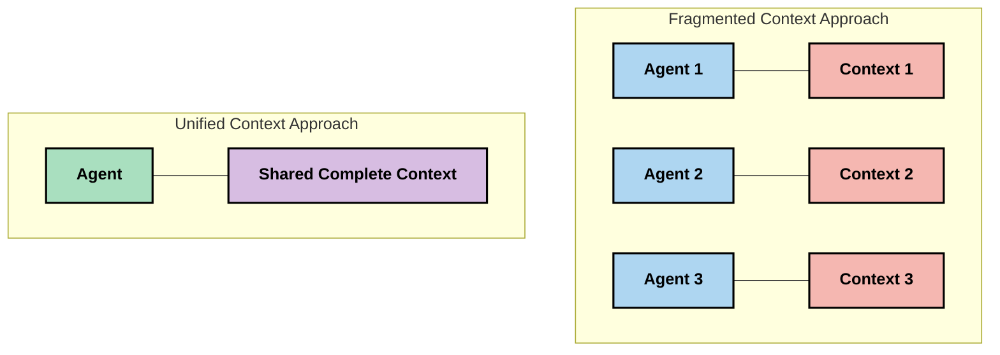
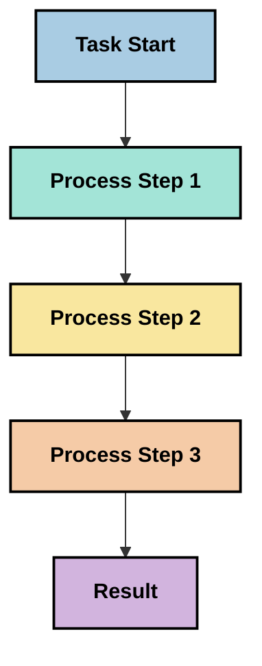
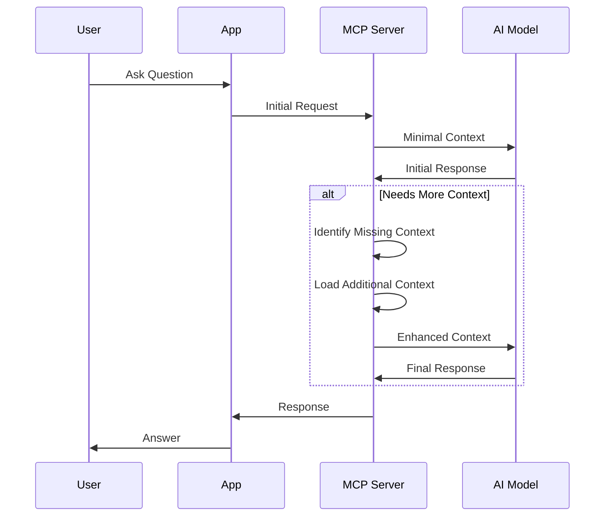
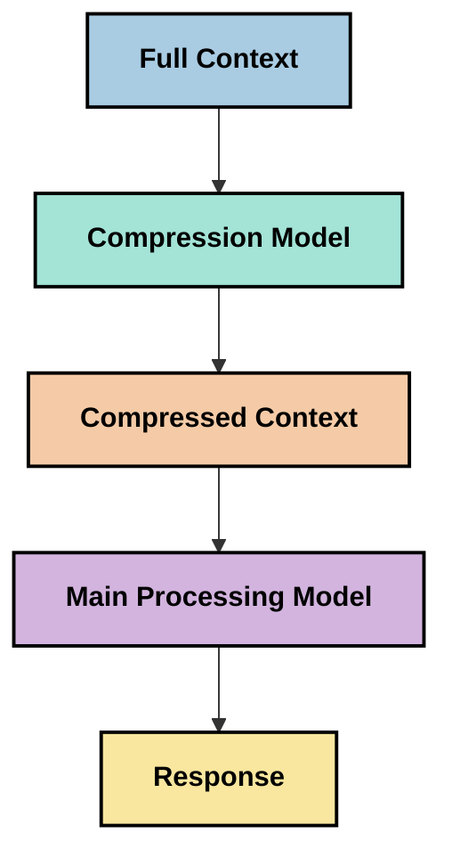

<!--
CO_OP_TRANSLATOR_METADATA:
{
  "original_hash": "5762e8e74dd99d8b7dbb31e69a82561e",
  "translation_date": "2025-07-17T13:20:27+00:00",
  "source_file": "05-AdvancedTopics/mcp-contextengineering/README.md",
  "language_code": "bg"
}
-->
# Контекстно инженерство: Нововъзникваща концепция в екосистемата на MCP

## Преглед

Контекстното инженерство е нововъзникваща концепция в сферата на изкуствения интелект, която изследва как информацията се структурира, предава и поддържа по време на взаимодействията между клиенти и AI услуги. С развитието на екосистемата на Model Context Protocol (MCP), разбирането как да се управлява контекстът ефективно става все по-важно. Този модул представя концепцията за контекстно инженерство и разглежда потенциалните ѝ приложения в MCP реализации.

## Учебни цели

След завършване на този модул ще можете да:

- Разберете нововъзникващата концепция за контекстно инженерство и потенциалната ѝ роля в MCP приложенията
- Идентифицирате ключовите предизвикателства в управлението на контекста, които протоколът MCP адресира
- Изследвате техники за подобряване на представянето на моделите чрез по-добро управление на контекста
- Обмислите подходи за измерване и оценка на ефективността на контекста
- Приложите тези нововъзникващи концепции за подобряване на AI преживяванията чрез рамката MCP

## Въведение в контекстното инженерство

Контекстното инженерство е нова концепция, фокусирана върху съзнателното проектиране и управление на потока от информация между потребители, приложения и AI модели. За разлика от утвърдени области като prompt engineering, контекстното инженерство все още се дефинира от практиците, докато те се стремят да решат уникалните предизвикателства при предоставянето на AI моделите на правилната информация в правилния момент.

С развитието на големите езикови модели (LLMs) значението на контекста става все по-очевидно. Качеството, релевантността и структурата на контекста, който предоставяме, влияят пряко върху изходите на модела. Контекстното инженерство изследва тази връзка и се стреми да развие принципи за ефективно управление на контекста.

> „През 2025 г. моделите са изключително интелигентни. Но дори и най-умният човек няма да може да свърши работата си ефективно без контекста на това, което му се иска... 'Контекстното инженерство' е следващото ниво на prompt engineering. Става дума за автоматизиране на този процес в динамична система.“ — Walden Yan, Cognition AI

Контекстното инженерство може да включва:

1. **Избор на контекст**: Определяне на релевантната информация за дадена задача  
2. **Структуриране на контекста**: Организиране на информацията за максимално разбиране от модела  
3. **Доставка на контекста**: Оптимизиране на начина и времето за подаване на информация към моделите  
4. **Поддържане на контекста**: Управление на състоянието и развитието на контекста във времето  
5. **Оценка на контекста**: Измерване и подобряване на ефективността на контекста  

Тези области са особено релевантни за екосистемата MCP, която предоставя стандартизиран начин за приложенията да подават контекст към LLM.

## Перспектива за пътуването на контекста

Един начин да визуализираме контекстното инженерство е да проследим пътя, който информацията изминава през MCP система:



### Ключови етапи в пътуването на контекста:

1. **Потребителски вход**: Сурова информация от потребителя (текст, изображения, документи)  
2. **Събиране на контекста**: Комбиниране на потребителския вход със системния контекст, историята на разговора и друга извлечена информация  
3. **Обработка от модела**: AI моделът обработва събрания контекст  
4. **Генериране на отговор**: Моделът създава изходи на базата на предоставения контекст  
5. **Управление на състоянието**: Системата обновява вътрешното си състояние въз основа на взаимодействието  

Тази перспектива подчертава динамичната природа на контекста в AI системите и повдига важни въпроси за това как най-добре да се управлява информацията на всеки етап.

## Нововъзникващи принципи в контекстното инженерство

С оформянето на областта контекстно инженерство, някои ранни принципи започват да се появяват от практиците. Тези принципи могат да помогнат при вземането на решения за имплементации на MCP:

### Принцип 1: Споделяйте контекста изцяло

Контекстът трябва да се споделя изцяло между всички компоненти на системата, а не да бъде фрагментиран между множество агенти или процеси. Когато контекстът е разпределен, решенията, взети в една част от системата, могат да противоречат на тези в друга.



В MCP приложения това предполага проектиране на системи, където контекстът тече безпроблемно през целия процес, а не е разделен на отделни части.

### Принцип 2: Признайте, че действията носят имплицитни решения

Всяко действие, което моделът предприема, съдържа имплицитни решения за това как да интерпретира контекста. Когато множество компоненти действат върху различни контексти, тези имплицитни решения могат да влязат в конфликт, водейки до несъгласувани резултати.

Този принцип има важни последици за MCP приложенията:  
- Предпочитайте линейна обработка на сложни задачи пред паралелно изпълнение с фрагментиран контекст  
- Осигурете достъп на всички точки на вземане на решения до една и съща контекстуална информация  
- Проектирайте системи, в които по-късните стъпки могат да видят пълния контекст на по-ранните решения  

### Принцип 3: Балансирайте дълбочината на контекста с ограниченията на прозореца

С нарастването на разговорите и процесите, контекстните прозорци в крайна сметка се препълват. Ефективното контекстно инженерство изследва подходи за управление на това напрежение между изчерпателния контекст и техническите ограничения.

Възможни подходи, които се изследват, включват:  
- Компресиране на контекста, което запазва съществената информация, като същевременно намалява използването на токени  
- Прогресивно зареждане на контекста според релевантността към текущите нужди  
- Обобщаване на предишни взаимодействия, като се запазват ключови решения и факти  

## Предизвикателства с контекста и дизайн на MCP протокола

Model Context Protocol (MCP) е проектиран с осъзнаване на уникалните предизвикателства при управлението на контекста. Разбирането на тези предизвикателства помага да се обяснят ключови аспекти от дизайна на MCP протокола:

### Предизвикателство 1: Ограничения на контекстния прозорец  
Повечето AI модели имат фиксирани размери на контекстния прозорец, което ограничава колко информация могат да обработват наведнъж.

**Отговор на дизайна на MCP:**  
- Протоколът поддържа структуриран, базиран на ресурси контекст, който може да се реферира ефективно  
- Ресурсите могат да се странират и зареждат прогресивно  

### Предизвикателство 2: Определяне на релевантността  
Определянето коя информация е най-релевантна за включване в контекста е трудно.

**Отговор на дизайна на MCP:**  
- Гъвкави инструменти позволяват динамично извличане на информация според нуждите  
- Структурирани подсказки осигуряват последователна организация на контекста  

### Предизвикателство 3: Устойчивост на контекста  
Управлението на състоянието през взаимодействията изисква внимателно проследяване на контекста.

**Отговор на дизайна на MCP:**  
- Стандартизирано управление на сесии  
- Ясно дефинирани модели на взаимодействие за развитие на контекста  

### Предизвикателство 4: Мултимодален контекст  
Различните типове данни (текст, изображения, структурирани данни) изискват различно третиране.

**Отговор на дизайна на MCP:**  
- Дизайнът на протокола поддържа различни типове съдържание  
- Стандартизирано представяне на мултимодална информация  

### Предизвикателство 5: Сигурност и поверителност  
Контекстът често съдържа чувствителна информация, която трябва да бъде защитена.

**Отговор на дизайна на MCP:**  
- Ясни граници между отговорностите на клиента и сървъра  
- Възможности за локална обработка с цел минимизиране на излагането на данни  

Разбирането на тези предизвикателства и как MCP ги адресира предоставя основа за изследване на по-напреднали техники в контекстното инженерство.

## Нововъзникващи подходи в контекстното инженерство

С развитието на областта контекстно инженерство се появяват няколко обещаващи подхода. Те отразяват текущото мислене, а не утвърдени добри практики, и вероятно ще се развиват с натрупването на опит с MCP реализации.

### 1. Линейна обработка в един поток

За разлика от многоагентните архитектури, които разпределят контекста, някои практици установяват, че линейната обработка в един поток дава по-последователни резултати. Това съответства на принципа за поддържане на единен контекст.



Въпреки че този подход може да изглежда по-малко ефективен от паралелната обработка, той често дава по-кохерентни и надеждни резултати, тъй като всяка стъпка се базира на пълно разбиране на предишните решения.

### 2. Разделяне и приоритизиране на контекста

Разбиване на големи контексти на управляеми части и приоритизиране на най-важното.

```python
# Conceptual Example: Context Chunking and Prioritization
def process_with_chunked_context(documents, query):
    # 1. Break documents into smaller chunks
    chunks = chunk_documents(documents)
    
    # 2. Calculate relevance scores for each chunk
    scored_chunks = [(chunk, calculate_relevance(chunk, query)) for chunk in chunks]
    
    # 3. Sort chunks by relevance score
    sorted_chunks = sorted(scored_chunks, key=lambda x: x[1], reverse=True)
    
    # 4. Use the most relevant chunks as context
    context = create_context_from_chunks([chunk for chunk, score in sorted_chunks[:5]])
    
    # 5. Process with the prioritized context
    return generate_response(context, query)
```

Горният пример илюстрира как можем да разделим големи документи на управляеми части и да изберем само най-релевантните за контекста. Този подход помага да се работи в рамките на ограниченията на контекстния прозорец, като същевременно се използват големи бази знания.

### 3. Прогресивно зареждане на контекста

Зареждане на контекста постепенно, според нуждите, а не наведнъж.



Прогресивното зареждане започва с минимален контекст и се разширява само когато е необходимо. Това може значително да намали използването на токени при прости заявки, като същевременно запази възможността за обработка на сложни въпроси.

### 4. Компресиране и обобщаване на контекста

Намаляване на размера на контекста, като се запазва съществената информация.



Компресирането на контекста се фокусира върху:  
- Премахване на излишна информация  
- Обобщаване на дълго съдържание  
- Извличане на ключови факти и детайли  
- Запазване на критични елементи от контекста  
- Оптимизация за ефективност на токените  

Този подход е особено ценен за поддържане на дълги разговори в рамките на контекстните прозорци или за ефективна обработка на големи документи. Някои практици използват специализирани модели, предназначени специално за компресиране и обобщаване на историята на разговорите.

## Изследователски съображения при контекстното инженерство

Докато изследваме новата област контекстно инженерство, няколко съображения са полезни при работа с MCP реализации. Те не са предписващи добри практики, а по-скоро области за изследване, които могат да доведат до подобрения във вашия конкретен случай.

### Обмислете целите си за контекста

Преди да приложите сложни решения за управление на контекста, ясно формулирайте какво искате да постигнете:  
- Каква конкретна информация е необходима на модела за успех?  
- Коя информация е съществена и коя е допълнителна?  
- Какви са ограниченията ви по отношение на производителност (забавяне, лимити на токени, разходи)?  

### Изследвайте многослойни подходи към контекста

Някои практици постигат успех с контекст, подреден в концептуални слоеве:  
- **Основен слой**: Съществена информация, която моделът винаги трябва да има  
- **Ситуационен слой**: Контекст, специфичен за текущото взаимодействие  
- **Поддържащ слой**: Допълнителна информация, която може да е полезна  
- **Резервен слой**: Информация, достъпна само при нужда  

### Изследвайте стратегии за извличане

Ефективността на контекста често зависи от начина, по който извличате информация:  
- Семантично търсене и embeddings за намиране на концептуално релевантна информация  
- Търсене по ключови думи за конкретни фактически детайли  
- Хибридни подходи, комбиниращи няколко метода за извличане  
- Филтриране по метаданни за стесняване на обхвата според категории, дати или източници  

### Експериментирайте с кохерентността на контекста

Структурата и потокът на контекста могат да влияят на разбирането на модела:  
- Групиране на свързана информация заедно  
- Използване на последователно форматиране и организация  
- Поддържане на логическо или хронологично подреждане, когато е подходящо  
- Избягване на противоречива информация  

### Преценете компромисите при многоагентни архитектури

Въпреки че многоагентните архитектури са популярни в много AI рамки, те носят значителни предизвикателства при управлението на контекста:  
- Фрагментацията на контекста може да доведе до несъгласувани решения между агентите  
- Паралелната обработка може да въведе конфликти, които са трудни за разрешаване  
- Комуникационният оувърхед между агентите може да компенсира печалбите в производителността  
- Необходимо е сложно управление на състоянието за поддържане на кохерентност  

В много случаи подход с един агент и цялостно управление на контекста може да даде по-надеждни резултати от множество специализирани агенти с фрагментиран контекст.

### Разработете методи за оценка

За да подобрите контекстното инженерство с времето, обмислете как ще измервате успеха:  
- A/B тестване на различни структури на контекста  
- Мониторинг на използването на токени и време за отговор  
- Проследяване на удовлетвореността на потребителите и степента на изпълнение на задачите  
- Анализ на случаи, в които стратегиите за контекст се провалят  

Тези съображения представляват активни области за изследване в пространството на контекстното инженерство. С развитието на областта вероятно ще се появят по-ясни модели и практики.

## Измерване на ефективността на контекста: развиваща се рамка

С появата на контекстното инженерство като концепция, практиците започват да изследват как може да се измери неговата ефективност. Все още няма установена рамка, но се разглеждат различни метрики, които биха могли да насочат бъдещата работа.

### Потенциални измервателни измерения

#### 1. Съображения за ефективност на входа

- **Съотношение контекст към отговор**: Колко контекст е необходим спрямо размера на отговора?  
- **Използване на токени**
- [Model Context Protocol Website](https://modelcontextprotocol.io/)
- [Model Context Protocol Specification](https://github.com/modelcontextprotocol/modelcontextprotocol)
- [MCP Documentation](https://modelcontextprotocol.io/docs)
- [MCP C# SDK](https://github.com/modelcontextprotocol/csharp-sdk)
- [MCP Python SDK](https://github.com/modelcontextprotocol/python-sdk)
- [MCP TypeScript SDK](https://github.com/modelcontextprotocol/typescript-sdk)
- [MCP Inspector](https://github.com/modelcontextprotocol/inspector) - Визуален инструмент за тестване на MCP сървъри

### Статии за контекстното инженерство
- [Не създавайте мулти-агенти: Принципи на контекстното инженерство](https://cognition.ai/blog/dont-build-multi-agents) - Размисли на Уолден Ян за принципите на контекстното инженерство
- [Практическо ръководство за създаване на агенти](https://cdn.openai.com/business-guides-and-resources/a-practical-guide-to-building-agents.pdf) - Ръководство на OpenAI за ефективен дизайн на агенти
- [Създаване на ефективни агенти](https://www.anthropic.com/engineering/building-effective-agents) - Подходът на Anthropic към разработката на агенти

### Свързани изследвания
- [Динамично разширяване на търсенето за големи езикови модели](https://arxiv.org/abs/2310.01487) - Изследване на динамични методи за извличане на информация
- [Изгубени в средата: Как езиковите модели използват дълги контексти](https://arxiv.org/abs/2307.03172) - Важно изследване за модели на обработка на контекста
- [Йерархично генериране на изображения, обусловено от текст, с CLIP латенти](https://arxiv.org/abs/2204.06125) - Статия за DALL-E 2 с прозрения за структуриране на контекста
- [Изследване на ролята на контекста в архитектурите на големи езикови модели](https://aclanthology.org/2023.findings-emnlp.124/) - Последни изследвания за обработка на контекста
- [Сътрудничество между мулти-агенти: Преглед](https://arxiv.org/abs/2304.03442) - Изследване на мулти-агентни системи и техните предизвикателства

### Допълнителни ресурси
- [Техники за оптимизация на контекстния прозорец](https://learn.microsoft.com/en-us/azure/ai-services/openai/concepts/context-window)
- [Разширени техники за RAG](https://www.microsoft.com/en-us/research/blog/retrieval-augmented-generation-rag-and-frontier-models/)
- [Документация на Semantic Kernel](https://github.com/microsoft/semantic-kernel)
- [AI Toolkit за управление на контекста](https://github.com/microsoft/aitoolkit)

## Какво следва
- [6. Приноси от общността](../../06-CommunityContributions/README.md)

**Отказ от отговорност**:  
Този документ е преведен с помощта на AI преводаческа услуга [Co-op Translator](https://github.com/Azure/co-op-translator). Въпреки че се стремим към точност, моля, имайте предвид, че автоматизираните преводи могат да съдържат грешки или неточности. Оригиналният документ на неговия първичен език трябва да се счита за авторитетен източник. За критична информация се препоръчва професионален човешки превод. Ние не носим отговорност за каквито и да е недоразумения или неправилни тълкувания, произтичащи от използването на този превод.