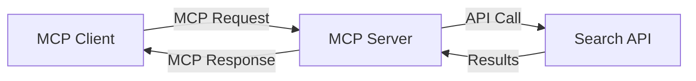
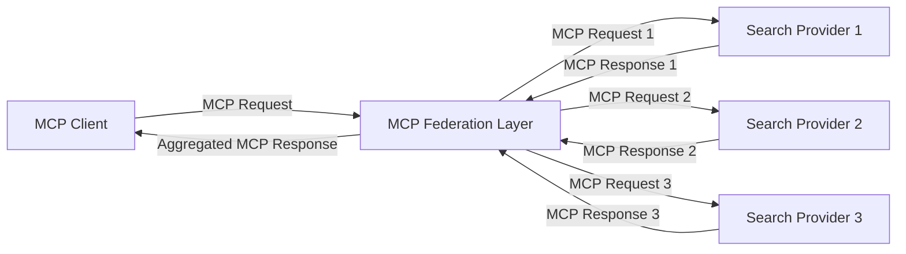
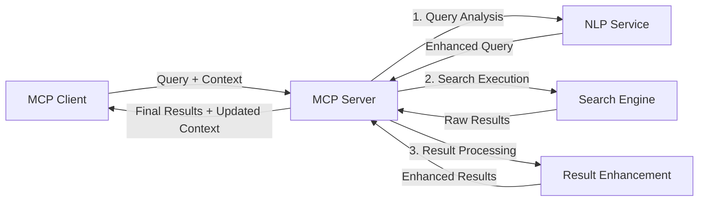

<!--
CO_OP_TRANSLATOR_METADATA:
{
  "original_hash": "eb12652eb7bd17f2193b835a344425c6",
  "translation_date": "2025-06-26T14:23:09+00:00",
  "source_file": "05-AdvancedTopics/mcp-realtimesearch/README.md",
  "language_code": "bg"
}
-->
## Отказ от отговорност за примерите с код

> **Важно:** Примерите с код по-долу демонстрират интеграцията на Model Context Protocol (MCP) с функционалността за уеб търсене. Въпреки че следват моделите и структурите на официалните MCP SDK, те са опростени с образователна цел.
> 
> Тези примери показват:
> 
> 1. **Python имплементация**: FastMCP сървър, който предоставя инструмент за уеб търсене и се свързва с външен търсещ API. Този пример демонстрира правилно управление на жизнения цикъл, обработка на контекст и реализиране на инструмент според моделите на [официалния MCP Python SDK](https://github.com/modelcontextprotocol/python-sdk). Сървърът използва препоръчания Streamable HTTP транспорт, който е заместил по-стария SSE транспорт за продукционни среди.
> 
> 2. **JavaScript имплементация**: TypeScript/JavaScript пример, използващ FastMCP модел от [официалния MCP TypeScript SDK](https://github.com/modelcontextprotocol/typescript-sdk) за създаване на сървър за търсене с правилно дефинирани инструменти и клиентски връзки. Следва най-новите препоръчителни практики за управление на сесии и запазване на контекст.
> 
> Тези примери изискват допълнителна обработка на грешки, автентикация и специфичен код за интеграция с API за продукционна употреба. Показаните крайни точки на търсещия API (`https://api.search-service.example/search`) са заместители и трябва да бъдат заменени с реални крайни точки на търсещи услуги.
> 
> За пълни детайли и най-актуални подходи, моля, вижте [официалната MCP спецификация](https://spec.modelcontextprotocol.io/) и документацията на SDK.

## Основни концепции

### Рамката на Model Context Protocol (MCP)

В основата си Model Context Protocol предоставя стандартизиран начин за обмен на контекст между AI модели, приложения и услуги. В реално време уеб търсенето тази рамка е съществена за създаване на последователни, многократни търсещи преживявания. Основните компоненти включват:

1. **Клиент-сървър архитектура**: MCP установява ясна разделителна линия между търсещи клиенти (заявители) и търсещи сървъри (доставчици), което позволява гъвкави модели на разгръщане.

2. **JSON-RPC комуникация**: Протоколът използва JSON-RPC за обмен на съобщения, което го прави съвместим с уеб технологии и лесен за имплементация на различни платформи.

3. **Управление на контекст**: MCP дефинира структурирани методи за поддържане, обновяване и използване на търсещия контекст през множество взаимодействия.

4. **Дефиниции на инструменти**: Търсещите възможности се излагат като стандартизирани инструменти с добре дефинирани параметри и връщани стойности.

5. **Поддръжка на стрийминг**: Протоколът поддържа поточно предаване на резултати, което е съществено за реално време търсене, където резултатите могат да пристигат постепенно.

### Модели за интеграция на уеб търсене

При интегриране на MCP с уеб търсене се открояват няколко модела:

#### 1. Директна интеграция с доставчик на търсене

В този модел MCP сървърът директно взаимодейства с един или повече търсещи API-та, превеждайки MCP заявки в специфични за API повиквания и форматирайки резултатите като MCP отговори.

#### 2. Федеративно търсене с запазване на контекст

Този модел разпределя търсещите заявки между множество MCP-съвместими доставчици на търсене, всеки от които може да е специализиран в различни типове съдържание или търсещи възможности, като същевременно поддържа единен контекст.

#### 3. Верига за търсене с подобрен контекст

В този модел търсещият процес е разделен на няколко етапа, като контекстът се обогатява на всяка стъпка, което води до постепенно по-релевантни резултати.

### Компоненти на търсещия контекст

В уеб търсенето, базирано на MCP, контекстът обикновено включва:

- **История на заявки**: Предишни търсещи заявки в сесията
- **Потребителски предпочитания**: Език, регион, настройки за безопасно търсене
- **История на взаимодействия**: Кои резултати са кликнати, време прекарано върху резултатите
- **Параметри за търсене**: Филтри, подреждания и други модификатори на търсенето
- **Доменни знания**: Специфичен контекст, свързан с предмета на търсене
- **Временен контекст**: Фактори за релевантност, свързани с времето
- **Предпочитания за източници**: Доверени или предпочитани източници на информация

## Приложения и случаи на употреба

### Изследване и събиране на информация

MCP подобрява изследователските работни процеси чрез:

- Запазване на изследователския контекст през търсещите сесии
- Позволяване на по-сложни и контекстуално релевантни заявки
- Поддръжка на федерация на търсене от множество източници
- Улесняване на извличането на знания от резултатите от търсенето

### Мониторинг на новини и тенденции в реално време

Търсенето с MCP предлага предимства за мониторинг на новини:

- Откриване на нововъзникващи новинарски истории почти в реално време
- Контекстуално филтриране на релевантна информация
- Проследяване на теми и обекти през множество източници
- Персонализирани новинарски известия на базата на потребителски контекст

### AI-подпомагано браузване и изследване

MCP създава нови възможности за AI-подпомагано браузване:

- Контекстуални предложения за търсене на базата на текущата активност в браузъра
- Безпроблемна интеграция на уеб търсене с помощници, захранвани от големи езикови модели (LLM)
- Многократна рефинемент на търсенето с поддържан контекст
- Подобрена проверка на факти и верификация на информация

## Бъдещи тенденции и иновации

### Еволюция на MCP в уеб търсенето

В бъдеще очакваме MCP да се развива в посока:

- **Мултимодално търсене**: Интегриране на търсене в текст, изображения, аудио и видео с запазен контекст
- **Децентрализирано търсене**: Поддръжка на разпределени и федеративни търсещи екосистеми
- **Поверителност при търсене**: Механизми за търсене с внимание към поверителността и контекста
- **Разбиране на заявки**: Дълбок семантичен анализ на естествени езикови търсещи заявки

### Потенциални технологични напредъци

Изгряващи технологии, които ще оформят бъдещето на MCP търсенето:

1. **Невронни архитектури за търсене**: Търсещи системи, базирани на вграждания, оптимизирани за MCP
2. **Персонализиран търсещ контекст**: Научаване на индивидуални търсещи модели на потребителите с времето
3. **Интеграция с графи на знанията**: Контекстуално търсене, обогатено с домейн-специфични графи на знания
4. **Крос-модален контекст**: Поддържане на контекст между различни модалности на търсене

## Практически упражнения

### Упражнение 1: Настройване на базов MCP търсещ конвейер

В това упражнение ще научите как да:
- Конфигурирате базова MCP търсеща среда
- Имплементирате обработващи контекст компоненти за уеб търсене
- Тествате и валидирате запазването на контекст през няколко итерации на търсене

### Упражнение 2: Създаване на изследователски асистент с MCP търсене

Създайте пълно приложение, което:
- Обработва изследователски въпроси на естествен език
- Извършва контекстуално осъзнато уеб търсене
- Синтезира информация от множество източници
- Представя организирани изследователски резултати

### Упражнение 3: Имплементиране на федерация на търсене с множество източници чрез MCP

Разширено упражнение, обхващащо:
- Контекстуално насочване на заявки към множество търсещи машини
- Подреждане и агрегиране на резултати
- Контекстуално премахване на дублирани резултати
- Обработка на метаданни, специфични за източника

## Допълнителни ресурси

- [Model Context Protocol Specification](https://spec.modelcontextprotocol.io/) - Официална MCP спецификация и подробна документация на протокола
- [Model Context Protocol Documentation](https://modelcontextprotocol.io/) - Подробни уроци и ръководства за имплементация
- [MCP Python SDK](https://github.com/modelcontextprotocol/python-sdk) - Официална Python имплементация на MCP протокола
- [MCP TypeScript SDK](https://github.com/modelcontextprotocol/typescript-sdk) - Официална TypeScript имплементация на MCP протокола
- [MCP Reference Servers](https://github.com/modelcontextprotocol/servers) - Референтни имплементации на MCP сървъри
- [Bing Web Search API Documentation](https://learn.microsoft.com/en-us/bing/search-apis/bing-web-search/overview) - Уеб търсещ API на Microsoft
- [Google Custom Search JSON API](https://developers.google.com/custom-search/v1/overview) - Програмируемата търсеща машина на Google
- [SerpAPI Documentation](https://serpapi.com/search-api) - API за резултати от търсещи машини
- [Meilisearch Documentation](https://www.meilisearch.com/docs) - Отворен код търсеща машина
- [Elasticsearch Documentation](https://www.elastic.co/guide/index.html) - Разпределена търсеща и аналитична машина
- [LangChain Documentation](https://python.langchain.com/docs/get_started/introduction) - Създаване на приложения с LLM

## Резултати от обучението

След завършване на този модул ще можете да:

- Разбирате основите на уеб търсенето в реално време и предизвикателствата му
- Обяснявате как Model Context Protocol (MCP) подобрява възможностите за уеб търсене в реално време
- Имплементирате търсещи решения, базирани на MCP, с помощта на популярни рамки и API-та
- Проектирате и внедрявате мащабируеми и високопроизводителни търсещи архитектури с MCP
- Прилагате MCP концепции в различни случаи на употреба, включително семантично търсене, изследователска помощ и AI-подпомагано браузване
- Оценявате нови тенденции и бъдещи иновации в търсещите технологии, базирани на MCP

### Съображения за доверие и безопасност

При имплементиране на уеб търсещи решения, базирани на MCP, имайте предвид следните важни принципи от MCP спецификацията:

1. **Потребителско съгласие и контрол**: Потребителите трябва изрично да дават съгласие и да разбират всички операции и достъп до данни. Това е особено важно за уеб търсене, което може да достъпва външни източници на данни.

2. **Поверителност на данните**: Осигурете подходящо третиране на търсещите заявки и резултати, особено когато съдържат чувствителна информация. Внедрете адекватни контролни механизми за достъп до потребителските данни.

3. **Безопасност на инструментите**: Реализирайте правилна авторизация и валидиране за търсещите инструменти, тъй като те представляват потенциален риск за сигурността чрез изпълнение на произволен код. Описанията на поведението на инструментите трябва да се считат за ненадеждни, освен ако не са получени от доверен сървър.

4. **Ясна документация**: Осигурете ясна документация за възможностите, ограниченията и съображенията за сигурност на вашата MCP-базирана имплементация, следвайки указанията от MCP спецификацията.

5. **Здрави потоци за съгласие**: Изградете стабилни потоци за съгласие и авторизация, които ясно обясняват какво прави всеки инструмент преди да бъде разрешено използването му, особено за инструменти, които взаимодействат с външни уеб ресурси.

За пълни подробности относно сигурността и съображенията за доверие при MCP, вижте [официалната документация](https://modelcontextprotocol.io/specification/2025-03-26#security-and-trust-%26-safety).

## Какво следва

- [5.11 Entra ID Authentication for Model Context Protocol Servers](../mcp-security-entra/README.md)

**Отказ от отговорност**:  
Този документ е преведен с помощта на AI преводаческа услуга [Co-op Translator](https://github.com/Azure/co-op-translator). Въпреки че се стремим към точност, моля, имайте предвид, че автоматизираните преводи могат да съдържат грешки или неточности. Оригиналният документ на неговия роден език трябва да се счита за авторитетен източник. За критична информация се препоръчва професионален човешки превод. Ние не носим отговорност за никакви недоразумения или неправилни тълкувания, произтичащи от използването на този превод.