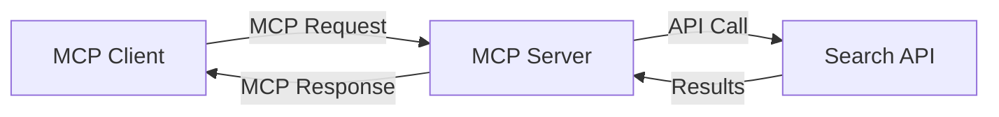
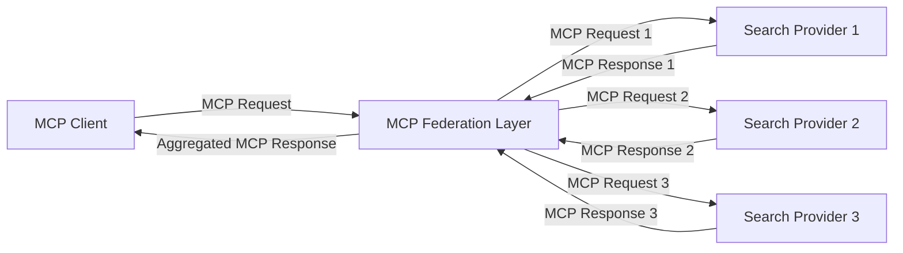
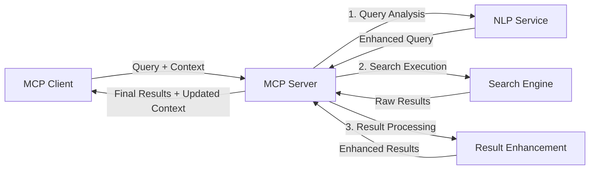

<!--
CO_OP_TRANSLATOR_METADATA:
{
  "original_hash": "16bef2c93c6a86d4ca6a8ce9e120e384",
  "translation_date": "2025-06-13T03:03:05+00:00",
  "source_file": "05-AdvancedTopics/mcp-realtimesearch/README.md",
  "language_code": "bg"
}
-->
## Отказ от отговорност за примерите с код

> **Важно уточнение**: Примерите с код по-долу демонстрират интеграцията на Model Context Protocol (MCP) с функционалност за уеб търсене. Въпреки че следват моделите и структурите на официалните MCP SDK, те са опростени с образователна цел.
> 
> Тези примери показват:
> 
> 1. **Python имплементация**: FastMCP сървър, който предоставя инструмент за уеб търсене и се свързва с външен търсещ API. Този пример демонстрира правилно управление на жизнения цикъл, работа с контекст и имплементация на инструмент според моделите на [официалния MCP Python SDK](https://github.com/modelcontextprotocol/python-sdk). Сървърът използва препоръчания Streamable HTTP транспорт, който е заместил по-стария SSE транспорт за продукционни среди.
> 
> 2. **JavaScript имплементация**: Имплементация на TypeScript/JavaScript, използваща FastMCP модела от [официалния MCP TypeScript SDK](https://github.com/modelcontextprotocol/typescript-sdk), за създаване на търсещ сървър с правилни дефиниции на инструменти и клиентски връзки. Следва най-новите препоръчани модели за управление на сесии и запазване на контекст.
> 
> Тези примери биха изисквали допълнителна обработка на грешки, удостоверяване и специфичен код за интеграция на API за продукционна употреба. Показаните крайни точки на търсещия API (`https://api.search-service.example/search`) са заместители и трябва да бъдат заменени с реални адреси на търсещи услуги.
> 
> За пълни детайли и най-актуални подходи, моля, консултирайте се с [официалната MCP спецификация](https://spec.modelcontextprotocol.io/) и документацията на SDK.

## Основни концепции

### Рамка на Model Context Protocol (MCP)

В основата си Model Context Protocol предоставя стандартизиран начин за обмен на контекст между AI модели, приложения и услуги. В реално време уеб търсенето тази рамка е от съществено значение за създаване на последователни, многостъпкови търсещи преживявания. Основни компоненти включват:

1. **Клиент-сървър архитектура**: MCP установява ясна разделителна линия между търсещи клиенти (заявители) и търсещи сървъри (доставчици), позволявайки гъвкави модели на разгръщане.

2. **JSON-RPC комуникация**: Протоколът използва JSON-RPC за обмен на съобщения, което го прави съвместим с уеб технологии и лесен за имплементация на различни платформи.

3. **Управление на контекст**: MCP дефинира структурирани методи за поддържане, обновяване и използване на търсещия контекст през множество взаимодействия.

4. **Дефиниции на инструменти**: Търсещите възможности се излагат като стандартизирани инструменти с добре дефинирани параметри и стойности за връщане.

5. **Поддръжка на стрийминг**: Протоколът поддържа предаване на резултати на потоци, което е ключово за реално време търсене, където резултатите могат да пристигат постепенно.

### Модели за интеграция на уеб търсене

При интеграция на MCP с уеб търсене се появяват няколко модела:

#### 1. Директна интеграция с доставчик на търсене

В този модел MCP сървърът директно комуникира с един или повече търсещи API-та, превръщайки MCP заявки в специфични за API обаждания и форматирайки резултатите като MCP отговори.

#### 2. Федеративно търсене с опазване на контекст

Този модел разпределя търсещите заявки към множество MCP-съвместими доставчици, всеки от които може да е специализиран в различен тип съдържание или търсещи възможности, като същевременно поддържа единен контекст.

#### 3. Цепочка за търсене с подобрен контекст

В този модел процесът на търсене е разделен на няколко етапа, като контекстът се обогатява на всяка стъпка, което води до все по-релевантни резултати.

### Компоненти на търсещия контекст

В уеб търсене, базирано на MCP, контекстът обикновено включва:

- **История на заявките**: Предишни търсещи заявки в сесията
- **Потребителски предпочитания**: Език, регион, настройки за безопасно търсене
- **История на взаимодействия**: Кои резултати са кликнати, време прекарано върху резултати
- **Параметри на търсене**: Филтри, подредби и други модификатори
- **Домейн знания**: Контекст, специфичен за темата на търсене
- **Временен контекст**: Фактори за релевантност, свързани с времето
- **Предпочитания за източници**: Доверени или предпочитани източници на информация

## Приложения и случаи на употреба

### Изследвания и събиране на информация

MCP подобрява работните потоци при изследвания чрез:

- Запазване на изследователския контекст през търсещи сесии
- Позволяване на по-сложни и контекстуално релевантни заявки
- Поддръжка на федерация на търсене от множество източници
- Улесняване на извличането на знания от резултатите от търсенето

### Мониторинг на новини и тенденции в реално време

Търсенето с MCP предлага предимства при наблюдение на новини:

- Почти в реално време откриване на нови новинарски истории
- Контекстуално филтриране на релевантна информация
- Проследяване на теми и обекти през множество източници
- Персонализирани новинарски известия, базирани на потребителски контекст

### AI-подпомагано сърфиране и изследвания

MCP създава нови възможности за AI-подпомагано сърфиране:

- Контекстуални предложения за търсене, базирани на текущата активност в браузъра
- Безпроблемна интеграция на уеб търсене с помощници, захранвани от големи езикови модели (LLM)
- Многостъпково усъвършенстване на търсенето с поддържан контекст
- Подобрена проверка на факти и верификация на информация

## Бъдещи тенденции и иновации

### Еволюция на MCP в уеб търсенето

В бъдеще очакваме MCP да се развие, за да адресира:

- **Мултимодално търсене**: Интегриране на текст, изображения, аудио и видео търсене с опазен контекст
- **Децентрализирано търсене**: Поддръжка на разпределени и федеративни търсещи екосистеми
- **Поверителност при търсене**: Контекстно осъзнати механизми за запазване на поверителността при търсене
- **Разбиране на заявки**: Дълбок семантичен анализ на естественоезикови търсещи заявки

### Потенциални технологични подобрения

Изгряващи технологии, които ще оформят бъдещето на MCP търсенето:

1. **Невронни архитектури за търсене**: Системи за търсене, базирани на вграждания, оптимизирани за MCP
2. **Персонализиран търсещ контекст**: Изучаване на индивидуални модели на търсене на потребителите с времето
3. **Интеграция с графи на знанието**: Контекстуално търсене, обогатено с домейн-специфични графи на знанието
4. **Крос-модален контекст**: Поддържане на контекст през различни модалности на търсене

## Практически упражнения

### Упражнение 1: Настройване на базова MCP търсеща верига

В това упражнение ще научите как да:
- Конфигурирате базова MCP търсеща среда
- Имплементирате обработващи контекст за уеб търсене
- Тествате и валидирате запазването на контекст през няколко търсения

### Упражнение 2: Създаване на асистент за изследвания с MCP търсене

Създайте пълно приложение, което:
- Обработва въпроси за изследвания на естествен език
- Извършва контекстно осъзнато уеб търсене
- Синтезира информация от множество източници
- Представя организирани изследователски резултати

### Упражнение 3: Имплементиране на федерация на многоизточниково търсене с MCP

Разширено упражнение, обхващащо:
- Контекстно осъзнато разпределяне на заявки към множество търсещи машини
- Ранжиране и агрегиране на резултати
- Контекстуално премахване на дублирани резултати
- Обработка на метаданни, специфични за източници

## Допълнителни ресурси

- [Model Context Protocol Спецификация](https://spec.modelcontextprotocol.io/) - Официална MCP спецификация и детайлна документация на протокола
- [Model Context Protocol Документация](https://modelcontextprotocol.io/) - Подробни уроци и ръководства за имплементация
- [MCP Python SDK](https://github.com/modelcontextprotocol/python-sdk) - Официална Python имплементация на MCP протокола
- [MCP TypeScript SDK](https://github.com/modelcontextprotocol/typescript-sdk) - Официална TypeScript имплементация на MCP протокола
- [MCP Референтни сървъри](https://github.com/modelcontextprotocol/servers) - Референтни имплементации на MCP сървъри
- [Bing Web Search API Документация](https://learn.microsoft.com/en-us/bing/search-apis/bing-web-search/overview) - Уеб търсещ API на Microsoft
- [Google Custom Search JSON API](https://developers.google.com/custom-search/v1/overview) - Програмируемата търсеща машина на Google
- [SerpAPI Документация](https://serpapi.com/search-api) - API за резултати от търсещи машини
- [Meilisearch Документация](https://www.meilisearch.com/docs) - Отворен код търсещ двигател
- [Elasticsearch Документация](https://www.elastic.co/guide/index.html) - Разпределен търсещ и аналитичен двигател
- [LangChain Документация](https://python.langchain.com/docs/get_started/introduction) - Създаване на приложения с големи езикови модели

## Резултати от обучението

След завършване на този модул ще можете да:

- Разбирате основите на уеб търсенето в реално време и предизвикателствата му
- Обяснявате как Model Context Protocol (MCP) подобрява възможностите за търсене в реално време
- Имплементирате търсещи решения, базирани на MCP, използвайки популярни рамки и API-та
- Проектирате и внедрявате мащабируеми, високопроизводителни търсещи архитектури с MCP
- Прилагате концепции на MCP в различни случаи на употреба, включително семантично търсене, помощ при изследвания и AI-подпомагано сърфиране
- Оценявате нововъзникващи тенденции и бъдещи иновации в MCP-базирани търсещи технологии

### Съображения за доверие и безопасност

При имплементиране на MCP-базирани уеб търсещи решения, имайте предвид следните важни принципи от MCP спецификацията:

1. **Потребителско съгласие и контрол**: Потребителите трябва изрично да дават съгласие и да разбират всички операции и достъп до данни. Това е особено важно при уеб търсене, което може да достъпва външни източници.

2. **Поверителност на данните**: Осигурете подходящо третиране на търсещите заявки и резултати, особено ако съдържат чувствителна информация. Внедрете адекватни контролни механизми за достъп за защита на потребителските данни.

3. **Безопасност на инструментите**: Прилагайте правилна авторизация и валидация на търсещите инструменти, тъй като те могат да представляват потенциален риск от изпълнение на произволен код. Описанията на поведението на инструментите трябва да се считат за ненадеждни, освен ако не са получени от доверен сървър.

4. **Ясна документация**: Осигурете ясна документация за възможностите, ограниченията и съображенията за сигурност на вашата MCP-базирана търсеща имплементация, следвайки насоките от MCP спецификацията.

5. **Здрави потоци за съгласие**: Изградете стабилни потоци за съгласие и авторизация, които ясно обясняват какво прави всеки инструмент преди да му бъде разрешено използване, особено за инструменти, които взаимодействат с външни уеб ресурси.

За пълни детайли относно сигурността и съображенията за доверие при MCP, вижте [официалната документация](https://modelcontextprotocol.io/specification/2025-03-26#security-and-trust-%26-safety).

## Какво следва

- [6. Общностни приноси](../../06-CommunityContributions/README.md)

**Отказ от отговорност**:  
Този документ е преведен с помощта на AI преводаческа услуга [Co-op Translator](https://github.com/Azure/co-op-translator). Въпреки че се стремим към точност, моля, имайте предвид, че автоматичните преводи могат да съдържат грешки или неточности. Оригиналният документ на неговия оригинален език трябва да се счита за авторитетен източник. За критична информация се препоръчва професионален човешки превод. Ние не носим отговорност за каквито и да е недоразумения или неправилни тълкувания, произтичащи от използването на този превод.