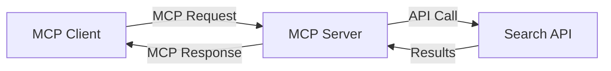
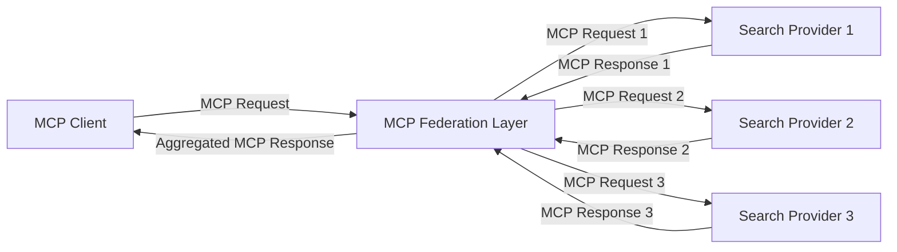
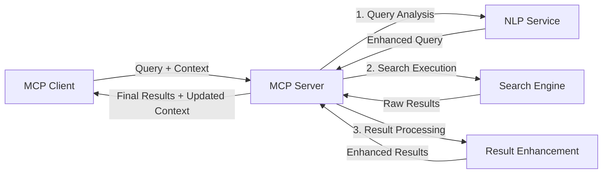

<!--
CO_OP_TRANSLATOR_METADATA:
{
  "original_hash": "333a03e51f90bdf3e6f1ba1694c73f36",
  "translation_date": "2025-07-17T11:32:05+00:00",
  "source_file": "05-AdvancedTopics/mcp-realtimesearch/README.md",
  "language_code": "bg"
}
-->
## Отказ от отговорност за примерите с код

> **Важно уточнение**: Примерите с код по-долу демонстрират интеграцията на Model Context Protocol (MCP) с функционалността за уеб търсене. Въпреки че следват моделите и структурите на официалните MCP SDK, те са опростени с образователна цел.
> 
> Тези примери показват:
> 
> 1. **Python имплементация**: FastMCP сървър, който предоставя инструмент за уеб търсене и се свързва с външен търсещ API. Този пример демонстрира правилно управление на жизнения цикъл, обработка на контекст и имплементация на инструменти, следвайки моделите на [официалния MCP Python SDK](https://github.com/modelcontextprotocol/python-sdk). Сървърът използва препоръчания Streamable HTTP транспорт, който е заместил по-стария SSE транспорт за продукционни среди.
> 
> 2. **JavaScript имплементация**: Имплементация на TypeScript/JavaScript, използваща FastMCP модела от [официалния MCP TypeScript SDK](https://github.com/modelcontextprotocol/typescript-sdk), за създаване на търсещ сървър с правилни дефиниции на инструменти и клиентски връзки. Следва най-новите препоръчани модели за управление на сесии и запазване на контекст.
> 
> Тези примери биха изисквали допълнителна обработка на грешки, автентикация и специфичен код за интеграция с API за продукционна употреба. Показаните крайни точки на търсещия API (`https://api.search-service.example/search`) са заместители и трябва да бъдат заменени с реални крайни точки на търсещи услуги.
> 
> За пълни детайли по имплементацията и най-актуалните подходи, моля, вижте [официалната MCP спецификация](https://spec.modelcontextprotocol.io/) и документацията на SDK.

## Основни концепции

### Рамката на Model Context Protocol (MCP)

В основата си Model Context Protocol предоставя стандартизиран начин за обмен на контекст между AI модели, приложения и услуги. В реално време уеб търсенето тази рамка е от съществено значение за създаване на последователни, многократни търсещи взаимодействия. Ключовите компоненти включват:

1. **Клиент-сървър архитектура**: MCP установява ясна разделителна линия между търсещите клиенти (заявители) и търсещите сървъри (доставчици), позволявайки гъвкави модели на разгръщане.

2. **JSON-RPC комуникация**: Протоколът използва JSON-RPC за обмен на съобщения, което го прави съвместим с уеб технологии и лесен за имплементация на различни платформи.

3. **Управление на контекст**: MCP дефинира структурирани методи за поддържане, обновяване и използване на търсещия контекст през множество взаимодействия.

4. **Дефиниции на инструменти**: Търсещите възможности се предоставят като стандартизирани инструменти с добре дефинирани параметри и стойности за връщане.

5. **Поддръжка на стрийминг**: Протоколът поддържа поточно предаване на резултати, което е от съществено значение за реално време търсене, където резултатите могат да пристигат постепенно.

### Модели за интеграция на уеб търсене

При интегриране на MCP с уеб търсене се открояват няколко модела:

#### 1. Директна интеграция с доставчик на търсене

В този модел MCP сървърът директно комуникира с един или повече търсещи API-та, превеждайки MCP заявки в специфични за API повиквания и форматирайки резултатите като MCP отговори.

#### 2. Федеративно търсене с запазване на контекст

Този модел разпределя търсещите заявки между множество MCP-съвместими доставчици на търсене, всеки от които може да е специализиран в различни типове съдържание или търсещи възможности, като същевременно поддържа единен контекст.

#### 3. Търсеща верига с подобрен контекст

В този модел търсещият процес е разделен на няколко етапа, като контекстът се обогатява на всяка стъпка, което води до постепенно по-релевантни резултати.

### Компоненти на търсещия контекст

В MCP-базираното уеб търсене контекстът обикновено включва:

- **История на заявките**: Предишни търсещи заявки в сесията
- **Потребителски предпочитания**: Език, регион, настройки за безопасно търсене
- **История на взаимодействията**: Кои резултати са кликнати, време прекарано върху резултати
- **Параметри на търсенето**: Филтри, подредби и други модификатори на търсенето
- **Домейн знания**: Специфичен контекст, свързан с темата на търсенето
- **Временен контекст**: Фактори за релевантност, базирани на време
- **Предпочитания за източници**: Доверени или предпочитани източници на информация

## Приложения и случаи на употреба

### Изследвания и събиране на информация

MCP подобрява изследователските работни потоци чрез:

- Запазване на изследователския контекст през търсещите сесии
- Позволяване на по-сложни и контекстуално релевантни заявки
- Поддръжка на федерация на търсене от множество източници
- Улесняване на извличането на знания от резултатите от търсенето

### Мониторинг на новини и тенденции в реално време

Търсенето с MCP предлага предимства за мониторинг на новини:

- Откриване на нови новинарски истории почти в реално време
- Контекстуално филтриране на релевантна информация
- Проследяване на теми и обекти през множество източници
- Персонализирани новинарски известия, базирани на потребителския контекст

### AI-подпомогнато сърфиране и изследване

MCP създава нови възможности за AI-подпомогнато сърфиране:

- Контекстуални предложения за търсене, базирани на текущата активност в браузъра
- Безпроблемна интеграция на уеб търсене с асистенти, захранвани от LLM
- Многократна прецизност на търсенето с поддържан контекст
- Подобрена проверка на факти и верификация на информация

## Бъдещи тенденции и иновации

### Еволюция на MCP в уеб търсенето

В бъдеще очакваме MCP да се развива, за да адресира:

- **Мултимодално търсене**: Интегриране на търсене по текст, изображения, аудио и видео с запазен контекст
- **Децентрализирано търсене**: Поддръжка на разпределени и федеративни търсещи екосистеми
- **Поверителност при търсене**: Механизми за търсене, запазващи поверителността с контекстуална осведоменост  
- **Разбиране на заявките**: Дълбок семантичен анализ на заявки за търсене на естествен език  

### Потенциални технологични напредъци

Нови технологии, които ще оформят бъдещето на MCP търсенето:

1. **Невронни архитектури за търсене**: Системи за търсене, базирани на вграждания, оптимизирани за MCP  
2. **Персонализиран контекст на търсене**: Изучаване на индивидуалните модели на търсене на потребителите с времето  
3. **Интеграция на графи на знанието**: Контекстуално търсене, подобрено чрез домейн-специфични графи на знанието  
4. **Крос-модален контекст**: Поддържане на контекст през различни модалности на търсене  

## Практически упражнения

### Упражнение 1: Настройване на базов MCP търсещ конвейер

В това упражнение ще научите как да:  
- Конфигурирате базова MCP среда за търсене  
- Имплементирате обработващи контекста за уеб търсене  
- Тествате и валидирате запазването на контекста през няколко итерации на търсене  

### Упражнение 2: Създаване на изследователски асистент с MCP търсене

Създайте пълно приложение, което:  
- Обработва изследователски въпроси на естествен език  
- Извършва контекстуално осведомени уеб търсения  
- Синтезира информация от множество източници  
- Представя организирани изследователски резултати  

### Упражнение 3: Имплементиране на федерация за търсене от множество източници с MCP

Разширено упражнение, обхващащо:  
- Контекстуално насочване на заявки към множество търсачки  
- Ранжиране и агрегиране на резултати  
- Контекстуално премахване на дублирани резултати  
- Обработка на метаданни, специфични за източниците  

## Допълнителни ресурси

- [Model Context Protocol Specification](https://spec.modelcontextprotocol.io/) - Официална спецификация на MCP и подробна документация на протокола  
- [Model Context Protocol Documentation](https://modelcontextprotocol.io/) - Подробни уроци и ръководства за имплементация  
- [MCP Python SDK](https://github.com/modelcontextprotocol/python-sdk) - Официална Python имплементация на MCP протокола  
- [MCP TypeScript SDK](https://github.com/modelcontextprotocol/typescript-sdk) - Официална TypeScript имплементация на MCP протокола  
- [MCP Reference Servers](https://github.com/modelcontextprotocol/servers) - Референтни имплементации на MCP сървъри  
- [Bing Web Search API Documentation](https://learn.microsoft.com/en-us/bing/search-apis/bing-web-search/overview) - Уеб търсещ API на Microsoft  
- [Google Custom Search JSON API](https://developers.google.com/custom-search/v1/overview) - Програмируема търсачка на Google  
- [SerpAPI Documentation](https://serpapi.com/search-api) - API за страници с резултати от търсачки  
- [Meilisearch Documentation](https://www.meilisearch.com/docs) - Отворен код търсещ двигател  
- [Elasticsearch Documentation](https://www.elastic.co/guide/index.html) - Разпределен търсещ и аналитичен двигател  
- [LangChain Documentation](https://python.langchain.com/docs/get_started/introduction) - Създаване на приложения с LLM  

## Резултати от обучението

След завършване на този модул ще можете да:  

- Разбирате основите на уеб търсенето в реално време и свързаните с него предизвикателства  
- Обяснявате как Model Context Protocol (MCP) подобрява възможностите за уеб търсене в реално време  
- Имплементирате решения за търсене, базирани на MCP, използвайки популярни рамки и API  
- Проектирате и внедрявате мащабируеми, високопроизводителни архитектури за търсене с MCP  
- Прилагате концепциите на MCP в различни случаи на употреба, включително семантично търсене, изследователска помощ и AI-подсилено сърфиране  
- Оценявате нововъзникващи тенденции и бъдещи иновации в технологиите за търсене, базирани на MCP  

### Съображения за доверие и безопасност

При имплементиране на уеб търсене, базирано на MCP, имайте предвид следните важни принципи от спецификацията на MCP:  

1. **Съгласие и контрол от потребителя**: Потребителите трябва изрично да дават съгласие и да разбират всички операции и достъп до данни. Това е особено важно при уеб търсения, които могат да достъпват външни източници на данни.  

2. **Поверителност на данните**: Осигурете подходящо третиране на заявките за търсене и резултатите, особено когато съдържат чувствителна информация. Внедрете адекватни контролни механизми за достъп, за да защитите потребителските данни.  

3. **Безопасност на инструментите**: Осигурете правилна авторизация и валидация на търсещите инструменти, тъй като те могат да представляват потенциален риск за сигурността чрез изпълнение на произволен код. Описанията на поведението на инструментите трябва да се считат за ненадеждни, освен ако не са получени от доверен сървър.  

4. **Ясна документация**: Предоставете ясна документация за възможностите, ограниченията и съображенията за сигурност на вашата MCP-базирана имплементация, следвайки насоките от спецификацията на MCP.  

5. **Здрави потоци за съгласие**: Изградете стабилни потоци за съгласие и авторизация, които ясно обясняват какво прави всеки инструмент преди да бъде разрешено използването му, особено за инструменти, които взаимодействат с външни уеб ресурси.  

За пълни подробности относно сигурността и съображенията за доверие в MCP, вижте [официалната документация](https://modelcontextprotocol.io/specification/2025-03-26#security-and-trust-%26-safety).  

## Какво следва  

- [5.12 Entra ID Authentication for Model Context Protocol Servers](../mcp-security-entra/README.md)

**Отказ от отговорност**:  
Този документ е преведен с помощта на AI преводаческа услуга [Co-op Translator](https://github.com/Azure/co-op-translator). Въпреки че се стремим към точност, моля, имайте предвид, че автоматизираните преводи могат да съдържат грешки или неточности. Оригиналният документ на неговия роден език трябва да се счита за авторитетен източник. За критична информация се препоръчва професионален човешки превод. Ние не носим отговорност за каквито и да е недоразумения или неправилни тълкувания, произтичащи от използването на този превод.