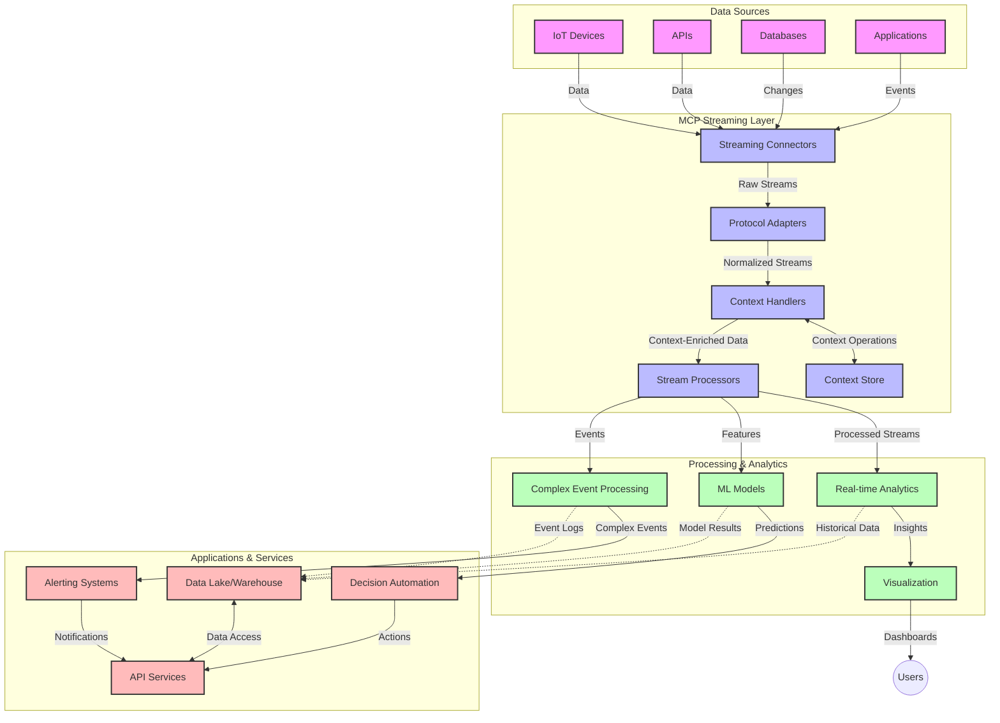

<!--
CO_OP_TRANSLATOR_METADATA:
{
  "original_hash": "b41174ac781ebf228b2043cbdfc09105",
  "translation_date": "2025-06-12T00:49:00+00:00",
  "source_file": "05-AdvancedTopics/mcp-realtimestreaming/README.md",
  "language_code": "bg"
}
-->
# Model Context Protocol за поточно предаване на данни в реално време

## Преглед

Поточното предаване на данни в реално време се превърна в незаменима част от съвременния свят, ориентиран към данни, където бизнесите и приложенията изискват незабавен достъп до информация, за да вземат своевременни решения. Model Context Protocol (MCP) представлява значителен напредък в оптимизирането на тези процеси на поточно предаване, като подобрява ефективността на обработката на данни, запазва контекстуалната цялост и повишава цялостната производителност на системата.

Този модул разглежда как MCP трансформира поточното предаване на данни в реално време, предоставяйки стандартизиран подход за управление на контекста между AI модели, платформи за стрийминг и приложения.

## Въведение в поточно предаване на данни в реално време

Поточното предаване на данни в реално време е технологичен модел, който позволява непрекъснат трансфер, обработка и анализ на данни в момента на тяхното генериране, давайки възможност на системите да реагират незабавно на нова информация. За разлика от традиционната пакетна обработка, която работи със статични набори от данни, стриймингът обработва данните в движение, предоставяйки прозрения и действия с минимално забавяне.

### Основни понятия за поточно предаване на данни в реално време:

- **Непрекъснат поток от данни**: Данните се обработват като непрекъснат, безкраен поток от събития или записи.
- **Обработка с ниска латентност**: Системите са проектирани да минимизират времето между генерирането и обработката на данните.
- **Мащабируемост**: Архитектурите за стрийминг трябва да се справят с променливи обеми и скорост на данните.
- **Устойчивост на грешки**: Системите трябва да бъдат устойчиви на повреди, за да осигурят непрекъснат поток от данни.
- **Обработка със състояние**: Запазването на контекст през събитията е от съществено значение за смислен анализ.

### Model Context Protocol и поточно предаване в реално време

Model Context Protocol (MCP) решава няколко ключови предизвикателства в среди за поточно предаване в реално време:

1. **Контекстуална непрекъснатост**: MCP стандартизира начина, по който контекстът се поддържа между разпределени компоненти на стрийминг, осигурявайки на AI моделите и възлите за обработка достъп до релевантен исторически и средов контекст.

2. **Ефективно управление на състоянието**: Чрез предоставяне на структурирани механизми за предаване на контекст, MCP намалява натоварването при управление на състоянието в стрийминг конвейерите.

3. **Взаимодействие**: MCP създава общ език за споделяне на контекст между различни стрийминг технологии и AI модели, позволявайки по-гъвкави и разширяеми архитектури.

4. **Оптимизиран контекст за стрийминг**: Имплементациите на MCP могат да приоритизират кои елементи от контекста са най-важни за вземане на решения в реално време, оптимизирайки както за производителност, така и за точност.

5. **Адаптивна обработка**: С правилно управление на контекста чрез MCP, стрийминг системите могат динамично да настройват обработката въз основа на променящите се условия и модели в данните.

В съвременни приложения, вариращи от IoT сензорни мрежи до финансови търговски платформи, интеграцията на MCP с технологии за стрийминг позволява по-интелигентна, контекстно осъзната обработка, която може адекватно да реагира на сложни и развиващи се ситуации в реално време.

## Учебни цели

След приключване на този урок ще можете да:

- Разберете основите на поточното предаване на данни в реално време и предизвикателствата му
- Обясните как Model Context Protocol (MCP) подобрява поточното предаване на данни в реално време
- Реализирате решения за стрийминг базирани на MCP с помощта на популярни рамки като Kafka и Pulsar
- Проектирате и внедрявате устойчиви на грешки, високопроизводителни стрийминг архитектури с MCP
- Прилагате концепциите на MCP в IoT, финансови търговски и AI-базирани аналитични случаи
- Оценявате нововъзникващи тенденции и бъдещи иновации в технологиите за стрийминг базирани на MCP

### Дефиниция и значение

Поточното предаване на данни в реално време включва непрекъснатото генериране, обработка и доставка на данни с минимална латентност. За разлика от пакетната обработка, при която данните се събират и обработват на групи, стрийминг данните се обработват постепенно при пристигането им, което позволява незабавни прозрения и действия.

Основни характеристики на поточното предаване на данни в реално време:

- **Ниска латентност**: Обработка и анализ на данни в рамките на милисекунди до секунди
- **Непрекъснат поток**: Непрекъснати потоци от данни от различни източници
- **Незабавна обработка**: Анализ на данните веднага при пристигането им, а не на групи
- **Архитектура, базирана на събития**: Реагиране на събития в момента, в който се случват

### Предизвикателства при традиционното поточно предаване на данни

Традиционните подходи към поточното предаване на данни имат няколко ограничения:

1. **Загуба на контекст**: Трудности при запазване на контекст в разпределени системи
2. **Проблеми с мащабируемостта**: Предизвикателства при справяне с големи обеми и висока скорост на данните
3. **Сложност при интеграция**: Проблеми с взаимодействието между различни системи
4. **Управление на латентността**: Балансиране между пропускателната способност и времето за обработка
5. **Консистентност на данните**: Осигуряване на точност и пълнота на данните през целия поток

## Разбиране на Model Context Protocol (MCP)

### Какво е MCP?

Model Context Protocol (MCP) е стандартизиран комуникационен протокол, създаден да улеснява ефективното взаимодействие между AI модели и приложения. В контекста на поточното предаване на данни в реално време, MCP предоставя рамка за:

- Запазване на контекста през целия конвейер за данни
- Стандартизиране на формати за обмен на данни
- Оптимизиране на предаването на големи набори от данни
- Подобряване на комуникацията между модели и между модели и приложения

### Основни компоненти и архитектура

Архитектурата на MCP за поточно предаване в реално време се състои от няколко ключови компонента:

1. **Context Handlers**: Управляват и поддържат контекстуална информация през целия стрийминг конвейер
2. **Stream Processors**: Обработват входящите потоци от данни с контекстно осъзнати техники
3. **Protocol Adapters**: Преобразуват между различни стрийминг протоколи, като същевременно запазват контекста
4. **Context Store**: Ефективно съхранява и извлича контекстуална информация
5. **Streaming Connectors**: Свързват се с различни стрийминг платформи (Kafka, Pulsar, Kinesis и др.)



### Как MCP подобрява обработката на данни в реално време

MCP отговаря на традиционните предизвикателства при стрийминг чрез:

- **Контекстуална цялост**: Поддържане на връзките между данните през целия конвейер
- **Оптимизирано предаване**: Намаляване на излишъка при обмен на данни чрез интелигентно управление на контекста
- **Стандартизирани интерфейси**: Осигуряване на последователни API за стрийминг компоненти
- **Намалена латентност**: Минимизиране на натоварването при обработка чрез ефективно управление на контекста
- **Подобрена мащабируемост**: Поддръжка на хоризонтално мащабиране с запазване на контекста

## Интеграция и внедряване

Системите за поточно предаване на данни в реално време изискват внимателен архитектурен дизайн и изпълнение, за да се запази както производителността, така и контекстуалната цялост. Model Context Protocol предлага стандартизиран подход за интегриране на AI модели и стрийминг технологии, позволявайки по-сложни, контекстно осъзнати обработващи конвейери.

### Преглед на интеграцията на MCP в стрийминг архитектури

Внедряването на MCP в среди за поточно предаване в реално време включва няколко ключови аспекта:

1. **Сериализация и транспорт на контекста**: MCP предоставя ефективни механизми за кодиране на контекстуална информация в стрийминг пакетите с данни, гарантирайки, че съществената информация следва данните през целия конвейер. Това включва стандартизирани формати за сериализация, оптимизирани за стрийминг транспорт.

2. **Обработка на потоци със състояние**: MCP позволява по-интелигентна обработка със състояние чрез поддържане на последователно представяне на контекста между възлите за обработка. Това е особено ценно в разпределени стрийминг архитектури, където управлението на състоянието традиционно е предизвикателство.

3. **Време на събитие срещу време на обработка**: Имплементациите на MCP трябва да адресират общия проблем с разграничаването кога са се случили събитията и кога се обработват. Протоколът може да включва времеви контекст, който запазва семантиката на времето на събитията.

4. **Управление на натоварването (Backpressure)**: Чрез стандартизиране на управлението на контекста MCP помага за регулиране на натоварването в стрийминг системите, позволявайки на компонентите да комуникират възможностите си за обработка и да настройват потока съответно.

5. **Операции с контекстови прозорци и агрегиране**: MCP улеснява по-сложни операции с прозорци, като предоставя структурирани представяния на времеви и релационни контексти, позволявайки по-смислени агрегирания през потоците от събития.

6. **Обработка точно веднъж (Exactly-Once Processing)**: В стрийминг системи, които изискват точно веднъж семантика, MCP може да включва метаданни за обработка, които помагат за проследяване и проверка на статуса на обработката в разпределени компоненти.

Внедряването на MCP в различни стрийминг технологии създава унифициран подход за управление на контекста, намалявайки нуждата от персонализиран интеграционен код и повишавайки способността на системата да поддържа смислен контекст при протичане на данните през конвейера.

### MCP в различни рамки за поточно предаване на данни

Следващите примери се основават на текущата спецификация на MCP, която се фокусира върху JSON-RPC базиран протокол с различни транспортни механизми. Кодът демонстрира как можете да реализирате персонализирани транспорти, които интегрират стрийминг платформи като Kafka и Pulsar, като същевременно запазват пълна съвместимост с протокола MCP.

Примерите са създадени, за да покажат как стрийминг платформите могат да бъдат интегрирани с MCP за осигуряване на обработка на данни в реално време, като се запазва контекстната осъзнатост, която е в основата на MCP. Този подход гарантира, че примерите точно отразяват текущото състояние на спецификацията MCP към юни 2025 г.

MCP може да бъде интегриран с популярни стрийминг рамки, включително:

#### Интеграция с Apache Kafka

```python
import asyncio
import json
from typing import Dict, Any, Optional
from confluent_kafka import Consumer, Producer, KafkaError
from mcp.client import Client, ClientCapabilities
from mcp.core.message import JsonRpcMessage
from mcp.core.transports import Transport

# Custom transport class to bridge MCP with Kafka
class KafkaMCPTransport(Transport):
    def __init__(self, bootstrap_servers: str, input_topic: str, output_topic: str):
        self.bootstrap_servers = bootstrap_servers
        self.input_topic = input_topic
        self.output_topic = output_topic
        self.producer = Producer({'bootstrap.servers': bootstrap_servers})
        self.consumer = Consumer({
            'bootstrap.servers': bootstrap_servers,
            'group.id': 'mcp-client-group',
            'auto.offset.reset': 'earliest'
        })
        self.message_queue = asyncio.Queue()
        self.running = False
        self.consumer_task = None
        
    async def connect(self):
        """Connect to Kafka and start consuming messages"""
        self.consumer.subscribe([self.input_topic])
        self.running = True
        self.consumer_task = asyncio.create_task(self._consume_messages())
        return self
        
    async def _consume_messages(self):
        """Background task to consume messages from Kafka and queue them for processing"""
        while self.running:
            try:
                msg = self.consumer.poll(1.0)
                if msg is None:
                    await asyncio.sleep(0.1)
                    continue
                
                if msg.error():
                    if msg.error().code() == KafkaError._PARTITION_EOF:
                        continue
                    print(f"Consumer error: {msg.error()}")
                    continue
                
                # Parse the message value as JSON-RPC
                try:
                    message_str = msg.value().decode('utf-8')
                    message_data = json.loads(message_str)
                    mcp_message = JsonRpcMessage.from_dict(message_data)
                    await self.message_queue.put(mcp_message)
                except Exception as e:
                    print(f"Error parsing message: {e}")
            except Exception as e:
                print(f"Error in consumer loop: {e}")
                await asyncio.sleep(1)
    
    async def read(self) -> Optional[JsonRpcMessage]:
        """Read the next message from the queue"""
        try:
            message = await self.message_queue.get()
            return message
        except Exception as e:
            print(f"Error reading message: {e}")
            return None
    
    async def write(self, message: JsonRpcMessage) -> None:
        """Write a message to the Kafka output topic"""
        try:
            message_json = json.dumps(message.to_dict())
            self.producer.produce(
                self.output_topic,
                message_json.encode('utf-8'),
                callback=self._delivery_report
            )
            self.producer.poll(0)  # Trigger callbacks
        except Exception as e:
            print(f"Error writing message: {e}")
    
    def _delivery_report(self, err, msg):
        """Kafka producer delivery callback"""
        if err is not None:
            print(f'Message delivery failed: {err}')
        else:
            print(f'Message delivered to {msg.topic()} [{msg.partition()}]')
    
    async def close(self) -> None:
        """Close the transport"""
        self.running = False
        if self.consumer_task:
            self.consumer_task.cancel()
            try:
                await self.consumer_task
            except asyncio.CancelledError:
                pass
        self.consumer.close()
        self.producer.flush()

# Example usage of the Kafka MCP transport
async def kafka_mcp_example():
    # Create MCP client with Kafka transport
    client = Client(
        {"name": "kafka-mcp-client", "version": "1.0.0"},
        ClientCapabilities({})
    )
    
    # Create and connect the Kafka transport
    transport = KafkaMCPTransport(
        bootstrap_servers="localhost:9092",
        input_topic="mcp-responses",
        output_topic="mcp-requests"
    )
    
    await client.connect(transport)
    
    try:
        # Initialize the MCP session
        await client.initialize()
        
        # Example of executing a tool via MCP
        response = await client.execute_tool(
            "process_data",
            {
                "data": "sample data",
                "metadata": {
                    "source": "sensor-1",
                    "timestamp": "2025-06-12T10:30:00Z"
                }
            }
        )
        
        print(f"Tool execution response: {response}")
        
        # Clean shutdown
        await client.shutdown()
    finally:
        await transport.close()

# Run the example
if __name__ == "__main__":
    asyncio.run(kafka_mcp_example())
```

#### Имплементация с Apache Pulsar

```python
import asyncio
import json
import pulsar
from typing import Dict, Any, Optional
from mcp.core.message import JsonRpcMessage
from mcp.core.transports import Transport
from mcp.server import Server, ServerOptions
from mcp.server.tools import Tool, ToolExecutionContext, ToolMetadata

# Create a custom MCP transport that uses Pulsar
class PulsarMCPTransport(Transport):
    def __init__(self, service_url: str, request_topic: str, response_topic: str):
        self.service_url = service_url
        self.request_topic = request_topic
        self.response_topic = response_topic
        self.client = pulsar.Client(service_url)
        self.producer = self.client.create_producer(response_topic)
        self.consumer = self.client.subscribe(
            request_topic,
            "mcp-server-subscription",
            consumer_type=pulsar.ConsumerType.Shared
        )
        self.message_queue = asyncio.Queue()
        self.running = False
        self.consumer_task = None
    
    async def connect(self):
        """Connect to Pulsar and start consuming messages"""
        self.running = True
        self.consumer_task = asyncio.create_task(self._consume_messages())
        return self
    
    async def _consume_messages(self):
        """Background task to consume messages from Pulsar and queue them for processing"""
        while self.running:
            try:
                # Non-blocking receive with timeout
                msg = self.consumer.receive(timeout_millis=500)
                
                # Process the message
                try:
                    message_str = msg.data().decode('utf-8')
                    message_data = json.loads(message_str)
                    mcp_message = JsonRpcMessage.from_dict(message_data)
                    await self.message_queue.put(mcp_message)
                    
                    # Acknowledge the message
                    self.consumer.acknowledge(msg)
                except Exception as e:
                    print(f"Error processing message: {e}")
                    # Negative acknowledge if there was an error
                    self.consumer.negative_acknowledge(msg)
            except Exception as e:
                # Handle timeout or other exceptions
                await asyncio.sleep(0.1)
    
    async def read(self) -> Optional[JsonRpcMessage]:
        """Read the next message from the queue"""
        try:
            message = await self.message_queue.get()
            return message
        except Exception as e:
            print(f"Error reading message: {e}")
            return None
    
    async def write(self, message: JsonRpcMessage) -> None:
        """Write a message to the Pulsar output topic"""
        try:
            message_json = json.dumps(message.to_dict())
            self.producer.send(message_json.encode('utf-8'))
        except Exception as e:
            print(f"Error writing message: {e}")
    
    async def close(self) -> None:
        """Close the transport"""
        self.running = False
        if self.consumer_task:
            self.consumer_task.cancel()
            try:
                await self.consumer_task
            except asyncio.CancelledError:
                pass
        self.consumer.close()
        self.producer.close()
        self.client.close()

# Define a sample MCP tool that processes streaming data
@Tool(
    name="process_streaming_data",
    description="Process streaming data with context preservation",
    metadata=ToolMetadata(
        required_capabilities=["streaming"]
    )
)
async def process_streaming_data(
    ctx: ToolExecutionContext,
    data: str,
    source: str,
    priority: str = "medium"
) -> Dict[str, Any]:
    """
    Process streaming data while preserving context
    
    Args:
        ctx: Tool execution context
        data: The data to process
        source: The source of the data
        priority: Priority level (low, medium, high)
        
    Returns:
        Dict containing processed results and context information
    """
    # Example processing that leverages MCP context
    print(f"Processing data from {source} with priority {priority}")
    
    # Access conversation context from MCP
    conversation_id = ctx.conversation_id if hasattr(ctx, 'conversation_id') else "unknown"
    
    # Return results with enhanced context
    return {
        "processed_data": f"Processed: {data}",
        "context": {
            "conversation_id": conversation_id,
            "source": source,
            "priority": priority,
            "processing_timestamp": ctx.get_current_time_iso()
        }
    }

# Example MCP server implementation using Pulsar transport
async def run_mcp_server_with_pulsar():
    # Create MCP server
    server = Server(
        {"name": "pulsar-mcp-server", "version": "1.0.0"},
        ServerOptions(
            capabilities={"streaming": True}
        )
    )
    
    # Register our tool
    server.register_tool(process_streaming_data)
    
    # Create and connect Pulsar transport
    transport = PulsarMCPTransport(
        service_url="pulsar://localhost:6650",
        request_topic="mcp-requests",
        response_topic="mcp-responses"
    )
    
    try:
        # Start the server with the Pulsar transport
        await server.run(transport)
    finally:
        await transport.close()

# Run the server
if __name__ == "__main__":
    asyncio.run(run_mcp_server_with_pulsar())
```

### Най-добри практики при внедряване

При внедряване на MCP за поточно предаване в реално време:

1. **Проектирайте за устойчивост на грешки**:
   - Реализирайте подходящо обработване на грешки
   - Използвайте опашки за неуспешни съобщения (dead-letter queues)
   - Проектирайте идемпотентни процесори

2. **Оптимизирайте за производителност**:
   - Конфигурирайте подходящи размери на буфери
   - Използвайте пакетна обработка, когато е подходящо
   - Реализирайте механизми за управление на натоварването (backpressure)

3. **Мониторинг и наблюдение**:
   - Следете метрики за обработка на потоци
   - Наблюдавайте разпространението на контекста
   - Настройте аларми за аномалии

4. **Осигурете сигурност на потоците**:
   - Прилагайте криптиране за чувствителни данни
   - Използвайте автентикация и авторизация
   - Прилагайте подходящи контрол на достъпа

### MCP в IoT и Edge изчисления

MCP подобрява IoT стрийминга чрез:

- Запазване на контекста на устройствата през целия конвейер за обработка
- Позволяване на ефективно стриймване от edge към облака
- Поддръжка на анализи в реално време върху IoT потоци от данни
- Улесняване на комуникацията устройство към устройство с контекст

Пример: Сензорни мрежи в умни градове  
```
Sensors → Edge Gateways → MCP Stream Processors → Real-time Analytics → Automated Responses
```

### Роля във финансовите транзакции и високочестотната търговия

MCP предлага значителни предимства за финансовия стрийминг на данни:

- Изключително ниска латентност при вземане на търговски решения
- Запазване на контекста на транзакциите през целия процес
- Поддръжка на сложна обработка на събития с контекстуална осъзнатост
- Осигуряване на консистентност на данните в разпределени търговски системи

### Подобряване на AI-базираната аналитика на данни

MCP създава нови възможности за стрийминг анализи:

- Обучение и инференция на модели в реално време
- Непрекъснато учене от поточни данни
- Контекстно осъзнато извличане на характеристики
- Конвейери за инференция с множество модели с запазен контекст

## Бъдещи тенденции и иновации

### Еволюция на MCP в реално време

В бъдеще очакваме MCP да се развива, за да адресира:

- **Интеграция с квантови изчисления**: Подготовка за стрийминг системи, базирани на квантови технологии
- **Обработка, родена на ръба (Edge-Native Processing)**: Пренасяне на повече контекстно осъзната обработка към edge устройства
- **Автономно управление на стрийминг**: Самооптимизиращи се стрийминг конвейери
- **Федеративен стрийминг**: Разпределена обработка с опазване на поверителността

### Потенциални технологични постижения

Новите технологии, които ще оформят бъдещето на MCP стрийминга:

1. **AI-оптимизирани стрийминг протоколи**: Персонализирани протоколи, създадени специално за AI натоварвания
2. **Интеграция на невроморфни изчисления**: Мозъкоподобни изчисления за обработка на потоци
3. **Serverless стрийминг**: Събитийно базирано, мащабируемо

**Отказ от отговорност**:  
Този документ е преведен с помощта на AI преводаческа услуга [Co-op Translator](https://github.com/Azure/co-op-translator). Въпреки че се стремим към точност, моля, имайте предвид, че автоматизираните преводи могат да съдържат грешки или неточности. Оригиналният документ на неговия език трябва да се счита за авторитетен източник. За критична информация се препоръчва професионален човешки превод. Ние не носим отговорност за никакви недоразумения или неправилни тълкувания, произтичащи от използването на този превод.