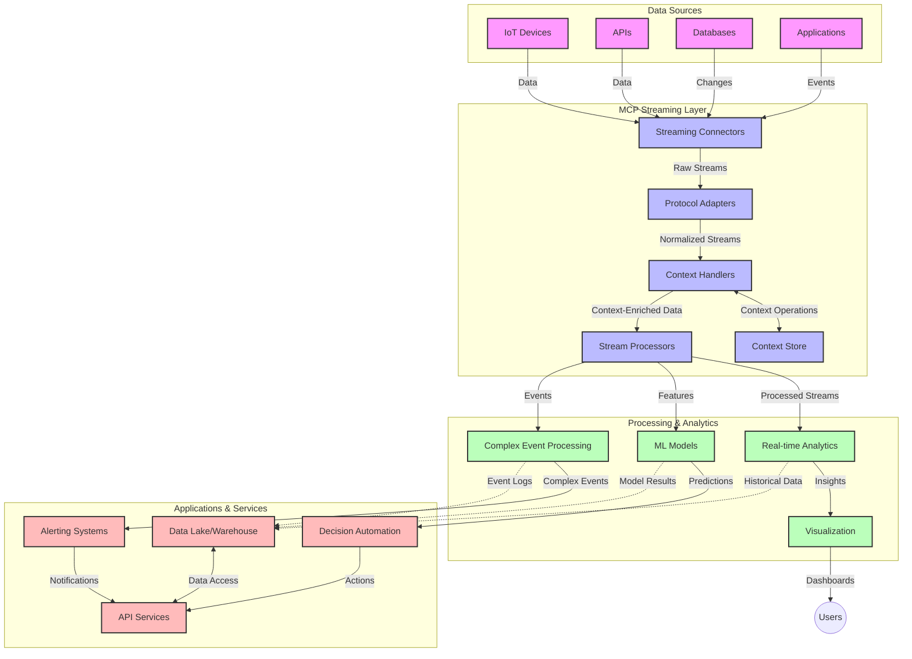

<!--
CO_OP_TRANSLATOR_METADATA:
{
  "original_hash": "68c518dbff8a3b127ed2aa934054c56c",
  "translation_date": "2025-06-11T17:31:49+00:00",
  "source_file": "05-AdvancedTopics/mcp-realtimestreaming/README.md",
  "language_code": "bg"
}
-->
# Протокол за контекст на моделите за стрийминг на данни в реално време

## Преглед

Стриймингът на данни в реално време се превърна в нещо съществено в съвременния свят, ориентиран към данните, където бизнесите и приложенията изискват незабавен достъп до информация за вземане на своевременни решения. Протоколът за контекст на моделите (MCP) представлява значителен напредък в оптимизирането на тези процеси на стрийминг в реално време, подобрявайки ефективността на обработката на данни, поддържайки контекстуалната цялост и повишавайки цялостната производителност на системата.

Този модул разглежда как MCP трансформира стрийминга на данни в реално време, предоставяйки стандартизиран подход за управление на контекста между AI модели, стрийминг платформи и приложения.

## Въведение в стрийминг на данни в реално време

Стриймингът на данни в реално време е технологичен парадигма, която позволява непрекъснат трансфер, обработка и анализ на данни в момента на тяхното генериране, позволявайки на системите да реагират незабавно на нова информация. За разлика от традиционната пакетна обработка, която работи с фиксирани набори от данни, стриймингът обработва данните в движение, доставяйки прозрения и действия с минимална латентност.

### Основни концепции на стрийминг на данни в реално време:

- **Непрекъснат поток от данни**: Данните се обработват като непрекъснат, безкраен поток от събития или записи.
- **Обработка с ниска латентност**: Системите са проектирани да минимизират времето между генериране и обработка на данните.
- **Мащабируемост**: Архитектурите за стрийминг трябва да могат да обработват променливи обеми и скорости на данните.
- **Толерантност към грешки**: Системите трябва да са устойчиви на повреди, за да осигурят непрекъснат поток от данни.
- **Състояние при обработката**: Поддържането на контекст между събитията е ключово за смислен анализ.

### Протоколът за контекст на моделите и стрийминг в реално време

Протоколът за контекст на моделите (MCP) адресира няколко критични предизвикателства в среди за стрийминг в реално време:

1. **Контекстуална непрекъснатост**: MCP стандартизира начина, по който контекстът се поддържа между разпределени компоненти на стрийминг, гарантирайки, че AI моделите и възлите за обработка имат достъп до релевантен исторически и околен контекст.

2. **Ефективно управление на състоянието**: Чрез предоставяне на структурирани механизми за предаване на контекста, MCP намалява натоварването при управление на състоянието в стрийминг конвейерите.

3. **Взаимна съвместимост**: MCP създава общ език за споделяне на контекст между различни стрийминг технологии и AI модели, позволявайки по-гъвкави и разширяеми архитектури.

4. **Оптимизиран за стрийминг контекст**: Имплементациите на MCP могат да приоритизират кои елементи от контекста са най-важни за вземане на решения в реално време, оптимизирайки както производителността, така и точността.

5. **Адаптивна обработка**: С правилно управление на контекста чрез MCP, стрийминг системите могат динамично да коригират обработката според променящите се условия и модели в данните.

В съвременните приложения, от IoT мрежи за сензори до финансови търговски платформи, интеграцията на MCP със стрийминг технологии позволява по-интелигентна, контекстно осъзната обработка, която може да реагира адекватно на сложни, динамични ситуации в реално време.

## Учебни цели

След края на този урок ще можете да:

- Разберете основите на стрийминг на данни в реално време и свързаните с него предизвикателства
- Обясните как Протоколът за контекст на моделите (MCP) подобрява стрийминга на данни в реално време
- Реализирате решения за стрийминг базирани на MCP с помощта на популярни рамки като Kafka и Pulsar
- Проектирате и внедрите устойчиви на грешки и високопроизводителни стрийминг архитектури с MCP
- Прилагате концепциите на MCP в IoT, финансови търговски и AI-аналитични сценарии
- Оценявате нововъзникващите тенденции и бъдещите иновации в стрийминг технологиите, базирани на MCP

### Дефиниция и значение

Стриймингът на данни в реално време включва непрекъснатото генериране, обработка и доставка на данни с минимална латентност. За разлика от пакетната обработка, при която данните се събират и обработват на групи, стриймингът обработва данните постепенно веднага щом пристигнат, позволявайки незабавни прозрения и действия.

Основни характеристики на стрийминг на данни в реално време:

- **Ниска латентност**: Обработка и анализ на данни в рамките на милисекунди до секунди
- **Непрекъснат поток**: Непрекъснати потоци от данни от различни източници
- **Незабавна обработка**: Анализ на данни веднага след пристигането им, а не на партиди
- **Архитектура, базирана на събития**: Реакция на събития в момента, в който се случват

### Предизвикателства в традиционния стрийминг на данни

Традиционните подходи към стрийминг на данни срещат няколко ограничения:

1. **Загуба на контекст**: Трудности при поддържането на контекст в разпределени системи
2. **Проблеми с мащабируемостта**: Трудности при мащабиране за обработка на големи обеми и висока скорост на данните
3. **Сложна интеграция**: Проблеми с взаимната съвместимост между различни системи
4. **Управление на латентността**: Балансиране между пропускателна способност и време за обработка
5. **Консистентност на данните**: Осигуряване на точност и пълнота на данните в потока

## Разбиране на Протокола за контекст на моделите (MCP)

### Какво е MCP?

Протоколът за контекст на моделите (MCP) е стандартизиран комуникационен протокол, предназначен да улесни ефективното взаимодействие между AI модели и приложения. В контекста на стрийминг на данни в реално време, MCP предоставя рамка за:

- Запазване на контекста през целия конвейер за данни
- Стандартизиране на формати за обмен на данни
- Оптимизиране на предаването на големи обеми данни
- Подобряване на комуникацията между модел-модел и модел-приложение

### Основни компоненти и архитектура

Архитектурата на MCP за стрийминг в реално време включва няколко ключови компонента:

1. **Контекстни обработващи**: Управляват и поддържат контекстуална информация през стрийминг конвейера
2. **Стрийм процесори**: Обработват входящите потоци данни, използвайки контекстно осъзнати техники
3. **Протоколни адаптери**: Конвертират между различни стрийминг протоколи, запазвайки контекста
4. **Контекстно хранилище**: Ефективно съхранява и извлича контекстуална информация
5. **Стрийминг конектори**: Свързват се с различни стрийминг платформи (Kafka, Pulsar, Kinesis и др.)



### Как MCP подобрява обработката на данни в реално време

MCP се справя с традиционните предизвикателства при стрийминг чрез:

- **Контекстуална цялост**: Поддържане на връзките между данните през целия конвейер
- **Оптимизирано предаване**: Намаляване на излишъка в обмена на данни чрез интелигентно управление на контекста
- **Стандартизирани интерфейси**: Осигуряване на последователни API-та за стрийминг компоненти
- **Намалена латентност**: Минимизиране на натоварването при обработка чрез ефективно управление на контекста
- **Подобрена мащабируемост**: Поддържане на хоризонтално мащабиране, без загуба на контекст

## Интеграция и внедряване

Системите за стрийминг на данни в реално време изискват внимателен архитектурен дизайн и внедряване, за да поддържат както производителност, така и контекстуална цялост. Протоколът за контекст на моделите предлага стандартизиран подход за интегриране на AI модели и стрийминг технологии, позволявайки по-сложни, контекстно осъзнати конвейери за обработка.

### Преглед на интеграцията на MCP в стрийминг архитектури

Внедряването на MCP в среди за стрийминг в реално време включва няколко ключови аспекта:

1. **Сериализация и трансфер на контекст**: MCP осигурява ефективни механизми за кодиране на контекстуална информация в стрийминг пакетите с данни, гарантирайки, че важният контекст следва данните през целия процес на обработка. Това включва стандартизирани формати за сериализация, оптимизирани за стрийминг транспорт.

2. **Състояние при обработка на потоци**: MCP позволява по-интелигентна обработка с поддържане на състояние, като поддържа последователно представяне на контекста между възлите за обработка. Това е особено ценно в разпределени стрийминг архитектури, където управлението на състоянието е традиционно предизвикателство.

3. **Време на събитието срещу време на обработка**: Имплементациите на MCP в стрийминг системи трябва да адресират често срещаното предизвикателство да различават кога са се случили събитията и кога се обработват. Протоколът може да включва времеви контекст, който запазва семантиката на времето на събитието.

4. **Управление на натоварването (Backpressure)**: Чрез стандартизирано управление на контекста, MCP помага за контролиране на натоварването в стрийминг системите, позволявайки на компонентите да комуникират капацитета си за обработка и да регулират потока съответно.

5. **Опресняване и агрегиране на контекстни прозорци**: MCP улеснява по-сложни операции с прозорци, като предоставя структурирани представяния на времеви и връзкови контексти, позволявайки по-смислени агрегирания в потоците от събития.

6. **Обработка с точно веднъж (Exactly-Once Processing)**: В стрийминг системи, изискващи семантика на точно веднъж, MCP може да включва метаданни за обработка, които помагат за проследяване и проверка на състоянието на обработката в разпределени компоненти.

Внедряването на MCP в различни стрийминг технологии създава единен подход за управление на контекста, намалявайки нуждата от специфичен интеграционен код и подобрявайки способността на системата да поддържа смислен контекст при преминаването на данните през конвейера.

### MCP в различни рамки за стрийминг на данни

MCP може да се интегрира с популярни стрийминг рамки, включително:

#### Интеграция с Apache Kafka

```python
from mcp_streaming import MCPKafkaConnector

# Initialize MCP Kafka connector
connector = MCPKafkaConnector(
    bootstrap_servers='localhost:9092',
    context_preservation=True
)

# Create a context-aware consumer
consumer = connector.create_consumer('input-topic')

# Process streaming data with context
for message in consumer:
    context = message.get_context()
    data = message.get_value()
    
    # Process with context awareness
    result = process_with_context(data, context)
    
    # Produce output with preserved context
    connector.produce('output-topic', result, context=context)
```

#### Имплементация с Apache Pulsar

```python
from mcp_streaming import MCPPulsarClient

# Initialize MCP Pulsar client
client = MCPPulsarClient('pulsar://localhost:6650')

# Subscribe with context awareness
consumer = client.subscribe('input-topic', 'subscription-name', 
                           context_enabled=True)

# Process messages with context preservation
while True:
    message = consumer.receive()
    context = message.get_context()
    
    # Process with context
    result = process_with_context(message.data(), context)
    
    # Acknowledge the message
    consumer.acknowledge(message)
    
    # Send result with preserved context
    producer = client.create_producer('output-topic')
    producer.send(result, context=context)
```

### Добри практики при внедряване

При внедряване на MCP за стрийминг в реално време:

1. **Проектиране за устойчивост на грешки**:
   - Прилагане на адекватно управление на грешки
   - Използване на опашки за неуспешни съобщения (dead-letter queues)
   - Проектиране на идемпотентни процесори

2. **Оптимизиране на производителността**:
   - Конфигуриране на подходящи размери на буферите
   - Използване на пакетна обработка, където е подходящо
   - Внедряване на механизми за контрол на натоварването

3. **Мониторинг и наблюдение**:
   - Проследяване на метрики за обработка на потока
   - Мониторинг на разпространението на контекста
   - Настройване на аларми при аномалии

4. **Защита на потоците**:
   - Прилагане на криптиране за чувствителни данни
   - Използване на автентикация и авторизация
   - Прилагане на адекватен контрол на достъпа

### MCP в IoT и Edge изчисления

MCP подобрява IoT стрийминга чрез:

- Запазване на контекста на устройствата през целия процес
- Позволяване на ефективен стрийминг от edge към облака
- Поддръжка на анализи в реално време върху IoT потоци данни
- Улесняване на комуникация устройство-устройство с контекст

Пример: Мрежи от сензори в умни градове  
```
Sensors → Edge Gateways → MCP Stream Processors → Real-time Analytics → Automated Responses
```

### Роля във финансови транзакции и високочестотна търговия

MCP осигурява значителни предимства при финансов стрийминг на данни:

- Изключително ниска латентност при вземане на търговски решения
- Поддържане на контекст на транзакциите през целия процес
- Поддръжка на сложна обработка на събития с контекстуална осведоменост
- Осигуряване на консистентност на данните в разпределени търговски системи

### Подобряване на AI-управляваната аналитика на данни

MCP отваря нови възможности за стрийминг анализи:

- Обучение и извеждане на модели в реално време
- Непрекъснато обучение от стрийминг данни
- Контекстно осъзнато извличане на характеристики
- Мулти-моделни конвейери за извеждане с запазен контекст

## Бъдещи тенденции и иновации

### Еволюция на MCP в среди за реално време

В бъдеще очакваме MCP да се развива, за да адресира:

- **Интеграция с квантови изчисления**: Подготовка за стрийминг системи, базирани на квантови технологии
- **Обработка, ориентирана към edge устройства**: Преместване на повече контекстно осъзната обработка към edge устройствата
- **Автономно управление на потоци**: Самооптимизиращи се стрийминг конвейери
- **Федеративен стрийминг**: Разпределена обработка с поддържане на поверителност

### Потенциални технологични напредъци

Нови технологии, които ще оформят бъдещето на MCP стрийминг:

1. **AI-оптимизирани стрийминг протоколи**: Персонализирани протоколи, създадени специално за AI натоварвания
2. **Интеграция на невроморфни изчисления**: Мозъкообразни изчисления за обработка на потоци
3. **Сървърлес стрийминг**: Събитийно ориентиран, мащабируем стрийминг без управление на инфраструктура
4. **Разпределени контекстни хранилища**: Глобално разпределено, но силно консистентно управление на контекста

## Практически упражнения

### Упражнение 1: Настройка на базов MCP стрийминг конвейер

В това упражнение ще научите как да:  
- Конфигурирате базова MCP стрийминг среда  
- Реализирате контекстни обработващи за стрийминг обработка  
- Тествате и валидирате запазването

**Отказ от отговорност**:  
Този документ е преведен с помощта на AI преводаческа услуга [Co-op Translator](https://github.com/Azure/co-op-translator). Въпреки че се стремим към точност, моля, имайте предвид, че автоматизираните преводи могат да съдържат грешки или неточности. Оригиналният документ на неговия оригинален език трябва да се счита за авторитетен източник. За критична информация се препоръчва професионален човешки превод. Ние не носим отговорност за никакви недоразумения или неправилни тълкувания, произтичащи от използването на този превод.