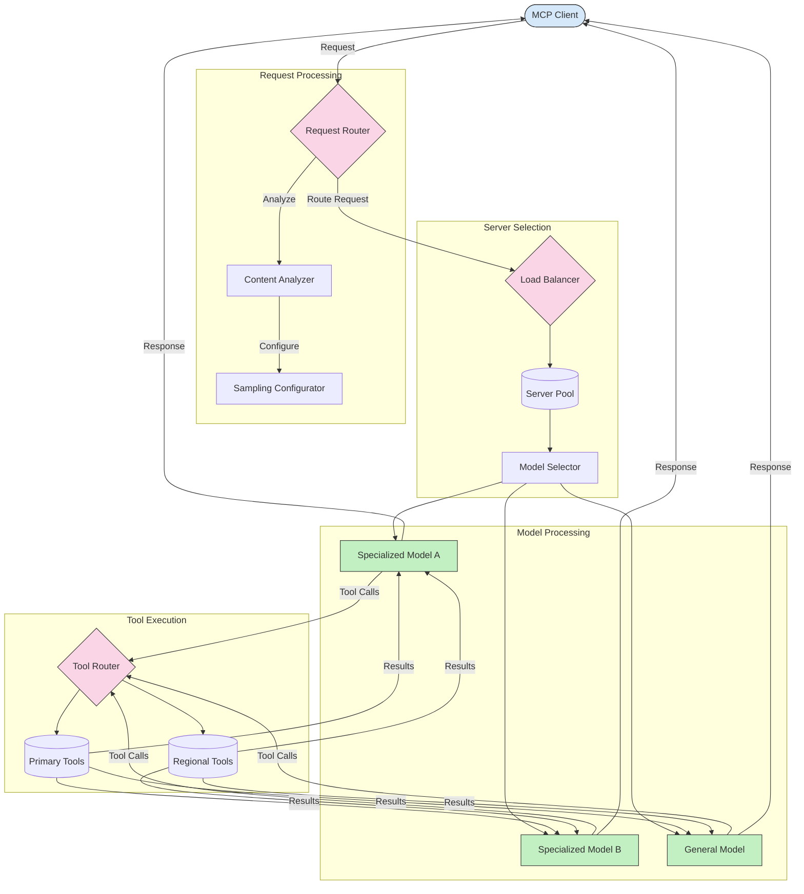

<!--
CO_OP_TRANSLATOR_METADATA:
{
  "original_hash": "af40eab7bd6ebf7e607f982a5506a5b5",
  "translation_date": "2025-06-13T01:13:20+00:00",
  "source_file": "05-AdvancedTopics/mcp-routing/README.md",
  "language_code": "bg"
}
-->
## Архитектура за извадки и маршрутизиране в MCP

Извличането на извадки е ключов компонент на Model Context Protocol (MCP), който позволява ефективна обработка и маршрутизиране на заявки. То включва анализ на входящите заявки, за да се определи най-подходящият модел или услуга за тяхното обработване, базирано на различни критерии като тип съдържание, контекст на потребителя и натоварване на системата.

Извличането на извадки и маршрутизирането могат да се комбинират, за да се създаде здрава архитектура, която оптимизира използването на ресурсите и осигурява висока наличност. Процесът на извличане на извадки може да се използва за класифициране на заявките, докато маршрутизирането ги насочва към подходящите модели или услуги.

Диаграмата по-долу илюстрира как извличането на извадки и маршрутизирането работят заедно в цялостна MCP архитектура:

## Какво следва

- [5.6 Извличане на извадки](../mcp-sampling/README.md)

**Отказ от отговорност**:  
Този документ е преведен с помощта на AI преводаческа услуга [Co-op Translator](https://github.com/Azure/co-op-translator). Въпреки че се стремим към точност, моля, имайте предвид, че автоматизираните преводи могат да съдържат грешки или неточности. Оригиналният документ на неговия роден език трябва да се счита за авторитетен източник. За критична информация се препоръчва професионален човешки превод. Ние не носим отговорност за каквито и да е недоразумения или неправилни тълкувания, възникнали от използването на този превод.