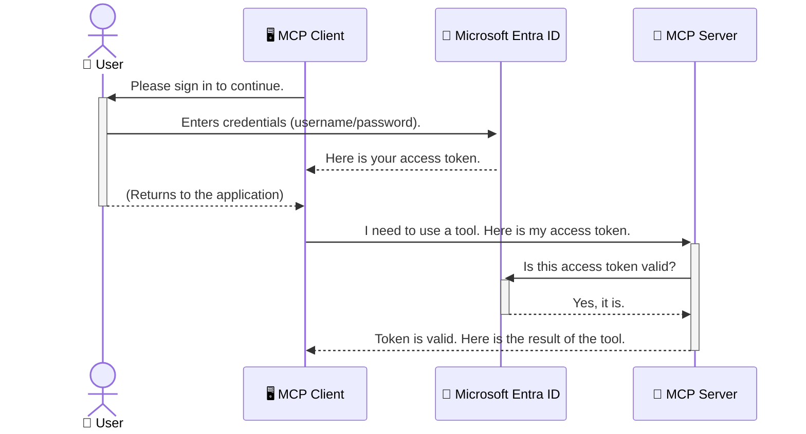

<!--
CO_OP_TRANSLATOR_METADATA:
{
  "original_hash": "6e562d7e5a77c8982da4aa8f762ad1d8",
  "translation_date": "2025-07-14T03:16:45+00:00",
  "source_file": "05-AdvancedTopics/mcp-security-entra/README.md",
  "language_code": "bg"
}
-->
# Защита на AI работни потоци: Entra ID удостоверяване за Model Context Protocol сървъри

## Въведение  
Защитата на вашия Model Context Protocol (MCP) сървър е също толкова важна, колкото заключването на входната врата на дома ви. Оставянето на MCP сървъра отворен излага вашите инструменти и данни на неоторизиран достъп, което може да доведе до пробиви в сигурността. Microsoft Entra ID предлага стабилно облачно решение за управление на идентичности и достъп, което гарантира, че само упълномощени потребители и приложения могат да взаимодействат с вашия MCP сървър. В този раздел ще научите как да защитите AI работните си потоци чрез удостоверяване с Entra ID.

## Учебни цели  
След края на този раздел ще можете да:

- Разберете значението на защитата на MCP сървърите.  
- Обясните основите на Microsoft Entra ID и OAuth 2.0 удостоверяването.  
- Разпознаете разликата между публични и конфиденциални клиенти.  
- Прилагате Entra ID удостоверяване както в локални (публичен клиент), така и в отдалечени (конфиденциален клиент) MCP сървърни сценарии.  
- Използвате най-добрите практики за сигурност при разработка на AI работни потоци.

## Сигурност и MCP  

Точно както не бихте оставили входната врата на дома си отключена, така не трябва да оставяте MCP сървъра си отворен за всеки. Защитата на AI работните потоци е от съществено значение за създаването на стабилни, надеждни и безопасни приложения. Тази глава ще ви запознае с използването на Microsoft Entra ID за защита на MCP сървърите, като гарантира, че само упълномощени потребители и приложения имат достъп до вашите инструменти и данни.

## Защо сигурността е важна за MCP сървърите  

Представете си, че вашият MCP сървър разполага с инструмент, който може да изпраща имейли или да достъпва база данни с клиенти. Небезопасен сървър означава, че всеки може потенциално да използва този инструмент, което води до неоторизиран достъп до данни, спам или други злонамерени действия.

Чрез внедряване на удостоверяване вие гарантирате, че всяка заявка към сървъра се проверява, потвърждавайки самоличността на потребителя или приложението, което я прави. Това е първата и най-важна стъпка за защита на вашите AI работни потоци.

## Въведение в Microsoft Entra ID  

[**Microsoft Entra ID**](https://adoption.microsoft.com/microsoft-security/entra/) е облачна услуга за управление на идентичности и достъп. Можете да го разглеждате като универсален охранител за вашите приложения. Той се грижи за сложния процес на проверка на потребителските идентичности (удостоверяване) и определяне на правата им (авторизация).

С помощта на Entra ID можете да:

- Осигурите сигурно влизане за потребителите.  
- Защитите API-та и услуги.  
- Управлявате политики за достъп от централизирано място.

За MCP сървърите Entra ID предлага стабилно и широко доверено решение за управление на това кой може да използва възможностите на вашия сървър.

---

## Разбиране на магията: Как работи удостоверяването с Entra ID  

Entra ID използва отворени стандарти като **OAuth 2.0** за обработка на удостоверяването. Въпреки че детайлите могат да са сложни, основната идея е проста и може да се обясни с аналогия.

### Леко въведение в OAuth 2.0: Ключът на паркинг асистента  

Представете си OAuth 2.0 като услуга за паркиране на колата ви. Когато пристигате в ресторант, не давате на паркинг асистента главния ключ. Вместо това му предоставяте **ключ за паркинг**, който има ограничени права – може да запали колата и да заключи вратите, но не може да отвори багажника или жабката.

В тази аналогия:

- **Вие** сте **Потребителят**.  
- **Вашата кола** е **MCP сървърът** с ценните инструменти и данни.  
- **Паркинг асистентът** е **Microsoft Entra ID**.  
- **Паркинг служителят** е **MCP клиентът** (приложението, което се опитва да достъпи сървъра).  
- **Ключът за паркинг** е **Access Token**.

Access token е защитен текстов низ, който MCP клиентът получава от Entra ID след вашето влизане. Клиентът представя този токен на MCP сървъра при всяка заявка. Сървърът може да провери токена, за да се увери, че заявката е легитимна и че клиентът има необходимите права, без никога да се налага да обработва вашите реални данни за вход (като парола).

### Поток на удостоверяване  

Ето как протича процесът на практика:



### Представяне на Microsoft Authentication Library (MSAL)  

Преди да се потопим в кода, важно е да запознаем с ключов компонент, който ще видите в примерите: **Microsoft Authentication Library (MSAL)**.

MSAL е библиотека, разработена от Microsoft, която улеснява значително работата на разработчиците с удостоверяването. Вместо да пишете сложен код за управление на сигурностни токени, влизания и обновяване на сесии, MSAL върши тежката работа вместо вас.

Използването на библиотека като MSAL е силно препоръчително, защото:

- **Сигурна е:** Прилага индустриални стандарти и най-добри практики за сигурност, намалявайки риска от уязвимости в кода ви.  
- **Опрощава разработката:** Абстрахира сложността на протоколите OAuth 2.0 и OpenID Connect, позволявайки ви да добавите стабилно удостоверяване с няколко реда код.  
- **Поддържа се:** Microsoft активно поддържа и обновява MSAL, за да отговаря на нови заплахи и промени в платформите.

MSAL поддържа множество езици и рамки за приложения, включително .NET, JavaScript/TypeScript, Python, Java, Go, както и мобилни платформи като iOS и Android. Това означава, че можете да използвате еднакви модели за удостоверяване във всички технологии, които използвате.

За повече информация за MSAL, можете да разгледате официалната [MSAL документация](https://learn.microsoft.com/entra/identity-platform/msal-overview).

---

## Защита на вашия MCP сървър с Entra ID: Стъпка по стъпка  

Сега нека разгледаме как да защитите локален MCP сървър (който комуникира през `stdio`) с помощта на Entra ID. Този пример използва **публичен клиент**, подходящ за приложения, работещи на машината на потребителя, като десктоп приложение или локален сървър за разработка.

### Сценарий 1: Защита на локален MCP сървър (с публичен клиент)  

В този сценарий разглеждаме MCP сървър, който работи локално, комуникира през `stdio` и използва Entra ID за удостоверяване на потребителя преди да му позволи достъп до инструментите. Сървърът ще има един инструмент, който извлича профилната информация на потребителя от Microsoft Graph API.

#### 1. Настройване на приложението в Entra ID  

Преди да започнете с кода, трябва да регистрирате приложението си в Microsoft Entra ID. Това информира Entra ID за вашето приложение и му дава разрешение да използва услугата за удостоверяване.

1. Отидете на **[Microsoft Entra портал](https://entra.microsoft.com/)**.  
2. Изберете **App registrations** и кликнете на **New registration**.  
3. Дайте име на приложението (например "My Local MCP Server").  
4. За **Supported account types** изберете **Accounts in this organizational directory only**.  
5. Можете да оставите **Redirect URI** празно за този пример.  
6. Кликнете **Register**.

След регистрацията запишете **Application (client) ID** и **Directory (tenant) ID** – ще ви трябват в кода.

#### 2. Кодът: Обяснение  

Нека разгледаме ключовите части от кода, които се занимават с удостоверяването. Пълният код за този пример е наличен в папката [Entra ID - Local - WAM](https://github.com/Azure-Samples/mcp-auth-servers/tree/main/src/entra-id-local-wam) в [mcp-auth-servers GitHub хранилището](https://github.com/Azure-Samples/mcp-auth-servers).

**`AuthenticationService.cs`**

Този клас отговаря за взаимодействието с Entra ID.

- **`CreateAsync`**: Този метод инициализира `PublicClientApplication` от MSAL. Конфигуриран е с `clientId` и `tenantId` на вашето приложение.  
- **`WithBroker`**: Активира използването на брокер (като Windows Web Account Manager), който осигурява по-сигурно и безпроблемно единично влизане.  
- **`AcquireTokenAsync`**: Основният метод. Първо се опитва да получи токен тихо (без да изисква от потребителя да влиза отново, ако вече има валидна сесия). Ако това не е възможно, подканва потребителя да влезе интерактивно.

```csharp
// Simplified for clarity
public static async Task<AuthenticationService> CreateAsync(ILogger<AuthenticationService> logger)
{
    var msalClient = PublicClientApplicationBuilder
        .Create(_clientId) // Your Application (client) ID
        .WithAuthority(AadAuthorityAudience.AzureAdMyOrg)
        .WithTenantId(_tenantId) // Your Directory (tenant) ID
        .WithBroker(new BrokerOptions(BrokerOptions.OperatingSystems.Windows))
        .Build();

    // ... cache registration ...

    return new AuthenticationService(logger, msalClient);
}

public async Task<string> AcquireTokenAsync()
{
    try
    {
        // Try silent authentication first
        var accounts = await _msalClient.GetAccountsAsync();
        var account = accounts.FirstOrDefault();

        AuthenticationResult? result = null;

        if (account != null)
        {
            result = await _msalClient.AcquireTokenSilent(_scopes, account).ExecuteAsync();
        }
        else
        {
            // If no account, or silent fails, go interactive
            result = await _msalClient.AcquireTokenInteractive(_scopes).ExecuteAsync();
        }

        return result.AccessToken;
    }
    catch (Exception ex)
    {
        _logger.LogError(ex, "An error occurred while acquiring the token.");
        throw; // Optionally rethrow the exception for higher-level handling
    }
}
```

**`Program.cs`**

Тук се настройва MCP сървърът и се интегрира услугата за удостоверяване.

- **`AddSingleton<AuthenticationService>`**: Регистрира `AuthenticationService` в контейнера за dependency injection, за да може да се използва от други части на приложението (като нашия инструмент).  
- Инструментът **`GetUserDetailsFromGraph`** изисква инстанция на `AuthenticationService`. Преди да направи нещо, той извиква `authService.AcquireTokenAsync()`, за да получи валиден access token. Ако удостоверяването е успешно, използва токена, за да извика Microsoft Graph API и да вземе детайлите на потребителя.

```csharp
// Simplified for clarity
[McpServerTool(Name = "GetUserDetailsFromGraph")]
public static async Task<string> GetUserDetailsFromGraph(
    AuthenticationService authService)
{
    try
    {
        // This will trigger the authentication flow
        var accessToken = await authService.AcquireTokenAsync();

        // Use the token to create a GraphServiceClient
        var graphClient = new GraphServiceClient(
            new BaseBearerTokenAuthenticationProvider(new TokenProvider(authService)));

        var user = await graphClient.Me.GetAsync();

        return System.Text.Json.JsonSerializer.Serialize(user);
    }
    catch (Exception ex)
    {
        return $"Error: {ex.Message}";
    }
}
```

#### 3. Как всичко работи заедно  

1. Когато MCP клиентът се опита да използва инструмента `GetUserDetailsFromGraph`, инструментът първо извиква `AcquireTokenAsync`.  
2. `AcquireTokenAsync` задейства MSAL библиотеката да провери за валиден токен.  
3. Ако токен не е намерен, MSAL чрез брокера подканва потребителя да влезе с Entra ID акаунта си.  
4. След влизане Entra ID издава access token.  
5. Инструментът получава токена и го използва, за да направи защитено повикване към Microsoft Graph API.  
6. Детайлите на потребителя се връщат към MCP клиента.

Този процес гарантира, че само удостоверени потребители могат да използват инструмента, като по този начин ефективно защитават локалния MCP сървър.

### Сценарий 2: Защита на отдалечен MCP сървър (с конфиденциален клиент)  

Когато MCP сървърът работи на отдалечена машина (например облачен сървър) и комуникира чрез протокол като HTTP Streaming, изискванията за сигурност са различни. В този случай трябва да използвате **конфиденциален клиент** и **Authorization Code Flow**. Това е по-сигурен метод, тъй като тайните на приложението никога не се излагат на браузъра.

Този пример използва MCP сървър на TypeScript, който използва Express.js за обработка на HTTP заявки.

#### 1. Настройване на приложението в Entra ID  

Настройката в Entra ID е подобна на тази за публичния клиент, но с една ключова разлика: трябва да създадете **client secret**.

1. Отидете на **[Microsoft Entra портал](https://entra.microsoft.com/)**.  
2. В регистрацията на приложението отидете на таба **Certificates & secrets**.  
3. Кликнете **New client secret**, дайте описание и натиснете **Add**.  
4. **Важно:** Копирайте стойността на секрета веднага. След това няма да можете да я видите отново.  
5. Трябва също да конфигурирате **Redirect URI**. Отидете на таба **Authentication**, кликнете **Add a platform**, изберете **Web** и въведете redirect URI за вашето приложение (например `http://localhost:3001/auth/callback`).

> **⚠️ Важна бележка за сигурността:** За продукционни приложения Microsoft силно препоръчва използването на **безсекретно удостоверяване** като **Managed Identity** или **Workload Identity Federation** вместо client secrets. Client secrets представляват риск за сигурността, тъй като могат да бъдат изтекли или компрометирани. Управляваните идентичности предлагат по-сигурен подход, като премахват нуждата от съхранение на идентификационни данни в кода или конфигурацията.  
>  
> За повече информация относно управляваните идентичности и тяхната имплементация вижте [Managed identities for Azure resources overview](https://learn.microsoft.com/entra/identity/managed-identities-azure-resources/overview).

#### 2. Кодът: Обяснение  

Този пример използва сесийно базиран подход. Когато потребителят се удостоверява, сървърът съхранява access token и refresh token в сесия и дава на потребителя сесионен токен. Този сесионен токен се използва за последващи заявки. Пълният код за този пример е наличен в папката [Entra ID - Confidential client](https://github.com/Azure-Samples/mcp-auth-servers/tree/main/src/entra-id-cca-session) в [mcp-auth-servers GitHub хранилището](https://github.com/Azure-Samples/mcp-auth-servers).

**`Server.ts`**

Този файл настройва Express сървъра и MCP транспортния слой.

- **`requireBearerAuth`**: Това е middleware, който защитава endpoint-ите `/sse` и `/message`. Проверява за валиден bearer token в `Authorization` хедъра на заявката.  
- **`EntraIdServerAuthProvider`**: Това е персонализиран клас, който имплементира интерфейса `McpServerAuthorizationProvider`. Отговаря за обработката на OAuth 2.0 потока.  
- **`/auth/callback`**: Този endpoint обработва пренасочването от Entra ID след като потребителят се е удостоверил. Разменя authorization code за access token и refresh token.

```typescript
// Simplified for clarity
const app = express();
const { server } = createServer();
const provider = new EntraIdServerAuthProvider();

// Protect the SSE endpoint
app.get("/sse", requireBearerAuth({
  provider,
  requiredScopes: ["User.Read"]
}), async (req, res) => {
  // ... connect to the transport ...
});

// Protect the message endpoint
app.post("/message", requireBearerAuth({
  provider,
  requiredScopes: ["User.Read"]
}), async (req, res) => {
  // ... handle the message ...
});

// Handle the OAuth 2.0 callback
app.get("/auth/callback", (req, res) => {
  provider.handleCallback(req.query.code, req.query.state)
    .then(result => {
      // ... handle success or failure ...
    });
});
```

**`Tools.ts`**

Този файл дефинира инструментите, които MCP сървърът предоставя. Инструментът `getUserDetails` е подобен на този в предишния пример, но взема access token от сесията.

```typescript
// Simplified for clarity
server.setRequestHandler(CallToolRequestSchema, async (request) => {
  const { name } = request.params;
  const context = request.params?.context as { token?: string } | undefined;
  const sessionToken = context?.token;

  if (name === ToolName.GET_USER_DETAILS) {
    if (!sessionToken) {
      throw new AuthenticationError("Authentication token is missing or invalid. Ensure the token is provided in the request context.");
    }

    // Get the Entra ID token from the session store
    const tokenData = tokenStore.getToken(sessionToken);
    const entraIdToken = tokenData.accessToken;

    const graphClient = Client.init({
      authProvider: (done) => {
        done(null, entraIdToken);
      }
    });

    const user = await graphClient.api('/me').get();

    // ... return user details ...
  }
});
```

**`auth/EntraIdServerAuthProvider.ts`**

Този клас управлява логиката за:

- Пренасочване на потребителя към страницата за влизане на Entra ID.  
- Размяна на authorization code за access token.  
- Съхранение на токените в `tokenStore`.  
- Обновяване на access token при изтичане.

#### 3. Как всичко работи заедно  

1. Когато потребителят се опита да се свърже с MCP сървъра за първи път, middleware-то `requireBearerAuth` установява, че няма валидна сесия и го пренасочва към страницата за влизане на Entra ID.  
2. Потребителят влиза с Entra ID акаунта си.  
3. Entra ID пренасочва потребителя обратно към endpoint-а `/auth/callback` с authorization code.
4. Сървърът разменя кода за access token и refresh token, съхранява ги и създава session token, който се изпраща на клиента.  
5. Клиентът вече може да използва този session token в заглавката `Authorization` за всички бъдещи заявки към MCP сървъра.  
6. Когато се извика инструментът `getUserDetails`, той използва session token-а, за да намери Entra ID access token и след това го използва, за да извика Microsoft Graph API.

Този процес е по-сложен от потока за публични клиенти, но е необходим за крайни точки, достъпни през интернет. Тъй като отдалечените MCP сървъри са достъпни през публичния интернет, те изискват по-силни мерки за сигурност, за да се предпазят от неоторизиран достъп и потенциални атаки.


## Security Best Practices

- **Винаги използвайте HTTPS**: Криптирайте комуникацията между клиента и сървъра, за да защитите токените от прихващане.  
- **Прилагайте контрол на достъпа на базата на роли (RBAC)**: Не проверявайте само *дали* потребителят е удостоверен, а и *какво* има право да прави. Можете да дефинирате роли в Entra ID и да ги проверявате в MCP сървъра си.  
- **Мониторинг и одит**: Записвайте всички събития по удостоверяване, за да можете да откривате и реагирате на подозрителна активност.  
- **Обработка на ограничаване на честотата и throttling**: Microsoft Graph и други API-та прилагат ограничаване на честотата, за да предотвратят злоупотреби. Внедрете експоненциално изчакване и логика за повторен опит в MCP сървъра, за да се справяте плавно с HTTP 429 (Too Many Requests) отговори. Помислете за кеширане на често използвани данни, за да намалите броя на API повикванията.  
- **Сигурно съхранение на токени**: Съхранявайте access token и refresh token на сигурно място. За локални приложения използвайте системните механизми за сигурно съхранение. За сървърни приложения обмислете използването на криптирано съхранение или услуги за управление на ключове като Azure Key Vault.  
- **Обработка на изтичане на токени**: Access token-ите имат ограничен живот. Внедрете автоматично обновяване на токените с помощта на refresh token, за да осигурите безпроблемно потребителско изживяване без необходимост от повторно удостоверяване.  
- **Обмислете използването на Azure API Management**: Докато внедряването на сигурността директно в MCP сървъра ви дава прецизен контрол, API шлюзове като Azure API Management могат автоматично да се справят с много от тези въпроси, включително удостоверяване, авторизация, ограничаване на честотата и мониторинг. Те осигуряват централизирано ниво на сигурност между вашите клиенти и MCP сървъри. За повече подробности относно използването на API шлюзове с MCP вижте [Azure API Management Your Auth Gateway For MCP Servers](https://techcommunity.microsoft.com/blog/integrationsonazureblog/azure-api-management-your-auth-gateway-for-mcp-servers/4402690).


## Key Takeaways

- Защитата на вашия MCP сървър е от съществено значение за опазване на данните и инструментите ви.  
- Microsoft Entra ID предлага стабилно и мащабируемо решение за удостоверяване и авторизация.  
- Използвайте **публичен клиент** за локални приложения и **конфиденциален клиент** за отдалечени сървъри.  
- **Authorization Code Flow** е най-сигурният вариант за уеб приложения.


## Exercise

1. Помислете за MCP сървър, който бихте изградили. Ще бъде ли локален или отдалечен сървър?  
2. Въз основа на отговора си, бихте ли използвали публичен или конфиденциален клиент?  
3. Какво разрешение би поискал вашият MCP сървър, за да извършва действия срещу Microsoft Graph?


## Hands-on Exercises

### Exercise 1: Register an Application in Entra ID  
Отидете в портала Microsoft Entra.  
Регистрирайте ново приложение за вашия MCP сървър.  
Запишете Application (client) ID и Directory (tenant) ID.

### Exercise 2: Secure a Local MCP Server (Public Client)  
- Следвайте примерния код, за да интегрирате MSAL (Microsoft Authentication Library) за удостоверяване на потребителя.  
- Тествайте потока на удостоверяване, като извикате MCP инструмента, който извлича потребителски данни от Microsoft Graph.

### Exercise 3: Secure a Remote MCP Server (Confidential Client)  
- Регистрирайте конфиденциален клиент в Entra ID и създайте client secret.  
- Конфигурирайте вашия Express.js MCP сървър да използва Authorization Code Flow.  
- Тествайте защитените крайни точки и потвърдете достъпа с токени.

### Exercise 4: Apply Security Best Practices  
- Активирайте HTTPS за локалния или отдалечения сървър.  
- Внедрете контрол на достъпа на базата на роли (RBAC) в логиката на сървъра.  
- Добавете обработка на изтичане на токени и сигурно съхранение на токени.

## Resources

1. **MSAL Overview Documentation**  
   Научете как Microsoft Authentication Library (MSAL) осигурява сигурно придобиване на токени на различни платформи:  
   [MSAL Overview on Microsoft Learn](https://learn.microsoft.com/en-gb/entra/msal/overview)

2. **Azure-Samples/mcp-auth-servers GitHub Repository**  
   Примерни реализации на MCP сървъри, демонстриращи потоци за удостоверяване:  
   [Azure-Samples/mcp-auth-servers on GitHub](https://github.com/Azure-Samples/mcp-auth-servers)

3. **Managed Identities for Azure Resources Overview**  
   Разберете как да елиминирате тайните, използвайки системно- или потребителски назначени управлявани идентичности:  
   [Managed Identities Overview on Microsoft Learn](https://learn.microsoft.com/en-us/entra/identity/managed-identities-azure-resources/)

4. **Azure API Management: Your Auth Gateway for MCP Servers**  
   Подробно разглеждане на използването на APIM като сигурен OAuth2 шлюз за MCP сървъри:  
   [Azure API Management Your Auth Gateway For MCP Servers](https://techcommunity.microsoft.com/blog/integrationsonazureblog/azure-api-management-your-auth-gateway-for-mcp-servers/4402690)

5. **Microsoft Graph Permissions Reference**  
   Пълен списък с делегирани и приложни разрешения за Microsoft Graph:  
   [Microsoft Graph Permissions Reference](https://learn.microsoft.com/zh-tw/graph/permissions-reference)


## Learning Outcomes  
След завършване на този раздел ще можете да:

- Обясните защо удостоверяването е критично за MCP сървъри и AI работни потоци.  
- Настроите и конфигурирате удостоверяване с Entra ID за локални и отдалечени MCP сървърни сценарии.  
- Изберете подходящия тип клиент (публичен или конфиденциален) според разгръщането на сървъра.  
- Прилагате сигурни практики при писане на код, включително съхранение на токени и авторизация на базата на роли.  
- Уверено защитите вашия MCP сървър и инструментите му от неоторизиран достъп.

## What's next 

- [5.13 Model Context Protocol (MCP) Integration with Azure AI Foundry](../mcp-foundry-agent-integration/README.md)

**Отказ от отговорност**:  
Този документ е преведен с помощта на AI преводаческа услуга [Co-op Translator](https://github.com/Azure/co-op-translator). Въпреки че се стремим към точност, моля, имайте предвид, че автоматизираните преводи могат да съдържат грешки или неточности. Оригиналният документ на неговия роден език трябва да се счита за авторитетен източник. За критична информация се препоръчва професионален човешки превод. Ние не носим отговорност за каквито и да е недоразумения или неправилни тълкувания, произтичащи от използването на този превод.