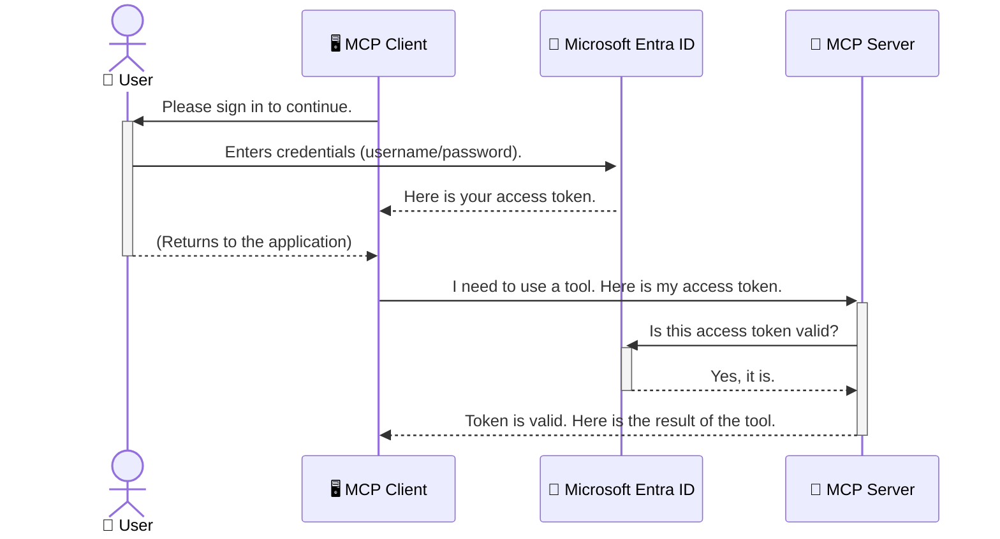

<!--
CO_OP_TRANSLATOR_METADATA:
{
  "original_hash": "6e562d7e5a77c8982da4aa8f762ad1d8",
  "translation_date": "2025-07-02T09:56:57+00:00",
  "source_file": "05-AdvancedTopics/mcp-security-entra/README.md",
  "language_code": "bg"
}
-->
# Защита на AI работни потоци: Entra ID удостоверяване за Model Context Protocol сървъри

## Въведение
Защитата на вашия Model Context Protocol (MCP) сървър е също толкова важна, колкото заключването на входната врата на дома ви. Оставянето на MCP сървъра отворен излага вашите инструменти и данни на неоторизиран достъп, което може да доведе до пробиви в сигурността. Microsoft Entra ID предлага надеждно облачно решение за управление на идентичността и достъпа, което гарантира, че само упълномощени потребители и приложения могат да взаимодействат с вашия MCP сървър. В този раздел ще научите как да защитите AI работните си потоци чрез удостоверяване с Entra ID.

## Учебни цели
След завършване на този раздел ще можете да:

- Разберете важността от защитата на MCP сървърите.
- Обясните основите на Microsoft Entra ID и OAuth 2.0 удостоверяването.
- Разпознаете разликата между публични и конфиденциални клиенти.
- Прилагате Entra ID удостоверяване както в локални (публичен клиент), така и в отдалечени (конфиденциален клиент) сценарии за MCP сървъри.
- Използвате най-добрите практики за сигурност при разработката на AI работни потоци.

## Сигурност и MCP

Точно както не бихте оставили входната врата на дома си отключена, така не трябва да оставяте MCP сървъра си достъпен за всеки. Защитата на вашите AI работни потоци е от съществено значение за създаването на надеждни, доверени и безопасни приложения. Тази глава ще ви запознае с използването на Microsoft Entra ID за защита на вашите MCP сървъри, гарантирайки, че само упълномощени потребители и приложения имат достъп до вашите инструменти и данни.

## Защо сигурността е важна за MCP сървърите

Представете си, че вашият MCP сървър има инструмент, който може да изпраща имейли или да достъпва база данни с клиенти. Несигурен сървър означава, че всеки може потенциално да използва този инструмент, което може да доведе до неоторизиран достъп до данни, спам или други злонамерени действия.

Чрез внедряване на удостоверяване вие гарантирате, че всяка заявка към сървъра се проверява, потвърждавайки идентичността на потребителя или приложението, което я прави. Това е първата и най-важна стъпка за защита на вашите AI работни потоци.

## Въведение в Microsoft Entra ID

[**Microsoft Entra ID**](https://adoption.microsoft.com/microsoft-security/entra/) е облачна услуга за управление на идентичността и достъпа. Можете да я разглеждате като универсален охранител за вашите приложения. Тя се грижи за сложния процес на проверка на потребителските идентичности (удостоверяване) и определяне на техните права (авторизация).

С помощта на Entra ID можете да:

- Осигурите сигурно влизане за потребителите.
- Защитите API-та и услуги.
- Управлявате политики за достъп от централен пункт.

За MCP сървърите Entra ID предлага стабилно и широко признато решение за контрол на достъпа до възможностите на вашия сървър.

---

## Разбиране на магията: Как работи удостоверяването с Entra ID

Entra ID използва отворени стандарти като **OAuth 2.0** за управление на удостоверяването. Въпреки че детайлите могат да са сложни, основната идея е проста и може да се обясни с аналогия.

### Леко въведение в OAuth 2.0: Ключът за паркиране

Представете си OAuth 2.0 като услуга за паркиране на колата ви. Когато пристигате в ресторант, не давате на паркиращия вашия главен ключ. Вместо това му предоставяте **ключ за паркиране**, който има ограничени права – може да запали колата и да заключи вратите, но не може да отвори багажника или жабката.

В тази аналогия:

- **Вие** сте **Потребителят**.
- **Вашата кола** е **MCP сървърът** с ценните инструменти и данни.
- **Паркиращият** е **Microsoft Entra ID**.
- **Асистентът по паркирането** е **MCP клиентът** (приложението, което се опитва да достъпи сървъра).
- **Ключът за паркиране** е **Access Token**.

Access token е защитен текстов низ, който MCP клиентът получава от Entra ID след вашето влизане. Клиентът подава този токен на MCP сървъра при всяка заявка. Сървърът може да провери токена, за да се увери, че заявката е легитимна и че клиентът има необходимите права, без никога да се налага да обработва вашите реални данни за достъп (като парола).

### Поток на удостоверяването

Ето как работи процесът на практика:



### Представяне на Microsoft Authentication Library (MSAL)

Преди да се потопим в кода, важно е да запознаем ключов компонент, който ще видите в примерите: **Microsoft Authentication Library (MSAL)**.

MSAL е библиотека, разработена от Microsoft, която значително улеснява разработчиците при управлението на удостоверяването. Вместо да пишете сложен код за обработка на защитени токени, управление на влизания и обновяване на сесии, MSAL върши тази тежка работа вместо вас.

Използването на библиотека като MSAL е силно препоръчително, защото:

- **Е сигурна:** Прилага индустриални стандарти и най-добри практики за сигурност, намалявайки риска от уязвимости в кода ви.
- **Опростява разработката:** Абстрахира сложността на протоколите OAuth 2.0 и OpenID Connect, позволявайки ви да добавите стабилно удостоверяване с няколко реда код.
- **Се поддържа активно:** Microsoft редовно обновява MSAL, за да се справи с нови заплахи и промени в платформите.

MSAL поддържа множество езици и рамки за приложения, включително .NET, JavaScript/TypeScript, Python, Java, Go и мобилни платформи като iOS и Android. Това ви позволява да използвате еднакви модели за удостоверяване във всички технологии, които използвате.

За повече информация за MSAL, можете да разгледате официалната [MSAL документация](https://learn.microsoft.com/entra/identity-platform/msal-overview).

---

## Защита на вашия MCP сървър с Entra ID: Стъпка по стъпка

Сега нека разгледаме как да защитите локален MCP сървър (който комуникира през `stdio`) using Entra ID. This example uses a **public client**, which is suitable for applications running on a user's machine, like a desktop app or a local development server.

### Scenario 1: Securing a Local MCP Server (with a Public Client)

In this scenario, we'll look at an MCP server that runs locally, communicates over `stdio`, and uses Entra ID to authenticate the user before allowing access to its tools. The server will have a single tool that fetches the user's profile information from the Microsoft Graph API.

#### 1. Setting Up the Application in Entra ID

Before writing any code, you need to register your application in Microsoft Entra ID. This tells Entra ID about your application and grants it permission to use the authentication service.

1. Navigate to the **[Microsoft Entra portal](https://entra.microsoft.com/)**.
2. Go to **App registrations** and click **New registration**.
3. Give your application a name (e.g., "My Local MCP Server").
4. For **Supported account types**, select **Accounts in this organizational directory only**.
5. You can leave the **Redirect URI** blank for this example.
6. Click **Register**.

Once registered, take note of the **Application (client) ID** and **Directory (tenant) ID**. You'll need these in your code.

#### 2. The Code: A Breakdown

Let's look at the key parts of the code that handle authentication. The full code for this example is available in the [Entra ID - Local - WAM](https://github.com/Azure-Samples/mcp-auth-servers/tree/main/src/entra-id-local-wam) folder of the [mcp-auth-servers GitHub repository](https://github.com/Azure-Samples/mcp-auth-servers).

**`AuthenticationService.cs`**

This class is responsible for handling the interaction with Entra ID.

- **`CreateAsync`**: This method initializes the `PublicClientApplication` from the MSAL (Microsoft Authentication Library). It's configured with your application's `clientId` and `tenantId`.
- **`WithBroker`**: This enables the use of a broker (like the Windows Web Account Manager), which provides a more secure and seamless single sign-on experience.
- **`AcquireTokenAsync`**: Това е основният метод. Първо се опитва да получи токен тихомълком (т.е. потребителят няма да се налага да влиза отново, ако вече има валидна сесия). Ако тихото получаване на токен не е възможно, потребителят ще бъде подканен да влезе интерактивно.

```csharp
// Simplified for clarity
public static async Task<AuthenticationService> CreateAsync(ILogger<AuthenticationService> logger)
{
    var msalClient = PublicClientApplicationBuilder
        .Create(_clientId) // Your Application (client) ID
        .WithAuthority(AadAuthorityAudience.AzureAdMyOrg)
        .WithTenantId(_tenantId) // Your Directory (tenant) ID
        .WithBroker(new BrokerOptions(BrokerOptions.OperatingSystems.Windows))
        .Build();

    // ... cache registration ...

    return new AuthenticationService(logger, msalClient);
}

public async Task<string> AcquireTokenAsync()
{
    try
    {
        // Try silent authentication first
        var accounts = await _msalClient.GetAccountsAsync();
        var account = accounts.FirstOrDefault();

        AuthenticationResult? result = null;

        if (account != null)
        {
            result = await _msalClient.AcquireTokenSilent(_scopes, account).ExecuteAsync();
        }
        else
        {
            // If no account, or silent fails, go interactive
            result = await _msalClient.AcquireTokenInteractive(_scopes).ExecuteAsync();
        }

        return result.AccessToken;
    }
    catch (Exception ex)
    {
        _logger.LogError(ex, "An error occurred while acquiring the token.");
        throw; // Optionally rethrow the exception for higher-level handling
    }
}
```

**`Program.cs`**

This is where the MCP server is set up and the authentication service is integrated.

- **`AddSingleton<AuthenticationService>`**: This registers the `AuthenticationService` with the dependency injection container, so it can be used by other parts of the application (like our tool).
- **`GetUserDetailsFromGraph` tool**: This tool requires an instance of `AuthenticationService`. Before it does anything, it calls `authService.AcquireTokenAsync()` използва за получаване на валиден access token. Ако удостоверяването е успешно, този токен се използва за извикване на Microsoft Graph API и извличане на детайлите на потребителя.

```csharp
// Simplified for clarity
[McpServerTool(Name = "GetUserDetailsFromGraph")]
public static async Task<string> GetUserDetailsFromGraph(
    AuthenticationService authService)
{
    try
    {
        // This will trigger the authentication flow
        var accessToken = await authService.AcquireTokenAsync();

        // Use the token to create a GraphServiceClient
        var graphClient = new GraphServiceClient(
            new BaseBearerTokenAuthenticationProvider(new TokenProvider(authService)));

        var user = await graphClient.Me.GetAsync();

        return System.Text.Json.JsonSerializer.Serialize(user);
    }
    catch (Exception ex)
    {
        return $"Error: {ex.Message}";
    }
}
```

#### 3. Как работи всичко заедно

1. Когато MCP клиентът се опита да използва `GetUserDetailsFromGraph` tool, the tool first calls `AcquireTokenAsync`.
2. `AcquireTokenAsync` triggers the MSAL library to check for a valid token.
3. If no token is found, MSAL, through the broker, will prompt the user to sign in with their Entra ID account.
4. Once the user signs in, Entra ID issues an access token.
5. The tool receives the token and uses it to make a secure call to the Microsoft Graph API.
6. The user's details are returned to the MCP client.

This process ensures that only authenticated users can use the tool, effectively securing your local MCP server.

### Scenario 2: Securing a Remote MCP Server (with a Confidential Client)

When your MCP server is running on a remote machine (like a cloud server) and communicates over a protocol like HTTP Streaming, the security requirements are different. In this case, you should use a **confidential client** and the **Authorization Code Flow**. This is a more secure method because the application's secrets are never exposed to the browser.

This example uses a TypeScript-based MCP server that uses Express.js to handle HTTP requests.

#### 1. Setting Up the Application in Entra ID

The setup in Entra ID is similar to the public client, but with one key difference: you need to create a **client secret**.

1. Navigate to the **[Microsoft Entra portal](https://entra.microsoft.com/)**.
2. In your app registration, go to the **Certificates & secrets** tab.
3. Click **New client secret**, give it a description, and click **Add**.
4. **Important:** Copy the secret value immediately. You will not be able to see it again.
5. You also need to configure a **Redirect URI**. Go to the **Authentication** tab, click **Add a platform**, select **Web**, and enter the redirect URI for your application (e.g., `http://localhost:3001/auth/callback`).

> **⚠️ Important Security Note:** For production applications, Microsoft strongly recommends using **secretless authentication** methods such as **Managed Identity** or **Workload Identity Federation** instead of client secrets. Client secrets pose security risks as they can be exposed or compromised. Managed identities provide a more secure approach by eliminating the need to store credentials in your code or configuration.
>
> For more information about managed identities and how to implement them, see the [Managed identities for Azure resources overview](https://learn.microsoft.com/entra/identity/managed-identities-azure-resources/overview).

#### 2. The Code: A Breakdown

This example uses a session-based approach. When the user authenticates, the server stores the access token and refresh token in a session and gives the user a session token. This session token is then used for subsequent requests. The full code for this example is available in the [Entra ID - Confidential client](https://github.com/Azure-Samples/mcp-auth-servers/tree/main/src/entra-id-cca-session) folder of the [mcp-auth-servers GitHub repository](https://github.com/Azure-Samples/mcp-auth-servers).

**`Server.ts`**

This file sets up the Express server and the MCP transport layer.

- **`requireBearerAuth`**: This is middleware that protects the `/sse` and `/message` endpoints. It checks for a valid bearer token in the `Authorization` header of the request.
- **`EntraIdServerAuthProvider`**: This is a custom class that implements the `McpServerAuthorizationProvider` interface. It's responsible for handling the OAuth 2.0 flow.
- **`/auth/callback`**: Този крайна точка обработва пренасочването от Entra ID след удостоверяването на потребителя. Той разменя authorization code за access token и refresh token.

```typescript
// Simplified for clarity
const app = express();
const { server } = createServer();
const provider = new EntraIdServerAuthProvider();

// Protect the SSE endpoint
app.get("/sse", requireBearerAuth({
  provider,
  requiredScopes: ["User.Read"]
}), async (req, res) => {
  // ... connect to the transport ...
});

// Protect the message endpoint
app.post("/message", requireBearerAuth({
  provider,
  requiredScopes: ["User.Read"]
}), async (req, res) => {
  // ... handle the message ...
});

// Handle the OAuth 2.0 callback
app.get("/auth/callback", (req, res) => {
  provider.handleCallback(req.query.code, req.query.state)
    .then(result => {
      // ... handle success or failure ...
    });
});
```

**`Tools.ts`**

This file defines the tools that the MCP server provides. The `getUserDetails` инструментът е подобен на предишния пример, но взема access token от сесията.

```typescript
// Simplified for clarity
server.setRequestHandler(CallToolRequestSchema, async (request) => {
  const { name } = request.params;
  const context = request.params?.context as { token?: string } | undefined;
  const sessionToken = context?.token;

  if (name === ToolName.GET_USER_DETAILS) {
    if (!sessionToken) {
      throw new AuthenticationError("Authentication token is missing or invalid. Ensure the token is provided in the request context.");
    }

    // Get the Entra ID token from the session store
    const tokenData = tokenStore.getToken(sessionToken);
    const entraIdToken = tokenData.accessToken;

    const graphClient = Client.init({
      authProvider: (done) => {
        done(null, entraIdToken);
      }
    });

    const user = await graphClient.api('/me').get();

    // ... return user details ...
  }
});
```

**`auth/EntraIdServerAuthProvider.ts`**

This class handles the logic for:

- Redirecting the user to the Entra ID sign-in page.
- Exchanging the authorization code for an access token.
- Storing the tokens in the `tokenStore`.
- Refreshing the access token when it expires.

#### 3. How It All Works Together

1. When a user first tries to connect to the MCP server, the `requireBearerAuth` middleware will see that they don't have a valid session and will redirect them to the Entra ID sign-in page.
2. The user signs in with their Entra ID account.
3. Entra ID redirects the user back to the `/auth/callback` endpoint with an authorization code.
4. The server exchanges the code for an access token and a refresh token, stores them, and creates a session token which is sent to the client.
5. The client can now use this session token in the `Authorization` header for all future requests to the MCP server.
6. When the `getUserDetails` инструментът използва токена от сесията, за да намери Entra ID access token и след това го използва, за да извика Microsoft Graph API.

Този поток е по-сложен от този за публичен клиент, но е необходим за крайни точки, достъпни в интернет. Тъй като отдалечените MCP сървъри са достъпни през публичния интернет, те изискват по-силни мерки за сигурност, за да се предпазят от неоторизиран достъп и потенциални атаки.

## Най-добри практики за сигурност

- **Винаги използвайте HTTPS**: Криптирайте комуникацията между клиента и сървъра, за да защитите токените от прихващане.
- **Прилагайте контрол на достъпа базиран на роли (RBAC)**: Не проверявайте само *дали* потребителят е удостоверен, а и *какво* има право да прави. Можете да дефинирате роли в Entra ID и да ги проверявате в MCP сървъра си.
- **Мониторинг и одит**: Записвайте всички събития по удостоверяване, за да можете да откривате и реагирате на подозрителна активност.
- **Обработка на ограничаване на честотата (rate limiting) и натоварване**: Microsoft Graph и други API-та прилагат ограничения за да предотвратят злоупотреби. Внедрете експоненциално отлагане и логика за повторни опити в MCP сървъра, за да се справяте елегантно с HTTP 429 (Too Many Requests). Помислете за кеширане на често използвани данни, за да намалите броя на повикванията към API.
- **Сигурно съхранение на токени**: Съхранявайте access и refresh токените сигурно. За локални приложения използвайте вградените в системата механизми за сигурно съхранение. За сървърни приложения обмислете криптирано съхранение или услуги за управление на ключове като Azure Key Vault.
- **Обработка на изтичане на токени**: Access токените имат ограничен срок на валидност. Внедрете автоматично обновяване на токените с refresh токени, за да осигурите безпроблемно потребителско изживяване без необходимост от повторно удостоверяване.
- **Обмислете използването на Azure API Management**: Въпреки че внедряването на сигурността директно в MCP сървъра ви дава детайлен контрол, API шлюзове като Azure API Management могат автоматично да се справят с много от тези аспекти на сигурността, включително удостоверяване, авторизация, ограничаване на честотата и мониторинг. Те осигуряват централен слой за сигурност между клиентите ви и MCP сървърите. За повече информация относно използването на API шлюзове с MCP, вижте нашия [Azure API Management Your Auth Gateway For MCP Servers](https://techcommunity.microsoft.com/blog/integrationsonazureblog/azure-api-management-your-auth-gateway-for-mcp-servers/4402690).

## Основни изводи

- Защитата на MCP сървъра е от ключово значение за опазване на данните и инструментите ви.
- Microsoft Entra ID предоставя стабилно и мащабируемо решение за удостоверяване и авторизация.
- Използвайте **публичен клиент** за локални приложения и **конфиденциален клиент** за отдалечени сървъри.
- **Authorization Code Flow** е най-сигурният вариант за уеб приложения.

## Упражнение

1. Помислете за MCP сървър, който бихте изградили. Ще бъде ли локален или отдалечен?
2. Въз основа на отговора, бихте ли използвали публичен или конфиденциален клиент?
3. Какви права би поискал вашият MCP сървър за изпълнение на действия спрямо Microsoft Graph?

## Практически упражнения

### Упражнение 1: Регистрирайте приложение в Entra ID
Отидете в портала на Microsoft Entra.  
Регистрирайте ново приложение за вашия MCP сървър.  
Запишете Application (client) ID и Directory (tenant) ID.

### Упражнение 2: Защитете локален MCP сървър (публичен клиент)
- Следвайте примерния код за интеграция на MSAL (Microsoft Authentication Library) за удостоверяване на потребители.
- Тествайте потока на удостоверяване, като извикате MCP инструмента, който извлича детайли за потребителя от Microsoft Graph.

### Упражнение 3: Защитете отдалечен MCP сървър (конфиденциален клиент)
- Регистрирайте конфиденциален клиент в Entra ID и създайте client secret.
- Конфигурирайте вашия Express.js MCP сървър да използва Authorization Code Flow.
- Тествайте защитените крайни точки и потвърдете достъпа чрез токен.

### Упражнение 4: Прилагайте най-добрите практики за сигурност
- Активирайте HTTPS за вашия локален или отдалечен сървър.
- Внедрете контрол на достъпа базиран на роли (RBAC) в логиката на сървъра.
- Добавете обработка на изтичане на токени и сигурно съхранение на токените.

## Ресурси

1. **MSAL обзорна документация**  
   Научете как Microsoft Authentication Library (MSAL) осигурява сигурно получаване на токени на различни платформи:  
   [MSAL Overview on Microsoft Learn](https://learn.microsoft.com/en-gb/entra/msal/overview)

2. **Azure-Samples/mcp-auth-servers GitHub хранилище**  
   Примери за имплементации на MCP сървъри, демонстриращи потоци за удостоверяване:  
   [Azure-Samples/mcp-auth-servers on GitHub](https://github.com/Azure-Samples/mcp-auth-servers)

3. **Обзор на управлявани идентичности за Azure ресурси**  
   Разберете как да елиминирате тайни, използвайки системно- или потребителски-назначени управлявани идентичности:  
   [Managed Identities Overview on Microsoft Learn](https://learn.microsoft.com/en-us/entra/identity/managed-identities-azure-resources/)

4. **Azure API Management: Вашият шлюз за удостоверяване за MCP сървъри**  
   Подробно за използването на APIM като защитен OAuth2 шлюз за MCP сървъри:  
   [Azure API Management Your Auth Gateway For MCP Servers](https://techcommunity.microsoft.com/blog/integrationsonazureblog/azure-api-management-your-auth-gateway-for-mcp-servers/4402690)

5. **Референция за права в Microsoft Graph**  
   Пълна справка за делегирани и приложни права в Microsoft Graph:  
   [Microsoft Graph Permissions Reference](https://learn.microsoft.com/zh-tw/graph/permissions-reference)

## Учебни резултати
След завършване на този раздел ще можете да:

- Обясните защо удостоверяването е критично за MCP сървърите и AI работните потоци.
- Настроите и конфигурирате Entra ID удостоверяване за локални и отдалечени MCP сървърни сценарии.
- Изберете подходящия тип клиент (публичен или конфиденциален) според разгръщането на сървъра.
- Прилагате сигурни практики в кода, включително съхранение на токени и авторизация на база роли.
- С увереност защитите вашия MCP сървър и неговите инструменти

**Отказ от отговорност**:  
Този документ е преведен с помощта на AI преводаческа услуга [Co-op Translator](https://github.com/Azure/co-op-translator). Въпреки че се стремим към точност, моля, имайте предвид, че автоматизираните преводи могат да съдържат грешки или неточности. Оригиналният документ на неговия роден език трябва да се счита за авторитетен източник. За критична информация се препоръчва професионален човешки превод. Ние не носим отговорност за никакви недоразумения или погрешни тълкувания, произтичащи от използването на този превод.