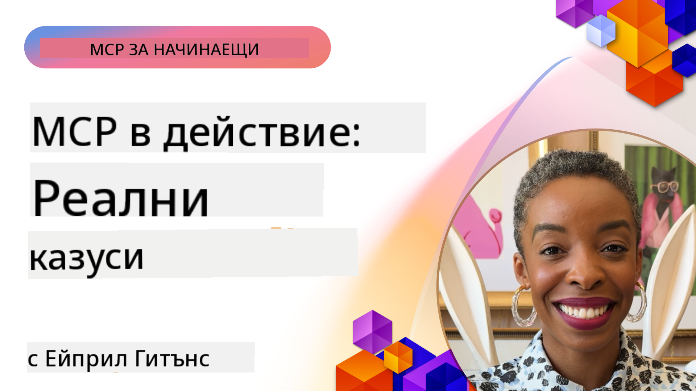

<!--
CO_OP_TRANSLATOR_METADATA:
{
  "original_hash": "1611dc5f6a2a35a789fc4c95fc5bfbe8",
  "translation_date": "2025-09-26T19:08:49+00:00",
  "source_file": "09-CaseStudy/README.md",
  "language_code": "bg"
}
-->
# MCP в действие: Примери от реалния свят

_(Кликнете върху изображението по-горе, за да гледате видеото към този урок)_

Протоколът за контекст на модела (MCP) променя начина, по който AI приложенията взаимодействат с данни, инструменти и услуги. Този раздел представя примери от реалния свят, които демонстрират практическото приложение на MCP в различни корпоративни сценарии.

## Преглед

Този раздел представя конкретни примери за внедряване на MCP, като подчертава как организациите използват този протокол за решаване на сложни бизнес предизвикателства. Чрез разглеждане на тези примери ще получите представа за гъвкавостта, мащабируемостта и практическите ползи от MCP в реални ситуации.

## Основни цели на обучението

Чрез разглеждане на тези примери ще:

- Разберете как MCP може да се приложи за решаване на конкретни бизнес проблеми
- Научите за различни модели на интеграция и архитектурни подходи
- Разпознаете най-добрите практики за внедряване на MCP в корпоративни среди
- Получите представа за предизвикателствата и решенията, срещани при реални внедрения
- Идентифицирате възможности за прилагане на подобни модели във вашите собствени проекти

## Представени примери

### 1. [Azure AI Travel Agents – Референтно внедряване](./travelagentsample.md)

Този пример разглежда цялостното референтно решение на Microsoft, което демонстрира как да се изгради многоагентно AI приложение за планиране на пътувания, използвайки MCP, Azure OpenAI и Azure AI Search. Проектът показва:

- Оркестрация на много агенти чрез MCP
- Интеграция на корпоративни данни с Azure AI Search
- Сигурна и мащабируема архитектура с Azure услуги
- Разширяеми инструменти с повторно използваеми MCP компоненти
- Конверзационен потребителски интерфейс, захранван от Azure OpenAI

Архитектурата и детайлите на внедряването предоставят ценни прозрения за изграждането на сложни многоагентни системи с MCP като координационен слой.

### 2. [Актуализиране на елементи в Azure DevOps от данни в YouTube](./UpdateADOItemsFromYT.md)

Този пример демонстрира практическо приложение на MCP за автоматизиране на работни процеси. Показва как MCP инструментите могат да се използват за:

- Извличане на данни от онлайн платформи (YouTube)
- Актуализиране на работни елементи в системи Azure DevOps
- Създаване на повторяеми автоматизирани работни процеси
- Интеграция на данни между различни системи

Този пример илюстрира как дори сравнително прости внедрения на MCP могат да осигурят значителни подобрения в ефективността чрез автоматизиране на рутинни задачи и подобряване на консистентността на данните между системите.

### 3. [Извличане на документация в реално време с MCP](./docs-mcp/README.md)

Този пример ви води през свързването на Python конзолен клиент към MCP сървър за извличане и записване на контекстуално осведомена документация на Microsoft в реално време. Ще научите как да:

- Свържете MCP сървър с Python клиент и официалния MCP SDK
- Използвате стрийминг HTTP клиенти за ефективно извличане на данни в реално време
- Извиквате инструменти за документация на сървъра и записвате отговорите директно в конзолата
- Интегрирате актуална документация на Microsoft във вашия работен процес без да напускате терминала

Главата включва практическо задание, минимален работещ кодов пример и връзки към допълнителни ресурси за по-задълбочено обучение. Вижте пълното ръководство и кода в свързаната глава, за да разберете как MCP може да трансформира достъпа до документация и продуктивността на разработчиците в конзолни среди.

### 4. [Интерактивно уеб приложение за генериране на учебни планове с MCP](./docs-mcp/README.md)

Този пример демонстрира как да изградите интерактивно уеб приложение, използвайки Chainlit и MCP, за да генерирате персонализирани учебни планове за всяка тема. Потребителите могат да зададат предмет (например "AI-900 сертификация") и продължителност на обучението (например 8 седмици), а приложението ще предостави седмично разпределение на препоръчителното съдържание. Chainlit осигурява конверзационен чат интерфейс, правейки преживяването ангажиращо и адаптивно.

- Конверзационно уеб приложение, захранвано от Chainlit
- Потребителски подканвания за тема и продължителност
- Седмични препоръки за съдържание, използвайки MCP
- Реални, адаптивни отговори в чат интерфейс

Проектът илюстрира как конверзационният AI и MCP могат да се комбинират за създаване на динамични, потребителски ориентирани образователни инструменти в модерна уеб среда.

### 5. [Документация в редактора с MCP сървър в VS Code](./docs-mcp/README.md)

Този пример демонстрира как можете да интегрирате документацията на Microsoft Learn директно във вашата VS Code среда, без да превключвате между браузърни табове! Ще видите как да:

- Търсите и четете документация директно в VS Code, използвайки MCP панел или команден палет
- Реферирате документация и вмъквате връзки директно в README или markdown файлове за курсове
- Използвате GitHub Copilot и MCP за безпроблемни, AI-захранвани работни процеси за документация и код
- Валидирате и подобрявате документацията с обратна връзка в реално време и точност от Microsoft
- Интегрирате MCP с GitHub работни процеси за непрекъсната валидация на документацията

Внедряването включва:

- Примерна `.vscode/mcp.json` конфигурация за лесна настройка
- Ръководства със скрийншоти за работа в редактора
- Съвети за комбиниране на Copilot и MCP за максимална продуктивност

Този сценарий е идеален за автори на курсове, писатели на документация и разработчици, които искат да останат фокусирани в редактора, докато работят с документация, Copilot и инструменти за валидация – всичко това, захранвано от MCP.

### 6. [Създаване на MCP сървър с APIM](./apimsample.md)

Този пример предоставя стъпка по стъпка ръководство за създаване на MCP сървър, използвайки Azure API Management (APIM). Обхваща:

- Настройка на MCP сървър в Azure API Management
- Излагане на API операции като MCP инструменти
- Конфигуриране на политики за ограничаване на скоростта и сигурност
- Тестване на MCP сървър с Visual Studio Code и GitHub Copilot

Този пример илюстрира как да използвате възможностите на Azure за създаване на надежден MCP сървър, който може да се използва в различни приложения, подобрявайки интеграцията на AI системи с корпоративни API.

### 7. [GitHub MCP Registry — Ускоряване на агентната интеграция](https://github.com/mcp)

Този пример разглежда как MCP Registry на GitHub, стартиран през септември 2025 г., решава критичен проблем в AI екосистемата: фрагментираното откриване и внедряване на MCP сървъри.

#### Преглед
**MCP Registry** решава нарастващия проблем с разпръснатите MCP сървъри в различни хранилища и регистри, което преди правеше интеграцията бавна и податлива на грешки. Тези сървъри позволяват на AI агентите да взаимодействат с външни системи като API, бази данни и източници на документация.

#### Проблем
Разработчиците, изграждащи агентни работни процеси, се сблъскваха със следните предизвикателства:
- **Лоша откриваемост** на MCP сървъри в различни платформи
- **Повтарящи се въпроси за настройка**, разпръснати из форуми и документация
- **Рискове за сигурността** от непроверени и ненадеждни източници
- **Липса на стандартизация** в качеството и съвместимостта на сървърите

#### Архитектура на решението
MCP Registry на GitHub централизира надеждни MCP сървъри с ключови функции:
- **Интеграция с едно кликване** чрез VS Code за опростена настройка
- **Сортиране по важност** чрез звезди, активност и валидиране от общността
- **Директна интеграция** с GitHub Copilot и други MCP-съвместими инструменти
- **Отворен модел за принос**, позволяващ както общността, така и корпоративни партньори да допринасят

#### Въздействие върху бизнеса
Регистърът е постигнал измерими подобрения:
- **По-бързо въвеждане** за разработчици, използващи инструменти като Microsoft Learn MCP Server, който стриймва официална документация директно в агентите
- **Подобрена продуктивност** чрез специализирани сървъри като `github-mcp-server`, позволяващи автоматизация на GitHub на естествен език (създаване на PR, повторно стартиране на CI, сканиране на код)
- **По-силно доверие в екосистемата** чрез курирани списъци и прозрачни стандарти за конфигурация

#### Стратегическа стойност
За практикуващите, специализирани в управлението на жизнения цикъл на агентите и възпроизводими работни процеси, MCP Registry предоставя:
- **Модулни възможности за внедряване на агенти** със стандартизирани компоненти
- **Регистър-базирани оценъчни тръбопроводи** за последователно тестване и валидиране
- **Интероперативност между инструменти**, позволяваща безпроблемна интеграция между различни AI платформи

Този пример демонстрира, че MCP Registry е не просто директория, а основна платформа за мащабируемо, реално внедряване на модели и агентни системи.

## Заключение

Тези седем подробни примера демонстрират забележителната гъвкавост и практическите приложения на MCP в разнообразни реални сценарии. От сложни многоагентни системи за планиране на пътувания и управление на корпоративни API до оптимизирани работни процеси за документация и революционния MCP Registry на GitHub, тези примери показват как MCP предоставя стандартизиран, мащабируем начин за свързване на AI системи с инструментите, данните и услугите, от които се нуждаят, за да доставят изключителна стойност.

Примерите обхващат множество измерения на внедряване на MCP:
- **Корпоративна интеграция**: Автоматизация с Azure API Management и Azure DevOps
- **Оркестрация на много агенти**: Планиране на пътувания с координирани AI агенти
- **Продуктивност на разработчиците**: Интеграция с VS Code и достъп до документация в реално време
- **Развитие на екосистемата**: MCP Registry на GitHub като основна платформа
- **Образователни приложения**: Интерактивни генератори на учебни планове и конверзационни интерфейси

Чрез изучаване на тези внедрения ще получите критични прозрения за:
- **Архитектурни модели** за различни мащаби и случаи на употреба
- **Стратегии за внедряване**, които балансират функционалност и поддръжка
- **Съображения за сигурност и мащабируемост** за производствени внедрения
- **Най-добри практики** за разработка на MCP сървъри и клиентска интеграция
- **Мислене за екосистемата** за изграждане на взаимосвързани AI-захранвани решения

Тези примери колективно демонстрират, че MCP не е просто теоретична рамка, а зрял, готов за производство протокол, който позволява практични решения на сложни бизнес предизвикателства. Независимо дали изграждате прости инструменти за автоматизация или сложни многоагентни системи, моделите и подходите, илюстрирани тук, предоставят солидна основа за вашите собствени MCP проекти.

## Допълнителни ресурси

- [Azure AI Travel Agents GitHub Repository](https://github.com/Azure-Samples/azure-ai-travel-agents)
- [Azure DevOps MCP Tool](https://github.com/microsoft/azure-devops-mcp)
- [Playwright MCP Tool](https://github.com/microsoft/playwright-mcp)
- [Microsoft Docs MCP Server](https://github.com/MicrosoftDocs/mcp)
- [GitHub MCP Registry — Ускоряване на агентната интеграция](https://github.com/mcp)
- [MCP Community Examples](https://github.com/microsoft/mcp)

Следва: Практическа лаборатория [Оптимизиране на AI работни процеси: Създаване на MCP сървър с AI Toolkit](../10-StreamliningAIWorkflowsBuildingAnMCPServerWithAIToolkit/README.md)

---

