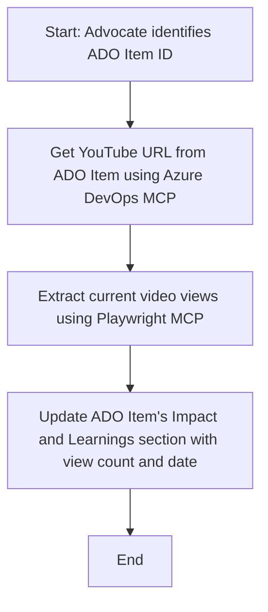

<!--
CO_OP_TRANSLATOR_METADATA:
{
  "original_hash": "14a2dfbea55ef735660a06bd6bdfe5f3",
  "translation_date": "2025-07-14T06:15:39+00:00",
  "source_file": "09-CaseStudy/UpdateADOItemsFromYT.md",
  "language_code": "bg"
}
-->
# Казус: Актуализиране на Azure DevOps елементи с данни от YouTube чрез MCP

> **Disclaimer:** Съществуват онлайн инструменти и отчети, които могат да автоматизират процеса на актуализиране на Azure DevOps елементи с данни от платформи като YouTube. Следният сценарий е предоставен единствено като пример за използване, за да илюстрира как MCP инструментите могат да се прилагат за автоматизация и интеграционни задачи.

## Преглед

Този казус показва един пример за това как Model Context Protocol (MCP) и неговите инструменти могат да се използват за автоматизиране на процеса по актуализиране на работни елементи в Azure DevOps (ADO) с информация, получена от онлайн платформи като YouTube. Описаният сценарий е само една илюстрация на по-широките възможности на тези инструменти, които могат да бъдат адаптирани за много подобни нужди от автоматизация.

В този пример, Advocate следи онлайн сесии чрез ADO елементи, като всеки елемент съдържа URL адрес на YouTube видео. Чрез използване на MCP инструментите, Advocate може да поддържа ADO елементите актуални с последните метрики за видеото, като брой гледания, по повтарящ се и автоматизиран начин. Този подход може да се приложи и в други случаи, когато информация от онлайн източници трябва да бъде интегрирана в ADO или други системи.

## Сценарий

Advocate е отговорен за проследяване на въздействието на онлайн сесиите и ангажираността на общността. Всяка сесия се записва като работен елемент в ADO в проекта 'DevRel', като работният елемент съдържа поле за URL адрес на YouTube видео. За да отчете точно обхвата на сесията, Advocate трябва да актуализира ADO елемента с текущия брой гледания на видеото и датата, на която тази информация е била получена.

## Използвани инструменти

- [Azure DevOps MCP](https://github.com/microsoft/azure-devops-mcp): Позволява програматичен достъп и актуализации на ADO работни елементи чрез MCP.
- [Playwright MCP](https://github.com/microsoft/playwright-mcp): Автоматизира действия в браузъра за извличане на живи данни от уеб страници, като статистики за YouTube видеа.

## Стъпка по стъпка работен процес

1. **Идентифициране на ADO елемента**: Започнете с ID на работния елемент в ADO (например 1234) в проекта 'DevRel'.
2. **Извличане на YouTube URL**: Използвайте Azure DevOps MCP инструмента, за да получите YouTube URL от работния елемент.
3. **Извличане на брой гледания**: Използвайте Playwright MCP инструмента, за да отидете на YouTube URL и да извлечете текущия брой гледания.
4. **Актуализиране на ADO елемента**: Запишете последния брой гледания и датата на извличане в секцията 'Impact and Learnings' на работния елемент в ADO, използвайки Azure DevOps MCP инструмента.

## Примерен Prompt

```bash
- Work with the ADO Item ID: 1234
- The project is '2025-Awesome'
- Get the YouTube URL for the ADO item
- Use Playwright to get the current views from the YouTube video
- Update the ADO item with the current video views and the updated date of the information
```

## Mermaid диаграма на потока



## Техническа реализация

- **MCP оркестрация**: Работният процес се управлява от MCP сървър, който координира използването на Azure DevOps MCP и Playwright MCP инструментите.
- **Автоматизация**: Процесът може да се стартира ръчно или да се планира да се изпълнява на регулярни интервали, за да поддържа ADO елементите актуални.
- **Разширяемост**: Същият модел може да се използва за актуализиране на ADO елементи с други онлайн метрики (например харесвания, коментари) или от други платформи.

## Резултати и въздействие

- **Ефективност**: Намалява ръчната работа на Advocate чрез автоматизиране на извличането и актуализацията на видео метриките.
- **Точност**: Гарантира, че ADO елементите отразяват най-актуалните данни, налични от онлайн източниците.
- **Повтаряемост**: Осигурява повторяем работен процес за подобни сценарии, включващи други източници на данни или метрики.

## Референции

- [Azure DevOps MCP](https://github.com/microsoft/azure-devops-mcp)
- [Playwright MCP](https://github.com/microsoft/playwright-mcp)
- [Model Context Protocol (MCP)](https://modelcontextprotocol.io/)

**Отказ от отговорност**:  
Този документ е преведен с помощта на AI преводаческа услуга [Co-op Translator](https://github.com/Azure/co-op-translator). Въпреки че се стремим към точност, моля, имайте предвид, че автоматизираните преводи могат да съдържат грешки или неточности. Оригиналният документ на неговия роден език трябва да се счита за авторитетен източник. За критична информация се препоръчва професионален човешки превод. Ние не носим отговорност за каквито и да е недоразумения или неправилни тълкувания, произтичащи от използването на този превод.