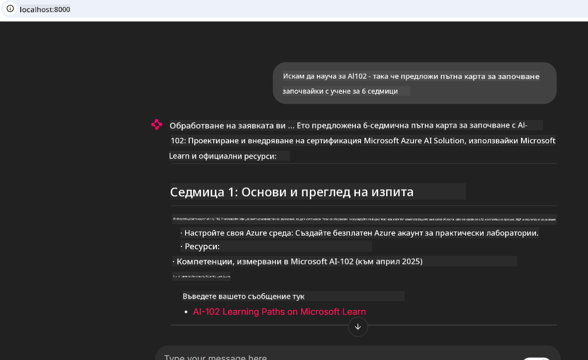

<!--
CO_OP_TRANSLATOR_METADATA:
{
  "original_hash": "4319d291c9d124ecafea52b3d04bfa0e",
  "translation_date": "2025-07-14T06:29:39+00:00",
  "source_file": "09-CaseStudy/docs-mcp/README.md",
  "language_code": "bg"
}
-->
# Казус: Свързване към Microsoft Learn Docs MCP сървър от клиент

Случвало ли ви се е да се ровите между сайтове с документация, Stack Overflow и безброй табове на търсачки, докато се опитвате да решите проблем в кода си? Може би имате втори монитор само за документация или постоянно превключвате между IDE-то и браузъра. Не би ли било по-добре, ако документацията беше интегрирана директно във вашия работен процес — в приложенията ви, IDE-то или дори в собствените ви инструменти? В този казус ще разгледаме как точно да направите това, като се свържете директно към Microsoft Learn Docs MCP сървъра от собствено клиентско приложение.

## Преглед

Модерната разработка е повече от писане на код — тя е за намиране на точната информация в точния момент. Документацията е навсякъде, но рядко там, където най-много ви трябва: вътре в инструментите и работните ви процеси. Чрез интегриране на извличането на документация директно в приложенията си, можете да спестите време, да намалите превключването между контексти и да повишите продуктивността си. В този раздел ще ви покажем как да свържете клиент към Microsoft Learn Docs MCP сървъра, за да имате достъп до документация в реално време, съобразена с контекста, без да напускате приложението си.

Ще преминем през процеса на установяване на връзка, изпращане на заявка и ефективно обработване на поточни отговори. Този подход не само опростява работния ви процес, но и отваря възможности за създаване на по-умни и полезни инструменти за разработчици.

## Учебни цели

Защо правим това? Защото най-доброто потребителско изживяване за разработчици е това, което премахва пречките. Представете си свят, в който вашият редактор на код, чатбот или уеб приложение може мигновено да отговаря на въпросите ви за документация, използвайки най-актуалното съдържание от Microsoft Learn. В края на тази глава ще знаете как да:

- Разбирате основите на комуникацията между MCP сървър и клиент за документация
- Имплементирате конзолно или уеб приложение за свързване към Microsoft Learn Docs MCP сървъра
- Използвате поточни HTTP клиенти за извличане на документация в реално време
- Логирате и интерпретирате отговорите с документация във вашето приложение

Ще видите как тези умения могат да ви помогнат да създавате инструменти, които не са просто реактивни, а наистина интерактивни и съобразени с контекста.

## Сценарий 1 - Извличане на документация в реално време с MCP

В този сценарий ще ви покажем как да свържете клиент към Microsoft Learn Docs MCP сървъра, за да имате достъп до документация в реално време, съобразена с контекста, без да напускате приложението си.

Нека го приложим на практика. Вашата задача е да напишете приложение, което се свързва към Microsoft Learn Docs MCP сървъра, извиква инструмента `microsoft_docs_search` и логва поточния отговор в конзолата.

### Защо този подход?
Защото това е основата за изграждане на по-сложни интеграции — независимо дали искате да захранвате чатбот, разширение за IDE или уеб табло.

Кодът и инструкциите за този сценарий ще намерите в папката [`solution`](./solution/README.md) в рамките на този казус. Стъпките ще ви преведат през настройването на връзката:
- Използвайте официалния MCP SDK и HTTP клиент с поддръжка на поточно предаване за връзка
- Извикайте инструмента `microsoft_docs_search` с параметър за заявка, за да получите документация
- Имплементирайте правилно логване и обработка на грешки
- Създайте интерактивен конзолен интерфейс, който позволява на потребителите да въвеждат множество заявки за търсене

Този сценарий демонстрира как да:
- Свържете се към Docs MCP сървъра
- Изпратите заявка
- Парснете и отпечатате резултатите

Ето как може да изглежда изпълнението на решението:

```
Prompt> What is Azure Key Vault?
Answer> Azure Key Vault is a cloud service for securely storing and accessing secrets. ...
```

По-долу е минимален пример за решение. Пълният код и подробности са налични в папката с решения.

<details>
<summary>Python</summary>

```python
import asyncio
from mcp.client.streamable_http import streamablehttp_client
from mcp import ClientSession

async def main():
    async with streamablehttp_client("https://learn.microsoft.com/api/mcp") as (read_stream, write_stream, _):
        async with ClientSession(read_stream, write_stream) as session:
            await session.initialize()
            result = await session.call_tool("microsoft_docs_search", {"query": "Azure Functions best practices"})
            print(result.content)

if __name__ == "__main__":
    asyncio.run(main())
```

- За пълната имплементация и логване вижте [`scenario1.py`](../../../../09-CaseStudy/docs-mcp/solution/python/scenario1.py).
- За инструкции за инсталация и употреба вижте файла [`README.md`](./solution/python/README.md) в същата папка.
</details>

## Сценарий 2 - Уеб приложение за интерактивен генератор на учебен план с MCP

В този сценарий ще научите как да интегрирате Docs MCP в уеб проект. Целта е да позволите на потребителите да търсят в документацията на Microsoft Learn директно от уеб интерфейс, правейки документацията моментално достъпна във вашето приложение или сайт.

Ще видите как да:
- Настроите уеб приложение
- Свържете се към Docs MCP сървъра
- Обработвате потребителски вход и показвате резултати

Ето как може да изглежда изпълнението на решението:

```
User> I want to learn about AI102 - so suggest the roadmap to get it started from learn for 6 weeks

Assistant> Here’s a detailed 6-week roadmap to start your preparation for the AI-102: Designing and Implementing a Microsoft Azure AI Solution certification, using official Microsoft resources and focusing on exam skills areas:

---
## Week 1: Introduction & Fundamentals
- **Understand the Exam**: Review the [AI-102 exam skills outline](https://learn.microsoft.com/en-us/credentials/certifications/exams/ai-102/).
- **Set up Azure**: Sign up for a free Azure account if you don't have one.
- **Learning Path**: [Introduction to Azure AI services](https://learn.microsoft.com/en-us/training/modules/intro-to-azure-ai/)
- **Focus**: Get familiar with Azure portal, AI capabilities, and necessary tools.

....more weeks of the roadmap...

Let me know if you want module-specific recommendations or need more customized weekly tasks!
```

По-долу е минимален пример за решение. Пълният код и подробности са налични в папката с решения.



<details>
<summary>Python (Chainlit)</summary>

Chainlit е рамка за създаване на разговорни AI уеб приложения. Тя улеснява създаването на интерактивни чатботове и асистенти, които могат да извикват MCP инструменти и да показват резултати в реално време. Идеална е за бързо прототипиране и потребителски приятелски интерфейси.

```python
import chainlit as cl
import requests

MCP_URL = "https://learn.microsoft.com/api/mcp"

@cl.on_message
def handle_message(message):
    query = {"question": message}
    response = requests.post(MCP_URL, json=query)
    if response.ok:
        result = response.json()
        cl.Message(content=result.get("answer", "No answer found.")).send()
    else:
        cl.Message(content="Error: " + response.text).send()
```

- За пълната имплементация вижте [`scenario2.py`](../../../../09-CaseStudy/docs-mcp/solution/python/scenario2.py).
- За инструкции за настройка и стартиране вижте [`README.md`](./solution/python/README.md).
</details>

## Сценарий 3: Документация в редактора с MCP сървър във VS Code

Ако искате да получите Microsoft Learn Docs директно във VS Code (без да превключвате табове в браузъра), можете да използвате MCP сървъра в редактора си. Това ви позволява да:
- Търсите и четете документация във VS Code, без да напускате средата за кодиране.
- Цитирате документация и вмъквате линкове директно в README или учебни файлове.
- Използвате GitHub Copilot и MCP заедно за безпроблемен, AI-захранван работен процес с документация.

**Ще видите как да:**
- Добавите валиден `.vscode/mcp.json` файл в корена на работното си пространство (вижте пример по-долу).
- Отворите MCP панела или използвате командния палитра във VS Code за търсене и вмъкване на документация.
- Цитирате документация директно в markdown файловете си по време на работа.
- Комбинирате този работен процес с GitHub Copilot за още по-голяма продуктивност.

Ето пример как да настроите MCP сървъра във VS Code:

```json
{
  "servers": {
    "LearnDocsMCP": {
      "url": "https://learn.microsoft.com/api/mcp"
    }
  }
}
```

</details>

> За подробен урок със скрийншотове и стъпка по стъпка ръководство вижте [`README.md`](./solution/scenario3/README.md).


Този подход е идеален за всеки, който създава технически курсове, пише документация или разработва код с чести нужди от справки.

## Основни изводи

Интегрирането на документация директно в инструментите ви не е просто удобство — това е промяна в играта за продуктивността. Като се свържете към Microsoft Learn Docs MCP сървъра от вашия клиент, можете да:

- Премахнете превключването между кода и документацията
- Извличате актуална, съобразена с контекста документация в реално време
- Създавате по-умни, по-интерактивни инструменти за разработчици

Тези умения ще ви помогнат да създавате решения, които не са само ефективни, но и удоволствие за използване.

## Допълнителни ресурси

За да задълбочите разбирането си, разгледайте тези официални ресурси:

- [Microsoft Learn Docs MCP Server (GitHub)](https://github.com/MicrosoftDocs/mcp)
- [Започнете с Azure MCP Server (mcp-python)](https://learn.microsoft.com/en-us/azure/developer/azure-mcp-server/get-started#create-the-python-app)
- [Какво е Azure MCP Server?](https://learn.microsoft.com/en-us/azure/developer/azure-mcp-server/)
- [Въведение в Model Context Protocol (MCP)](https://modelcontextprotocol.io/introduction)
- [Добавяне на плъгини от MCP сървър (Python)](https://learn.microsoft.com/en-us/semantic-kernel/concepts/plugins/adding-mcp-plugins)

**Отказ от отговорност**:  
Този документ е преведен с помощта на AI преводаческа услуга [Co-op Translator](https://github.com/Azure/co-op-translator). Въпреки че се стремим към точност, моля, имайте предвид, че автоматизираните преводи могат да съдържат грешки или неточности. Оригиналният документ на неговия роден език трябва да се счита за авторитетен източник. За критична информация се препоръчва професионален човешки превод. Ние не носим отговорност за каквито и да е недоразумения или неправилни тълкувания, произтичащи от използването на този превод.