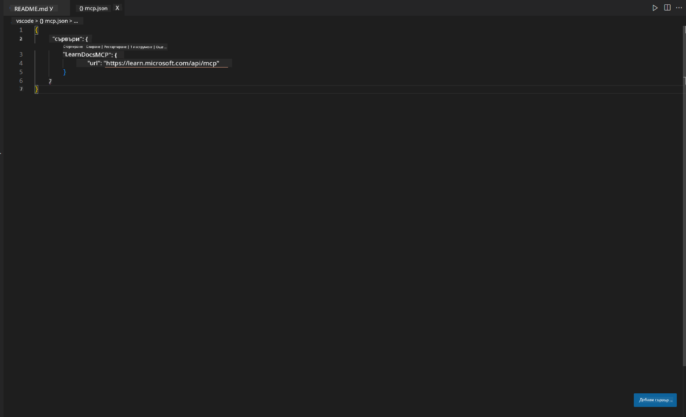
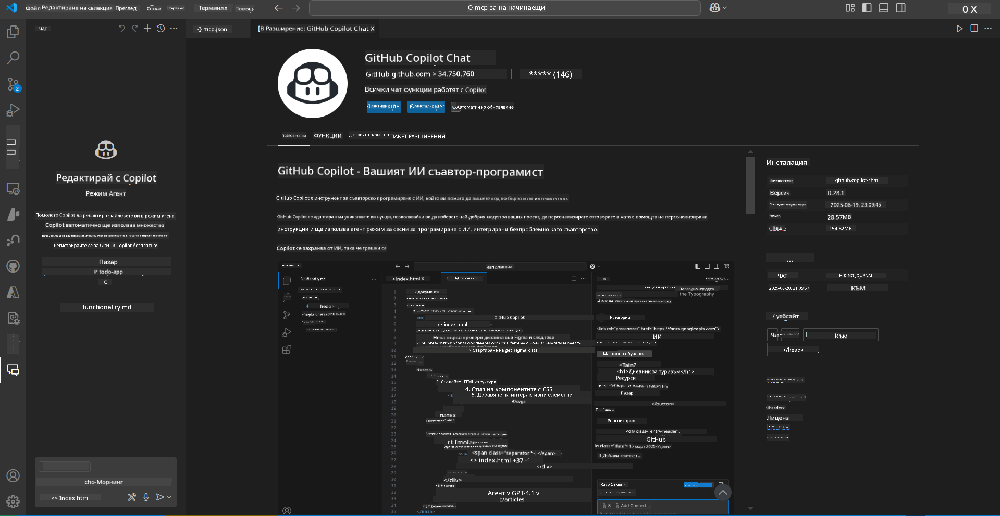
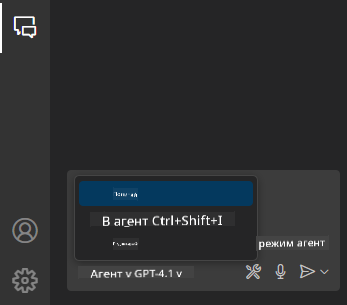
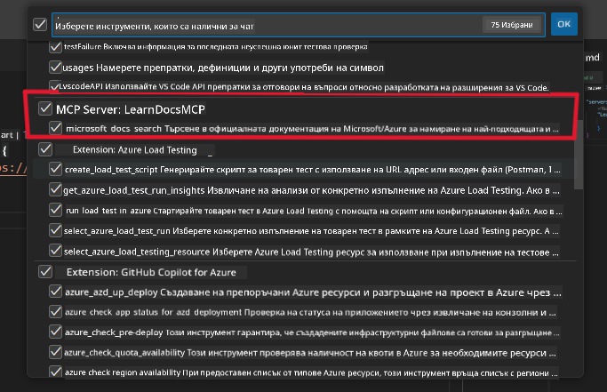
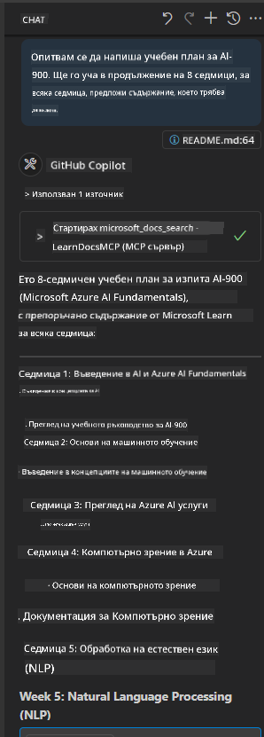
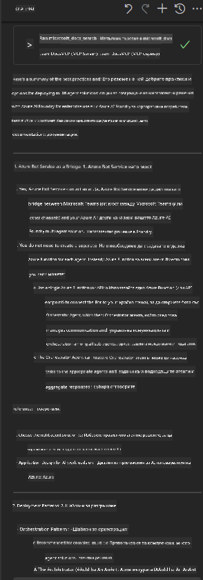

<!--
CO_OP_TRANSLATOR_METADATA:
{
  "original_hash": "db532b1ec386c9ce38c791653dc3c881",
  "translation_date": "2025-07-14T06:56:08+00:00",
  "source_file": "09-CaseStudy/docs-mcp/solution/scenario3/README.md",
  "language_code": "bg"
}
-->
# Сценарий 3: Документация в редактора с MCP сървър във VS Code

## Преглед

В този сценарий ще научите как да интегрирате Microsoft Learn Docs директно във вашата среда на Visual Studio Code, използвайки MCP сървъра. Вместо постоянно да превключвате между браузърни табове, за да търсите документация, можете да имате достъп, да търсите и да цитирате официални документи директно в редактора си. Този подход оптимизира работния ви процес, помага ви да останете фокусирани и позволява безпроблемна интеграция с инструменти като GitHub Copilot.

- Търсете и четете документация във VS Code, без да напускате средата за кодиране.
- Цитирайте документация и вмъквайте линкове директно в README или файловете на курса.
- Използвайте GitHub Copilot и MCP заедно за безпроблемен работен процес с AI-подпомагана документация.

## Учебни цели

Към края на тази глава ще разберете как да настроите и използвате MCP сървъра във VS Code, за да подобрите работния си процес с документация и разработка. Ще можете да:

- Конфигурирате работната си среда да използва MCP сървъра за търсене на документация.
- Търсите и вмъквате документация директно от VS Code.
- Комбинирате силата на GitHub Copilot и MCP за по-продуктивен, AI-подсилен работен процес.

Тези умения ще ви помогнат да останете фокусирани, да подобрите качеството на документацията и да повишите продуктивността си като разработчик или технически писател.

## Решение

За да осигурите достъп до документация в редактора, ще следвате поредица от стъпки, които интегрират MCP сървъра с VS Code и GitHub Copilot. Това решение е идеално за автори на курсове, писатели на документация и разработчици, които искат да останат концентрирани в редактора, докато работят с документация и Copilot.

- Бързо добавяйте референтни линкове в README, докато пишете курс или проектна документация.
- Използвайте Copilot за генериране на код и MCP за моментално намиране и цитиране на релевантна документация.
- Останете фокусирани в редактора и повишете продуктивността си.

### Стъпка по стъпка

За да започнете, следвайте тези стъпки. За всяка стъпка можете да добавите екранна снимка от папката assets, за да илюстрирате процеса визуално.

1. **Добавете конфигурацията на MCP:**
   В корена на проекта си създайте файл `.vscode/mcp.json` и добавете следната конфигурация:
   ```json
   {
     "servers": {
       "LearnDocsMCP": {
         "url": "https://learn.microsoft.com/api/mcp"
       }
     }
   }
   ```
   Тази конфигурация казва на VS Code как да се свърже с [`Microsoft Learn Docs MCP server`](https://github.com/MicrosoftDocs/mcp).
   
   
    
2. **Отворете панела GitHub Copilot Chat:**
   Ако все още нямате инсталирано разширението GitHub Copilot, отидете в изгледа Extensions във VS Code и го инсталирайте. Можете да го изтеглите директно от [Visual Studio Code Marketplace](https://marketplace.visualstudio.com/items?itemName=GitHub.copilot-chat). След това отворете панела Copilot Chat от страничната лента.

   

3. **Активирайте agent mode и проверете инструментите:**
   В панела Copilot Chat активирайте agent mode.

   

   След активирането на agent mode, проверете дали MCP сървърът е в списъка с налични инструменти. Това гарантира, че Copilot агентът може да достъпва сървъра за документация, за да извлича релевантна информация.
   
   
4. **Започнете нов чат и задайте въпрос на агента:**
   Отворете нов чат в панела Copilot Chat. Сега можете да задавате въпроси на агента относно документацията. Агентът ще използва MCP сървъра, за да извлече и покаже релевантна документация от Microsoft Learn директно в редактора ви.

   - *"Опитвам се да напиша учебен план за тема X. Ще я изучавам 8 седмици, за всяка седмица предложи съдържание, което трябва да покрия."*

   

5. **Живо запитване:**

   > Нека вземем живо запитване от секцията [#get-help](https://discord.gg/D6cRhjHWSC) в Azure AI Foundry Discord ([виж оригиналното съобщение](https://discord.com/channels/1113626258182504448/1385498306720829572)):
   
   *"Търся отговори как да разположа мулти-агентско решение с AI агенти, разработени в Azure AI Foundry. Виждам, че няма директен метод за разполагане, като например канали в Copilot Studio. Какви са различните начини за това разполагане, така че корпоративните потребители да могат да взаимодействат и да свършат работата?
Има много статии и блогове, които казват, че можем да използваме Azure Bot service като мост между MS Teams и Azure AI Foundry Agents. Ще работи ли това, ако настроя Azure bot, който се свързва с Orchestrator Agent в Azure AI Foundry чрез Azure function за оркестрация, или трябва да създам Azure function за всеки AI агент в мулти-агентското решение, за да се извърши оркестрацията на Bot framework? Други предложения са добре дошли."*

   

   Агентът ще отговори с релевантни линкове и резюмета от документацията, които можете директно да вмъкнете във вашите markdown файлове или да използвате като препратки в кода си.
   
### Примерни запитвания

Ето няколко примерни запитвания, които можете да изпробвате. Те ще демонстрират как MCP сървърът и Copilot работят заедно, за да предоставят мигновена, контекстуално осъзната документация и препратки, без да напускате VS Code:

- "Покажи ми как да използвам тригери в Azure Functions."
- "Вмъкни линк към официалната документация за Azure Key Vault."
- "Кои са най-добрите практики за защита на Azure ресурси?"
- "Намери quickstart за Azure AI услуги."

Тези запитвания ще демонстрират как MCP сървърът и Copilot могат да работят заедно, за да предоставят мигновена, контекстуално осъзната документация и препратки, без да напускате VS Code.

---

**Отказ от отговорност**:  
Този документ е преведен с помощта на AI преводаческа услуга [Co-op Translator](https://github.com/Azure/co-op-translator). Въпреки че се стремим към точност, моля, имайте предвид, че автоматизираните преводи могат да съдържат грешки или неточности. Оригиналният документ на неговия роден език трябва да се счита за авторитетен източник. За критична информация се препоръчва професионален човешки превод. Ние не носим отговорност за каквито и да е недоразумения или неправилни тълкувания, произтичащи от използването на този превод.