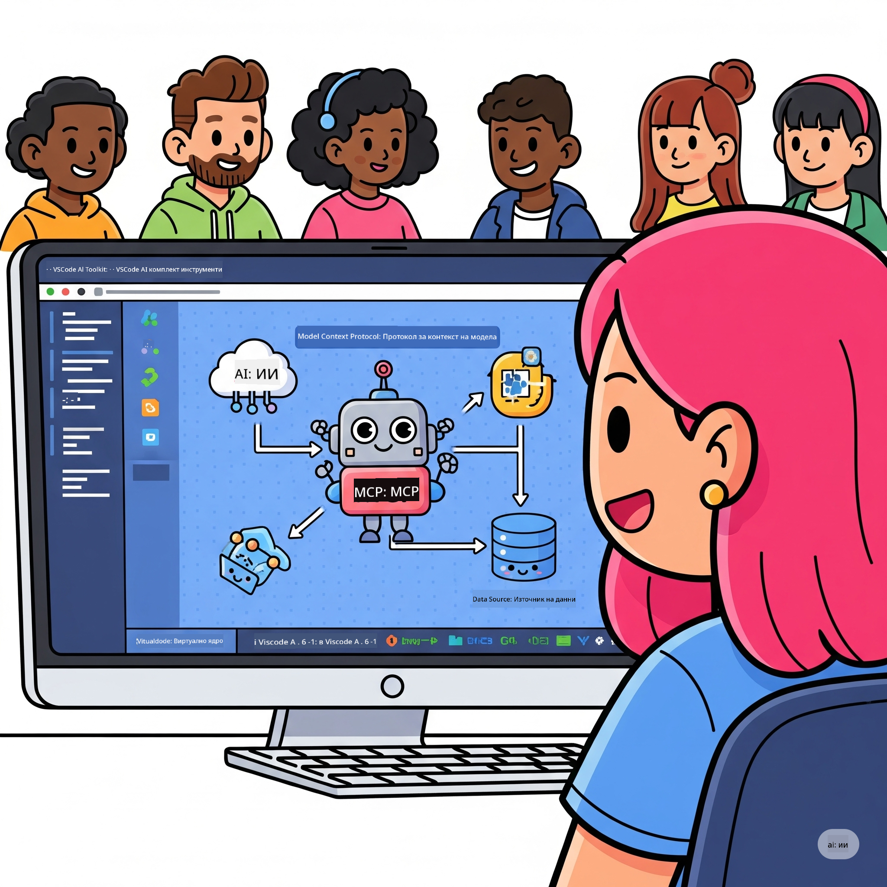

<!--
CO_OP_TRANSLATOR_METADATA:
{
  "original_hash": "787440926586cd064b0899fd1c514f52",
  "translation_date": "2025-07-14T07:14:10+00:00",
  "source_file": "10-StreamliningAIWorkflowsBuildingAnMCPServerWithAIToolkit/README.md",
  "language_code": "bg"
}
-->
# Оптимизиране на AI работни процеси: Създаване на MCP сървър с AI Toolkit

## 🎯 Преглед

Добре дошли в **Model Context Protocol (MCP) Workshop**! Този изчерпателен практически курс съчетава две водещи технологии, които революционизират разработката на AI приложения:

- **🔗 Model Context Protocol (MCP)**: Отворен стандарт за безпроблемна интеграция на AI инструменти
- **🛠️ AI Toolkit за Visual Studio Code (AITK)**: Мощното AI разширение на Microsoft за разработка

### 🎓 Какво ще научите

В края на този курс ще овладеете уменията за създаване на интелигентни приложения, които свързват AI модели с реални инструменти и услуги. От автоматизирано тестване до персонализирани API интеграции, ще придобиете практически знания за решаване на сложни бизнес предизвикателства.

## 🏗️ Технологичен стек

### 🔌 Model Context Protocol (MCP)

MCP е **„USB-C за AI“** – универсален стандарт, който свързва AI модели с външни инструменти и източници на данни.

**✨ Основни характеристики:**
- 🔄 **Стандартизирана интеграция**: Универсален интерфейс за свързване на AI инструменти
- 🏛️ **Гъвкава архитектура**: Локални и отдалечени сървъри чрез stdio/SSE транспорт
- 🧰 **Богат екосистем**: Инструменти, подсказки и ресурси в един протокол
- 🔒 **Готовност за предприятия**: Вградена сигурност и надеждност

**🎯 Защо MCP е важен:**
Точно както USB-C премахна хаоса с кабелите, MCP опростява сложността на AI интеграциите. Един протокол, безкрайни възможности.

### 🤖 AI Toolkit за Visual Studio Code (AITK)

Водещото AI разширение на Microsoft, което превръща VS Code в AI мощност.

**🚀 Основни възможности:**
- 📦 **Каталог с модели**: Достъп до модели от Azure AI, GitHub, Hugging Face, Ollama
- ⚡ **Локално изпълнение**: ONNX-оптимизирано изпълнение на CPU/GPU/NPU
- 🏗️ **Agent Builder**: Визуално създаване на AI агенти с MCP интеграция
- 🎭 **Мултимодален**: Поддръжка на текст, визуални и структурирани изходи

**💡 Предимства при разработка:**
- Нулева конфигурация за разгръщане на модели
- Визуално инженерство на подсказки
- Пясъчник за тестване в реално време
- Безпроблемна интеграция с MCP сървъри

## 📚 Обучителен път

### [🚀 Модул 1: Основи на AI Toolkit](./lab1/README.md)
**Продължителност**: 15 минути
- 🛠️ Инсталиране и конфигуриране на AI Toolkit за VS Code
- 🗂️ Разглеждане на Каталога с модели (100+ модела от GitHub, ONNX, OpenAI, Anthropic, Google)
- 🎮 Овладяване на Интерактивния пясъчник за тестване на модели в реално време
- 🤖 Създаване на първия AI агент с Agent Builder
- 📊 Оценка на представянето на моделите с вградени метрики (F1, релевантност, сходство, кохерентност)
- ⚡ Запознаване с пакетна обработка и мултимодална поддръжка

**🎯 Резултат от обучението**: Създаване на функционален AI агент с пълно разбиране на възможностите на AITK

### [🌐 Модул 2: MCP с основи на AI Toolkit](./lab2/README.md)
**Продължителност**: 20 минути
- 🧠 Овладяване на архитектурата и концепциите на Model Context Protocol (MCP)
- 🌐 Запознаване с екосистемата на MCP сървъри на Microsoft
- 🤖 Създаване на агент за браузърна автоматизация с Playwright MCP сървър
- 🔧 Интегриране на MCP сървъри с AI Toolkit Agent Builder
- 📊 Конфигуриране и тестване на MCP инструменти в агентите
- 🚀 Експортиране и разгръщане на MCP-задвижвани агенти за продукция

**🎯 Резултат от обучението**: Разгръщане на AI агент, подсилен с външни инструменти чрез MCP

### [🔧 Модул 3: Разширена MCP разработка с AI Toolkit](./lab3/README.md)
**Продължителност**: 20 минути
- 💻 Създаване на персонализирани MCP сървъри с AI Toolkit
- 🐍 Конфигуриране и използване на последния MCP Python SDK (v1.9.3)
- 🔍 Настройка и използване на MCP Inspector за отстраняване на грешки
- 🛠️ Създаване на Weather MCP сървър с професионални дебъгинг работни процеси
- 🧪 Отстраняване на грешки в MCP сървъри както в Agent Builder, така и в Inspector

**🎯 Резултат от обучението**: Разработка и отстраняване на грешки в персонализирани MCP сървъри с модерни инструменти

### [🐙 Модул 4: Практическа MCP разработка - Персонализиран GitHub Clone сървър](./lab4/README.md)
**Продължителност**: 30 минути
- 🏗️ Създаване на реален GitHub Clone MCP сървър за разработващи работни процеси
- 🔄 Имплементиране на интелигентно клониране на хранилища с валидация и обработка на грешки
- 📁 Създаване на интелигентно управление на директории и интеграция с VS Code
- 🤖 Използване на GitHub Copilot Agent Mode с персонализирани MCP инструменти
- 🛡️ Прилагане на надеждност за продукция и съвместимост с различни платформи

**🎯 Резултат от обучението**: Разгръщане на продукционно готов MCP сървър, който оптимизира реални работни процеси

## 💡 Приложения в реалния свят и въздействие

### 🏢 Примери за използване в предприятия

#### 🔄 Автоматизация на DevOps
Трансформирайте разработващите си процеси с интелигентна автоматизация:
- **Интелигентно управление на хранилища**: AI-базирани прегледи на код и решения за сливане
- **Интелигентен CI/CD**: Автоматична оптимизация на pipeline според промените в кода
- **Триаж на проблеми**: Автоматична класификация и разпределение на бъгове

#### 🧪 Революция в осигуряването на качеството
Подобрете тестването с AI-управлявана автоматизация:
- **Интелигентно генериране на тестове**: Автоматично създаване на пълни тестови комплекти
- **Визуално регресионно тестване**: AI-базирано откриване на промени в UI
- **Мониторинг на производителността**: Проактивно откриване и решаване на проблеми

#### 📊 Интелигентност в обработката на данни
Създайте по-умни работни процеси за обработка на данни:
- **Адаптивни ETL процеси**: Самооптимизиращи се трансформации на данни
- **Откриване на аномалии**: Мониторинг на качеството на данните в реално време
- **Интелигентно маршрутизиране**: Управление на потока на данни

#### 🎧 Подобряване на клиентското изживяване
Създайте изключителни взаимодействия с клиентите:
- **Поддръжка с контекст**: AI агенти с достъп до историята на клиента
- **Проактивно решаване на проблеми**: Прогностично обслужване на клиенти
- **Мултиканална интеграция**: Единно AI изживяване на различни платформи

## 🛠️ Изисквания и настройка

### 💻 Системни изисквания

| Компонент           | Изискване               | Забележки               |
|---------------------|-------------------------|-------------------------|
| **Операционна система** | Windows 10+, macOS 10.15+, Linux | Всяка модерна ОС         |
| **Visual Studio Code** | Последна стабилна версия | Задължително за AITK     |
| **Node.js**          | v18.0+ и npm            | За разработка на MCP сървъри |
| **Python**           | 3.10+                   | По избор за Python MCP сървъри |
| **Памет**            | Минимум 8GB RAM         | Препоръчително 16GB за локални модели |

### 🔧 Разработваща среда

#### Препоръчителни разширения за VS Code
- **AI Toolkit** (ms-windows-ai-studio.windows-ai-studio)
- **Python** (ms-python.python)
- **Python Debugger** (ms-python.debugpy)
- **GitHub Copilot** (GitHub.copilot) - По избор, но полезно

#### По избор инструменти
- **uv**: Модерен пакетен мениджър за Python
- **MCP Inspector**: Визуален инструмент за дебъгване на MCP сървъри
- **Playwright**: За примери с уеб автоматизация

## 🎖️ Резултати от обучението и път за сертифициране

### 🏆 Контролен списък за овладяване на умения

След завършване на този курс ще постигнете експертност в:

#### 🎯 Основни компетенции
- [ ] **Майсторство на MCP протокола**: Задълбочено разбиране на архитектурата и модели за имплементация
- [ ] **Професионално използване на AITK**: Експертно боравене с AI Toolkit за бърза разработка
- [ ] **Разработка на персонализирани сървъри**: Създаване, разгръщане и поддръжка на продукционни MCP сървъри
- [ ] **Отлична интеграция на инструменти**: Безпроблемно свързване на AI с вече съществуващи работни процеси
- [ ] **Прилагане на умения за решаване на проблеми**: Използване на наученото за реални бизнес предизвикателства

#### 🔧 Технически умения
- [ ] Настройка и конфигуриране на AI Toolkit във VS Code
- [ ] Проектиране и имплементация на персонализирани MCP сървъри
- [ ] Интеграция на GitHub модели с MCP архитектура
- [ ] Създаване на автоматизирани тестови работни процеси с Playwright
- [ ] Разгръщане на AI агенти за продукционна употреба
- [ ] Отстраняване на грешки и оптимизация на MCP сървърите

#### 🚀 Разширени възможности
- [ ] Проектиране на AI интеграции в мащаб на предприятия
- [ ] Прилагане на най-добри практики за сигурност в AI приложения
- [ ] Проектиране на мащабируеми MCP сървърни архитектури
- [ ] Създаване на персонализирани инструментални вериги за специфични области
- [ ] Наставничество в AI-ориентирана разработка

## 📖 Допълнителни ресурси
- [MCP Спецификация](https://modelcontextprotocol.io/docs)
- [AI Toolkit GitHub хранилище](https://github.com/microsoft/vscode-ai-toolkit)
- [Колекция с примерни MCP сървъри](https://github.com/modelcontextprotocol/servers)
- [Ръководство с най-добри практики](https://modelcontextprotocol.io/docs/best-practices)

---

**🚀 Готови ли сте да революционизирате своя AI разработващ процес?**

Нека заедно изградим бъдещето на интелигентните приложения с MCP и AI Toolkit!

**Отказ от отговорност**:  
Този документ е преведен с помощта на AI преводаческа услуга [Co-op Translator](https://github.com/Azure/co-op-translator). Въпреки че се стремим към точност, моля, имайте предвид, че автоматизираните преводи могат да съдържат грешки или неточности. Оригиналният документ на неговия език трябва да се счита за авторитетен източник. За критична информация се препоръчва професионален човешки превод. Ние не носим отговорност за каквито и да е недоразумения или неправилни тълкувания, произтичащи от използването на този превод.