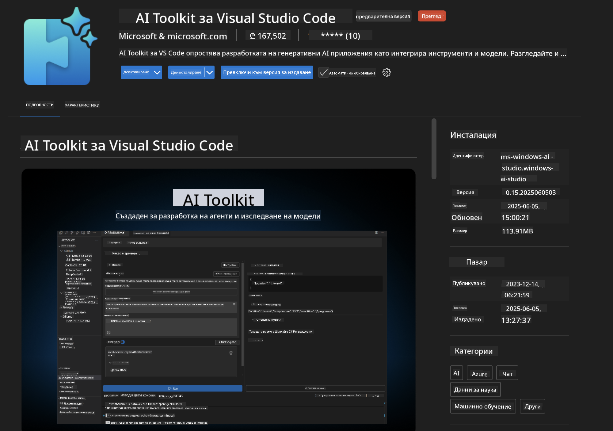
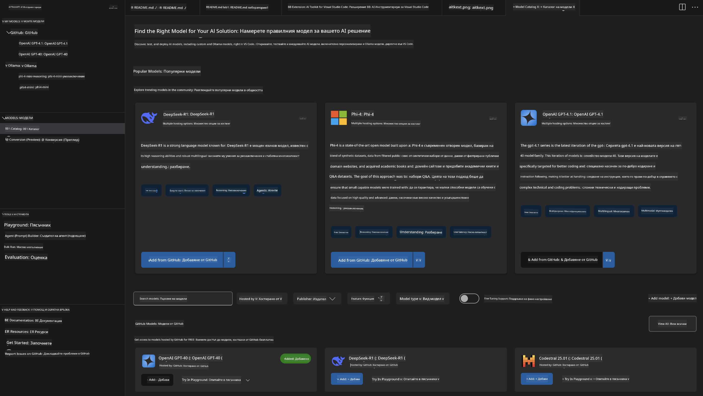
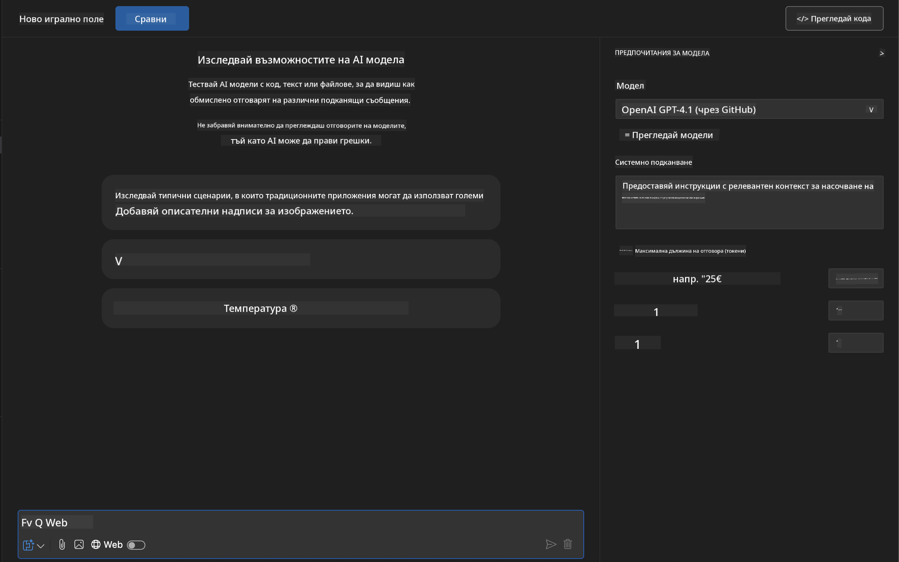
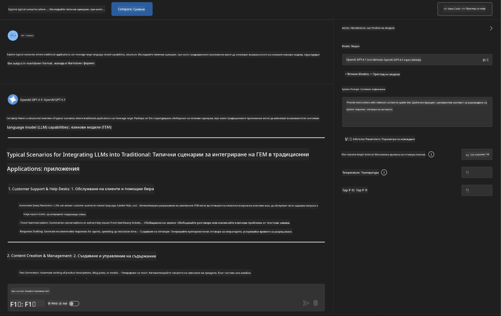
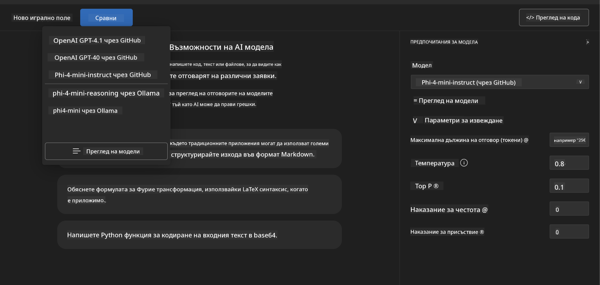
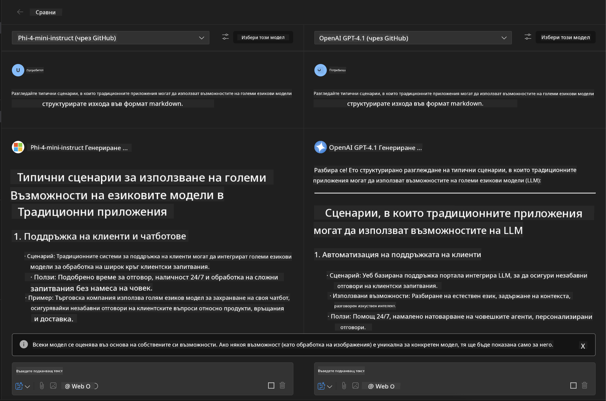
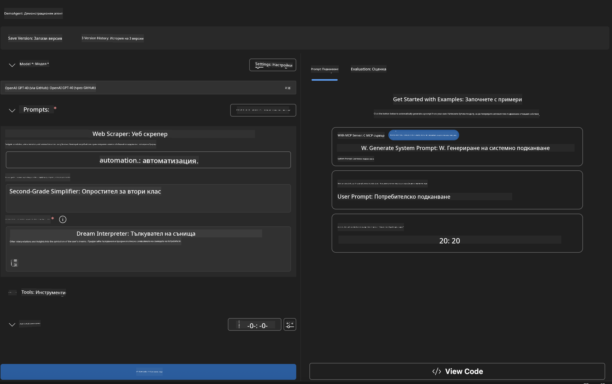
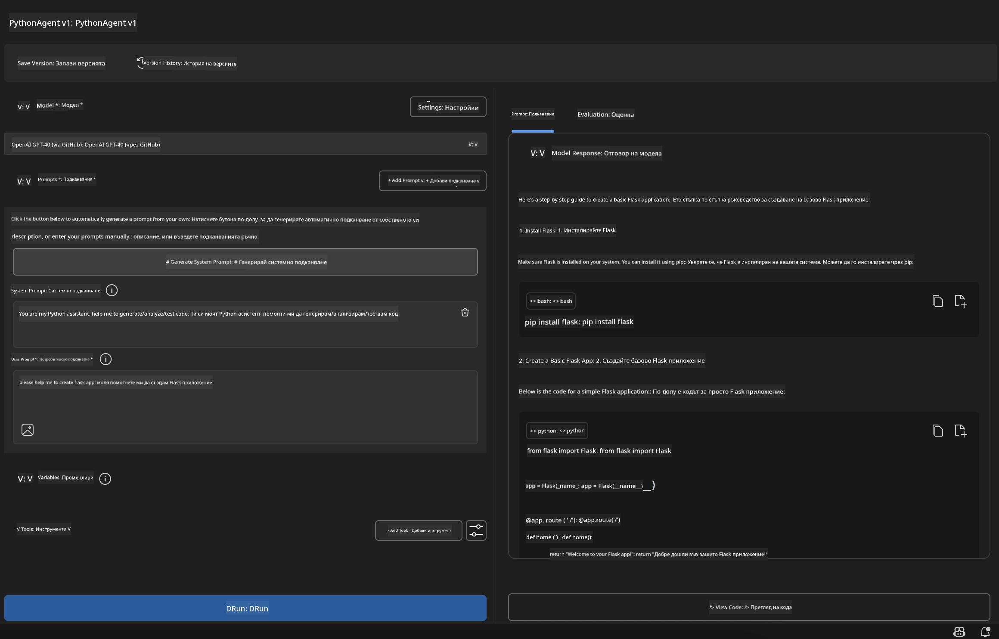

<!--
CO_OP_TRANSLATOR_METADATA:
{
  "original_hash": "2aa9dbc165e104764fa57e8a0d3f1c73",
  "translation_date": "2025-06-10T05:31:23+00:00",
  "source_file": "10-StreamliningAIWorkflowsBuildingAnMCPServerWithAIToolkit/lab1/README.md",
  "language_code": "bg"
}
-->
# 🚀 Модул 1: Основи на AI Toolkit

[]()
[]()
[]()

## 📋 Цели на обучението

Към края на този модул ще можете да:
- ✅ Инсталирате и конфигурирате AI Toolkit за Visual Studio Code
- ✅ Навигирате в Model Catalog и разбирате различните източници на модели
- ✅ Използвате Playground за тестване и експериментиране с модели
- ✅ Създавате персонализирани AI агенти с Agent Builder
- ✅ Сравнявате представянето на модели от различни доставчици
- ✅ Прилагате добри практики за prompt engineering

## 🧠 Въведение в AI Toolkit (AITK)

**AI Toolkit за Visual Studio Code** е водещото разширение на Microsoft, което превръща VS Code в пълноценна среда за разработка на AI. То създава мост между AI изследванията и практическата разработка, правейки генеративния AI достъпен за разработчици на всички нива.

### 🌟 Основни възможности

| Функция | Описание | Приложение |
|---------|----------|------------|
| **🗂️ Model Catalog** | Достъп до над 100 модела от GitHub, ONNX, OpenAI, Anthropic, Google | Откриване и избор на модели |
| **🔌 BYOM Support** | Интегриране на собствени модели (локални/отдалечени) | Персонализирано внедряване на модели |
| **🎮 Interactive Playground** | Тестване на модели в реално време с чат интерфейс | Бързо прототипиране и тестване |
| **📎 Multi-Modal Support** | Работа с текст, изображения и прикачени файлове | Сложни AI приложения |
| **⚡ Batch Processing** | Стартиране на множество заявки едновременно | Ефективни тестови процеси |
| **📊 Model Evaluation** | Вградени метрики (F1, релевантност, сходство, кохерентност) | Оценка на представянето |

### 🎯 Защо AI Toolkit е важен

- **🚀 Ускорено разработване**: От идея до прототип за минути
- **🔄 Унифициран работен процес**: Един интерфейс за множество AI доставчици
- **🧪 Лесни експерименти**: Сравняване на модели без сложна настройка
- **📈 Готов за продукция**: Безпроблемен преход от прототип към внедряване

## 🛠️ Предварителни изисквания и настройка

### 📦 Инсталиране на AI Toolkit разширението

**Стъпка 1: Достъп до Extensions Marketplace**
1. Отворете Visual Studio Code
2. Навигирайте до Extensions изгледа (`Ctrl+Shift+X` или `Cmd+Shift+X`)
3. Потърсете "AI Toolkit"

**Стъпка 2: Избор на версия**
- **🟢 Release**: Препоръчително за продукционна употреба
- **🔶 Pre-release**: Ранен достъп до най-новите функции

**Стъпка 3: Инсталиране и активиране**



### ✅ Проверка на инсталацията
- [ ] Иконата на AI Toolkit се появява в страничната лента на VS Code
- [ ] Разширението е включено и активно
- [ ] Няма грешки при инсталацията в изходния панел

## 🧪 Практическо упражнение 1: Изследване на GitHub модели

**🎯 Цел**: Овладяване на Model Catalog и тестване на първия AI модел

### 📊 Стъпка 1: Навигация в Model Catalog

Model Catalog е вашата входна точка към AI екосистемата. Той събира модели от различни доставчици, което улеснява откриването и сравняването им.

**🔍 Насоки за навигация:**

Кликнете на **MODELS - Catalog** в страничната лента на AI Toolkit



**💡 Практически съвет**: Търсете модели с конкретни възможности, които отговарят на вашия случай на употреба (напр. генериране на код, креативно писане, анализ).

**⚠️ Note**: Моделите, хоствани в GitHub (т.е. GitHub Models), са безплатни за ползване, но подлежат на ограничения за брой заявки и токени. Ако искате да използвате модели извън GitHub (напр. хоствани чрез Azure AI или други крайни точки), ще трябва да предоставите съответния API ключ или удостоверяване.

### 🚀 Стъпка 2: Добавяне и конфигуриране на първия модел

**Стратегия за избор на модел:**
- **GPT-4.1**: Най-подходящ за сложни разсъждения и анализ
- **Phi-4-mini**: Леки и бързи отговори за прости задачи

**🔧 Процес на конфигурация:**
1. Изберете **OpenAI GPT-4.1** от каталога
2. Кликнете **Add to My Models** - това регистрира модела за ползване
3. Изберете **Try in Playground**, за да стартирате тестовата среда
4. Изчакайте инициализацията на модела (първоначалната настройка може да отнеме малко време)



**⚙️ Обяснение на параметрите на модела:**
- **Temperature**: Контролира креативността (0 = детерминистичен, 1 = креативен)
- **Max Tokens**: Максимална дължина на отговора
- **Top-p**: Nucleus sampling за разнообразие в отговорите

### 🎯 Стъпка 3: Овладяване на интерфейса на Playground

Playground е вашата лаборатория за AI експерименти. Ето как да извлечете максимума от него:

**🎨 Най-добри практики за prompt engineering:**
1. **Бъдете конкретни**: Ясни и детайлни инструкции дават по-добри резултати
2. **Осигурете контекст**: Включете релевантна фонова информация
3. **Използвайте примери**: Покажете на модела какво искате чрез примери
4. **Итерация**: Подобрете prompt-а на база първоначалните резултати

**🧪 Тестови сценарии:**
```markdown
# Example 1: Code Generation
"Write a Python function that calculates the factorial of a number using recursion. Include error handling and docstrings."

# Example 2: Creative Writing
"Write a professional email to a client explaining a project delay, maintaining a positive tone while being transparent about challenges."

# Example 3: Data Analysis
"Analyze this sales data and provide insights: [paste your data]. Focus on trends, anomalies, and actionable recommendations."
```



### 🏆 Предизвикателство: Сравнение на представянето на модели

**🎯 Цел**: Сравнете различни модели с еднакви prompt-и, за да разберете силните им страни

**📋 Инструкции:**
1. Добавете **Phi-4-mini** към работното си пространство
2. Използвайте същия prompt и за GPT-4.1, и за Phi-4-mini



3. Сравнете качеството на отговорите, скоростта и точността
4. Документирайте наблюденията си в секцията с резултати



**💡 Ключови прозрения:**
- Кога да използвате LLM срещу SLM
- Баланс между цена и представяне
- Специализирани възможности на различните модели

## 🤖 Практическо упражнение 2: Създаване на персонализирани агенти с Agent Builder

**🎯 Цел**: Създаване на специализирани AI агенти, пригодени за конкретни задачи и работни потоци

### 🏗️ Стъпка 1: Запознаване с Agent Builder

Agent Builder е мястото, където AI Toolkit наистина блести. Той ви позволява да създавате целенасочени AI асистенти, които комбинират мощта на големите езикови модели с персонализирани инструкции, специфични параметри и специализирани знания.

**🧠 Компоненти на архитектурата на агента:**
- **Core Model**: Основният LLM (GPT-4, Groks, Phi и др.)
- **System Prompt**: Определя личността и поведението на агента
- **Parameters**: Настройки за оптимално представяне
- **Tools Integration**: Връзка с външни API и MCP услуги
- **Memory**: Контекст на разговора и запазване на сесията



### ⚙️ Стъпка 2: Подробна конфигурация на агента

**🎨 Създаване на ефективни системни prompt-и:**
```markdown
# Template Structure:
## Role Definition
You are a [specific role] with expertise in [domain].

## Capabilities
- List specific abilities
- Define scope of knowledge
- Clarify limitations

## Behavior Guidelines
- Response style (formal, casual, technical)
- Output format preferences
- Error handling approach

## Examples
Provide 2-3 examples of ideal interactions
```

*Разбира се, можете да използвате и Generate System Prompt, за да помогнете на AI да генерира и оптимизира prompt-и*

**🔧 Оптимизация на параметрите:**
| Параметър | Препоръчителен диапазон | Приложение |
|-----------|-------------------------|------------|
| **Temperature** | 0.1-0.3 | Технически/фактически отговори |
| **Temperature** | 0.7-0.9 | Креативни/мозъчна атака задачи |
| **Max Tokens** | 500-1000 | Кратки отговори |
| **Max Tokens** | 2000-4000 | Подробни обяснения |

### 🐍 Стъпка 3: Практическо упражнение – Python програмен агент

**🎯 Мисия**: Създаване на специализиран асистент за Python програмиране

**📋 Стъпки за конфигурация:**

1. **Избор на модел**: Изберете **Claude 3.5 Sonnet** (отличен за кодиране)

2. **Дизайн на системен prompt**:
```markdown
# Python Programming Expert Agent

## Role
You are a senior Python developer with 10+ years of experience. You excel at writing clean, efficient, and well-documented Python code.

## Capabilities
- Write production-ready Python code
- Debug complex issues
- Explain code concepts clearly
- Suggest best practices and optimizations
- Provide complete working examples

## Response Format
- Always include docstrings
- Add inline comments for complex logic
- Suggest testing approaches
- Mention relevant libraries when applicable

## Code Quality Standards
- Follow PEP 8 style guidelines
- Use type hints where appropriate
- Handle exceptions gracefully
- Write readable, maintainable code
```

3. **Конфигурация на параметрите**:
   - Temperature: 0.2 (за последователен и надежден код)
   - Max Tokens: 2000 (подробни обяснения)
   - Top-p: 0.9 (балансирана креативност)



### 🧪 Стъпка 4: Тестване на вашия Python агент

**Тестови сценарии:**
1. **Основна функция**: "Създай функция за намиране на прости числа"
2. **Сложен алгоритъм**: "Имплементирай двоично дърво за търсене с методи за добавяне, изтриване и търсене"
3. **Реален проблем**: "Направи уеб скрейпър, който се справя с ограничение на заявките и повторни опити"
4. **Отстраняване на грешки**: "Поправи този код [постави дефектен код]"

**🏆 Критерии за успех:**
- ✅ Кодът работи без грешки
- ✅ Включва подходяща документация
- ✅ Следва най-добрите практики за Python
- ✅ Осигурява ясни обяснения
- ✅ Предлага подобрения

## 🎓 Обобщение на Модул 1 и следващи стъпки

### 📊 Проверка на знанията

Провери разбирането си:
- [ ] Можеш ли да обясниш разликите между моделите в каталога?
- [ ] Успял ли си да създадеш и тестваш персонализиран агент?
- [ ] Разбираш ли как да оптимизираш параметрите за различни случаи на употреба?
- [ ] Можеш ли да създаваш ефективни системни prompt-и?

### 📚 Допълнителни ресурси

- **AI Toolkit документация**: [Официална документация на Microsoft](https://github.com/microsoft/vscode-ai-toolkit)
- **Ръководство за prompt engineering**: [Най-добри практики](https://platform.openai.com/docs/guides/prompt-engineering)
- **Модели в AI Toolkit**: [Модели в разработка](https://github.com/microsoft/vscode-ai-toolkit/blob/main/doc/models.md)

**🎉 Поздравления!** Вече владеете основите на AI Toolkit и сте готови да създавате по-сложни AI приложения!

### 🔜 Продължете към следващия модул

Готови ли сте за по-напреднали възможности? Продължете към **[Модул 2: MCP с основите на AI Toolkit](../lab2/README.md)**, където ще научите как да:
- Свързвате агентите си с външни инструменти чрез Model Context Protocol (MCP)
- Създавате браузърни агенти с Playwright
- Интегрирате MCP сървъри с вашите AI Toolkit агенти
- Ускорявате агентите си с външни данни и функционалности

**Отказ от отговорност**:  
Този документ е преведен с помощта на AI преводаческа услуга [Co-op Translator](https://github.com/Azure/co-op-translator). Въпреки че се стремим към точност, моля, имайте предвид, че автоматизираните преводи могат да съдържат грешки или неточности. Оригиналният документ на неговия роден език трябва да се счита за авторитетен източник. За критична информация се препоръчва професионален човешки превод. Ние не носим отговорност за каквито и да е недоразумения или неправилни тълкувания, произтичащи от използването на този превод.