<!--
CO_OP_TRANSLATOR_METADATA:
{
  "original_hash": "a22b7dd11cd7690f99f9195877cafdc3",
  "translation_date": "2025-07-14T08:01:56+00:00",
  "source_file": "10-StreamliningAIWorkflowsBuildingAnMCPServerWithAIToolkit/lab2/README.md",
  "language_code": "bg"
}
-->
# 🌐 Модул 2: Основи на MCP с AI Toolkit

[]()
[]()
[]()

## 📋 Учебни цели

Към края на този модул ще можете да:
- ✅ Разберете архитектурата и предимствата на Model Context Protocol (MCP)
- ✅ Изследвате екосистемата от MCP сървъри на Microsoft
- ✅ Интегрирате MCP сървъри с AI Toolkit Agent Builder
- ✅ Създадете функционален агент за автоматизация на браузър с Playwright MCP
- ✅ Конфигурирате и тествате MCP инструменти в агентите си
- ✅ Експортирате и внедрявате агенти с MCP за продукционна употреба

## 🎯 Надграждане върху Модул 1

В Модул 1 овладяхме основите на AI Toolkit и създадохме първия си Python агент. Сега ще **усъвършенстваме** вашите агенти, като ги свържем с външни инструменти и услуги чрез революционния **Model Context Protocol (MCP)**.

Представете си това като ъпгрейд от обикновен калкулатор към пълноценен компютър – вашите AI агенти ще получат възможността да:
- 🌐 Разглеждат и взаимодействат с уебсайтове
- 📁 Достъпват и управляват файлове
- 🔧 Интегрират се с корпоративни системи
- 📊 Обработват данни в реално време от API-та

## 🧠 Какво е Model Context Protocol (MCP)

### 🔍 Какво представлява MCP?

Model Context Protocol (MCP) е **„USB-C за AI приложенията“** – революционен отворен стандарт, който свързва големи езикови модели (LLMs) с външни инструменти, източници на данни и услуги. Точно както USB-C премахна хаоса с кабелите, предоставяйки един универсален конектор, MCP премахва сложността при интеграцията на AI с един стандартизиран протокол.

### 🎯 Проблемът, който MCP решава

**Преди MCP:**
- 🔧 Персонализирани интеграции за всеки инструмент
- 🔄 Заключване към доставчици с патентовани решения  
- 🔒 Уязвимости в сигурността от ad-hoc връзки
- ⏱️ Месеци разработка за базови интеграции

**С MCP:**
- ⚡ Интеграция на инструменти с plug-and-play подход
- 🔄 Архитектура, независима от доставчици
- 🛡️ Вградени най-добри практики за сигурност
- 🚀 Добавяне на нови възможности за минути

### 🏗️ Подробности за архитектурата на MCP

MCP следва **клиент-сървър архитектура**, която създава сигурна и мащабируема екосистема:

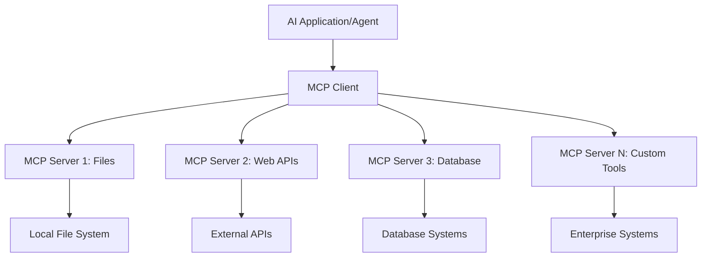

**🔧 Основни компоненти:**

| Компонент | Роля | Примери |
|-----------|------|----------|
| **MCP Hosts** | Приложения, които използват MCP услуги | Claude Desktop, VS Code, AI Toolkit |
| **MCP Clients** | Обработват протокола (1:1 със сървърите) | Вградени в хост приложенията |
| **MCP Servers** | Предоставят възможности чрез стандартен протокол | Playwright, Files, Azure, GitHub |
| **Транспортен слой** | Методи за комуникация | stdio, HTTP, WebSockets |


## 🏢 Екосистема от MCP сървъри на Microsoft

Microsoft води екосистемата на MCP с цялостен набор от корпоративни сървъри, които отговарят на реални бизнес нужди.

### 🌟 Представени MCP сървъри на Microsoft

#### 1. ☁️ Azure MCP Server
**🔗 Репозитория**: [azure/azure-mcp](https://github.com/azure/azure-mcp)  
**🎯 Цел**: Комплексно управление на Azure ресурси с AI интеграция

**✨ Основни функции:**
- Декларативно предоставяне на инфраструктура
- Мониторинг на ресурси в реално време
- Препоръки за оптимизация на разходите
- Проверка на съответствие със сигурността

**🚀 Приложения:**
- Infrastructure-as-Code с AI помощ
- Автоматично мащабиране на ресурси
- Оптимизация на облачни разходи
- Автоматизация на DevOps процеси

#### 2. 📊 Microsoft Dataverse MCP
**📚 Документация**: [Microsoft Dataverse Integration](https://go.microsoft.com/fwlink/?linkid=2320176)  
**🎯 Цел**: Интерфейс на естествен език за бизнес данни

**✨ Основни функции:**
- Запитвания към база данни на естествен език
- Разбиране на бизнес контекст
- Персонализирани шаблони за заявки
- Управление на корпоративни данни

**🚀 Приложения:**
- Отчети за бизнес интелигентност
- Анализ на клиентски данни
- Прозрения за продажбени потоци
- Запитвания за съответствие

#### 3. 🌐 Playwright MCP Server
**🔗 Репозитория**: [microsoft/playwright-mcp](https://github.com/microsoft/playwright-mcp)  
**🎯 Цел**: Автоматизация на браузър и уеб взаимодействия

**✨ Основни функции:**
- Крос-браузър автоматизация (Chrome, Firefox, Safari)
- Интелигентно откриване на елементи
- Генериране на скрийншотове и PDF
- Мониторинг на мрежов трафик

**🚀 Приложения:**
- Автоматизирани тестови процеси
- Уеб скрейпинг и извличане на данни
- Мониторинг на UI/UX
- Автоматизация на конкурентен анализ

#### 4. 📁 Files MCP Server
**🔗 Репозитория**: [microsoft/files-mcp-server](https://github.com/microsoft/files-mcp-server)  
**🎯 Цел**: Интелигентни операции с файловата система

**✨ Основни функции:**
- Декларативно управление на файлове
- Синхронизация на съдържание
- Интеграция с контрол на версиите
- Извличане на метаданни

**🚀 Приложения:**
- Управление на документация
- Организация на кодови хранилища
- Работни потоци за публикуване на съдържание
- Обработка на файлове в данни потоци

#### 5. 📝 MarkItDown MCP Server
**🔗 Репозитория**: [microsoft/markitdown](https://github.com/microsoft/markitdown)  
**🎯 Цел**: Разширена обработка и манипулация на Markdown

**✨ Основни функции:**
- Богат парсинг на Markdown
- Конвертиране на формати (MD ↔ HTML ↔ PDF)
- Анализ на структурата на съдържанието
- Обработка на шаблони

**🚀 Приложения:**
- Работни потоци за техническа документация
- Системи за управление на съдържание
- Генериране на отчети
- Автоматизация на бази знания

#### 6. 📈 Clarity MCP Server
**📦 Пакет**: [@microsoft/clarity-mcp-server](https://www.npmjs.com/package/@microsoft/clarity-mcp-server)  
**🎯 Цел**: Уеб аналитика и анализ на потребителско поведение

**✨ Основни функции:**
- Анализ на heatmap данни
- Записи на потребителски сесии
- Метрики за производителност
- Анализ на конверсионни фунии

**🚀 Приложения:**
- Оптимизация на уебсайтове
- Изследване на потребителски опит
- Анализ на A/B тестове
- Табла за бизнес интелигентност

### 🌍 Общностна екосистема

Освен сървърите на Microsoft, екосистемата MCP включва:
- **🐙 GitHub MCP**: Управление на репозитории и анализ на код
- **🗄️ Database MCPs**: Интеграции с PostgreSQL, MySQL, MongoDB
- **☁️ Cloud Provider MCPs**: Инструменти за AWS, GCP, Digital Ocean
- **📧 Communication MCPs**: Интеграции със Slack, Teams, Email

## 🛠️ Практическа лаборатория: Създаване на агент за автоматизация на браузър

**🎯 Цел на проекта**: Създайте интелигентен агент за автоматизация на браузър с Playwright MCP сървър, който може да навигира в уебсайтове, извлича информация и изпълнява сложни уеб взаимодействия.

### 🚀 Фаза 1: Настройка на основата на агента

#### Стъпка 1: Инициализирайте агента си
1. **Отворете AI Toolkit Agent Builder**  
2. **Създайте нов агент** с следната конфигурация:  
   - **Име**: `BrowserAgent`  
   - **Модел**: Изберете GPT-4o  

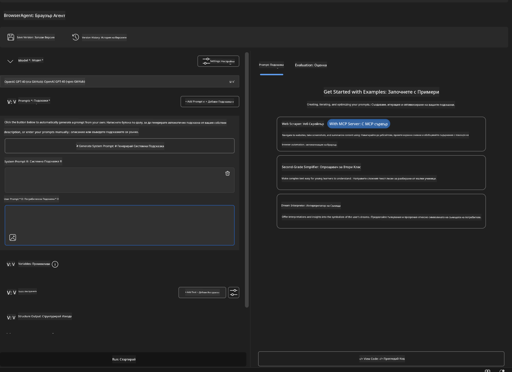


### 🔧 Фаза 2: Работен процес за интеграция на MCP

#### Стъпка 3: Добавете интеграция с MCP сървър
1. **Отидете в секцията Инструменти** в Agent Builder  
2. **Кликнете "Add Tool"** за да отворите менюто за интеграции  
3. **Изберете "MCP Server"** от наличните опции  

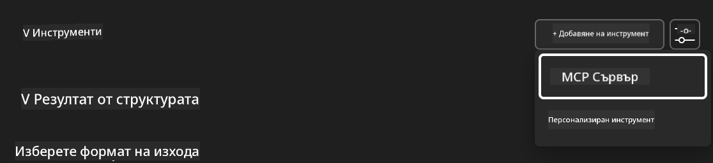

**🔍 Разбиране на типовете инструменти:**  
- **Вградени инструменти**: Предварително конфигурирани функции на AI Toolkit  
- **MCP сървъри**: Интеграции с външни услуги  
- **Потребителски API-та**: Ваши собствени крайни точки на услуги  
- **Function Calling**: Директен достъп до функции на модела  

#### Стъпка 4: Избор на MCP сървър
1. **Изберете опцията "MCP Server"** за продължаване  
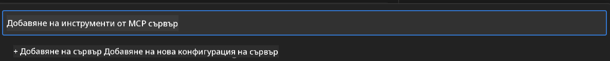

2. **Разгледайте MCP каталога** за налични интеграции  
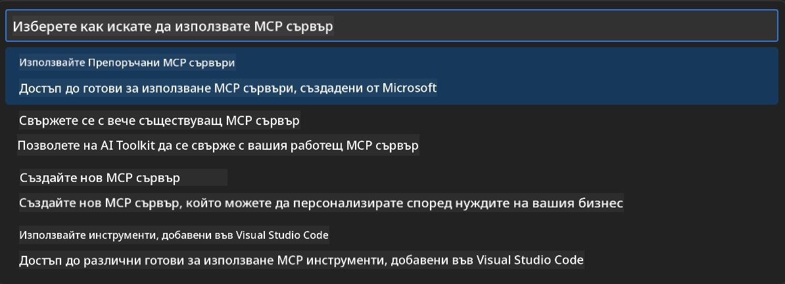


### 🎮 Фаза 3: Конфигурация на Playwright MCP

#### Стъпка 5: Изберете и конфигурирайте Playwright
1. **Кликнете "Use Featured MCP Servers"** за достъп до проверените сървъри на Microsoft  
2. **Изберете "Playwright"** от списъка с препоръчани  
3. **Приемете подразбиращия се MCP ID** или го персонализирайте за вашата среда  

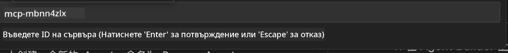

#### Стъпка 6: Активирайте възможностите на Playwright
**🔑 Критична стъпка**: Изберете **ВСИЧКИ** налични Playwright методи за максимална функционалност  


**🛠️ Основни Playwright инструменти:**  
- **Навигация**: `goto`, `goBack`, `goForward`, `reload`  
- **Взаимодействие**: `click`, `fill`, `press`, `hover`, `drag`  
- **Извличане**: `textContent`, `innerHTML`, `getAttribute`  
- **Валидация**: `isVisible`, `isEnabled`, `waitForSelector`  
- **Заснемане**: `screenshot`, `pdf`, `video`  
- **Мрежа**: `setExtraHTTPHeaders`, `route`, `waitForResponse`  

#### Стъпка 7: Проверете успешната интеграция
**✅ Индикатори за успех:**  
- Всички инструменти се показват в интерфейса на Agent Builder  
- Няма съобщения за грешки в панела за интеграция  
- Статусът на Playwright сървъра показва „Connected“  

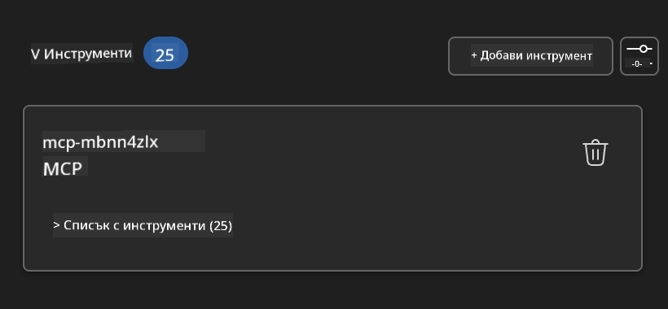

**🔧 Отстраняване на често срещани проблеми:**  
- **Неуспешна връзка**: Проверете интернет връзката и настройките на защитната стена  
- **Липсващи инструменти**: Уверете се, че всички възможности са избрани при настройката  
- **Грешки с разрешения**: Проверете дали VS Code има необходимите системни права  

### 🎯 Фаза 4: Разширено проектиране на подсказки

#### Стъпка 8: Създайте интелигентни системни подсказки
Създайте сложни подсказки, които използват пълния потенциал на Playwright:

```markdown
# Web Automation Expert System Prompt

## Core Identity
You are an advanced web automation specialist with deep expertise in browser automation, web scraping, and user experience analysis. You have access to Playwright tools for comprehensive browser control.

## Capabilities & Approach
### Navigation Strategy
- Always start with screenshots to understand page layout
- Use semantic selectors (text content, labels) when possible
- Implement wait strategies for dynamic content
- Handle single-page applications (SPAs) effectively

### Error Handling
- Retry failed operations with exponential backoff
- Provide clear error descriptions and solutions
- Suggest alternative approaches when primary methods fail
- Always capture diagnostic screenshots on errors

### Data Extraction
- Extract structured data in JSON format when possible
- Provide confidence scores for extracted information
- Validate data completeness and accuracy
- Handle pagination and infinite scroll scenarios

### Reporting
- Include step-by-step execution logs
- Provide before/after screenshots for verification
- Suggest optimizations and alternative approaches
- Document any limitations or edge cases encountered

## Ethical Guidelines
- Respect robots.txt and rate limiting
- Avoid overloading target servers
- Only extract publicly available information
- Follow website terms of service
```

#### Стъпка 9: Създайте динамични потребителски подсказки
Проектирайте подсказки, които демонстрират различни възможности:

**🌐 Пример за уеб анализ:**  
```markdown
Navigate to github.com/kinfey and provide a comprehensive analysis including:
1. Repository structure and organization
2. Recent activity and contribution patterns  
3. Documentation quality assessment
4. Technology stack identification
5. Community engagement metrics
6. Notable projects and their purposes

Include screenshots at key steps and provide actionable insights.
```

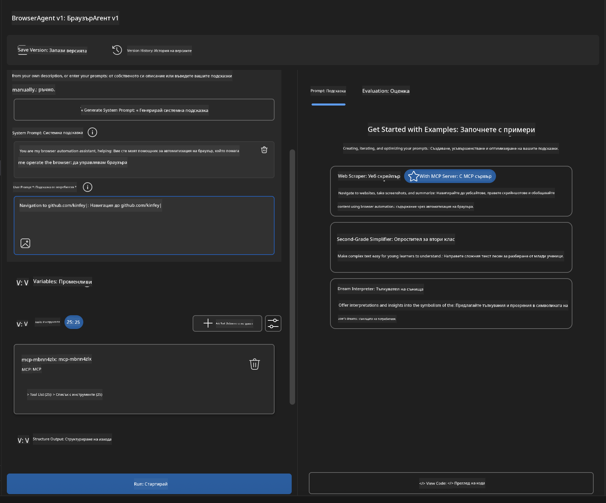

### 🚀 Фаза 5: Изпълнение и тестване

#### Стъпка 10: Стартирайте първата си автоматизация
1. **Кликнете "Run"** за стартиране на автоматичната последователност  
2. **Наблюдавайте изпълнението в реално време**:  
   - Автоматично се стартира Chrome браузър  
   - Агентът навигира до целевия уебсайт  
   - Скрийншотове заснемат всеки важен етап  
   - Резултатите от анализа се показват в реално време  

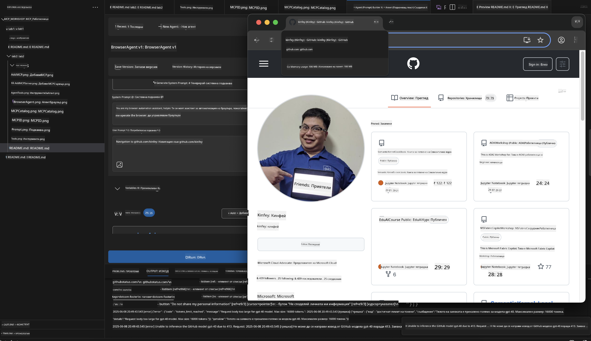

#### Стъпка 11: Анализирайте резултатите и прозренията
Прегледайте подробния анализ в интерфейса на Agent Builder:

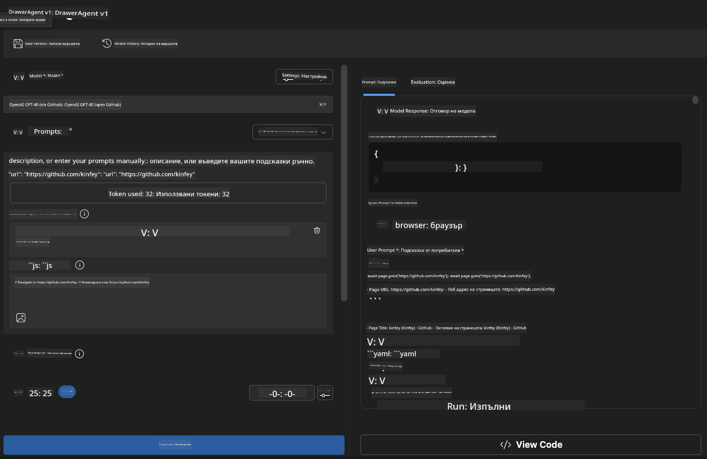

### 🌟 Фаза 6: Разширени възможности и внедряване

#### Стъпка 12: Експортиране и продукционно внедряване
Agent Builder поддържа множество опции за внедряване:

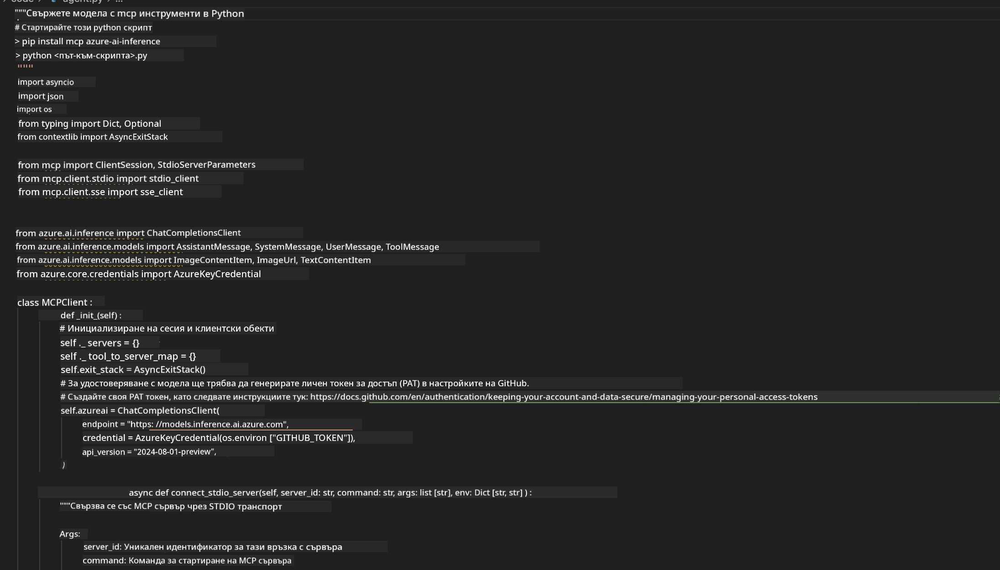

## 🎓 Обобщение на Модул 2 и следващи стъпки

### 🏆 Постигнато ниво: Майстор на MCP интеграцията

**✅ Овладени умения:**  
- [ ] Разбиране на архитектурата и предимствата на MCP  
- [ ] Навигация в екосистемата от MCP сървъри на Microsoft  
- [ ] Интеграция на Playwright MCP с AI Toolkit  
- [ ] Създаване на сложни агенти за автоматизация на браузър  
- [ ] Разширено проектиране на подсказки за уеб автоматизация  

### 📚 Допълнителни ресурси

- **🔗 MCP Спецификация**: [Официална документация на протокола](https://modelcontextprotocol.io/)  
- **🛠️ Playwright API**: [Пълен справочник с методи](https://playwright.dev/docs/api/class-playwright)  
- **🏢 Microsoft MCP сървъри**: [Ръководство за корпоративна интеграция](https://github.com/microsoft/mcp-servers)  
- **🌍 Общностни примери**: [Галерия на MCP сървъри](https://github.com/modelcontextprotocol/servers)  

**🎉 Поздравления!** Вече успешно овладяхте MCP интеграцията и можете да създавате продукционно готови AI агенти с възможности за външни инструменти!

### 🔜 Продължете към следващия модул

Готови ли сте да издигнете MCP уменията си на следващо ниво? Продължете към **[Мод
- Създаване на Weather MCP сървър от нулата

**Отказ от отговорност**:  
Този документ е преведен с помощта на AI преводаческа услуга [Co-op Translator](https://github.com/Azure/co-op-translator). Въпреки че се стремим към точност, моля, имайте предвид, че автоматизираните преводи могат да съдържат грешки или неточности. Оригиналният документ на неговия роден език трябва да се счита за авторитетен източник. За критична информация се препоръчва професионален човешки превод. Ние не носим отговорност за каквито и да е недоразумения или неправилни тълкувания, произтичащи от използването на този превод.