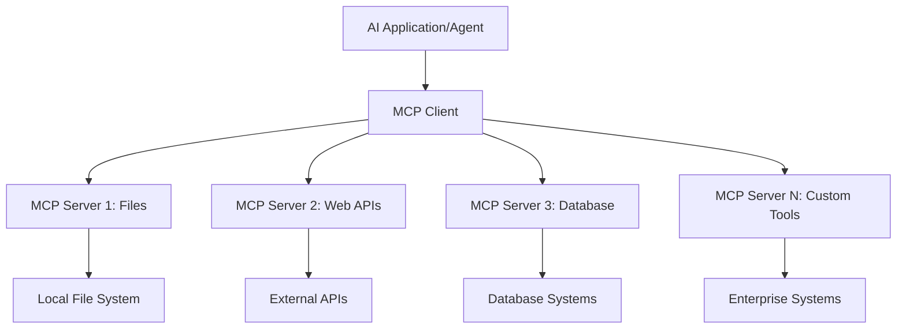

<!--
CO_OP_TRANSLATOR_METADATA:
{
  "original_hash": "a22b7dd11cd7690f99f9195877cafdc3",
  "translation_date": "2025-06-10T05:59:01+00:00",
  "source_file": "10-StreamliningAIWorkflowsBuildingAnMCPServerWithAIToolkit/lab2/README.md",
  "language_code": "bg"
}
-->
# 🌐 Модул 2: Основи на MCP с AI Toolkit

[]()
[]()
[]()

## 📋 Учебни цели

Към края на този модул ще можете да:
- ✅ Разберете архитектурата и предимствата на Model Context Protocol (MCP)
- ✅ Проучите екосистемата на MCP сървърите на Microsoft
- ✅ Интегрирате MCP сървъри с AI Toolkit Agent Builder
- ✅ Създадете функционален агент за браузърна автоматизация с Playwright MCP
- ✅ Конфигурирате и тествате MCP инструменти в агентите си
- ✅ Експортирате и внедрявате агенти с MCP за продукционна употреба

## 🎯 Надграждане върху Модул 1

В Модул 1 усвоихме основите на AI Toolkit и създадохме първия си Python агент. Сега ще **усъвършенстваме** агентите ви, като ги свържем с външни инструменти и услуги чрез революционния **Model Context Protocol (MCP)**.

Помислете за това като ъпгрейд от обикновен калкулатор към пълноценен компютър – вашите AI агенти ще получат възможността да:
- 🌐 Разглеждат и взаимодействат с уебсайтове
- 📁 Достъпват и управляват файлове
- 🔧 Интегрират се с корпоративни системи
- 📊 Обработват данни в реално време от API-та

## 🧠 Разбиране на Model Context Protocol (MCP)

### 🔍 Какво е MCP?

Model Context Protocol (MCP) е **„USB-C за AI приложения“** – революционен отворен стандарт, който свързва големите езикови модели (LLMs) с външни инструменти, източници на данни и услуги. Както USB-C премахна хаоса с кабелите, като предложи един универсален конектор, така MCP премахва сложността при интеграцията на AI с един стандартизиран протокол.

### 🎯 Проблемът, който решава MCP

**Преди MCP:**
- 🔧 Персонализирани интеграции за всеки инструмент
- 🔄 Заключване към доставчик с проприетарни решения  
- 🔒 Уязвимости в сигурността от спонтанни връзки
- ⏱️ Месеци разработка за основни интеграции

**С MCP:**
- ⚡ Интеграция на инструменти с plug-and-play подход
- 🔄 Архитектура, независима от доставчици
- 🛡️ Вградени най-добри практики за сигурност
- 🚀 Минутки за добавяне на нови възможности

### 🏗️ Задълбочен поглед върху архитектурата на MCP

MCP следва **клиент-сървър архитектура**, която създава сигурна и мащабируема екосистема:



**🔧 Основни компоненти:**

| Компонент | Роля | Примери |
|-----------|------|----------|
| **MCP Hosts** | Приложения, които използват MCP услуги | Claude Desktop, VS Code, AI Toolkit |
| **MCP Clients** | Обработват протокола (1:1 със сървъри) | Вградени в хост приложенията |
| **MCP Servers** | Предлагат възможности чрез стандартен протокол | Playwright, Files, Azure, GitHub |
| **Транспортен слой** | Методи за комуникация | stdio, HTTP, WebSockets |


## 🏢 Екосистема на MCP сървърите на Microsoft

Microsoft води MCP екосистемата с цялостен набор от корпоративни сървъри, които покриват реални бизнес нужди.

### 🌟 Избрани MCP сървъри на Microsoft

#### 1. ☁️ Azure MCP Server
**🔗 Репозитория**: [azure/azure-mcp](https://github.com/azure/azure-mcp)
**🎯 Цел**: Цялостно управление на Azure ресурси с AI интеграция

**✨ Основни функции:**
- Декларативно предоставяне на инфраструктура
- Мониторинг на ресурсите в реално време
- Препоръки за оптимизация на разходите
- Проверка на съответствие със сигурността

**🚀 Приложения:**
- Infrastructure-as-Code с AI помощ
- Автоматично мащабиране на ресурси
- Оптимизация на облачните разходи
- Автоматизация на DevOps процеси

#### 2. 📊 Microsoft Dataverse MCP
**📚 Документация**: [Microsoft Dataverse Integration](https://go.microsoft.com/fwlink/?linkid=2320176)
**🎯 Цел**: Интерфейс на естествен език за бизнес данни

**✨ Основни функции:**
- Запитвания към бази данни на естествен език
- Разбиране на бизнес контекста
- Персонализирани шаблони за заявки
- Управление на корпоративни данни

**🚀 Приложения:**
- Отчети за бизнес интелигентност
- Анализ на клиентски данни
- Информация за продажбени процеси
- Запитвания за съответствие с регулации

#### 3. 🌐 Playwright MCP Server
**🔗 Репозитория**: [microsoft/playwright-mcp](https://github.com/microsoft/playwright-mcp)
**🎯 Цел**: Автоматизация на браузъра и уеб взаимодействия

**✨ Основни функции:**
- Крос-браузърна автоматизация (Chrome, Firefox, Safari)
- Интелигентно разпознаване на елементи
- Генериране на скрийншотове и PDF файлове
- Мониторинг на мрежов трафик

**🚀 Приложения:**
- Автоматизирани тестови процеси
- Уеб скрейпинг и извличане на данни
- Мониторинг на UI/UX
- Автоматизация на конкурентен анализ

#### 4. 📁 Files MCP Server
**🔗 Репозитория**: [microsoft/files-mcp-server](https://github.com/microsoft/files-mcp-server)
**🎯 Цел**: Интелигентни операции с файловата система

**✨ Основни функции:**
- Декларативно управление на файлове
- Синхронизация на съдържание
- Интеграция с контрол на версиите
- Извличане на метаданни

**🚀 Приложения:**
- Управление на документация
- Организация на кодови репозитории
- Работни процеси за публикуване на съдържание
- Обработка на файлове в данни потоци

#### 5. 📝 MarkItDown MCP Server
**🔗 Репозитория**: [microsoft/markitdown](https://github.com/microsoft/markitdown)
**🎯 Цел**: Разширена обработка и манипулация на Markdown

**✨ Основни функции:**
- Богато парсване на Markdown
- Конвертиране на формати (MD ↔ HTML ↔ PDF)
- Анализ на структурата на съдържанието
- Обработка на шаблони

**🚀 Приложения:**
- Работни процеси за техническа документация
- Системи за управление на съдържание
- Генериране на отчети
- Автоматизация на бази знания

#### 6. 📈 Clarity MCP Server
**📦 Пакет**: [@microsoft/clarity-mcp-server](https://www.npmjs.com/package/@microsoft/clarity-mcp-server)
**🎯 Цел**: Уеб анализи и разбиране на поведението на потребителите

**✨ Основни функции:**
- Анализ на топлинни карти
- Запис на потребителски сесии
- Метрики за производителност
- Анализ на конверсионни фунии

**🚀 Приложения:**
- Оптимизация на уебсайтове
- Изследване на потребителския опит
- Анализ на A/B тестове
- Табла за бизнес интелигентност

### 🌍 Общностна екосистема

Освен сървърите на Microsoft, MCP екосистемата включва:
- **🐙 GitHub MCP**: Управление на репозитории и анализ на код
- **🗄️ Database MCPs**: Интеграции с PostgreSQL, MySQL, MongoDB
- **☁️ Cloud Provider MCPs**: Инструменти за AWS, GCP, Digital Ocean
- **📧 Communication MCPs**: Интеграции със Slack, Teams, Email

## 🛠️ Практическа лаборатория: Създаване на агент за браузърна автоматизация

**🎯 Цел на проекта**: Създайте интелигентен агент за браузърна автоматизация с Playwright MCP сървър, който може да навигира в уебсайтове, извлича информация и изпълнява сложни уеб взаимодействия.

### 🚀 Фаза 1: Настройка на основата на агента

#### Стъпка 1: Инициализирайте агента си
1. **Отворете AI Toolkit Agent Builder**
2. **Създайте нов агент** с конфигурацията:
   - **Име**: `BrowserAgent`
   - **Model**: Choose GPT-4o 


### 🔧 Phase 2: MCP Integration Workflow

#### Step 3: Add MCP Server Integration
1. **Navigate to Tools Section** in Agent Builder
2. **Click "Add Tool"** to open the integration menu
3. **Select "MCP Server"** from available options


**🔍 Understanding Tool Types:**
- **Built-in Tools**: Pre-configured AI Toolkit functions
- **MCP Servers**: External service integrations
- **Custom APIs**: Your own service endpoints
- **Function Calling**: Direct model function access

#### Step 4: MCP Server Selection
1. **Choose "MCP Server"** option to proceed


2. **Browse MCP Catalog** to explore available integrations


### 🎮 Phase 3: Playwright MCP Configuration

#### Step 5: Select and Configure Playwright
1. **Click "Use Featured MCP Servers"** to access Microsoft's verified servers
2. **Select "Playwright"** from the featured list
3. **Accept Default MCP ID** or customize for your environment


#### Step 6: Enable Playwright Capabilities
**🔑 Critical Step**: Select **ALL** available Playwright methods for maximum functionality


**🛠️ Essential Playwright Tools:**
- **Navigation**: `goto`, `goBack`, `goForward`, `reload`
- **Interaction**: `click`, `fill`, `press`, `hover`, `drag`
- **Extraction**: `textContent`, `innerHTML`, `getAttribute`
- **Validation**: `isVisible`, `isEnabled`, `waitForSelector`
- **Capture**: `screenshot`, `pdf`, `video`
- **Network**: `setExtraHTTPHeaders`, `route`, `waitForResponse`

#### Стъпка 7: Потвърдете успешната интеграция
**✅ Индикатори за успех:**
- Всички инструменти се показват в интерфейса на Agent Builder
- Няма съобщения за грешки в панела за интеграция
- Статусът на Playwright сървъра показва „Connected“


**🔧 Често срещани проблеми и решения:**
- **Връзката неуспешна**: Проверете интернет връзката и настройките на защитната стена
- **Липсващи инструменти**: Уверете се, че всички възможности са избрани при настройката
- **Грешки с разрешения**: Проверете дали VS Code има необходимите системни права

### 🎯 Фаза 4: Напреднала инженерия на подсказки

#### Стъпка 8: Създайте интелигентни системни подсказки
Създайте сложни подсказки, които използват пълните възможности на Playwright:

```markdown
# Web Automation Expert System Prompt

## Core Identity
You are an advanced web automation specialist with deep expertise in browser automation, web scraping, and user experience analysis. You have access to Playwright tools for comprehensive browser control.

## Capabilities & Approach
### Navigation Strategy
- Always start with screenshots to understand page layout
- Use semantic selectors (text content, labels) when possible
- Implement wait strategies for dynamic content
- Handle single-page applications (SPAs) effectively

### Error Handling
- Retry failed operations with exponential backoff
- Provide clear error descriptions and solutions
- Suggest alternative approaches when primary methods fail
- Always capture diagnostic screenshots on errors

### Data Extraction
- Extract structured data in JSON format when possible
- Provide confidence scores for extracted information
- Validate data completeness and accuracy
- Handle pagination and infinite scroll scenarios

### Reporting
- Include step-by-step execution logs
- Provide before/after screenshots for verification
- Suggest optimizations and alternative approaches
- Document any limitations or edge cases encountered

## Ethical Guidelines
- Respect robots.txt and rate limiting
- Avoid overloading target servers
- Only extract publicly available information
- Follow website terms of service
```

#### Стъпка 9: Създайте динамични потребителски подсказки
Дизайнирайте подсказки, които демонстрират различни възможности:

**🌐 Пример за уеб анализ:**
```markdown
Navigate to github.com/kinfey and provide a comprehensive analysis including:
1. Repository structure and organization
2. Recent activity and contribution patterns  
3. Documentation quality assessment
4. Technology stack identification
5. Community engagement metrics
6. Notable projects and their purposes

Include screenshots at key steps and provide actionable insights.
```


### 🚀 Фаза 5: Изпълнение и тестване

#### Стъпка 10: Стартирайте първата си автоматизация
1. **Натиснете „Run“**, за да стартирате автоматизацията
2. **Наблюдавайте изпълнението в реално време**:
   - Автоматично стартиране на Chrome браузър
   - Агентът навигира към целевия уебсайт
   - Скрийншотове заснемат всеки основен етап
   - Резултатите от анализа се показват в реално време


#### Стъпка 11: Анализирайте резултатите и изводите
Прегледайте подробния анализ в интерфейса на Agent Builder:


### 🌟 Фаза 6: Разширени възможности и внедряване

#### Стъпка 12: Експортиране и продукционно внедряване
Agent Builder поддържа множество опции за внедряване:


## 🎓 Обобщение на Модул 2 и следващи стъпки

### 🏆 Отключено постижение: Майстор на MCP интеграцията

**✅ Усвоени умения:**
- [ ] Разбиране на архитектурата и предимствата на MCP
- [ ] Навигация в екосистемата на MCP сървърите на Microsoft
- [ ] Интегриране на Playwright MCP с AI Toolkit
- [ ] Създаване на сложни агенти за браузърна автоматизация
- [ ] Напреднала инженерия на подсказки за уеб автоматизация

### 📚 Допълнителни ресурси

- **🔗 MCP Спецификация**: [Официална документация на протокола](https://modelcontextprotocol.io/)
- **🛠️ Playwright API**: [Пълен списък с методи](https://playwright.dev/docs/api/class-playwright)
- **🏢 Microsoft MCP сървъри**: [Ръководство за корпоративна интеграция](https://github.com/microsoft/mcp-servers)
- **🌍 Общностни примери**: [Галерия на MCP сървъри](https://github.com/modelcontextprotocol/servers)

**🎉 Поздравления!** Успешно овладяхте MCP интеграцията и вече можете да създавате AI агенти, готови за продукция, с възможности за външни инструменти!

### 🔜 Продължете към следващия модул

Готови ли сте да издигнете MCP уменията си на следващо ниво? Продължете към **[Модул 3: Разширена разработка на MCP с AI Toolkit](../lab3/README.md)**, където ще научите как да:
- Създавате свои собствени персонализирани MCP сървъри
- Конфигурирате и използвате най-новия MCP Python SDK
- Настроите MCP Inspector за дебъгване
- Овладеете напреднали работни процеси за разработка на MCP сървъри
- Създадете Weather MCP Server от нулата

**Отказ от отговорност**:  
Този документ е преведен с помощта на AI преводаческа услуга [Co-op Translator](https://github.com/Azure/co-op-translator). Въпреки че се стремим към точност, моля, имайте предвид, че автоматизираните преводи могат да съдържат грешки или неточности. Оригиналният документ на неговия оригинален език трябва да се счита за авторитетен източник. За критична информация се препоръчва професионален човешки превод. Ние не носим отговорност за каквито и да е недоразумения или неправилни тълкувания, възникнали в резултат на използването на този превод.