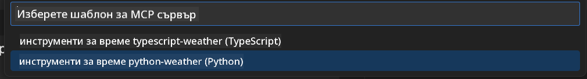
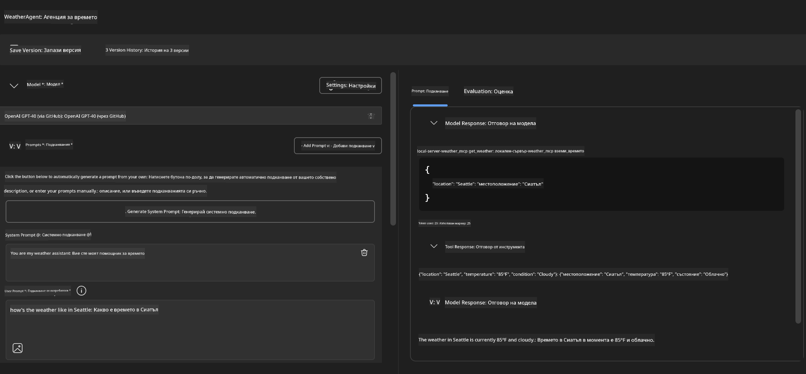

<!--
CO_OP_TRANSLATOR_METADATA:
{
  "original_hash": "dd8da3f75addcef453fe11f02a270217",
  "translation_date": "2025-07-14T08:19:47+00:00",
  "source_file": "10-StreamliningAIWorkflowsBuildingAnMCPServerWithAIToolkit/lab3/README.md",
  "language_code": "bg"
}
-->
# 🔧 Модул 3: Разширена разработка на MCP с AI Toolkit


## 🎯 Учебни цели

Към края на тази лаборатория ще можете да:

- ✅ Създавате персонализирани MCP сървъри с помощта на AI Toolkit
- ✅ Конфигурирате и използвате най-новия MCP Python SDK (v1.9.3)
- ✅ Настроите и използвате MCP Inspector за отстраняване на грешки
- ✅ Отстранявате грешки в MCP сървъри както в Agent Builder, така и в Inspector
- ✅ Разбирате напреднали работни процеси за разработка на MCP сървъри

## 📋 Предварителни изисквания

- Завършена Лаборатория 2 (Основи на MCP)
- VS Code с инсталирано разширение AI Toolkit
- Python 3.10+ среда
- Node.js и npm за настройка на Inspector

## 🏗️ Какво ще създадете

В тази лаборатория ще създадете **Weather MCP Server**, който демонстрира:
- Персонализирана реализация на MCP сървър
- Интеграция с AI Toolkit Agent Builder
- Професионални работни процеси за отстраняване на грешки
- Модерни модели на използване на MCP SDK

---

## 🔧 Преглед на основните компоненти

### 🐍 MCP Python SDK
Model Context Protocol Python SDK предоставя основата за изграждане на персонализирани MCP сървъри. Ще използвате версия 1.9.3 с подобрени възможности за отстраняване на грешки.

### 🔍 MCP Inspector
Мощен инструмент за отстраняване на грешки, който предлага:
- Мониторинг на сървъра в реално време
- Визуализация на изпълнението на инструментите
- Инспекция на мрежови заявки и отговори
- Интерактивна тестова среда

---

## 📖 Стъпка по стъпка изпълнение

### Стъпка 1: Създайте WeatherAgent в Agent Builder

1. **Стартирайте Agent Builder** във VS Code чрез разширението AI Toolkit
2. **Създайте нов агент** със следната конфигурация:
   - Име на агента: `WeatherAgent`


### Стъпка 2: Инициализирайте MCP Server проект

1. **Отидете на Tools** → **Add Tool** в Agent Builder
2. **Изберете "MCP Server"** от наличните опции
3. **Изберете "Create A new MCP Server"**
4. **Изберете шаблона `python-weather`**
5. **Наименувайте сървъра си:** `weather_mcp`



### Стъпка 3: Отворете и разгледайте проекта

1. **Отворете генерирания проект** във VS Code
2. **Прегледайте структурата на проекта:**
   ```
   weather_mcp/
   ├── src/
   │   ├── __init__.py
   │   └── server.py
   ├── inspector/
   │   ├── package.json
   │   └── package-lock.json
   ├── .vscode/
   │   ├── launch.json
   │   └── tasks.json
   ├── pyproject.toml
   └── README.md
   ```

### Стъпка 4: Актуализирайте до най-новия MCP SDK

> **🔍 Защо да актуализираме?** Искаме да използваме най-новия MCP SDK (v1.9.3) и Inspector (0.14.0) за по-добри функции и възможности за отстраняване на грешки.

#### 4a. Актуализирайте Python зависимостите

**Редактирайте `pyproject.toml`:** актуализирайте [./code/weather_mcp/pyproject.toml](../../../../10-StreamliningAIWorkflowsBuildingAnMCPServerWithAIToolkit/lab3/code/weather_mcp/pyproject.toml)

#### 4b. Актуализирайте конфигурацията на Inspector

**Редактирайте `inspector/package.json`:** актуализирайте [./code/weather_mcp/inspector/package.json](../../../../10-StreamliningAIWorkflowsBuildingAnMCPServerWithAIToolkit/lab3/code/weather_mcp/inspector/package.json)

#### 4c. Актуализирайте зависимостите на Inspector

**Редактирайте `inspector/package-lock.json`:** актуализирайте [./code/weather_mcp/inspector/package-lock.json](../../../../10-StreamliningAIWorkflowsBuildingAnMCPServerWithAIToolkit/lab3/code/weather_mcp/inspector/package-lock.json)

> **📝 Забележка:** Този файл съдържа обширни дефиниции на зависимости. По-долу е показана основната структура – пълното съдържание гарантира правилното разрешаване на зависимостите.

> **⚡ Пълен Package Lock:** Пълният package-lock.json съдържа около 3000 реда дефиниции на зависимости. По-горе е показана ключовата структура – използвайте предоставения файл за пълно разрешаване на зависимости.

### Стъпка 5: Конфигурирайте отстраняване на грешки във VS Code

*Забележка: Моля, копирайте файла в посочения път, за да замените съответния локален файл*

#### 5a. Актуализирайте конфигурацията за стартиране

**Редактирайте `.vscode/launch.json`:**

```json
{
  "version": "0.2.0",
  "configurations": [
    {
      "name": "Attach to Local MCP",
      "type": "debugpy",
      "request": "attach",
      "connect": {
        "host": "localhost",
        "port": 5678
      },
      "presentation": {
        "hidden": true
      },
      "internalConsoleOptions": "neverOpen",
      "postDebugTask": "Terminate All Tasks"
    },
    {
      "name": "Launch Inspector (Edge)",
      "type": "msedge",
      "request": "launch",
      "url": "http://localhost:6274?timeout=60000&serverUrl=http://localhost:3001/sse#tools",
      "cascadeTerminateToConfigurations": [
        "Attach to Local MCP"
      ],
      "presentation": {
        "hidden": true
      },
      "internalConsoleOptions": "neverOpen"
    },
    {
      "name": "Launch Inspector (Chrome)",
      "type": "chrome",
      "request": "launch",
      "url": "http://localhost:6274?timeout=60000&serverUrl=http://localhost:3001/sse#tools",
      "cascadeTerminateToConfigurations": [
        "Attach to Local MCP"
      ],
      "presentation": {
        "hidden": true
      },
      "internalConsoleOptions": "neverOpen"
    }
  ],
  "compounds": [
    {
      "name": "Debug in Agent Builder",
      "configurations": [
        "Attach to Local MCP"
      ],
      "preLaunchTask": "Open Agent Builder",
    },
    {
      "name": "Debug in Inspector (Edge)",
      "configurations": [
        "Launch Inspector (Edge)",
        "Attach to Local MCP"
      ],
      "preLaunchTask": "Start MCP Inspector",
      "stopAll": true
    },
    {
      "name": "Debug in Inspector (Chrome)",
      "configurations": [
        "Launch Inspector (Chrome)",
        "Attach to Local MCP"
      ],
      "preLaunchTask": "Start MCP Inspector",
      "stopAll": true
    }
  ]
}
```

**Редактирайте `.vscode/tasks.json`:**

```
{
  "version": "2.0.0",
  "tasks": [
    {
      "label": "Start MCP Server",
      "type": "shell",
      "command": "python -m debugpy --listen 127.0.0.1:5678 src/__init__.py sse",
      "isBackground": true,
      "options": {
        "cwd": "${workspaceFolder}",
        "env": {
          "PORT": "3001"
        }
      },
      "problemMatcher": {
        "pattern": [
          {
            "regexp": "^.*$",
            "file": 0,
            "location": 1,
            "message": 2
          }
        ],
        "background": {
          "activeOnStart": true,
          "beginsPattern": ".*",
          "endsPattern": "Application startup complete|running"
        }
      }
    },
    {
      "label": "Start MCP Inspector",
      "type": "shell",
      "command": "npm run dev:inspector",
      "isBackground": true,
      "options": {
        "cwd": "${workspaceFolder}/inspector",
        "env": {
          "CLIENT_PORT": "6274",
          "SERVER_PORT": "6277",
        }
      },
      "problemMatcher": {
        "pattern": [
          {
            "regexp": "^.*$",
            "file": 0,
            "location": 1,
            "message": 2
          }
        ],
        "background": {
          "activeOnStart": true,
          "beginsPattern": "Starting MCP inspector",
          "endsPattern": "Proxy server listening on port"
        }
      },
      "dependsOn": [
        "Start MCP Server"
      ]
    },
    {
      "label": "Open Agent Builder",
      "type": "shell",
      "command": "echo ${input:openAgentBuilder}",
      "presentation": {
        "reveal": "never"
      },
      "dependsOn": [
        "Start MCP Server"
      ],
    },
    {
      "label": "Terminate All Tasks",
      "command": "echo ${input:terminate}",
      "type": "shell",
      "problemMatcher": []
    }
  ],
  "inputs": [
    {
      "id": "openAgentBuilder",
      "type": "command",
      "command": "ai-mlstudio.agentBuilder",
      "args": {
        "initialMCPs": [ "local-server-weather_mcp" ],
        "triggeredFrom": "vsc-tasks"
      }
    },
    {
      "id": "terminate",
      "type": "command",
      "command": "workbench.action.tasks.terminate",
      "args": "terminateAll"
    }
  ]
}
```

---

## 🚀 Стартиране и тестване на вашия MCP сървър

### Стъпка 6: Инсталирайте зависимости

След като направите промените в конфигурацията, изпълнете следните команди:

**Инсталирайте Python зависимости:**
```bash
uv sync
```

**Инсталирайте зависимости на Inspector:**
```bash
cd inspector
npm install
```

### Стъпка 7: Отстраняване на грешки с Agent Builder

1. **Натиснете F5** или използвайте конфигурацията **"Debug in Agent Builder"**
2. **Изберете комбинираната конфигурация** от панела за отстраняване на грешки
3. **Изчакайте сървърът да стартира** и Agent Builder да се отвори
4. **Тествайте вашия weather MCP сървър** с естествени езикови заявки

Въведете заявка като тази

SYSTEM_PROMPT

```
You are my weather assistant
```

USER_PROMPT

```
How's the weather like in Seattle
```



### Стъпка 8: Отстраняване на грешки с MCP Inspector

1. **Използвайте конфигурацията "Debug in Inspector"** (Edge или Chrome)
2. **Отворете интерфейса на Inspector** на `http://localhost:6274`
3. **Разгледайте интерактивната тестова среда:**
   - Прегледайте наличните инструменти
   - Тествайте изпълнението на инструментите
   - Наблюдавайте мрежовите заявки
   - Отстранявайте грешки в отговорите на сървъра


---

## 🎯 Основни резултати от обучението

След завършване на тази лаборатория вие:

- [x] **Създадохте персонализиран MCP сървър** с помощта на AI Toolkit шаблони
- [x] **Актуализирахте до най-новия MCP SDK** (v1.9.3) за подобрена функционалност
- [x] **Конфигурирахте професионални работни процеси за отстраняване на грешки** както за Agent Builder, така и за Inspector
- [x] **Настроихте MCP Inspector** за интерактивно тестване на сървъра
- [x] **Овладяхте конфигурациите за отстраняване на грешки във VS Code** за разработка на MCP

## 🔧 Разгледани разширени функции

| Функция | Описание | Приложение |
|---------|-------------|----------|
| **MCP Python SDK v1.9.3** | Най-нова реализация на протокола | Модерна разработка на сървъри |
| **MCP Inspector 0.14.0** | Интерактивен инструмент за отстраняване на грешки | Тестване на сървъра в реално време |
| **Отстраняване на грешки във VS Code** | Интегрирана среда за разработка | Професионален работен процес за отстраняване на грешки |
| **Интеграция с Agent Builder** | Директна връзка с AI Toolkit | Крайно-до-крайно тестване на агенти |

## 📚 Допълнителни ресурси

- [MCP Python SDK Документация](https://modelcontextprotocol.io/docs/sdk/python)
- [Ръководство за AI Toolkit разширението](https://code.visualstudio.com/docs/ai/ai-toolkit)
- [Документация за отстраняване на грешки във VS Code](https://code.visualstudio.com/docs/editor/debugging)
- [Спецификация на Model Context Protocol](https://modelcontextprotocol.io/docs/concepts/architecture)

---

**🎉 Поздравления!** Успешно завършихте Лаборатория 3 и вече можете да създавате, отстранявате грешки и внедрявате персонализирани MCP сървъри с професионални работни процеси за разработка.

### 🔜 Продължете към следващия модул

Готови ли сте да приложите уменията си за MCP в реален работен процес? Продължете към **[Модул 4: Практическа разработка на MCP - Персонализиран GitHub Clone сървър](../lab4/README.md)**, където ще:
- Създадете продукционно готов MCP сървър, който автоматизира операции с GitHub хранилища
- Реализирате функционалност за клониране на GitHub хранилища чрез MCP
- Интегрирате персонализирани MCP сървъри с VS Code и GitHub Copilot Agent Mode
- Тествате и внедрявате персонализирани MCP сървъри в продукционни среди
- Научите практическа автоматизация на работни процеси за разработчици

**Отказ от отговорност**:  
Този документ е преведен с помощта на AI преводаческа услуга [Co-op Translator](https://github.com/Azure/co-op-translator). Въпреки че се стремим към точност, моля, имайте предвид, че автоматизираните преводи могат да съдържат грешки или неточности. Оригиналният документ на неговия първичен език трябва да се счита за авторитетен източник. За критична информация се препоръчва професионален човешки превод. Ние не носим отговорност за каквито и да е недоразумения или неправилни тълкувания, произтичащи от използването на този превод.