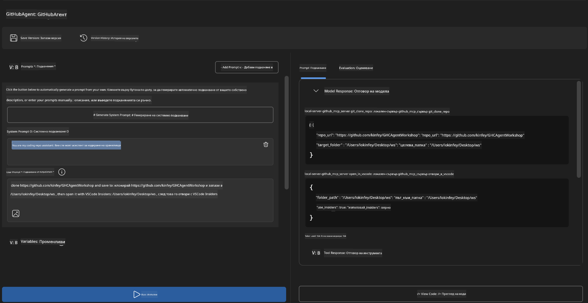
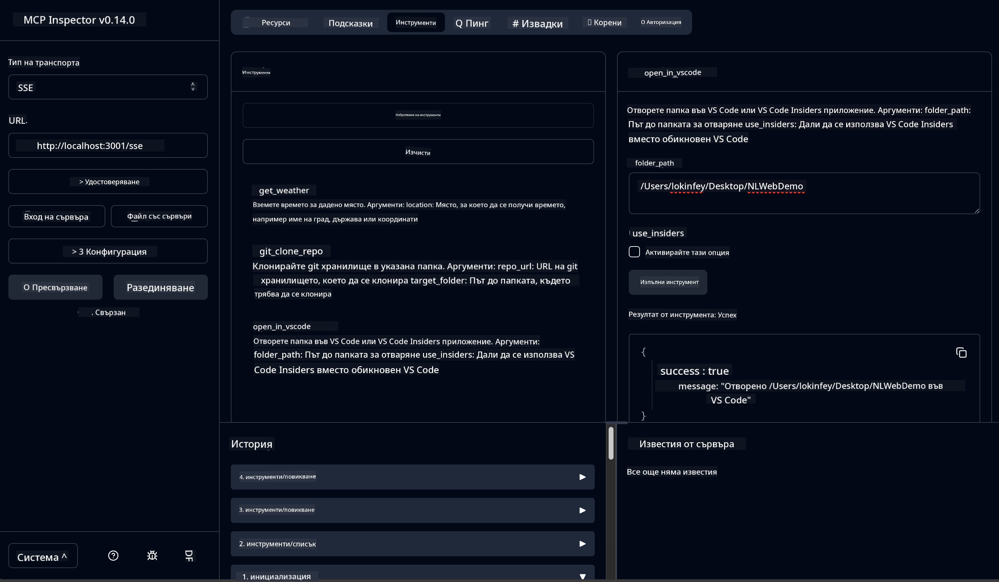

<!--
CO_OP_TRANSLATOR_METADATA:
{
  "original_hash": "f83bc722dc758efffd68667d6a1db470",
  "translation_date": "2025-07-14T08:47:44+00:00",
  "source_file": "10-StreamliningAIWorkflowsBuildingAnMCPServerWithAIToolkit/lab4/README.md",
  "language_code": "bg"
}
-->
# 🐙 Модул 4: Практическо разработване на MCP - Персонализиран GitHub Clone сървър


> **⚡ Бърз старт:** Създайте готов за продукция MCP сървър, който автоматизира клонирането на GitHub репозитории и интеграцията с VS Code само за 30 минути!

## 🎯 Учебни цели

Към края на тази лаборатория ще можете да:

- ✅ Създавате персонализиран MCP сървър за реални работни процеси в разработката
- ✅ Реализирате функционалност за клониране на GitHub репозитории чрез MCP
- ✅ Интегрирате персонализирани MCP сървъри с VS Code и Agent Builder
- ✅ Използвате GitHub Copilot Agent Mode с персонализирани MCP инструменти
- ✅ Тествате и внедрявате персонализирани MCP сървъри в продукционни среди

## 📋 Предварителни изисквания

- Завършени лаборатории 1-3 (основи на MCP и напреднала разработка)
- Абонамент за GitHub Copilot ([наличен безплатен регистрация](https://github.com/github-copilot/signup))
- VS Code с разширения AI Toolkit и GitHub Copilot
- Инсталиран и конфигуриран Git CLI

## 🏗️ Преглед на проекта

### **Реално предизвикателство в разработката**
Като разработчици често използваме GitHub за клониране на репозитории и отварянето им във VS Code или VS Code Insiders. Този ръчен процес включва:
1. Отваряне на терминал/команден ред
2. Навигиране до желаната директория
3. Изпълнение на командата `git clone`
4. Отваряне на VS Code в клонираната директория

**Нашето MCP решение обединява всичко това в една интелигентна команда!**

### **Какво ще създадете**
**GitHub Clone MCP сървър** (`git_mcp_server`), който предлага:

| Функция | Описание | Полза |
|---------|-------------|---------|
| 🔄 **Умно клониране на репозитории** | Клониране на GitHub репозитории с валидация | Автоматична проверка за грешки |
| 📁 **Интелигентно управление на директории** | Проверка и безопасно създаване на директории | Предотвратява презаписване |
| 🚀 **Кросплатформена интеграция с VS Code** | Отваряне на проекти във VS Code/Insiders | Безпроблемен преход в работния процес |
| 🛡️ **Здрава обработка на грешки** | Управление на мрежови, разрешителни и пътни проблеми | Надеждност за продукционна среда |

---

## 📖 Стъпка по стъпка изпълнение

### Стъпка 1: Създаване на GitHub агент в Agent Builder

1. **Стартирайте Agent Builder** през разширението AI Toolkit
2. **Създайте нов агент** с следната конфигурация:
   ```
   Agent Name: GitHubAgent
   ```

3. **Инициализирайте персонализиран MCP сървър:**
   - Отидете на **Tools** → **Add Tool** → **MCP Server**
   - Изберете **"Create A new MCP Server"**
   - Изберете **Python шаблон** за максимална гъвкавост
   - **Име на сървъра:** `git_mcp_server`

### Стъпка 2: Конфигуриране на GitHub Copilot Agent Mode

1. **Отворете GitHub Copilot** във VS Code (Ctrl/Cmd + Shift + P → "GitHub Copilot: Open")
2. **Изберете Agent Model** в интерфейса на Copilot
3. **Изберете модел Claude 3.7** за подобрени възможности за разсъждение
4. **Активирайте MCP интеграция** за достъп до инструменти

> **💡 Полезен съвет:** Claude 3.7 осигурява по-добро разбиране на работните процеси и модели за обработка на грешки.

### Стъпка 3: Реализиране на основната функционалност на MCP сървъра

**Използвайте следния подробен prompt с GitHub Copilot Agent Mode:**

```
Create two MCP tools with the following comprehensive requirements:

🔧 TOOL A: clone_repository
Requirements:
- Clone any GitHub repository to a specified local folder
- Return the absolute path of the successfully cloned project
- Implement comprehensive validation:
  ✓ Check if target directory already exists (return error if exists)
  ✓ Validate GitHub URL format (https://github.com/user/repo)
  ✓ Verify git command availability (prompt installation if missing)
  ✓ Handle network connectivity issues
  ✓ Provide clear error messages for all failure scenarios

🚀 TOOL B: open_in_vscode
Requirements:
- Open specified folder in VS Code or VS Code Insiders
- Cross-platform compatibility (Windows/Linux/macOS)
- Use direct application launch (not terminal commands)
- Auto-detect available VS Code installations
- Handle cases where VS Code is not installed
- Provide user-friendly error messages

Additional Requirements:
- Follow MCP 1.9.3 best practices
- Include proper type hints and documentation
- Implement logging for debugging purposes
- Add input validation for all parameters
- Include comprehensive error handling
```

### Стъпка 4: Тествайте своя MCP сървър

#### 4a. Тест в Agent Builder

1. **Стартирайте debug конфигурацията** за Agent Builder
2. **Конфигурирайте агента с тази системна инструкция:**

```
SYSTEM_PROMPT:
You are my intelligent coding repository assistant. You help developers efficiently clone GitHub repositories and set up their development environment. Always provide clear feedback about operations and handle errors gracefully.
```

3. **Тествайте с реалистични потребителски сценарии:**

```
USER_PROMPT EXAMPLES:

Scenario : Basic Clone and Open
"Clone {Your GitHub Repo link such as https://github.com/kinfey/GHCAgentWorkshop
 } and save to {The global path you specify}, then open it with VS Code Insiders"
```



**Очаквани резултати:**
- ✅ Успешно клониране с потвърждение на пътя
- ✅ Автоматично стартиране на VS Code
- ✅ Ясни съобщения за грешки при невалидни сценарии
- ✅ Коректно обработване на гранични случаи

#### 4b. Тест в MCP Inspector



---

**🎉 Поздравления!** Успешно създадохте практичен, готов за продукция MCP сървър, който решава реални предизвикателства в работните процеси на разработчиците. Вашият персонализиран GitHub clone сървър демонстрира силата на MCP за автоматизация и повишаване на продуктивността.

### 🏆 Постигнато:
- ✅ **MCP разработчик** - Създаден персонализиран MCP сървър
- ✅ **Автоматизатор на работни процеси** - Оптимизирани процеси на разработка  
- ✅ **Експерт по интеграция** - Свързани множество инструменти за разработка
- ✅ **Готов за продукция** - Изградени решения за внедряване

---

## 🎓 Завършване на работилницата: Вашето пътешествие с Model Context Protocol

**Уважаеми участник в работилницата,**

Поздравления за завършването на всички четири модула от работилницата Model Context Protocol! Изминахте дълъг път от разбирането на основите на AI Toolkit до създаването на готови за продукция MCP сървъри, които решават реални предизвикателства в разработката.

### 🚀 Обзор на вашия учебен път:

**[Модул 1](../lab1/README.md)**: Започнахте с основите на AI Toolkit, тестване на модели и създаване на първия си AI агент.

**[Модул 2](../lab2/README.md)**: Научихте архитектурата на MCP, интегрирахте Playwright MCP и създадохте първия си агент за браузърна автоматизация.

**[Модул 3](../lab3/README.md)**: Напреднахте към разработка на персонализирани MCP сървъри с Weather MCP сървъра и овладяхте инструментите за дебъг.

**[Модул 4](../lab4/README.md)**: Сега приложихте всичко, за да създадете практичен инструмент за автоматизация на работния процес с GitHub репозитории.

### 🌟 Какво овладяхте:

- ✅ **Екосистема AI Toolkit**: Модели, агенти и интеграционни модели
- ✅ **Архитектура MCP**: Клиент-сървър дизайн, транспортни протоколи и сигурност
- ✅ **Инструменти за разработчици**: От Playground до Inspector и продукционно внедряване
- ✅ **Персонализирана разработка**: Създаване, тестване и внедряване на собствени MCP сървъри
- ✅ **Практически приложения**: Решаване на реални предизвикателства в работните процеси с AI

### 🔮 Следващи стъпки:

1. **Създайте свой собствен MCP сървър**: Използвайте тези умения, за да автоматизирате вашите уникални работни процеси
2. **Присъединете се към MCP общността**: Споделяйте своите проекти и учете от другите
3. **Изследвайте напреднала интеграция**: Свържете MCP сървъри с корпоративни системи
4. **Допринасяйте за Open Source**: Помогнете за подобряване на MCP инструментите и документацията

Запомнете, тази работилница е само началото. Екосистемата на Model Context Protocol се развива бързо и вие вече сте подготвени да бъдете в авангарда на AI-базираните инструменти за разработка.

**Благодарим ви за участието и отдадеността към ученето!**

Надяваме се тази работилница да ви е вдъхновила с идеи, които ще променят начина, по който създавате и използвате AI инструменти в своята разработка.

**Приятно кодиране!**

---

**Отказ от отговорност**:  
Този документ е преведен с помощта на AI преводаческа услуга [Co-op Translator](https://github.com/Azure/co-op-translator). Въпреки че се стремим към точност, моля, имайте предвид, че автоматизираните преводи могат да съдържат грешки или неточности. Оригиналният документ на неговия роден език трябва да се счита за авторитетен източник. За критична информация се препоръчва професионален човешки превод. Ние не носим отговорност за каквито и да е недоразумения или неправилни тълкувания, произтичащи от използването на този превод.